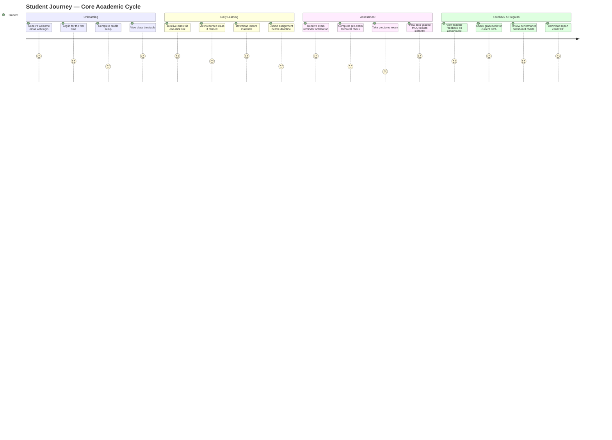
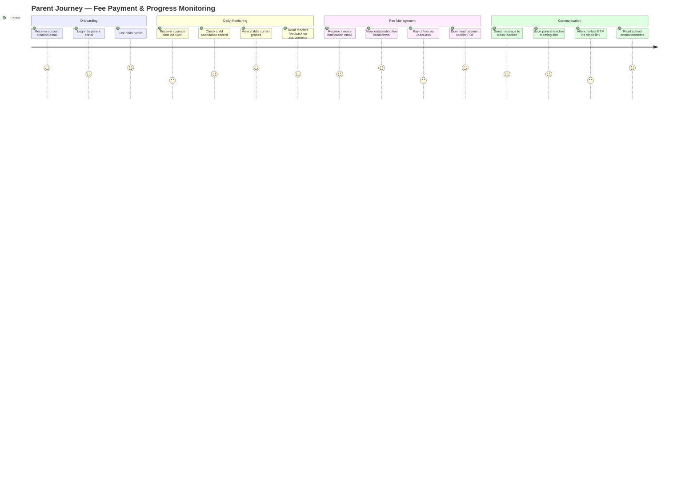
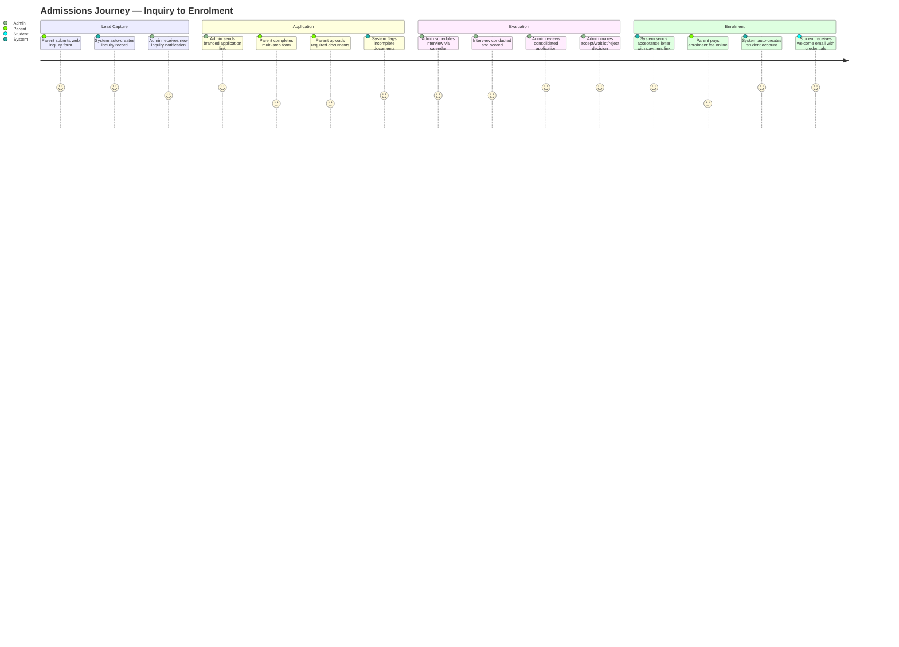
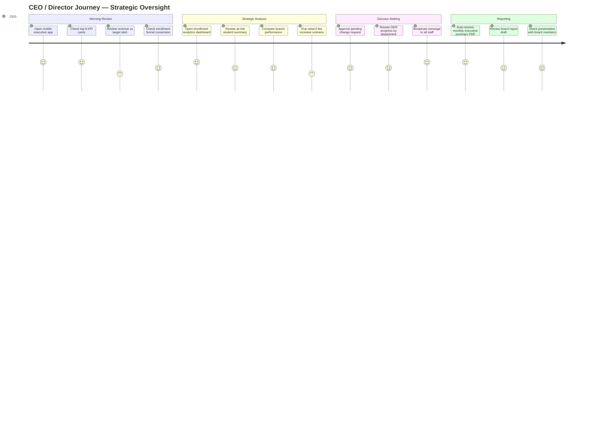
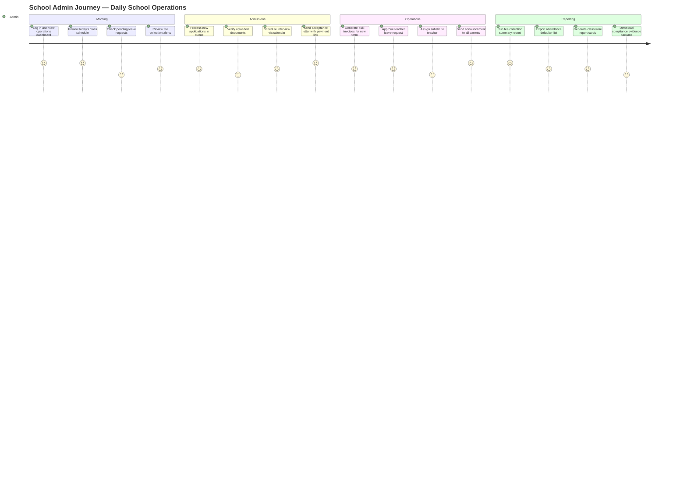
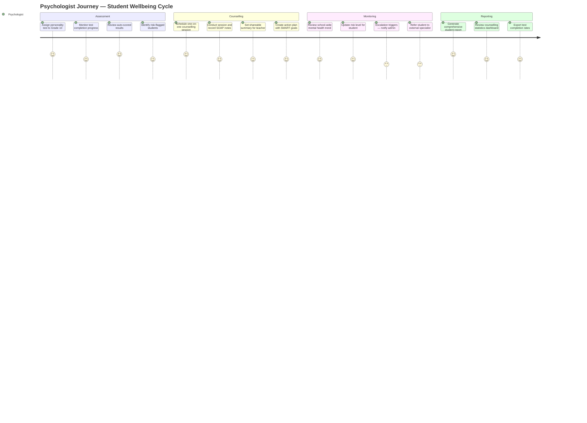

# PART 2 — STAKEHOLDERS & USERS
## P1 — Learning Management System + School Management System
### Layer 1 — Business & Strategy

**Status:** 🟡 Content Complete — Layer Gate Not Yet Passed
**Outstanding:** Journey diagrams for J05–J28 still pending (minimum gate requires one diagram per role — School Admin satisfied via J01–J04; Teacher, Student, Parent, Psychologist, and Staff roles still need at least one diagram each before the Layer 1 gate is fully passed)

---

## 2.1 Stakeholder Register

### Table 1 — Project Stakeholders

| # | Role | Interest in Project | Influence | Communication Needs |
|---|---|---|---|---|
| STK-01 | School Owner / CEO (Lighthouse Global School System) | Platform delivers on strategic vision — Cambridge compliance, AI-readiness, financial visibility, and global scalability. ROI is achieved. | High | Monthly executive summary report. Immediate notification on critical issues: budget overrun, major delays, go-live decision. |
| STK-02 | School Administrator | All school operational modules — admissions, fees, timetable, attendance, HR — work correctly and reduce manual workload. | High | Weekly progress update on modules affecting daily school operations. UAT participation during testing phase. |
| STK-03 | Teachers | Teacher portal, assignment module, gradebook, live classes, and exam module are intuitive and reduce administrative burden. | Medium | Notified at UAT phase for testing of teacher-facing modules. Training session delivered before go-live. |
| STK-04 | School Psychologist | Psychological assessment module, counselling management, and student wellbeing reporting function correctly and maintain data privacy. | Low | Notified at UAT phase for psychologist portal testing only. Training session delivered before go-live. |
| STK-05 | IT / Development Team | Technical specifications are unambiguous, architecture decisions are documented, and all APIs and integrations are fully specified. | High | Daily standup during active development. Full access to all technical documentation, API specifications, and architecture decisions as produced. |
| STK-06 | SRS Consultant | SRS is complete, accurate, and contractually defensible. All requirements are traceable and testable. | High | Full document access at all times. Weekly review session to approve completed parts before proceeding to next section. |

---

### Table 2 — External Third Parties

These organisations are not users of the system. They are external parties whose approvals, APIs, or standards directly affect the project.

| # | Organisation | Role in Project | Impact if Delayed | Communication Approach |
|---|---|---|---|---|
| EXT-01 | Cambridge International Education | Provides REST API (OAuth 2.0) for grade submission and candidate entries via developer.cambridgeassessment.org.uk. Approves live API credentials. | Cambridge integration cannot go live. Grade submission remains manual until approval received. | Contacted at project kickoff to initiate API access application. Weekly follow-up by client until credentials received. |
| EXT-02 | Cognia | International accreditation body whose evidence standards define the structure of the Cognia Evidence Management module (S-17). | Evidence module may not meet Cognia assessor requirements if standards are not confirmed before development. | Consulted during evidence module design phase to confirm evidence requirements. No ongoing communication needed until accreditation submission begins. |
| EXT-03 | Stripe / PayPal | International payment gateway providers. Merchant account approval required before payment integration can go live. | International online payments unavailable at launch. | Client initiates merchant account applications at project kickoff. No ongoing communication after account approval. |
| EXT-04 | JazzCash / Easypaisa | Pakistan payment gateway providers. Merchant account approval required before payment integration can go live. | Pakistan online payments unavailable at launch. | Client initiates merchant account applications at project kickoff. No ongoing communication after account approval. |
| EXT-05 | Meta (WhatsApp Business) | Approves WhatsApp Business API access. Required for WhatsApp communication features in S-09. | WhatsApp messaging unavailable until approval received (estimated 2–4 weeks). | Client submits Meta Business verification at project kickoff. No ongoing communication — approval is a one-time process. |

---

## 2.2 User Personas

*Five personas covering all system user roles. Students and parents are users — not project stakeholders — and are defined here.*

---

### Persona 1 — School Administrator

| Field | Detail |
|---|---|
| **Name** | Sarah Ahmed |
| **Role** | School Administrator |
| **Age** | 38 |
| **Location** | Islamabad, Pakistan |
| **Background** | 10 years in school administration. Manages admissions, fee collection, staff records, timetables, and daily school operations. Currently uses Excel for fees, a separate system for timetables, WhatsApp for staff communication, and staff records maintained in scattered Word documents and shared Google Drive folders with no central HR system. |
| **Goals** | Run all school operations from one place. Know in real time which fees are outstanding, which staff are on leave, and which students have not attended. Generate reports for the CEO without spending hours compiling data manually. |
| **Frustrations** | Spends 3–4 hours daily on tasks that should be automated — chasing fee payments, updating attendance registers, manually building timetables. Data lives in 5 different places. Cannot give the CEO a live financial picture without a full day of preparation. |
| **Tech Comfort** | Medium. Comfortable with Excel and email. Has used an SMS platform before. Needs an interface that does not require training to understand. |
| **Usage Frequency** | Daily — 6 to 8 hours on the platform |
| **Primary Device** | Desktop (work) + mobile (on the go) |
| **Quote** | *"I spend more time compiling reports than actually running the school. I need one place where everything just lives."* |

---

### Persona 2 — Teacher

| Field | Detail |
|---|---|
| **Name** | Hassan Malik |
| **Role** | Cambridge IGCSE Mathematics Teacher |
| **Age** | 31 |
| **Location** | Lahore, Pakistan |
| **Background** | 6 years teaching experience. Delivers live online classes via Zoom. Currently sends assignments via WhatsApp or email, collects submissions in a shared Google Drive folder, grades manually in Excel, and communicates with parents via WhatsApp groups. |
| **Goals** | Create and distribute assignments in minutes, not hours. See at a glance which students are falling behind. Mark submissions with feedback without switching between tools. Have all student grades calculated automatically. |
| **Frustrations** | Collecting assignments from 30 students across WhatsApp and email is chaotic. No way to track who has submitted and who has not without manually checking. Grade calculations take an entire evening. Parents message on personal WhatsApp at all hours. |
| **Tech Comfort** | Medium-High. Comfortable with Zoom, Google Drive, and Excel. Quick to learn new tools if they clearly save time. |
| **Usage Frequency** | Daily — 4 to 6 hours on the platform |
| **Primary Device** | Laptop (teaching) + mobile (communication) |
| **Quote** | *"I spend more time creating assignments from scratch, setting up quizzes, chasing submissions, and answering parent messages on my personal phone than I do actually teaching."* |

---

### Persona 3 — Student

| Field | Detail |
|---|---|
| **Name** | Aisha Khan |
| **Role** | Cambridge IGCSE Student (Year 10) |
| **Age** | 15 |
| **Location** | Karachi, Pakistan |
| **Background** | Online school student studying 8 IGCSE subjects. Attends live classes daily via Zoom. Receives assignments through a mix of WhatsApp groups, email, and Google Classroom depending on the teacher. Submits work via WhatsApp or email. Studies using PDF notes shared in WhatsApp groups. |
| **Goals** | Have one place for everything — assignments, deadlines, class recordings, grades, and feedback — so nothing is missed and no time is wasted hunting across WhatsApp groups and emails. Submit work confidently knowing it has been received. See grades and teacher feedback the moment they are published without waiting or asking. Revisit any recorded class at any time with chapter navigation and transcript search for effective exam revision. Track her own academic progress and know exactly where she stands in every subject before report card day. |
| **Frustrations** | Assignments are announced in different places by different teachers. Misses deadlines because notifications get buried in WhatsApp. Cannot see her overall academic standing without asking the school admin. Recorded classes are not always shared. |
| **Tech Comfort** | High. Digital native. Uses phone primarily. Learns new apps quickly. Expects the experience to feel as smooth as social media apps. |
| **Usage Frequency** | Daily — 3 to 5 hours on the platform |
| **Primary Device** | Mobile (primary) + laptop (exams and assignments) |
| **Quote** | *"I have five WhatsApp groups, three email threads, and I still miss deadlines. My grades, assignments, and notes are all scattered and I have no real picture of how I'm actually doing until the report card arrives — by then the exams are already over."* |

---

### Persona 4 — Parent

| Field | Detail |
|---|---|
| **Name** | Rizwan Ali |
| **Role** | Parent of two Cambridge school students |
| **Age** | 44 |
| **Location** | Dubai, UAE |
| **Background** | Senior manager with a demanding work schedule. Has two children in the school — one in Year 8 and one in Year 11. Currently receives updates about his children's progress only at report card time, three times a year. Pays school fees via manual bank transfer, then has to WhatsApp or call the school to confirm receipt, wait for a manually issued receipt, and chase if it does not arrive. Contacts teachers either through the school's main WhatsApp number or directly on their personal numbers with no boundary between professional and personal communication. |
| **Goals** | See his children's attendance, grades, and upcoming exams without calling the school. Pay fees online in under 2 minutes with an instant digital receipt. Message teachers directly through a professional channel. Get notified immediately if a child is absent. |
| **Frustrations** | Has no visibility into his children's day-to-day progress — attendance, grades, and assignment completion are all invisible until report card day, by which point it is too late to intervene. Fee payment is a manual, unconfirmed process every time — bank transfer, then chasing the school for a receipt with no online record to refer back to. Reaching a specific teacher requires going through the school reception or messaging personal WhatsApp numbers, with no professional boundary or response time expectation. Managing two children across different year groups with no unified view makes everything twice as difficult. |
| **Tech Comfort** | Medium. Comfortable with banking apps and WhatsApp. Expects mobile-first experience. Does not want to learn a complex system. |
| **Usage Frequency** | 3 to 4 times per week — primarily mobile |
| **Primary Device** | Mobile |
| **Quote** | *"I only find out my son is struggling when the report card arrives. By then it's too late."* |

---

### Persona 5 — School Psychologist

| Field | Detail |
|---|---|
| **Name** | Dr. Nadia Iqbal |
| **Role** | School Psychologist and Student Counsellor |
| **Age** | 36 |
| **Location** | Islamabad, Pakistan |
| **Background** | Psychologist with 3 years of experience in educational settings, still developing her assessment and reporting practice. Administers personality, aptitude, and career assessments to students but scores them manually, leaving room for calculation errors. Manages counselling sessions with no structured record system — session notes are informal, inconsistent, and stored in personal folders. Shares assessment results with parents and teachers verbally or via informal emails with no standardised report format, making it difficult to be taken seriously as a professional and hard to maintain confidentiality boundaries. |
| **Goals** | Administer assessments digitally and have results scored automatically. Maintain confidential student records in one secure place. Create and track personalised action plans for each student. Alert teachers when a student needs academic or emotional support without breaching confidentiality. |
| **Frustrations** | Scoring assessments manually is time-consuming and prone to error. Student records are scattered across documents on her laptop — no central secure record. Cannot easily share appropriate summary information with teachers without exposing confidential details. Has no way to track whether students are following their action plans. |
| **Tech Comfort** | Medium. Comfortable with Word, Excel, and email. Open to new tools if they are straightforward and clearly protect student data privacy. |
| **Usage Frequency** | Daily — 2 to 3 hours on the platform |
| **Primary Device** | Laptop |
| **Quote** | *"My records are a mess, my reports look unprofessional, and I have no way to show teachers what a student needs without oversharing confidential information. I know which students need help — what I don't have is a structured, professional way to assess them, record it, act on it, and communicate it without breaching their privacy."* |

---

### Persona 6 — Non-Teaching Staff (Librarian)

| Field | Detail |
|---|---|
| **Name** | Fatima Sheikh |
| **Role** | School Librarian |
| **Age** | 29 |
| **Location** | Lahore, Pakistan |
| **Background** | Manages the school's digital learning resources — e-books, journals, and reference materials. Currently tracks usage requests via email and maintains an Excel sheet of available digital resources with no organised catalog or access control. | 
| **Goals** | Maintain a searchable digital catalog. See which resources are most used by students and teachers. Manage access permissions without manually emailing files to each request. |
| **Frustrations** | Resources scattered across shared drives. No visibility into usage patterns to guide future resource purchasing decisions. Manual file-sharing creates version control problems when materials are updated. |
| **Tech Comfort** | Medium. Comfortable with file management and basic spreadsheets. |
| **Usage Frequency** | Daily — 2 to 4 hours on the platform |
| **Primary Device** | Desktop |
| **Quote** | *"I have no idea what students actually use until they email asking why a link is broken. I need a real system, not a folder of files."* |

---

## Note on Non-Teaching Staff Sub-Roles

The Staff Portal serves multiple distinct functional roles — Librarian, Accountant, and similar non-teaching positions — each requiring different permissions. Rather than a single fixed permission set, School Admin configures sub-role permissions per staff member using the custom role and permission override system defined in Part 1 (S-01) and detailed in the Roles & Permissions Matrix (Section 2.4). The Librarian persona above represents one such sub-role; an Accountant sub-role would instead receive permissions aligned to the School Financial Management module.

*29 journeys mapped across all 5 roles. Each journey includes a full step table (6 components: action, system response, emotion, pain point, opportunity). Composite visual journey maps are provided after the full journey table below.*

**Journey Index**

| # | Role | Journey | Table | Diagram |
|---|---|---|---|---|
| J01 | School Admin | Student Admissions — Inquiry to Enrolment | ✅ | ✅ `J01_Admin_Admissions.svg` |
| J02 | School Admin | Fee Collection Cycle | ✅ | ✅ `J02_Admin_Fee_Collection.svg` |
| J03 | School Admin | Timetable Creation and Publishing | ✅ | ✅ `J03_Admin_Timetable.svg` |
| J04 | School Admin | Staff Leave Request Approval | ✅ | ✅ `J04_Admin_Leave_Approval.svg` |
| J05 | School Admin | Attendance Monitoring and Parent Alert | ✅ | 🔴 Pending |
| J06 | School Admin | Report Generation for CEO | ✅ | 🔴 Pending |
| J07 | Teacher | Live Class — Schedule to Delivery | ✅ | 🔴 Pending |
| J08 | Teacher | Assignment — Creation to Graded Feedback | ✅ | 🔴 Pending |
| J09 | Teacher | Exam — Creation to Results Published | ✅ | 🔴 Pending |
| J10 | Teacher | Gradebook — Entry to Report Card | ✅ | 🔴 Pending |
| J11 | Teacher | Attendance Marking | ✅ | 🔴 Pending |
| J12 | Teacher | Parent-Teacher Communication | ✅ | 🔴 Pending |
| J13 | Teacher | Course Content Upload and Organisation | ✅ | 🔴 Pending |
| J14 | Student | Joining a Live Class | ✅ | 🔴 Pending |
| J15 | Student | Submitting an Assignment | ✅ | 🔴 Pending |
| J16 | Student | Taking a Proctored Exam | ✅ | 🔴 Pending |
| J17 | Student | Viewing Grades and Feedback | ✅ | 🔴 Pending |
| J18 | Student | Accessing Recorded Classes for Revision | ✅ | 🔴 Pending |
| J19 | Student | Viewing Own Performance Dashboard | ✅ | 🔴 Pending |
| J20 | Parent | Absence Alert and Response | ✅ | 🔴 Pending |
| J21 | Parent | Fee Payment and Receipt | ✅ | 🔴 Pending |
| J22 | Parent | Viewing Child's Academic Progress | ✅ | 🔴 Pending |
| J23 | Parent | Messaging a Teacher | ✅ | 🔴 Pending |
| J24 | Parent | Booking a Parent-Teacher Meeting | ✅ | 🔴 Pending |
| J25 | Psychologist | Assigning and Administering a Test | ✅ | 🔴 Pending |
| J26 | Psychologist | Viewing Results and Generating a Report | ✅ | 🔴 Pending |
| J27 | Psychologist | Creating a Student Action Plan | ✅ | 🔴 Pending |
| J28 | Psychologist | Scheduling and Documenting a Counselling Session | ✅ | 🔴 Pending |

**All 28 journey tables are complete.**

#### Composite Visual Journey Maps

*The 28 detailed J01–J28 journey tables above are role/task-specific. The 7 diagrams below are composite visual arcs synthesizing groups of related J-items into a single end-to-end picture per role — useful for onboarding and stakeholder walkthroughs. Mapping: Student arc covers J12–J17-equivalent flows; Parent arc covers J18–J24; Teacher arc covers J07–J11; Admissions arc covers J01; CEO/Admin/Psychologist arcs are role-level composites of J02–J06 and J25–J28 respectively.*

**Student Journey — From Enrolment to Exam Result**

**Parent Journey — Fee Payment & Child Monitoring**

**Teacher Journey — Delivering a Course**

**Admissions Journey — Inquiry to Enrolled Student**

**Part 2.3 — CEO Journey**

**Part 2.3 — School Admin Journey**

**Part 2.3 — Psychologist Journey**

---

### J01 — School Admin: Student Admissions (Inquiry to Enrolment)

**Trigger:** A parent contacts the school expressing interest in enrolling their child.
**Goal:** Student is fully enrolled, account created, and first fee payment received.
**Actors:** School Admin, System, Parent

| Step | What Admin Does | What System Does | Emotion | Pain Point | Opportunity |
|---|---|---|---|---|---|
| 1 | Receives inquiry via website form, phone, or walk-in | Captures inquiry automatically from website form. Manual entry option for phone/walk-in. Creates inquiry record with source tracking. | Neutral | Phone and walk-in inquiries currently captured on paper or not at all | System captures every inquiry regardless of channel — no lead is lost |
| 2 | Reviews inquiry and assigns to admissions officer | Notifies assigned officer. Logs assignment with timestamp. | Neutral | No assignment tracking currently — inquiries fall through the cracks | Full accountability — every inquiry has an owner |
| 3 | Sends application form link to parent | Auto-generates branded application form link and sends via email and WhatsApp in one click | Relieved | Currently emails a PDF form manually and chases for return | One click sends professional branded form — no manual follow-up needed |
| 4 | Parent completes and submits application online | Receives application, validates required fields, stores documents, notifies admin, moves to Document Verification | Satisfied | Currently receives PDF or paper form, manually checks for missing fields | Automated validation — incomplete applications flagged instantly |
| 5 | Reviews submitted documents and verifies completeness | Shows document checklist per grade. Flags missing documents. Sends auto-reminder to parent. | Satisfied | Currently chases parents manually via WhatsApp for missing documents | Automated reminders eliminate manual follow-up |
| 6 | Schedules interview and assigns interviewer | Books slot on interviewer's calendar, sends calendar invite to parent and interviewer automatically | Satisfied | Currently done via phone calls and manual calendar entries | One action schedules everything and notifies all parties |
| 7 | Interviewer conducts interview and submits feedback | Provides structured interview feedback form with scoring rubric. Stores feedback against application. | Neutral | Interview notes currently stored informally or not at all | Structured scoring creates a defensible, consistent admissions process |
| 8 | Reviews application, interview feedback, and makes decision | Presents full application summary — documents, interview score, notes. Admin selects: Accept/Reject/Waitlist/Conditional | Confident | Decision currently made without a consolidated view of all information | Full picture in one screen — faster, more informed decisions |
| 9 | — | Auto-generates branded acceptance letter, sent via email with embedded payment link | Delighted | Acceptance letters currently typed manually per student | Professional branded letter generated and sent in seconds |
| 10 | Parent pays enrolment fee online | Receives payment confirmation, marks Enrolled, auto-creates student account, generates student ID | Delighted | Currently waits for bank transfer, manually confirms, manually creates account | End-to-end automated — payment triggers account creation instantly |
| 11 | Reviews completed enrolment and assigns to class | Prompts class assignment. Updates enrolment count. Notifies class teacher. Updates dashboards. | Satisfied | Currently updates multiple spreadsheets manually | Single action updates the entire system |

**Diagram:** `Appendices/B_Wireframes/Journey_Maps/J01_Admin_Admissions.svg`

---

### J02 — School Admin: Fee Collection Cycle

**Trigger:** New academic term begins or fee due date approaches.
**Goal:** All student fees invoiced, collected, reconciled, and outstanding balances escalated.
**Actors:** School Admin, System, Parent

| Step | What Admin Does | What System Does | Emotion | Pain Point | Opportunity |
|---|---|---|---|---|---|
| 1 | Sets up fee structure for the term — fee heads, amounts per grade, due dates, installment plans | Saves fee structure. Applies to all enrolled students automatically. | Neutral | Currently built manually in Excel per grade every term | Set once, applies to all students automatically |
| 2 | Triggers bulk invoice generation for all students | Generates individual branded invoices for every student in seconds. Applies sibling discounts and scholarships automatically. | Relieved | Currently generated manually one by one or not at all | Hundreds of invoices generated in one click |
| 3 | Reviews and approves invoices before sending | Previews bulk invoice run. Flags any anomalies. | Satisfied | No preview or QA step exists today | Catch errors before parents see them |
| 4 | Sends invoices to all parents | Delivers invoices via email and WhatsApp simultaneously. Logs delivery status per parent. | Satisfied | Currently sends manually via WhatsApp one by one | One action reaches all parents across all channels |
| 5 | — | Parent receives invoice, clicks payment link, pays online via Stripe/PayPal/JazzCash/Easypaisa | — | Parent currently pays via bank transfer with no confirmation | Instant payment with instant digital receipt |
| 6 | Monitors live collection dashboard | Shows real-time collection rate, paid vs unpaid, amount outstanding per grade and per student | Confident | No live view exists — must call accounts staff for status | Live dashboard — no calls needed |
| 7 | — | Sends automated reminders at 7 days, 3 days, and 1 day before due date. Escalates frequency after due date. | — | No automated reminders — admin chases manually | Zero manual chasing |
| 8 | Reviews overdue list and decides on escalation | Generates aging report — 0-30, 31-60, 61-90, 90+ days overdue with parent contact details | Concerned | Overdue list compiled manually from Excel | Aging report in one click |
| 9 | — | Calculates and applies late fee automatically after due date passes. Notifies parent. | — | Late fees calculated manually and inconsistently | Automatic, consistent, auditable |
| 10 | Reviews and approves fee waiver requests | Waiver request workflow — admin approves or rejects with reason. Audit trail maintained. | Neutral | Waivers granted informally with no record | Every waiver documented and auditable |
| 11 | Runs fee collection report for CEO | Generates report — total billed, collected, outstanding, collection rate %, revenue by fee head | Satisfied | Report takes half a day to compile manually | One click — board-ready report instantly |

**Diagram:** `Appendices/B_Wireframes/Journey_Maps/J02_Admin_Fee_Collection.svg`

---

### J03 — School Admin: Timetable Creation and Publishing

**Trigger:** New academic term begins or timetable requires updating.
**Goal:** Complete, conflict-free timetable built and published to all teachers and students.
**Actors:** School Admin, System, Teacher

| Step | What Admin Does | What System Does | Emotion | Pain Point | Opportunity |
|---|---|---|---|---|---|
| 1 | Defines scheduling constraints — teacher availability, room types, subject frequency, break times | Saves all constraints. Validates completeness before scheduling can begin. | Neutral | Currently tracked in separate Excel sheets with no validation | All constraints in one place — nothing missed |
| 2 | Triggers AI auto-scheduler | Runs scheduling algorithm — minimises gaps, balances teacher workload, generates multiple draft options | Relieved | Currently built manually — takes 2 to 3 days per term | AI generates optimised draft in minutes |
| 3 | Reviews generated timetable options | Presents 2 to 3 draft timetables with workload balance scores and gap analysis | Confident | No options generated today — one painful manual version | Compare options with data before deciding |
| 4 | Selects preferred draft and makes manual adjustments | Provides drag-and-drop editor. Flags conflicts in real time as adjustments are made. | Satisfied | Manual adjustments today break other periods invisibly | Real-time conflict detection as you drag |
| 5 | Resolves remaining conflicts flagged by system | Lists all unresolved conflicts with suggested fixes — teacher clash, room clash, student clash | Satisfied | Conflicts discovered only when teachers complain | Every conflict surfaced and resolved before publishing |
| 6 | Approves final timetable | Locks timetable version. Archives previous version. Marks status ready to publish. | Confident | No version control — previous timetables lost | Full version history — revert anytime |
| 7 | Publishes timetable with one click | Pushes to all teacher and student portals simultaneously. Sends push notification to all. | Satisfied | Currently emailed as PDF — different versions circulate | One source of truth, all portals updated instantly |
| 8 | — | Each teacher and student sees only their own personalised schedule | — | Teachers receive full school PDF, find their own classes manually | Personalised view per user — zero confusion |
| 9 | Marks a teacher absent — substitution needed | Suggests available substitutes based on subject expertise and workload. Admin selects substitute. | Neutral | Admin calls around manually to find a free teacher | Qualified substitute suggested instantly |
| 10 | Confirms substitute assignment | Notifies substitute teacher and affected class. Updates timetable. Logs substitution for records. | Satisfied | No substitution log kept — untraceable | Every substitution documented automatically |

**Diagram:** `Appendices/B_Wireframes/Journey_Maps/J03_Admin_Timetable.svg`

---

### J04 — School Admin: Staff Leave Request Approval

**Trigger:** A teacher or staff member submits a leave request.
**Goal:** Request reviewed, decision made, timetable updated, substitute arranged if needed.
**Actors:** School Admin, System, Teacher/Staff

| Step | What Admin Does | What System Does | Emotion | Pain Point | Opportunity |
|---|---|---|---|---|---|
| 1 | — | Teacher submits leave request via portal — type, dates, reason, supporting document if required | — | Currently submitted via WhatsApp message or verbal request — no formal record | Structured digital request with full details captured |
| 2 | Receives notification of pending leave request | Notifies admin instantly with request summary — who, what dates, what type | Neutral | Admin finds out informally or forgets entirely | Instant notification — nothing falls through |
| 3 | Reviews leave request and staff leave balance | Shows remaining leave balance per type, previous leave history, and any clashes with scheduled classes | Confident | Leave balance tracked in separate Excel — often inaccurate | Live balance and clash detection in one view |
| 4 | Checks timetable impact | Shows all classes affected during requested leave period | Satisfied | Admin manually cross-references timetable to find impact | Automatic impact summary — affected classes listed instantly |
| 5 | Approves or rejects with reason | Records decision with reason. Updates leave balance automatically. Notifies teacher of outcome. | Neutral | Decision communicated verbally or via WhatsApp with no record | Every decision documented with reason and timestamp |
| 6 | — | If approved, auto-flags affected classes as requiring substitute. Links to substitution workflow. | — | Admin must manually remember to arrange cover | System automatically triggers substitution workflow |
| 7 | Assigns substitute for affected classes | Suggests available qualified substitutes per affected class. Admin selects. | Satisfied | Calls around manually — time consuming | Qualified substitutes surfaced instantly |
| 8 | — | Notifies substitute teacher and affected students. Updates timetable for leave period. Logs all changes. | — | Students find out last minute or not at all | All parties notified automatically, timetable updated |
| 9 | Reviews monthly leave summary for CEO report | Generates leave report — leave by type, by staff member, balance status, trends | Satisfied | Monthly leave report compiled manually from Excel | One-click report — always accurate |

**Diagram:** `Appendices/B_Wireframes/Journey_Maps/J04_Admin_Leave_Approval.svg`

---

### J05 — School Admin: Attendance Monitoring and Parent Alert

**Trigger:** Daily attendance is marked across all classes.
**Goal:** Absences identified, parents notified, chronic absenteeism flagged and escalated.
**Actors:** School Admin, System, Teacher, Parent

| Step | What Admin Does | What System Does | Emotion | Pain Point | Opportunity |
|---|---|---|---|---|---|
| 1 | — | Teacher marks daily attendance per class (present/absent/late/excused) | — | Attendance currently marked on paper registers, transferred later | Digital marking — instant, no transfer needed |
| 2 | — | Aggregates attendance across all classes in real time. Calculates daily attendance rate. | — | No real-time school-wide view exists today | Instant visibility across entire school |
| 3 | Reviews daily attendance dashboard | Shows attendance rate by class, by grade, and flags any class below threshold | Neutral | Admin only finds out about attendance issues days later | Same-day visibility — issues caught immediately |
| 4 | — | Auto-sends SMS/email/WhatsApp notification to parent when student marked absent | — | Parents currently not informed of absence at all unless they ask | Parent informed within minutes of being marked absent |
| 5 | — | Detects chronic absenteeism pattern (e.g. 3+ consecutive absences) and auto-flags student | — | Chronic absenteeism noticed only when grades start slipping | Early intervention — pattern caught before it becomes a problem |
| 6 | Reviews flagged chronic absenteeism cases | Shows flagged student list with absence history and pattern details | Concerned | No flagging system — relies on teacher noticing and reporting | Proactive list — nothing relies on memory |
| 7 | Contacts parent regarding chronic absence | Provides parent contact details and absence history in one view. Logs admin outreach. | Neutral | Admin searches multiple records to find contact and history | All context in one place — faster, more informed conversation |
| 8 | — | Parent receives absence notification and can submit excuse/reason directly in app | — | Parents currently call school to explain absence — often missed | Self-service excuse submission — fewer calls, faster resolution |
| 9 | Reviews and approves/rejects submitted excuse | Shows excuse with any supporting document attached. Admin approves or rejects. Updates attendance record. | Neutral | Excuses handled verbally with no record kept | Documented excuse trail — defensible record |
| 10 | Generates monthly attendance report for CEO | Shows attendance rate trends, defaulter list, comparison by grade/class | Satisfied | Compiled manually from registers — time consuming and error-prone | One-click report — always accurate and current |

---

### J06 — School Admin: Report Generation for CEO

**Trigger:** CEO requests a report, or scheduled monthly/quarterly reporting cycle begins.
**Goal:** Comprehensive, accurate report delivered to CEO without manual data compilation.
**Actors:** School Admin, System, CEO

| Step | What Admin Does | What System Does | Emotion | Pain Point | Opportunity |
|---|---|---|---|---|---|
| 1 | Receives request for report from CEO, or scheduled cycle triggers | Sends reminder to admin if a recurring report is due based on configured schedule | Neutral | Admin currently tracks reporting deadlines manually or forgets | Automated reminders — nothing missed |
| 2 | Selects report type — enrollment, financial, academic, attendance, or custom | Presents standard report templates plus drag-and-drop custom report builder | Neutral | Reports built from scratch each time in Excel | Pre-built templates ready instantly |
| 3 | Sets filters — date range, grade, section, or specific metrics | Applies filters and pulls live data from all relevant modules instantly | Confident | Data scattered across multiple systems must be manually gathered | All data sources unified — no manual gathering |
| 4 | Reviews generated report for accuracy | Displays report with calculated totals, charts, and trend indicators | Satisfied | Manual calculations prone to error, especially under time pressure | System-calculated — consistent and accurate every time |
| 5 | Adds commentary or context notes if needed | Allows admin to add narrative notes alongside data sections | Neutral | Context currently added verbally when presenting to CEO | Written context travels with the report permanently |
| 6 | Exports report to PDF or Excel | Generates branded, formatted report ready for distribution | Satisfied | Manual formatting takes significant time to look professional | Professional formatting automatic — every time |
| 7 | Sends report to CEO | Delivers report via email or makes available on CEO dashboard. Logs delivery. | Satisfied | Sent informally via WhatsApp or email attachment with no tracking | Delivery tracked, report always accessible on demand |
| 8 | — | CEO views report on Executive Dashboard with drill-down capability into any metric | — | CEO can only ask follow-up questions later, causing delay | CEO self-serves deeper questions instantly via drill-down |
| 9 | Schedules report for automatic recurring delivery | Sets recurrence — weekly, monthly, quarterly. System auto-generates and sends going forward. | Relieved | Same report rebuilt manually every single cycle | Set once — never rebuilt manually again |

---

### J07 — Teacher: Live Class (Schedule to Delivery)

**Trigger:** A scheduled class session approaches or a teacher creates a new live class.
**Goal:** Class is scheduled, delivered smoothly, recorded, and attendance captured automatically.
**Actors:** Teacher, System, Student

| Step | What Teacher Does | What System Does | Emotion | Pain Point | Opportunity |
|---|---|---|---|---|---|
| 1 | Schedules live class — title, date, time, duration, class/section, platform (Jitsi/Zoom/Meet/Teams) | Saves class schedule. Adds to teacher and student calendars automatically. | Neutral | Currently scheduled manually on Zoom, then separately announced via WhatsApp | One action schedules and notifies everyone |
| 2 | Attaches pre-class materials | Stores materials and makes them downloadable to students before class starts | Satisfied | Materials shared separately via WhatsApp or email, easy to miss | Materials attached directly to the class — always findable |
| 3 | — | Sends automated reminders to students 24h, 1h, and 15min before class | — | Students often forget or miss the class entirely | Multiple reminder touchpoints — fewer missed classes |
| 4 | Starts class with one click at scheduled time | Auto-generates meeting link, opens waiting room, admits students as they join | Confident | Manually starts Zoom and shares link again each time | One click — everything ready instantly |
| 5 | Delivers lesson using whiteboard, screen share, polls | Provides whiteboard tools, screen share, live polls/quizzes, breakout rooms | Engaged | Currently switches between multiple disconnected tools mid-class | All teaching tools in one integrated interface |
| 6 | — | Tracks live attendance automatically based on join time and duration in session | — | Attendance taken manually afterward from memory or chat log | Automatic, accurate attendance — zero manual entry |
| 7 | Manages class — mutes students, manages raised hands, monitors chat | Provides full class controls — mute all, individual mute, hand-raise queue, live chat moderation | Confident | Basic Zoom controls only, no integrated hand-raise queue | Purpose-built classroom controls beyond generic video tools |
| 8 | Ends class | Stops recording automatically, processes and publishes recording within 30 minutes | Relieved | Recording manually downloaded and uploaded elsewhere afterward | Recording auto-published — zero extra work |
| 9 | — | Generates attendance report and pushes directly into Attendance Module | — | Attendance manually re-entered into a separate system afterward | Attendance flows automatically — no duplicate entry |
| 10 | Reviews class analytics — attendance rate, engagement, poll results | Shows participation metrics, poll/quiz results, and engagement score per student | Satisfied | No analytics available today — no visibility into engagement | Data-driven insight into which students are engaged |

---

### J08 — Teacher: Assignment (Creation to Graded Feedback)

**Trigger:** Teacher needs to assign new coursework to a class.
**Goal:** Assignment created, distributed, submitted, graded, and feedback returned to students.
**Actors:** Teacher, System, Student

| Step | What Teacher Does | What System Does | Emotion | Pain Point | Opportunity |
|---|---|---|---|---|---|
| 1 | Creates assignment — title, instructions, type, attachments | Saves assignment as draft. Validates required fields. | Neutral | Currently typed in WhatsApp message or email from scratch each time | Structured creation form — nothing forgotten |
| 2 | Attaches or builds rubric for grading criteria | Provides rubric builder with reusable rubric library | Satisfied | Grading criteria exist only in teacher's head, inconsistent | Reusable, consistent rubrics — fairer grading |
| 3 | Sets deadline, late submission rules, and attempt limits | Saves configuration and applies automatically to all submissions | Confident | Late submission rules enforced manually and inconsistently | Rules enforced automatically and fairly for every student |
| 4 | Publishes assignment to class | Notifies all students instantly via app, email, and push notification | Relieved | Currently posted to WhatsApp group — easily missed in busy chat | Reaches every student through multiple guaranteed channels |
| 5 | — | Student receives notification, views assignment details and deadline | — | Students miss assignments buried in group chats | Always visible in a dedicated assignments list |
| 6 | — | Student submits work — file upload, text, or URL submission with auto-save drafts | — | Students submit via WhatsApp/email with no confirmation of receipt | Confirmed submission with timestamp — no ambiguity |
| 7 | Monitors submission status | Shows real-time list — submitted, late, missing — for the whole class | Confident | No way to see who has submitted without manually checking each channel | One screen shows entire class submission status |
| 8 | Sends reminder to students who have not submitted | Sends automated reminder to only the students who have not yet submitted | Relieved | Manually messages each non-submitter individually | Targeted reminders sent automatically |
| 9 | Grades submissions using rubric and inline annotation | Provides side-by-side grading view, rubric auto-calculation, voice/video feedback options | Satisfied | Grading done in isolation in Excel with no annotation on actual work | Rich feedback directly on the student's submitted work |
| 10 | Publishes grades and feedback | Notifies students that grades are published. Tracks whether student has viewed feedback. | Satisfied | Feedback given verbally or via scattered messages, easily lost | Feedback permanently attached to submission, always accessible |
| 11 | Reviews assignment analytics | Shows submission rate, average score, grade distribution histogram | Satisfied | No analytics available — no sense of how the class performed overall | Instant insight into class-wide performance patterns |

---

### J09 — Teacher: Exam (Creation to Results Published)

**Trigger:** A scheduled exam, quiz, or assessment needs to be created and administered.
**Goal:** Exam created, administered with integrity controls, graded, and results published.
**Actors:** Teacher, System, Student

| Step | What Teacher Does | What System Does | Emotion | Pain Point | Opportunity |
|---|---|---|---|---|---|
| 1 | Creates exam — title, type, subject, total marks, passing marks | Saves exam configuration as draft | Neutral | Exams currently created in Word documents from scratch each time | Structured creation — consistent format every time |
| 2 | Selects or generates questions from question bank | Offers manual selection or AI-generated questions based on syllabus content and difficulty level | Relieved | Writing fresh questions for every exam takes hours | AI quiz bot drafts questions in minutes, teacher reviews and edits |
| 3 | Configures exam settings — time limit, attempts, shuffle, navigation rules | Saves settings and applies uniformly to every student taking the exam | Confident | Settings applied manually and inconsistently between students | Same rules enforced automatically for every student |
| 4 | Enables proctoring settings — full-screen lock, webcam capture, tab-switch detection | Activates selected proctoring layer for the exam session | Confident | No proctoring exists today — exam integrity relies on trust alone | Built-in integrity controls without separate proctoring software |
| 5 | Publishes exam with scheduled start and end window | Notifies all students of exam schedule and requirements in advance | Satisfied | Exam details shared via WhatsApp message, easy to misread | Clear, structured exam information reaches every student |
| 6 | — | Student completes pre-exam technical check, then takes exam within proctored environment | — | Students currently take exams with no integrity safeguards at all | Confidence that all students take the exam under equal conditions |
| 7 | — | Auto-grades objective questions (MCQ, T/F, matching) immediately on submission | — | All grading currently done manually, including simple objective questions | Instant grading for objective questions — saves hours |
| 8 | Manually grades subjective questions (essay, short answer) | Provides manual grading queue with rubric support for subjective questions only | Satisfied | All questions graded manually regardless of type | Only subjective questions require manual attention |
| 9 | Reviews flagged proctoring incidents if any | Shows flagged incidents — tab switching, multiple faces detected — with timestamp and evidence | Concerned | No way to verify suspected cheating without direct confrontation | Evidence-based review before any action is taken |
| 10 | Publishes results | Releases results immediately or on schedule. Shows correct answers if enabled. Shows class average if enabled. | Satisfied | Results announced verbally in class, no formal record for students | Results permanently accessible with full transparency control |
| 11 | Reviews question-level analytics | Shows which questions were hardest, average time spent, and score distribution | Satisfied | No insight into which topics the class struggled with | Identifies teaching gaps directly from exam performance data |

---

### J10 — Teacher: Gradebook (Entry to Report Card)

**Trigger:** Grading period ends or grades need to be consolidated for reporting.
**Goal:** All grades entered, calculated correctly, and report cards generated for parents.
**Actors:** Teacher, System, Parent/Student

| Step | What Teacher Does | What System Does | Emotion | Pain Point | Opportunity |
|---|---|---|---|---|---|
| 1 | Sets up grading categories and weights — Homework 20%, Exams 40%, Participation 10%, etc. | Saves weighting structure and applies to all grade calculations automatically | Neutral | Weights applied manually in Excel formulas, error-prone | Configured once, calculated correctly every time |
| 2 | — | Auto-pulls grades from completed assignments and exams directly into gradebook | — | Grades re-typed manually from assignment/exam records into a separate gradebook | Zero duplicate entry — grades flow automatically |
| 3 | Enters any additional grades manually — participation, projects | Provides spreadsheet-like quick entry interface | Satisfied | Entire gradebook built manually in Excel from scratch | Only genuinely manual grades need entry — rest is automatic |
| 4 | Applies grade scaling or curve if needed | Recalculates all affected grades instantly based on chosen curve method | Confident | Curving calculated manually with high error risk across many students | Instant, error-free recalculation across the whole class |
| 5 | Reviews calculated final grades per student | Shows calculated grade with full breakdown by category for transparency | Satisfied | Final grade calculation done by hand, hard to double check | Full calculation visible — easy to verify accuracy |
| 6 | Adds comments per student | Provides comment bank for fast, consistent feedback alongside grades | Relieved | Comments written from scratch for every student individually | Reusable comments speed up report card writing significantly |
| 7 | Publishes grades | Makes grades visible to students and parents simultaneously. Sends notification. | Satisfied | Grades shared only at report card time, no ongoing visibility | Real-time grade visibility throughout the term, not just at the end |
| 8 | — | Auto-generates report card using school-branded template, pulling all subject grades | — | Report cards typed manually per student, extremely time-consuming | Report cards generated for the entire class in seconds |
| 9 | Reviews and approves report cards before distribution | Shows preview of every report card for final review before sending | Confident | No review step — report cards sent directly with no quality check | Catch any error before parents receive the report card |
| 10 | Distributes report cards | Sends report cards to parent and student portals simultaneously as downloadable PDF | Satisfied | Report cards printed and physically sent home, slow and easy to lose | Instant digital delivery — always accessible, never lost |

---

### J11 — Teacher: Attendance Marking

**Trigger:** A class period begins and attendance needs to be recorded.
**Goal:** Attendance marked quickly and accurately, exceptions noted, records flow to the central Attendance Module.
**Actors:** Teacher, System

| Step | What Teacher Does | What System Does | Emotion | Pain Point | Opportunity |
|---|---|---|---|---|---|
| 1 | Opens class roster at start of period | Displays student list with photos for quick visual identification | Neutral | Paper register requires writing every name manually each period | Visual roster — faster, fewer mistakes |
| 2 | Marks all students present by default | Provides bulk "mark all present" action as starting point | Relieved | Every student marked individually even when nearly all are present | One click covers the majority, exceptions take seconds |
| 3 | Marks exceptions — absent, late, excused | Toggles individual student status with a single tap per exception | Satisfied | Entire class marked one by one regardless of attendance pattern | Only exceptions require action — much faster overall |
| 4 | Adds note for an absence if relevant | Provides optional note field per student for context | Neutral | Context about absences lost or only remembered verbally | Notes travel with the attendance record permanently |
| 5 | — | Cross-checks against live class join data if this is an online session, auto-suggesting attendance | — | Manual attendance taken even when system already knows who joined the live class | Attendance pre-filled automatically for live class sessions |
| 6 | Submits attendance for the period | Saves attendance instantly and pushes to the central Attendance Module in real time | Confident | Attendance recorded on paper, transferred to system hours or days later | Real-time data — admin and parents see it immediately |
| 7 | — | Triggers automatic parent notification for any student marked absent | — | Parents not informed of absence unless they happen to ask | Parents informed within minutes, no teacher action needed |
| 8 | Reviews own class attendance history | Shows attendance rate trend per class and per student over time | Satisfied | No visibility into attendance patterns without manually reviewing past registers | Patterns visible instantly — supports early intervention |

---

### J12 — Teacher: Parent-Teacher Communication

**Trigger:** A teacher needs to inform or discuss a student matter with a parent, or a parent reaches out.
**Goal:** Clear, documented, professional communication exchanged without relying on personal contact channels.
**Actors:** Teacher, System, Parent

| Step | What Teacher Does | What System Does | Emotion | Pain Point | Opportunity |
|---|---|---|---|---|---|
| 1 | Opens messaging inbox to contact a parent | Shows parent contact linked directly to the relevant student record | Neutral | Teacher searches personal phone contacts or asks admin for parent's number | Parent contact always available in context, no searching |
| 2 | Composes message to parent regarding student matter | Provides messaging interface with attachment support and message templates | Neutral | Message composed fresh each time, often via personal WhatsApp number | Professional channel — no personal number exposure |
| 3 | Sends message | Delivers message instantly and logs it against the student's communication history | Relieved | No record kept of what was said or when — disputes are he-said-she-said | Every conversation documented and retrievable later |
| 4 | — | Parent receives notification and views message in their portal or via WhatsApp/email | — | Parent message easily lost among personal WhatsApp chats | Dedicated channel — messages don't get buried |
| 5 | — | Parent replies directly in the same thread | — | Replies scattered across calls, texts, and in-person conversations | Single threaded conversation — full context always visible |
| 6 | Reviews read receipt to confirm parent has seen the message | Shows read status and timestamp for sent messages | Confident | No way to know if a WhatsApp message was actually read | Certainty about whether communication was received |
| 7 | Schedules a parent-teacher meeting if the matter needs deeper discussion | Shows teacher's available time slots, lets parent book directly, sends calendar invite to both | Satisfied | Meetings arranged via back-and-forth messages trying to find a time | Self-service booking — no scheduling back-and-forth |
| 8 | Documents meeting outcome and any agreed actions | Saves meeting notes against the student record for future reference | Satisfied | Meeting outcomes remembered informally, often forgotten by next term | Permanent record — context never lost between terms |

---

### J13 — Teacher: Course Content Upload and Organisation

**Trigger:** A teacher needs to prepare and organise learning material for a course or unit.
**Goal:** Course content uploaded, structured, and made available to students in a logical sequence.
**Actors:** Teacher, System, Student

| Step | What Teacher Does | What System Does | Emotion | Pain Point | Opportunity |
|---|---|---|---|---|---|
| 1 | Creates a new module or unit within the course | Saves module structure and adds it to the course outline | Neutral | Course material organised loosely across folders with no clear structure | Structured modules give every course a consistent shape |
| 2 | Uploads lesson content — documents, videos, slides, audio | Stores files, validates format and size, generates preview where applicable | Satisfied | Files shared individually via WhatsApp or Google Drive links that expire or get lost | All content lives permanently inside the course, never lost |
| 3 | Arranges lessons in sequence using drag-and-drop | Saves lesson order and reflects it immediately in the student-facing view | Satisfied | Manually re-explaining the right order to follow each time | Sequence is visually clear and enforced for students |
| 4 | Sets prerequisites — e.g. Module 1 must be completed before Module 2 | Locks subsequent modules until prerequisite is marked complete | Confident | No way to ensure students follow material in the intended order | Structured progression — students can't skip ahead by accident |
| 5 | Sets visibility — publish immediately or schedule for a future date | Releases content automatically at the scheduled time without teacher action | Relieved | Teacher must remember to manually share material on the right day | Content releases itself — one less thing to remember |
| 6 | — | Student views course content in a clear, sequential layout with progress tracking | — | Students unsure what they've already covered or what's left | Visual progress bar shows exactly where they stand |
| 7 | Reuses content from a previous class or shares with another teacher | Provides resource library to duplicate or share material across classes/terms | Relieved | Material recreated from scratch every term even when reused | Build once, reuse indefinitely — major time saving |
| 8 | Reviews content engagement | Shows which materials students have viewed, downloaded, or skipped | Satisfied | No visibility into whether students are actually using the material | Clear signal on what's working and what's being ignored |

---

### J14 — Student: Joining a Live Class

**Trigger:** A scheduled live class is about to begin.
**Goal:** Student joins on time, participates fully, and the session is captured for later reference.
**Actors:** Student, System, Teacher

| Step | What Student Does | What System Does | Emotion | Pain Point | Opportunity |
|---|---|---|---|---|---|
| 1 | Sees upcoming class on dashboard with countdown | Displays countdown timer and "Join" button that activates only within the scheduled window | Neutral | Currently relies on remembering the time or a separate calendar reminder | Class is impossible to miss — it's right on the dashboard |
| 2 | Runs pre-class technical check | Tests camera, microphone, speakers, and internet bandwidth, suggests fixes if issues found | Confident | Technical issues discovered only after joining, disrupting the class | Issues caught and resolved before the class even starts |
| 3 | Clicks join | Authenticates automatically and places student in waiting room or directly into class | Relieved | Manually finds and clicks a Zoom link shared separately each time | One click, already authenticated — zero friction |
| 4 | Participates — raises hand, uses chat, reacts with emojis | Provides raise-hand queue, live chat, and emoji reactions integrated into the class view | Engaged | Basic video call with no structured way to signal needing help | Clear ways to participate without interrupting the teacher |
| 5 | Uses "I'm lost" button if struggling silently | Sends a private signal to the teacher without alerting the rest of the class | Relieved | No discreet way to signal confusion without raising hand publicly | Private signal — comfortable for shy students |
| 6 | Joins a breakout room when assigned | Moves student automatically into assigned or self-selected breakout room | Neutral | Breakout rooms in generic tools are clunky and slow to join | Smooth, fast breakout room transitions |
| 7 | — | System auto-marks attendance based on join time and duration in session | — | Attendance taken separately, sometimes inaccurately reflecting actual presence | Attendance always accurate, no separate process needed |
| 8 | Leaves class at the end | Confirms attendance, prompts a quick 1-5 star rating of the session | Satisfied | No feedback loop — teachers don't know how the class felt for students | Quick feedback helps teachers improve over time |

---

### J15 — Student: Submitting an Assignment

**Trigger:** An assignment deadline is approaching or the student is ready to submit completed work.
**Goal:** Work submitted successfully, on time, with confirmation.
**Actors:** Student, System

| Step | What Student Does | What System Does | Emotion | Pain Point | Opportunity |
|---|---|---|---|---|---|
| 1 | Opens assignment from dashboard or course page | Shows assignment details, instructions, rubric, and exact deadline with countdown | Neutral | Assignment details scattered across WhatsApp messages, hard to find later | Always findable in one place with full details |
| 2 | Works on submission and saves progress | Auto-saves draft every 30 seconds in the background | Relieved | Work lost if browser crashes or device shuts down unexpectedly | Never lose work — auto-save protects against accidents |
| 3 | Uploads files or completes text submission | Validates file type and size, shows upload progress, allows multiple files | Confident | Uncertainty whether a large file actually uploaded successfully via email | Clear upload confirmation — no guessing |
| 4 | Previews submission before final submit | Shows exactly what will be submitted, allowing review before committing | Satisfied | No way to check work before sending via WhatsApp or email | Final check reduces submission mistakes |
| 5 | Confirms and submits | Records submission with exact timestamp, sends confirmation receipt | Relieved | No proof of submission — disputes arise over "I sent it on time" | Timestamped proof — no ambiguity ever |
| 6 | — | Flags submission as late automatically if past deadline, applies any configured penalty | — | Late submissions handled inconsistently and sometimes unfairly | Consistent, fair, and transparent late penalty application |
| 7 | Views submission status in assignment list | Shows clear status: submitted, late, graded, or needs resubmission | Confident | No visibility into whether work was received or even looked at | Always know exactly where things stand |

---

### J16 — Student: Taking a Proctored Exam

**Trigger:** A scheduled exam window opens.
**Goal:** Exam completed under fair, monitored conditions with answers safely recorded.
**Actors:** Student, System

| Step | What Student Does | What System Does | Emotion | Pain Point | Opportunity |
|---|---|---|---|---|---|
| 1 | Runs pre-exam technical check | Tests camera, mic, and bandwidth before allowing exam entry | Nervous | Technical failures discovered mid-exam with no time to fix them | Issues resolved before the clock starts — fairer for everyone |
| 2 | Reads exam instructions and rules | Displays clear rules and requires explicit acknowledgment before starting | Neutral | Rules explained verbally beforehand, easy to forget under pressure | Rules always visible and confirmed — no confusion |
| 3 | Starts exam — proctoring activates | Locks full-screen, disables copy-paste, activates webcam monitoring | Anxious | No proctoring today means inconsistent exam conditions for everyone | Equal, monitored conditions build trust in the result |
| 4 | Answers questions, flags any for review | Saves answers automatically every 30 seconds, allows flagging and revisiting | Focused | Risk of losing answers if something goes wrong during the exam | Continuous auto-save — nothing is ever lost |
| 5 | Monitors remaining time via countdown | Displays clear, persistent countdown timer throughout | Focused | Students lose track of time without a clear, visible timer | Constant time awareness reduces exam-day stress |
| 6 | Submits exam with confirmation | Warns if any questions are unanswered before final submission | Relieved | Accidental early submission with unanswered questions and no warning | Safety check prevents costly accidental mistakes |
| 7 | — | Logs any proctoring flags (tab switching, multiple faces) for teacher review | — | No record exists if integrity concerns arise after the fact | Evidence-based record protects honest students too |
| 8 | Views results once released | Shows score, correct answers (if enabled), and class average comparison | Satisfied | Results announced verbally with no formal, accessible record | Permanent, accessible results whenever needed |

---

### J17 — Student: Viewing Grades and Feedback

**Trigger:** A grade or piece of feedback has been published by a teacher.
**Goal:** Student understands their grade and feedback well enough to improve.
**Actors:** Student, System

| Step | What Student Does | What System Does | Emotion | Pain Point | Opportunity |
|---|---|---|---|---|---|
| 1 | Receives notification that a grade has been published | Sends instant notification via app and push when grade or feedback goes live | Curious | Grades found out about only by asking the teacher directly | Immediate notification — no need to ask anyone |
| 2 | Opens the graded assignment or exam | Shows grade, rubric breakdown, and teacher's annotated feedback together | Neutral | Grade given with no context on what was right or wrong | Full context — grade and reasoning together, always |
| 3 | Reviews teacher's annotations or written comments | Displays inline annotations directly on the submitted work, plus any voice or video feedback | Engaged | Feedback limited to a single grade with no real explanation | Rich, detailed feedback exactly where it's relevant |
| 4 | Compares grade to class average if enabled | Shows anonymous class average and the student's position relative to peers | Reflective | No context on whether their performance is typical or unusual | Healthy context for self-assessment, fully anonymous for peers |
| 5 | Requests clarification if needed | Allows direct reply or question to teacher attached to the specific feedback | Confident | Clarifying questions asked awkwardly in person or via group chat | Direct, contextual conversation tied to the exact feedback |
| 6 | Tracks grade history over time | Shows trend line of grades across the term for that subject | Motivated | No way to see if performance is improving or declining over time | Visual progress — motivating and informative |

---

### J18 — Student: Accessing Recorded Classes for Revision

**Trigger:** Student missed a live class or wants to revise material before an exam.
**Goal:** Student efficiently finds and reviews the exact content needed.
**Actors:** Student, System

| Step | What Student Does | What System Does | Emotion | Pain Point | Opportunity |
|---|---|---|---|---|---|
| 1 | Opens class recordings list | Shows all past recordings organised by subject and date | Neutral | Recordings shared as random links in WhatsApp, hard to find later | Organised library — every recording always findable |
| 2 | Searches for a specific topic within a recording | Provides searchable transcript that jumps to the relevant timestamp | Relieved | Has to watch the entire recording to find one specific explanation | Jump straight to the exact moment needed |
| 3 | Watches recording at adjusted playback speed | Offers speed controls (0.5x to 2x) for faster or slower review | Satisfied | Fixed playback speed wastes time on already-understood sections | Personalised pace — faster revision overall |
| 4 | Navigates using chapter markers | Shows timestamped chapters dividing the lesson into topics | Satisfied | No way to skip to a specific part of a long, unstructured recording | Structured navigation — no scrubbing through entire videos |
| 5 | Downloads recording for offline viewing if enabled | Provides download option respecting teacher-set permissions | Relieved | No offline access — unusable with poor or no internet connection | Study anywhere, even without a connection |
| 6 | Reviews own attendance record for that session | Shows whether the student attended live or is watching the recording instead | Neutral | No personal record of which classes were attended live versus missed | Clear personal history — useful for the student and parents |

---

### J19 — Student: Viewing Own Performance Dashboard

**Trigger:** Student wants to check overall academic standing, typically before exams or report cards.
**Goal:** Student gets a clear, motivating, accurate picture of their performance across all subjects.
**Actors:** Student, System

| Step | What Student Does | What System Does | Emotion | Pain Point | Opportunity |
|---|---|---|---|---|---|
| 1 | Opens performance dashboard | Displays GPA trend, attendance rate, and assignment completion at a glance | Curious | No single place to see overall standing — must calculate manually | Complete picture in seconds, not hours of manual checking |
| 2 | Reviews subject strength radar chart | Shows visual comparison of performance across all subjects | Reflective | No visibility into relative strengths and weaknesses across subjects | Clear visual — instantly see where to focus effort |
| 3 | Checks exam performance vs class average | Plots personal score against class average per exam | Motivated | No idea whether their results are strong or weak relative to peers | Healthy, anonymous benchmarking drives motivation |
| 4 | Reviews AI-generated performance insights | Surfaces plain-language insights — e.g. "Your maths scores improved 15% this term" | Encouraged | Raw numbers with no narrative — hard to see the bigger picture | Insights translate data into something meaningful and motivating |
| 5 | Tracks progress toward personal academic goals | Shows goal completion gauges if personal goals were set | Motivated | No mechanism to set or track personal academic goals at all | Goal-setting turns academics into something actively pursued |
| 6 | Exports performance report | Generates a downloadable PDF summary of overall performance | Satisfied | No way to keep or share a personal performance record outside the school | Portable record — useful for personal tracking or scholarship applications |

---

### J20 — Parent: Absence Alert and Response

**Trigger:** Parent's child is marked absent from a class or full day.
**Goal:** Parent is informed immediately and can respond with context if needed.
**Actors:** Parent, System, School Admin

| Step | What Parent Does | What System Does | Emotion | Pain Point | Opportunity |
|---|---|---|---|---|---|
| 1 | — | Sends instant SMS/email/push notification the moment child is marked absent | — | Parents find out about absence days later, if at all | Real-time awareness — never caught off guard |
| 2 | Opens notification to see details | Shows which class, what time, and attendance status (absent/late/excused) | Concerned | No detail provided beyond a vague mention, if any | Full context immediately — no guessing or follow-up calls needed |
| 3 | Submits excuse or reason for the absence | Provides a simple form to submit reason and attach supporting document if needed | Relieved | Has to call the school and explain verbally, often during work hours | Submit explanation anytime, anywhere, without a phone call |
| 4 | Tracks status of submitted excuse | Shows whether the excuse has been reviewed, approved, or rejected | Confident | No feedback loop — unclear whether the explanation was ever received | Clear status — always know where things stand |
| 5 | Reviews child's attendance trend over time | Shows monthly attendance pattern and percentage for the child | Aware | No visibility into attendance patterns beyond individual incidents | Spot patterns early, before they become a real problem |

---

### J21 — Parent: Fee Payment and Receipt

**Trigger:** An invoice is due or a parent wants to make a payment.
**Goal:** Fee paid quickly online with an instant, reliable receipt.
**Actors:** Parent, System

| Step | What Parent Does | What System Does | Emotion | Pain Point | Opportunity |
|---|---|---|---|---|---|
| 1 | Receives invoice notification | Delivers invoice via email and WhatsApp with a direct payment link | Neutral | Has to call the school to ask for bank account details each time | Payment link arrives directly — no calls needed |
| 2 | Reviews fee breakdown | Shows itemised breakdown — tuition, activities, any discounts applied | Confident | Fee breakdown unclear or only available on request | Full transparency on exactly what is being charged |
| 3 | Selects payment method | Offers Stripe, PayPal, JazzCash, or Easypaisa depending on region | Satisfied | Limited to bank transfer only, slow and inconvenient | Choice of familiar, fast payment methods |
| 4 | Completes payment | Processes payment securely and confirms instantly | Relieved | Bank transfers take days to confirm and reconcile | Instant confirmation — paid and done in minutes |
| 5 | Receives digital receipt | Generates and sends a downloadable PDF receipt immediately | Satisfied | Has to request a receipt separately, sometimes never receiving one | Receipt always generated automatically, no request needed |
| 6 | Reviews payment history across all children | Shows complete payment history and outstanding balance for every child in one view | Confident | Each child's fees tracked separately with no consolidated view | One view for the whole family — no more juggling separate records |

---

### J22 — Parent: Viewing Child's Academic Progress

**Trigger:** Parent wants to check how their child is doing, independent of report card timing.
**Goal:** Parent gets an accurate, current view of academic standing without contacting the school.
**Actors:** Parent, System

| Step | What Parent Does | What System Does | Emotion | Pain Point | Opportunity |
|---|---|---|---|---|---|
| 1 | Opens child's progress dashboard | Shows current GPA, attendance rate, and pending fees in one summary view | Curious | Only finds out how the child is doing at report card time, three times a year | Real-time visibility, available whenever needed |
| 2 | Reviews grades by subject | Shows current grades and trend over time per subject | Concerned/Reassured | No insight into performance until it's reflected in a final report card | Early visibility — can act before it's too late to help |
| 3 | Reads teacher comments | Shows any feedback or comments teachers have added to assignments or grades | Informed | Comments only shared informally, if at all, during parent-teacher meetings | Direct access to the same feedback the student receives |
| 4 | Reviews assignment completion and submission status | Shows which assignments are completed, missing, or overdue for the child | Aware | No visibility into whether assignments are even being submitted on time | Catch missed assignments before they damage the final grade |
| 5 | Switches between multiple children's profiles | Provides simple toggle to switch dashboards between children seamlessly | Satisfied | Managing two children's academics means tracking two completely separate things | One account, seamless switching — far less mental overhead |

---

### J23 — Parent: Messaging a Teacher

**Trigger:** Parent has a question or concern about their child and needs to reach a specific teacher.
**Goal:** Parent reaches the right teacher through a professional channel and gets a timely response.
**Actors:** Parent, System, Teacher

| Step | What Parent Does | What System Does | Emotion | Pain Point | Opportunity |
|---|---|---|---|---|---|
| 1 | Opens child's profile to find the relevant teacher | Shows all of the child's teachers per subject, ready to message directly | Neutral | No idea how to contact a specific subject teacher directly | Right teacher found instantly, no guesswork |
| 2 | Composes and sends message | Provides messaging interface, no personal phone numbers exposed on either side | Relieved | Currently messages the teacher's personal WhatsApp number, blurring boundaries | Professional channel protects both parent and teacher's privacy |
| 3 | — | Notifies teacher of new message in their professional inbox | — | Messages arrive at all hours on personal phones with no boundaries | Messages contained within working channels and expectations |
| 4 | Receives teacher's reply | Delivers reply with notification, keeps full conversation threaded | Satisfied | Replies scattered across calls and texts, hard to follow the full conversation | One clear, threaded conversation always accessible |
| 5 | Reviews response time expectations | Shows any school-configured expected response time for teacher messages | Informed | No idea how long to wait before following up or escalating | Clear expectations reduce anxious follow-up messaging |

---

### J24 — Parent: Booking a Parent-Teacher Meeting

**Trigger:** Parent or teacher wants to discuss the child's progress in more depth than messaging allows.
**Goal:** Meeting scheduled at a mutually convenient time without back-and-forth coordination.
**Actors:** Parent, System, Teacher

| Step | What Parent Does | What System Does | Emotion | Pain Point | Opportunity |
|---|---|---|---|---|---|
| 1 | Opens meeting scheduler for a specific teacher | Shows teacher's available time slots in real time | Neutral | Scheduling involves multiple messages trying to find a mutually free time | Available slots visible immediately — no back-and-forth |
| 2 | Selects a convenient time slot | Books the slot instantly and blocks it from other parents | Satisfied | Risk of double-booking or confusion over confirmed times | Instant, conflict-free booking |
| 3 | Receives calendar invite | Sends calendar invite to both parent and teacher automatically | Relieved | Manually adds the meeting to a calendar, easy to forget | Automatically synced — never accidentally missed |
| 4 | Attends meeting — in person or via video link if virtual | Provides embedded video link directly in the invite if the meeting is virtual | Engaged | Separate video link shared last minute, sometimes not at all | Everything needed is in one place, ready to go |
| 5 | Reviews meeting notes afterward | Shows any notes or agreed actions the teacher logged after the meeting | Informed | Meeting outcomes only remembered verbally, easily forgotten | Permanent record of what was discussed and agreed |

---

### J25 — Psychologist: Assigning and Administering a Test

**Trigger:** A student or group of students needs psychological or aptitude assessment.
**Goal:** Test assigned, completed under proper conditions, and automatically scored.
**Actors:** Psychologist, System, Student

| Step | What Psychologist Does | What System Does | Emotion | Pain Point | Opportunity |
|---|---|---|---|---|---|
| 1 | Selects test type — personality, career, aptitude, IQ, or EQ | Presents standardised test library plus custom test builder option | Neutral | Tests administered on paper or generic survey tools with no educational context | Purpose-built test library designed for school assessment needs |
| 2 | Assigns test to individual student, class, or grade level | Saves assignment and sets the testing window | Confident | Tests distributed manually, hard to track who has been assigned what | Clear, trackable assignment to any scope needed |
| 3 | Configures test settings — time limit, retake prevention | Enforces settings automatically for every student taking the test | Confident | Settings impossible to enforce consistently with paper-based tests | Consistent, fair conditions enforced automatically |
| 4 | — | Sends notification and reminder to assigned students about the pending test | — | Students forget to complete assessments, requiring manual chasing | Automated reminders — fewer overdue assessments |
| 5 | Monitors test completion progress | Shows real-time status — not started, in progress, completed — per student | Satisfied | No visibility into completion status until manually checking with each student | Live progress tracking — know exactly who still needs to complete it |
| 6 | — | Auto-scores test immediately upon submission using predefined algorithms | — | Manual scoring takes significant time and carries real risk of calculation error | Instant, accurate scoring — zero calculation errors |
| 7 | Reviews generated results | Shows visual results — radar charts, percentile rankings, profile summaries | Satisfied | Results compiled into a written summary manually for each student | Professional visual results ready immediately |

---

### J26 — Psychologist: Viewing Results and Generating a Report

**Trigger:** A test has been completed and results need to be interpreted and shared appropriately.
**Goal:** Clear, professional, appropriately-shared report produced from test results.
**Actors:** Psychologist, System, Teacher/Parent

| Step | What Psychologist Does | What System Does | Emotion | Pain Point | Opportunity |
|---|---|---|---|---|---|
| 1 | Opens completed test results for a student | Displays full results with visual charts and percentile comparisons | Engaged | Results exist only as raw numbers requiring manual interpretation | Visual, interpreted results ready to review immediately |
| 2 | Compares results to class, grade, or national norms | Shows comparative analysis automatically calculated against available norm data | Confident | Comparisons calculated manually, if attempted at all | Instant, accurate context for every result |
| 3 | Reviews integrated insights across multiple tests if available | Shows how personality, aptitude, and career results relate to one another | Reflective | Each test interpreted in isolation, missing the full picture | Connected insights — a fuller, more useful understanding of the student |
| 4 | Generates comprehensive PDF report | Auto-compiles a professional report with interpretation guide and visual charts | Relieved | Reports written from scratch using the same template repeatedly | Professional reports generated in minutes, not hours |
| 5 | Sets visibility for different audiences | Configures what is visible to student, parent, and teacher respectively | Confident | Shares the same information with everyone, risking confidentiality breaches | Granular control — appropriate detail for each audience |
| 6 | Shares report with appropriate parties | Delivers report securely to configured recipients with access logging | Satisfied | Shares informally via email attachment with no access control or log | Secure, logged sharing protects student confidentiality |

---

### J27 — Psychologist: Creating a Student Action Plan

**Trigger:** Test results or behavioural observations indicate a student needs structured support.
**Goal:** A personalised, trackable action plan created and shared with the right level of detail to each audience.
**Actors:** Psychologist, System, Teacher/Parent/Student

| Step | What Psychologist Does | What System Does | Emotion | Pain Point | Opportunity |
|---|---|---|---|---|---|
| 1 | Selects student and reviews relevant test results and health records | Pulls together all relevant data — tests, attendance, academic performance — in one view | Engaged | Has to gather information from multiple disconnected sources first | Complete student context available instantly in one place |
| 2 | Defines SMART goals for the student | Provides structured goal-setting template ensuring goals are specific and measurable | Confident | Goals written informally, often vague and hard to track later | Structured goals that are genuinely trackable over time |
| 3 | Sets milestones with deadlines | Saves milestones and schedules automatic review reminders | Organised | No systematic way to track progress against goals over time | Built-in milestone tracking — nothing forgotten |
| 4 | Assigns activities and recommends resources | Attaches specific exercises, articles, or recommended actions to the plan | Satisfied | Recommendations given verbally during a session, easily forgotten afterward | Resources permanently attached and accessible anytime |
| 5 | Sets visibility controls for the plan | Configures what is visible to student, parent, teacher respectively, with override for critical cases | Confident | All information shared uniformly with no ability to protect sensitive details | Confidentiality protected while still keeping necessary people informed |
| 6 | — | Student or parent views their permitted portion of the plan and tracks progress | — | No mechanism for the student to even know an action plan exists | Active, visible engagement instead of a plan known only to the psychologist |
| 7 | Reviews progress at scheduled intervals | Shows completion percentage and self-reported progress on each milestone | Satisfied | Progress reviewed only when the psychologist happens to remember | Automatic visibility into progress — proactive instead of reactive |

---

### J28 — Psychologist: Scheduling and Documenting a Counselling Session

**Trigger:** A student needs a counselling session, scheduled routinely or in response to a concern.
**Goal:** Session scheduled, conducted, and documented appropriately with confidentiality maintained.
**Actors:** Psychologist, System, Student

| Step | What Psychologist Does | What System Does | Emotion | Pain Point | Opportunity |
|---|---|---|---|---|---|
| 1 | Schedules a counselling session — date, time, location or video link | Saves session and sends calendar invite to the student | Neutral | Sessions arranged informally via message, easy to lose track of | Structured scheduling — never double-booked or forgotten |
| 2 | Sets recurrence if ongoing counselling is needed | Automatically schedules recurring sessions going forward | Relieved | Each session for ongoing counselling scheduled manually, one at a time | Set once for the whole course of ongoing support |
| 3 | Conducts the session | Provides session timer and structured note-taking template (SOAP format) | Engaged | Notes taken informally in personal notebooks, inconsistent in structure | Professional, consistent documentation every time |
| 4 | Records confidential notes | Saves notes as fully private, visible only to the psychologist | Confident | Sensitive notes stored in personal files with uncertain security | Properly secured, access-controlled confidential records |
| 5 | Records a shareable summary if appropriate | Saves a separate summary-level note visible to relevant parties as configured | Satisfied | All-or-nothing sharing — either full disclosure or nothing at all | Granular sharing — protects privacy while keeping others informed appropriately |
| 6 | Logs session outcome | Records whether the situation is improving, stable, or requires escalation | Aware | No systematic outcome tracking across multiple sessions over time | Clear trend visibility — track real progress over time |
| 7 | Reviews complete session history for the student | Shows full history of past sessions, notes, and outcomes in one place | Confident | Session history scattered, hard to reconstruct context before each new session | Full context instantly available before every session |

---

## 2.4 Roles & Permissions Matrix

**Legend**

| Code | Meaning |
|---|---|
| Full | Create, edit, delete, and view |
| Edit | Create and edit, view — no delete |
| View | Read-only access |
| Own | Access limited to own records / own child's records only |
| Approve | Can approve or reject but not create |
| No | No access |

**Role Key:** SA = Super Admin · CEO = CEO/Director · AD = School Admin · TC = Teacher · ST = Student · PA = Parent · PS = Psychologist · NT = Non-Teaching Staff (sub-role permissions vary — Librarian, Accountant, etc. — configured by School Admin via custom role system)

---

### Platform & System Administration

| Feature | SA | CEO | AD | TC | ST | PA | PS | NT |
|---|---|---|---|---|---|---|---|---|
| System configuration (global settings, password policy, file limits) | Full | No | No | No | No | No | No | No |
| Multi-school onboarding and management | Full | View | No | No | No | No | No | No |
| Subscription and billing management | Full | View | No | No | No | No | No | No |
| Module enable/disable per school | Full | No | No | No | No | No | No | No |
| Global user directory and impersonation | Full | No | No | No | No | No | No | No |
| Feature flags and beta management | Full | No | No | No | No | No | No | No |
| Security and compliance centre (MFA enforcement, IP rules) | Full | No | No | No | No | No | No | No |
| Audit logs (system-wide) | Full | No | View (own school) | No | No | No | No | No |
| Support ticketing (cross-school) | Full | No | Own | No | No | No | No | No |
| System-wide announcements | Full | No | No | No | No | No | No | No |
| Platform usage analytics (DAU/MAU, adoption rates) | Full | No | No | No | No | No | No | No |
| Data migration and import tools | Full | No | No | No | No | No | No | No |

---

### User & Role Management

| Feature | SA | CEO | AD | TC | ST | PA | PS | NT |
|---|---|---|---|---|---|---|---|---|
| Create/edit/deactivate student accounts | Full | View | Full | No | No | No | No | No |
| Create/edit/deactivate teacher accounts | Full | View | Full | No | No | No | No | No |
| Create/edit/deactivate parent accounts | Full | View | Full | No | No | No | No | No |
| Create/edit/deactivate psychologist accounts | Full | View | Full | No | No | No | No | No |
| Create/edit non-teaching staff accounts and assign sub-role | Full | View | Full | No | No | No | No | No |
| Custom role creation and permission overrides | Full | No | Edit (within school) | No | No | No | No | No |
| Bulk user import/export | Full | No | Full | No | No | No | No | No |
| Link parent to multiple children | Full | View | Full | No | No | No | No | No |
| View own profile and update personal info | Full | Full | Full | Own | Own | Own | Own | Own |

---

### Admissions Module

| Feature | SA | CEO | AD | TC | ST | PA | PS | NT |
|---|---|---|---|---|---|---|---|---|
| Build/edit online application forms | No | No | Full | No | No | No | No | No |
| Receive and review applications | No | View | Full | No | No | No | No | No |
| Document verification | No | No | Full | No | No | No | No | No |
| Schedule and conduct interviews | No | No | Full | Edit (if assigned interviewer) | No | No | No | No |
| Accept/reject/waitlist decisions | No | View | Full | No | No | No | No | No |
| Generate acceptance letters | No | No | Full | No | No | No | No | No |
| Convert applicant to enrolled student | No | No | Full | No | No | No | No | No |
| Submit own application (prospective parent) | No | No | No | No | No | Own | No | No |
| View enrolment funnel analytics | No | Full | Full | No | No | No | No | No |

---

### Live Online Classes Module

| Feature | SA | CEO | AD | TC | ST | PA | PS | NT |
|---|---|---|---|---|---|---|---|---|
| Configure global video platform settings (API keys) | Full | No | No | No | No | No | No | No |
| Schedule a live class | No | No | View | Full | No | No | No | No |
| Start/control a live class (mute, breakout rooms, etc.) | No | No | No | Full | No | No | No | No |
| Join a live class | No | No | No | Full | Full | No | No | No |
| View live class recordings | No | View | View | Full | Own | Own (child) | No | No |
| View live class analytics (attendance, engagement) | No | View | View | Own (own classes) | Own | Own (child) | No | No |
| Rate a class experience | No | No | No | No | Full | No | No | No |

---

### Assignment Module

| Feature | SA | CEO | AD | TC | ST | PA | PS | NT |
|---|---|---|---|---|---|---|---|---|
| Create/edit assignments | No | No | No | Full | No | No | No | No |
| Build/reuse rubrics | No | No | No | Full | No | No | No | No |
| Submit assignment | No | No | No | No | Full | No | No | No |
| View own submission status | No | No | No | Own (own classes) | Own | Own (child) | No | No |
| Grade and give feedback | No | No | No | Full | No | No | No | No |
| View grades and feedback received | No | No | No | No | Own | Own (child) | No | No |
| View assignment analytics (class-wide) | No | View | View | Own (own classes) | No | No | No | No |

---

### Exam Module

| Feature | SA | CEO | AD | TC | ST | PA | PS | NT |
|---|---|---|---|---|---|---|---|---|
| Create exam and question bank | No | No | No | Full | No | No | No | No |
| Use AI quiz generation bot | No | No | No | Full | No | No | No | No |
| Configure proctoring settings | No | No | View | Full | No | No | No | No |
| Take exam | No | No | No | No | Full | No | No | No |
| View live proctoring dashboard | No | No | View | Full (own exams) | No | No | No | No |
| Grade subjective questions | No | No | No | Full | No | No | No | No |
| Publish results | No | No | No | Full | No | No | No | No |
| View own exam results | No | No | No | No | Own | Own (child) | No | No |
| View question-level analytics | No | View | View | Own (own exams) | No | No | No | No |

---

### Gradebook Module

| Feature | SA | CEO | AD | TC | ST | PA | PS | NT |
|---|---|---|---|---|---|---|---|---|
| Configure grading categories and weights | No | No | Edit (school defaults) | Full (own classes) | No | No | No | No |
| Enter/import grades | No | No | No | Full | No | No | No | No |
| Apply grade curves/scaling | No | No | No | Full | No | No | No | No |
| Override calculated grades (with reason) | No | No | View | Full | No | No | No | No |
| Publish grades | No | No | No | Full | No | No | No | No |
| View own/child's grades | No | View (school-wide) | View (school-wide) | Own (own classes) | Own | Own (child) | No | No |
| Generate report cards | No | No | Full | Full (own classes) | No | No | No | No |
| Use what-if grade calculator | No | No | No | No | Full | No | No | No |

---

### Attendance Module

| Feature | SA | CEO | AD | TC | ST | PA | PS | NT |
|---|---|---|---|---|---|---|---|---|
| Configure attendance rules (late threshold, etc.) | No | No | Full | No | No | No | No | No |
| Mark daily/period attendance | No | No | Edit (override) | Full | No | No | No | No |
| Approve leave/excuse requests | No | No | Full | Approve (own classes) | No | No | No | No |
| Submit absence excuse | No | No | No | No | Own | Own (child) | No | No |
| View attendance analytics (school-wide) | No | View | Full | Own (own classes) | No | No | No | No |
| View own/child's attendance record | No | No | View | Own (own classes) | Own | Own (child) | No | Own |
| Configure biometric/RFID/QR integration | Full | No | Edit | No | No | No | No | No |

---

### Timetable / Scheduling Module

| Feature | SA | CEO | AD | TC | ST | PA | PS | NT |
|---|---|---|---|---|---|---|---|---|
| Define scheduling constraints | No | No | Full | No | No | No | No | No |
| Run AI auto-scheduler | No | No | Full | No | No | No | No | No |
| Manually adjust timetable | No | No | Full | No | No | No | No | No |
| Publish timetable | No | No | Full | No | No | No | No | No |
| Mark teacher absence / assign substitute | No | No | Full | No | No | No | No | No |
| View own timetable | No | No | View | Own | Own | Own (child) | No | Own |

---

### Fee Management Module

| Feature | SA | CEO | AD | TC | ST | PA | PS | NT |
|---|---|---|---|---|---|---|---|---|
| Configure fee structure | No | No | Full | No | No | No | No | No |
| Configure payment gateway credentials (per school) | No | No | Full | No | No | No | No | No |
| View which gateway providers are configured (name only, no credentials) | View | No | Full | No | No | No | No | No |
| Generate/send invoices | No | No | Full | No | No | No | No | No |
| Process manual payments | No | No | Full | No | No | No | No | Full (if Accountant sub-role) |
| Approve fee waivers | No | View | Full | No | No | No | No | No |
| Pay fees online | No | No | No | No | No | Own (child) | No | No |
| View own/child's fee statement and history | No | View (school-wide) | Full | No | Own | Own (child) | No | No |
| View collection analytics and aging reports | No | Full | Full | No | No | No | No | Full (if Accountant sub-role) |

---

### School Financial Management (Accounting)

| Feature | SA | CEO | AD | TC | ST | PA | PS | NT |
|---|---|---|---|---|---|---|---|---|
| Configure chart of accounts | No | No | Full | No | No | No | No | Edit (if Accountant sub-role) |
| Enter journal entries | No | No | Full | No | No | No | No | Edit (if Accountant sub-role) |
| View ledger, trial balance, P&L, balance sheet (own school) | No | Full | Full | No | No | No | No | Full (if Accountant sub-role) |
| View individual school financial data (platform support access) | View (audit logged, no export) | No | — | No | No | No | No | No |
| Manage expense tracking and budgets | No | View | Full | No | No | No | No | Edit (if Accountant sub-role) |
| Generate financial reports for board | No | Full | Full | No | No | No | No | Edit (if Accountant sub-role) |

---

### School Staff Management (HR)

| Feature | SA | CEO | AD | TC | ST | PA | PS | NT |
|---|---|---|---|---|---|---|---|---|
| Create/edit staff profiles and contracts | No | View | Full | No | No | No | No | No |
| Track qualifications and certifications | No | View | Full | No | No | No | No | No |
| Submit leave request | No | No | No | Full (own) | No | No | Full (own) | Full (own) |
| Approve/reject leave requests | No | No | Full | No | No | No | No | No |
| Performance tracking | No | View | Full | No | No | No | No | No |
| View own HR record | No | No | Full | Own | No | No | Own | Own |

---

### School Staff Payroll

| Feature | SA | CEO | AD | TC | ST | PA | PS | NT |
|---|---|---|---|---|---|---|---|---|
| Configure payroll rules (Pakistan labour law) | No | No | Full | No | No | No | No | No |
| Run monthly payroll processing | No | View | Full | No | No | No | No | Edit (if Accountant sub-role) |
| Generate payslips | No | No | Full | No | No | No | No | Edit (if Accountant sub-role) |
| View own payslip and payroll history | No | No | Full | Own | No | No | Own | Own |
| View payroll cost reports | No | Full | Full | No | No | No | No | No |

---

### Digital Library Module

| Feature | SA | CEO | AD | TC | ST | PA | PS | NT |
|---|---|---|---|---|---|---|---|---|
| Add/manage e-books and digital resources | No | No | Full | Edit (own subject) | No | No | No | Full (if Librarian sub-role) |
| Search and access digital catalog | No | No | Full | Full | Full | Full (child's access) | Full | Full |
| Track usage and most-accessed resources | No | View | Full | No | No | No | No | Full (if Librarian sub-role) |

---

### Communication Module

| Feature | SA | CEO | AD | TC | ST | PA | PS | NT |
|---|---|---|---|---|---|---|---|---|
| Send bulk announcements (SMS/email/WhatsApp/push) to all students/parents | Full (cross-school) | No | Full | Edit (own classes) | No | No | No | No |
| Send staff broadcast (CEO to all staff or by department) | No | Full | View | No | No | No | No | No |
| Send/receive direct messages | No | Full | Full | Full | Full | Full | Full | Full |
| Configure emergency alert templates | No | No | Full | No | No | No | No | No |
| Trigger emergency broadcast | Full | Full | Full | No | No | No | No | No |
| Schedule parent-teacher meetings | No | No | View | Full | No | Own | No | No |
| Participate in class/school discussion forums | No | No | Full (moderate) | Full | Full | View | No | No |

---

### Psychological Assessment Module

| Feature | SA | CEO | AD | TC | ST | PA | PS | NT |
|---|---|---|---|---|---|---|---|---|
| Configure test library and scoring algorithms | No | No | No | No | No | No | Full | No |
| Assign psychological/aptitude tests | No | No | No | No | No | No | Full | No |
| Take assigned test | No | No | No | No | Full (own) | No | No | No |
| View own/child's test results | No | No | No | No | Own | Own (child, summary level) | Full | No |
| View student health records | No | No | No | No | Own | Own (child) | Full | No |
| Create and manage action plans | No | No | No | View (assigned students) | Own (view) | Own (child, view) | Full | No |
| Configure action plan visibility | No | No | No | No | No | No | Full | No |
| Schedule/document counselling sessions | No | No | No | No | No | No | Full | No |
| View confidential session notes | No | No | No | No | No | No | Full (own notes only) | No |
| View shareable session summaries | No | No | View (critical cases only) | View (if shared) | Own | Own (child, if shared) | Full | No |
| Receive risk escalation alerts | No | View (critical only) | Full | View (if flagged) | No | No | Full | No |
| View mental health analytics (school-wide, anonymised) | No | View | Full | No | No | No | Full | No |

---

### Transport Management Module

| Feature | SA | CEO | AD | TC | ST | PA | PS | NT |
|---|---|---|---|---|---|---|---|---|
| Configure routes and assign vehicles/drivers | No | No | Full | No | No | No | No | No |
| Allocate students to routes | No | No | Full | No | No | No | No | No |
| View GPS tracking | No | View | Full | No | No | Own (child) | No | No |
| Receive pickup/drop notifications | No | No | No | No | No | Own (child) | No | No |

---

### Cognia Evidence Management Module

| Feature | SA | CEO | AD | TC | ST | PA | PS | NT |
|---|---|---|---|---|---|---|---|---|
| Configure evidence standards mapping | No | No | Full | No | No | No | No | No |
| Upload/tag evidence (learning outcomes, teaching standards) | No | No | Full | Edit (own classes) | No | No | No | No |
| Generate compliance reports | No | Full | Full | No | No | No | No | No |
| View audit trail | Full | View | Full | No | No | No | No | No |

---

### Reports & Analytics (Cross-Module)

| Feature | SA | CEO | AD | TC | ST | PA | PS | NT |
|---|---|---|---|---|---|---|---|---|
| Cross-school analytics | Full | Full | No | No | No | No | No | No |
| School-wide standard reports (enrolment, fees, attendance) | Full | Full | Full | No | No | No | No | No |
| Custom report builder | Full | Edit | Full | No | No | No | No | No |
| Own class/own student analytics | No | No | No | Full (own) | Own | Own (child) | No | No |
| Export any report to PDF/Excel/CSV | Full | Full | Full | Own (own classes) | No | No | No | No |

---

### Settings & Configuration

| Feature | SA | CEO | AD | TC | ST | PA | PS | NT |
|---|---|---|---|---|---|---|---|---|
| School profile and branding | No | No | Full | No | No | No | No | No |
| Academic settings (grading scale, promotion rules) | No | No | Full | No | No | No | No | No |
| Notification template customisation | No | No | Full | No | No | No | No | No |
| Payment gateway credentials (per school) | No | No | Full | No | No | No | No | No |
| Notification preferences (personal) | No | Own | Own | Own | Own | Own | Own | Own |
| Backup and restore trigger | Full | No | Full (own school) | No | No | No | No | No |

---

## 2.5 Accessibility Requirements

| Requirement | Standard | Applies To |
|---|---|---|
| Compliance level | WCAG 2.1 Level AA | All screens, all 8 portals |
| Screen reader support | Full ARIA labelling on all interactive elements; tested with NVDA (Windows) and VoiceOver (iOS/macOS) | All screens |
| Keyboard navigation | Every action reachable via keyboard alone — no mouse-only interactions | All screens |
| Colour contrast | Minimum 4.5:1 for normal text, 3:1 for large text (per WCAG 2.1 AA) | All text and interactive components |
| Colour as sole indicator | Never used alone — every colour-coded status (e.g. attendance, risk level, payment status) paired with a text label or icon | All status indicators, charts, badges |
| Text resizing | Interface remains usable at up to 200% browser zoom with no loss of content or function | All screens |
| RTL language support | Full mirrored layout for Arabic and Urdu — navigation, forms, tables, charts, and icons all flip direction correctly | All screens, all 3 languages (EN/AR/UR) |
| Font support | Arabic and Urdu fonts render correctly across web, iOS, and Android with no character clipping or fallback-font substitution | All screens, all platforms |
| Form error handling | Errors announced to screen readers immediately, not just shown visually | All forms across all portals |
| Video accessibility | Live class recordings include auto-generated captions and searchable transcripts | Live Classes Module |
| Alternative text | All images, icons, and charts include descriptive alt text | All screens |
| Touch target size | Minimum 44x44px touch targets on mobile for all interactive elements | iOS and Android apps |
| Reduced motion | Respects system-level "reduce motion" setting — disables non-essential animations | All screens, all platforms |
| Focus indicators | Visible focus outline on every interactive element when navigating via keyboard or assistive technology | All screens |

**Compliance Verification:** Automated WCAG 2.1 AA audits (axe, Lighthouse) run per release as defined in KPI-12 (Part 1, Section 1.4). Manual screen-reader testing conducted before each major release across both RTL and LTR language modes.

---

*To be written after 2.4 is confirmed.*

---

*Lighthouse Global School System — P1 Master SRS — Part 2 — Layer 1 — Internal — v1.0*
