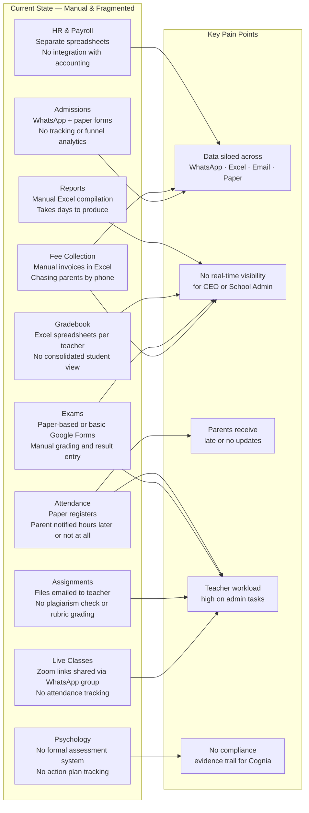
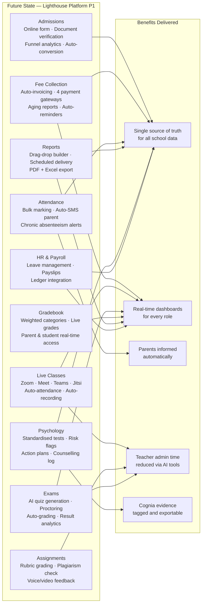
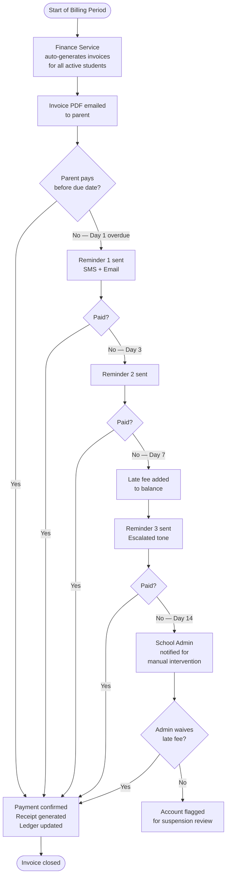
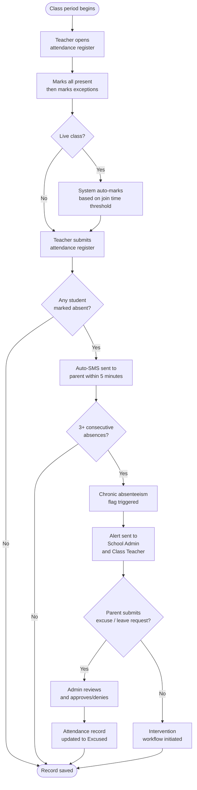
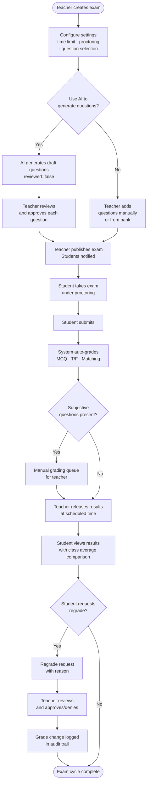
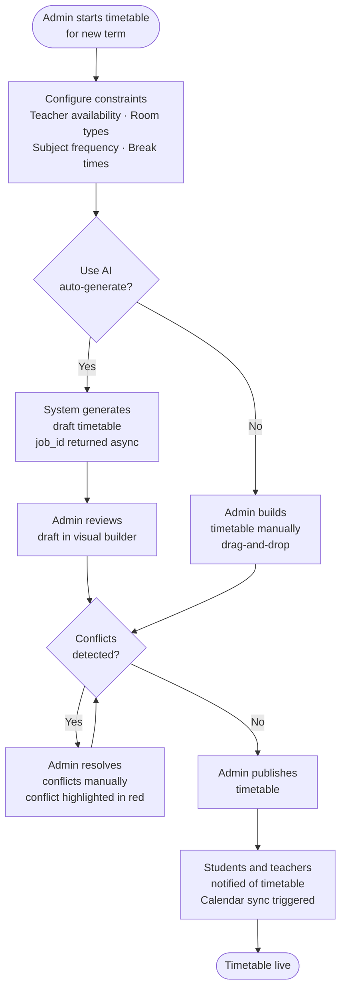
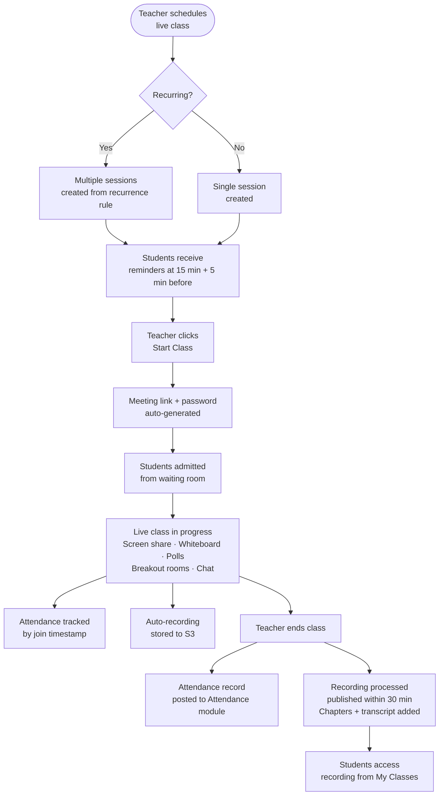
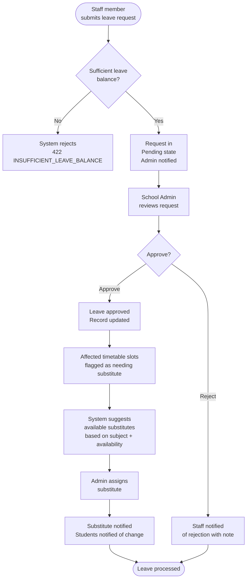
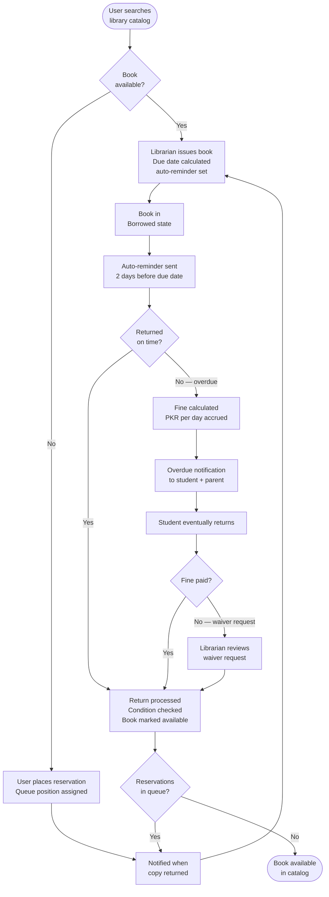

# PART 3 — BUSINESS REQUIREMENTS
## P1 — Learning Management System + School Management System
### Layer 1 — Business & Strategy

**Status:** 🟡 Content Complete — Layer Gate Not Yet Passed
**Layer Gate:** Not yet passed — diagrams for all 29 processes pending, batched with Part 2 journey diagrams

---

## 3.1 Current State

*Pain-point map of the current manual/fragmented state*

Lighthouse Global School System operates today without an integrated platform. Each functional domain relies on disconnected consumer tools, creating fragmentation, manual rework, and no single source of truth across the school.

**Academic Operations:** Teaching activity depends on WhatsApp for assignment distribution, Excel for grade calculation, and standalone Zoom for live classes — none of which communicate with each other (J07, J08, J10). No teacher has a unified view of a student's standing without manually cross-referencing five separate sources, and no admin can verify academic delivery without the same manual effort.

**Financial Operations:** Fee structures are built in Excel each term, invoices generated manually one by one, and payments confirmed via bank transfer with no automated reconciliation (J02). Accounting — ledgers, trial balances, payroll — exists in separate spreadsheets disconnected from the fee system, requiring duplicate data entry and creating reconciliation risk at every reporting cycle.

**Admissions & Enrolment:** Applications arrive via PDF forms emailed manually, tracked with no formal funnel visibility, and converted to enrolled students through entirely manual account creation (J01). There is no system-enforced workflow — every stage relies on an admin remembering the next step.

**Communication:** Parents and teachers communicate primarily through personal WhatsApp numbers, with no professional boundary, no message history retained against student records, and no read-receipt confirmation (J12, J23). Emergency communication has no structured multi-channel broadcast mechanism.

**Student Wellbeing:** Psychological assessments are scored manually with real risk of calculation error. Records are stored in personal, unsecured documents with no access control, and confidential information is at risk of being shared informally beyond its intended audience (Persona 5, J25–J28).

**Staff & Compliance:** Leave requests, performance tracking, and payroll processing happen manually with no audit trail. There is no structured evidence repository for Cognia accreditation readiness, meaning compliance evidence would need to be reconstructed retroactively if requested.

## 3.2 Future State

*Target-state capability map and benefits*

P1 consolidates every functional domain into a single multi-tenant platform where data flows automatically between modules, eliminating manual re-entry and giving every role real-time access to the same source of truth.

**Academic Operations:** Assignment, attendance, exam, and grade data flow automatically into one student record. A teacher sees complete class performance at a glance; an admin verifies academic delivery without contacting a single teacher; AI-assisted quiz generation reduces exam preparation time from hours to minutes (J08, J09, J10).

**Financial Operations:** Fee structures, invoicing, payment collection, and full double-entry accounting operate as one connected system. A payment made by a parent reconciles automatically against the ledger with zero manual entry, and the CEO views live financial position rather than waiting for month-end compilation (J02, J06).

**Admissions & Enrolment:** The full funnel — inquiry, application, document verification, interview, decision, enrolment, first payment — is system-enforced with automated stage transitions, removing dependency on any individual remembering the next step (J01).

**Communication:** All parent-teacher, admin-parent, and emergency communication moves through a professional, logged, multi-channel system, protecting both parties' privacy while creating a permanent, retrievable record of every conversation (J12, J20, J23, J24).

**Student Wellbeing:** Assessments are auto-scored with zero calculation error. Records are centrally secured with role-based visibility controls, ensuring confidential information reaches only its intended audience while critical risk cases still trigger appropriate escalation (J25–J28).

**Staff & Compliance:** Leave, performance, and payroll processes are fully auditable. Cognia evidence accumulates continuously as a by-product of normal platform use rather than being reconstructed under accreditation deadline pressure.

## 3.3 Business Process Flows

*29 cross-functional processes spanning multiple roles, distinct from the single-role user journeys documented in Part 2. Each process includes trigger, goal, actors, and step sequence. Representative flowcharts for the highest-complexity processes follow below; the remaining processes follow the same documented step sequence in their table form.*

**Fee Collection Process**

**Absence & Attendance Workflow**

**Exam Creation & Results Workflow**

**Part 3.3 — Timetable Creation Process**

**Part 3.3 — Live Class Lifecycle**

**Part 3.3 — HR Leave Request Process**

**Part 3.3 — Library Circulation Process**

**Process Index**

| # | Process | Roles Spanned | Status |
|---|---|---|---|
| BP01 | Full Enrolment-to-Graduation Lifecycle | Admin, Teacher, Student, Parent | ✅ |
| BP02 | Cambridge Exam Submission Cycle | Teacher, Admin, Cambridge (external) | ✅ |
| BP03 | At-Risk Student Intervention Workflow | Teacher, Psychologist, Admin, Parent | ✅ |
| BP04 | Financial Close Cycle | Admin, Accountant (Staff), CEO | ✅ |
| BP05 | New School Onboarding | Super Admin, School Admin | ✅ |
| BP06 | Staff Recruitment-to-Payroll Lifecycle | Admin, HR (Staff), Accountant (Staff) | ✅ |
| BP07 | Academic Year / Term Transition | Super Admin, School Admin, Teacher | ✅ |
| BP08 | Emergency / Crisis Communication Workflow | CEO, Admin, Teacher, Parent, Student | ✅ |
| BP09 | Psychological Crisis Escalation Protocol | Psychologist, Admin, CEO, Parent, External | ✅ |
| BP10 | Cognia Accreditation Evidence Collection Cycle | Teacher, Admin, Psychologist, CEO | ✅ |
| BP11 | Scholarship / Fee Discount Approval Workflow | Parent, Admin, CEO, Accountant (Staff) | ✅ |
| BP12 | Same-Day Emergency Substitute Workflow | Teacher, Admin | ✅ |
| BP13 | Multi-Child Family Account Management | Parent, Admin, Multiple Teachers | ✅ |
| BP14 | Annual Budget & Fee Structure Planning Cycle | CEO, Admin, Accountant (Staff) | ✅ |
| BP15 | School-Wide Report Card Compilation & Distribution | Admin, All Teachers, Parents | ✅ |
| BP16 | Student Transfer Between Sections/Classes | Admin, Outgoing Teacher, Incoming Teacher, Student | ✅ |
| BP17 | Student Withdrawal / Unenrollment | Admin, Accountant (Staff), Teacher, Parent | ✅ |
| BP18 | Exam Re-Evaluation / Regrade Request | Student, Teacher, Admin | ✅ |
| BP19 | Plagiarism / Academic Integrity Case Handling | Teacher, Admin, Student, Parent | ✅ |
| BP20 | Health Incident / Medical Emergency Response | Teacher, Admin, Psychologist, Parent | ✅ |
| BP21 | School Closure / Weather Emergency Decision & Notification | CEO, Admin, Teacher, Parent, Student | ✅ |
| BP22 | Teacher Onboarding & First-Class Readiness | HR (Staff), Admin, New Teacher | ✅ |
| BP23 | Annual Re-Enrollment for Returning Students | Admin, Parent, Accountant (Staff) | ✅ |
| BP24 | Parent/Student Complaint & Grievance Handling | Parent/Student, Admin, CEO | ✅ |
| BP25 | Resource Acquisition & Curation (digital library) | Librarian (Staff), Teachers, Admin | ✅ |
| BP26 | Teacher Performance Review Cycle | Admin, CEO, Teacher | ✅ |
| BP27 | New Payment Gateway / Video Platform Integration Onboarding | Super Admin, School Admin | ✅ |
| BP28 | GDPR/Data Subject Access or Deletion Request Handling | Super Admin, School Admin, Affected User | ✅ |
| BP29 | Parent-Teacher Conference Day (school-wide event coordination) | Admin, All Teachers, All Parents | ✅ |

---

### BP01 — Full Enrolment-to-Graduation Lifecycle

**Trigger:** A student is enrolled and begins their academic journey through the school.
**Goal:** Student progresses through every academic year, with all records (academic, attendance, financial, wellbeing) maintained continuously until graduation or transfer.
**Actors:** School Admin, Teacher, Student, Parent, System

| Step | Description | Responsible |
|---|---|---|
| 1 | Student enrolled and assigned to class/section (see J01 for detailed admissions flow) | Admin |
| 2 | Student attends classes, submits assignments, takes exams across the academic year | Student, Teacher |
| 3 | Attendance, grades, and fee payments accumulate continuously in the student's unified record | System |
| 4 | At year-end, academic performance is reviewed against promotion criteria | Admin, Teacher |
| 5 | Promotion decision made — promote to next grade, retain, or flag for review | Admin |
| 6 | Student re-enrolled for the new academic year (see BP23) | Admin, Parent |
| 7 | Cycle repeats annually until final grade/programme level is reached | All |
| 8 | Final year: transcript and graduation requirements verified against Cambridge programme completion | Admin |
| 9 | Graduation certificate and final transcript generated | Admin, System |
| 10 | Student status changed to Alumni; ongoing portal access adjusted per school policy | Admin, System |

---

### BP02 — Cambridge Exam Submission Cycle

**Trigger:** A Cambridge-administered exam period (e.g. IGCSE, AS/A-Level) approaches.
**Goal:** Student exam entries and final grades submitted accurately and on time to Cambridge International via the API integration.
**Actors:** School Admin, Teacher, Cambridge International (external), System

| Step | Description | Responsible |
|---|---|---|
| 1 | Cambridge exam window and submission deadlines confirmed for the term | Admin |
| 2 | Eligible students identified per subject and programme level | Admin, System |
| 3 | Candidate entries prepared and validated against Cambridge's required data format | Admin, System |
| 4 | Entries submitted to Cambridge via API (sandbox tested, live credentials required — see DEP-01/DEP-02) | System |
| 5 | Cambridge confirms entry receipt; any rejected entries flagged for correction | System, Admin |
| 6 | Internal assessment marks and coursework grades compiled by teachers where required | Teacher |
| 7 | Predicted grades submitted if required by Cambridge for the relevant programme | Teacher, Admin |
| 8 | Final candidate results received from Cambridge upon release | System |
| 9 | Results imported into student records and gradebook automatically | System |
| 10 | Results communicated to students and parents through standard grade publication flow (J17) | System |

---

### BP03 — At-Risk Student Intervention Workflow

**Trigger:** A student is flagged as at-risk through declining grades, attendance issues, or psychological assessment results.
**Goal:** Early, coordinated intervention involving teacher, psychologist, and parent before the situation escalates.
**Actors:** Teacher, Psychologist, School Admin, Parent, System

| Step | Description | Responsible |
|---|---|---|
| 1 | System detects risk pattern — declining grades, chronic absenteeism, or concerning assessment score | System |
| 2 | Auto-flag generated and routed to relevant teacher and psychologist | System |
| 3 | Teacher reviews academic context and adds observations | Teacher |
| 4 | Psychologist reviews wellbeing context — test results, attendance, behavioural notes | Psychologist |
| 5 | Psychologist creates a student action plan with SMART goals (see J27) | Psychologist |
| 6 | Admin notified if risk level is High or Critical per escalation rules | System |
| 7 | Parent informed at the appropriate visibility level configured in the action plan | System, Psychologist |
| 8 | Coordinated check-ins scheduled between teacher and psychologist | Teacher, Psychologist |
| 9 | Progress tracked against action plan milestones over subsequent weeks | Psychologist, System |
| 10 | Case reviewed and closed, escalated, or continued based on progress trend | Psychologist, Admin |

---

### BP04 — Financial Close Cycle

**Trigger:** End of month or end of term financial reporting period begins.
**Goal:** All fee collection reconciled with accounting records, financial statements prepared, and reported to CEO/board.
**Actors:** School Admin, Accountant (Staff), CEO, System

| Step | Description | Responsible |
|---|---|---|
| 1 | Fee collection cycle for the period completes (see J02) | Admin, System |
| 2 | All payments automatically posted to the ledger as they are received throughout the period | System |
| 3 | Accountant reviews ledger entries for the period and resolves any discrepancies | Accountant (Staff) |
| 4 | Outstanding fees and aging report reviewed for collection follow-up | Admin, Accountant (Staff) |
| 5 | Payroll costs for the period posted to accounting records | System |
| 6 | Trial balance generated and reviewed for accuracy | Accountant (Staff) |
| 7 | Profit & Loss statement and Balance Sheet generated for the period | System |
| 8 | Accountant adds any manual adjusting entries required | Accountant (Staff) |
| 9 | Final financial statements reviewed and approved | Admin |
| 10 | Financial report compiled and delivered to CEO/board (see J06) | Admin, System |

---

### BP05 — New School Onboarding (Multi-Tenant Setup)

**Trigger:** A new school signs up to the SaaS platform.
**Goal:** New school tenant fully configured and operational with its own isolated data, branding, and module configuration.
**Actors:** Super Admin, School Admin, System

| Step | Description | Responsible |
|---|---|---|
| 1 | Super Admin creates new school tenant with unique subdomain | Super Admin |
| 2 | School profile configured — name, address, timezone, currency, academic calendar | Super Admin, School Admin |
| 3 | Modules enabled/disabled per the school's subscribed plan | Super Admin |
| 4 | School branding applied — logo, colour scheme, favicon | School Admin |
| 5 | Subscription plan and billing cycle assigned | Super Admin |
| 6 | School Admin account created and credentials issued | Super Admin |
| 7 | School Admin configures payment gateway credentials for their region (per-tenant, plug-and-play) | School Admin |
| 8 | School Admin sets up academic structure — grades, sections, subjects, grading scale | School Admin |
| 9 | Initial user accounts created — teachers, students, parents (bulk import or manual) | School Admin |
| 10 | School status set to Active; school begins normal operations | Super Admin, School Admin |

### BP06 — Staff Recruitment-to-Payroll Lifecycle

**Trigger:** A school identifies a staffing need (new teacher, librarian, accountant, etc.).
**Goal:** New staff member hired, onboarded, and integrated into the payroll cycle.
**Actors:** School Admin, HR (Staff sub-role), Accountant (Staff sub-role), New Staff Member, System

| Step | Description | Responsible |
|---|---|---|
| 1 | Staffing need identified and role profile defined | Admin |
| 2 | Candidate selected and employment terms agreed (external recruitment process, outside system scope) | Admin |
| 3 | New staff profile created in system — role, sub-role permissions, contract details | Admin, HR (Staff) |
| 4 | Staff member account credentials issued | System |
| 5 | Onboarding checklist completed — see BP22 for teacher-specific onboarding | HR (Staff) |
| 6 | Staff member added to payroll configuration with salary, allowances, and deductions | HR (Staff), Accountant (Staff) |
| 7 | First payroll cycle processes new staff member's salary | Accountant (Staff), System |
| 8 | Payslip generated and made accessible to staff member | System |
| 9 | Staff performance tracking initiated per school's review cycle (see BP26) | Admin |
| 10 | Ongoing payroll processed monthly as part of standard cycle | Accountant (Staff), System |

---

### BP07 — Academic Year / Term Transition

**Trigger:** Current academic term or year is ending; preparation for the next term/year begins.
**Goal:** Clean transition with all academic structures configured before the new term begins.
**Actors:** Super Admin, School Admin, Teacher, System

| Step | Description | Responsible |
|---|---|---|
| 1 | Current term's grades, attendance, and records finalised and locked | Admin, System |
| 2 | New academic term/year created with start/end dates | Admin |
| 3 | Promotion decisions applied — students moved to next grade per BP01 | Admin |
| 4 | Fee structure for the new term configured (see J02 step 1) | Admin |
| 5 | New timetable built for the upcoming term (see J03) | Admin |
| 6 | Subject and curriculum assignments confirmed for each class | Admin, Teacher |
| 7 | Teacher class/subject assignments updated for the new term | Admin |
| 8 | Historical data from the previous term archived but remains accessible | System |
| 9 | New term communicated to all portals — students, parents, teachers notified of start date | System |
| 10 | New term begins; system switches active context to new term | System |

---

### BP08 — Emergency / Crisis Communication Workflow

**Trigger:** A school-wide emergency occurs requiring immediate, coordinated communication (security incident, urgent announcement, etc.).
**Goal:** All affected parties notified immediately through multiple channels with confirmed delivery tracking.
**Actors:** CEO, School Admin, Teacher, Parent, Student, System

| Step | Description | Responsible |
|---|---|---|
| 1 | Emergency identified requiring immediate broadcast | Admin or CEO |
| 2 | Pre-defined emergency template selected (or custom message composed) | Admin, CEO |
| 3 | Target audience selected — entire school, specific grade, or specific class | Admin, CEO |
| 4 | Broadcast triggered across all configured channels simultaneously (SMS, email, push, in-app) | System |
| 5 | Delivery confirmation tracked per recipient | System |
| 6 | Two-way communication channel opened if the situation requires parent/student response | System |
| 7 | Follow-up updates sent as the situation develops | Admin, CEO |
| 8 | Resolution confirmation broadcast once the situation is resolved | Admin, CEO |
| 9 | Full communication log retained for post-incident review | System |
| 10 | Incident reviewed and emergency templates updated if gaps identified | Admin, CEO |

---

### BP09 — Psychological Crisis Escalation Protocol

**Trigger:** A student is identified as being in a mental health crisis (self-reported, flagged by test results, or observed by staff).
**Goal:** Immediate, appropriate escalation through the correct level of response without breaching confidentiality unnecessarily.
**Actors:** Psychologist, School Admin, CEO, Parent, External Referral (specialist/psychiatrist), System

| Step | Description | Responsible |
|---|---|---|
| 1 | Crisis indicator detected — self-report, concerning test score, or staff observation reported to psychologist | Psychologist, Teacher |
| 2 | Psychologist assesses severity and assigns risk level (Low/Medium/High/Critical) | Psychologist |
| 3 | Level 1 escalation: Psychologist begins immediate response per crisis intervention protocol | Psychologist |
| 4 | Level 2 escalation (High risk): School Admin notified | System |
| 5 | Level 3 escalation (Critical risk): Principal/CEO and emergency contacts notified immediately | System |
| 6 | Parent contacted directly by psychologist or admin depending on severity | Psychologist, Admin |
| 7 | External referral initiated if specialist care is required | Psychologist |
| 8 | Referral status tracked until handover to external care is confirmed | Psychologist, System |
| 9 | Confidential session notes recorded; only appropriate summary shared with relevant parties | Psychologist |
| 10 | Follow-up monitoring scheduled and outcome tracked over subsequent weeks | Psychologist |

---

### BP10 — Cognia Accreditation Evidence Collection Cycle

**Trigger:** Ongoing, continuous process throughout the academic year in preparation for Cognia accreditation review.
**Goal:** Evidence of teaching standards, learning outcomes, and institutional quality accumulated systematically, ready for accreditation submission.
**Actors:** Teacher, School Admin, Psychologist, CEO, System

| Step | Description | Responsible |
|---|---|---|
| 1 | Cognia evidence standards mapped to specific platform activities (lesson delivery, assessment, wellbeing support) | Admin |
| 2 | Teachers tag relevant evidence as part of normal platform use — lesson plans, assessment records, outcome data | Teacher |
| 3 | System automatically captures audit-trail evidence in the background (attendance accuracy, grading consistency, etc.) | System |
| 4 | Psychologist's wellbeing and counselling records contribute evidence of holistic student support | Psychologist |
| 5 | Admin periodically reviews evidence completeness against Cognia standards checklist | Admin |
| 6 | Gaps identified and flagged for additional evidence collection | Admin |
| 7 | Evidence compiled into structured reports mapped to each Cognia standard | System, Admin |
| 8 | CEO reviews accreditation readiness summary | CEO |
| 9 | Final evidence package prepared ahead of Cognia review/audit | Admin |
| 10 | Evidence package submitted to Cognia for accreditation review (external process) | Admin |

### BP11 — Scholarship / Fee Discount Approval Workflow

**Trigger:** A parent requests a fee discount, or the school proactively offers a merit/sibling scholarship.
**Goal:** Discount or scholarship reviewed, approved through appropriate authority, and correctly applied to the fee structure.
**Actors:** Parent, School Admin, CEO, Accountant (Staff sub-role), System

| Step | Description | Responsible |
|---|---|---|
| 1 | Parent submits scholarship/discount request with supporting justification, or school identifies eligible student (merit, sibling, staff discount) | Parent or Admin |
| 2 | Admin reviews request against school's discount policy criteria | Admin |
| 3 | Discount amount/percentage calculated based on policy (sibling discount, merit scholarship, financial hardship) | Admin, System |
| 4 | Approval routed to CEO if discount exceeds admin's authorised threshold | System |
| 5 | CEO reviews and approves or rejects high-value discount requests | CEO |
| 6 | Approved discount applied to the student's fee structure | Admin, System |
| 7 | Accountant verifies discount is correctly reflected in revenue projections and reporting | Accountant (Staff) |
| 8 | Parent notified of decision and updated fee statement | System |
| 9 | Discount automatically reapplied each billing cycle for the duration approved | System |
| 10 | Discount/scholarship report included in financial reporting (see BP04) | System |

---

### BP12 — Same-Day Emergency Substitute Workflow

**Trigger:** A teacher is unexpectedly unable to attend (illness, emergency) with no advance notice — distinct from planned leave (J04).
**Goal:** Affected classes covered within minutes, minimising disruption to students.
**Actors:** Teacher, School Admin, System

| Step | Description | Responsible |
|---|---|---|
| 1 | Teacher or admin reports sudden unavailability, typically same-day or last-minute | Teacher or Admin |
| 2 | Admin marks teacher as unavailable for the day with reason | Admin |
| 3 | System immediately identifies all classes scheduled for that teacher today | System |
| 4 | System surfaces available substitute teachers ranked by subject match and immediate availability | System |
| 5 | Admin selects substitute(s) for each affected class with urgency priority | Admin |
| 6 | Substitute notified immediately via push/SMS with class details and any available lesson materials | System |
| 7 | Students and parents notified of the substitution for transparency | System |
| 8 | Substitute accesses original teacher's lesson plan/materials if available, or proceeds with standard coverage | Substitute Teacher |
| 9 | Substitution logged against both the absent teacher's and substitute's records | System |
| 10 | Same-day substitution pattern tracked — frequent last-minute absences flagged for HR review | System |

---

### BP13 — Multi-Child Family Account Management

**Trigger:** A parent has multiple children enrolled at the school, potentially across different grades or even campuses.
**Goal:** Parent manages all children's academic, financial, and communication needs from a single unified account.
**Actors:** Parent, School Admin, Multiple Teachers, System

| Step | Description | Responsible |
|---|---|---|
| 1 | Parent account created and linked to first child during admissions (see J01) | Admin |
| 2 | Second (or subsequent) child enrolled and linked to the same parent account | Admin |
| 3 | Parent dashboard automatically aggregates summary cards for all linked children | System |
| 4 | Parent toggles between children's individual dashboards seamlessly (see J22) | Parent |
| 5 | Fee statements consolidated showing total obligation across all children, with sibling discount applied automatically if eligible | System |
| 6 | Parent makes a single payment session covering fees for multiple children if desired | Parent, System |
| 7 | Communication from each child's respective teachers routes to the same parent inbox, clearly labelled by child | System |
| 8 | Absence/grade alerts clearly indicate which child the notification concerns | System |
| 9 | Authorized pickup persons and emergency contacts managed once, applicable across all linked children unless overridden per child | Parent |
| 10 | If a child transfers or withdraws, the parent account remains active for any remaining enrolled children | Admin, System |

---

### BP14 — Annual Budget & Fee Structure Planning Cycle

**Trigger:** Annual planning cycle begins ahead of the next academic year, typically initiated by CEO/leadership.
**Goal:** Next year's fee structure and operational budget approved and ready for term transition (BP07).
**Actors:** CEO, School Admin, Accountant (Staff sub-role), System

| Step | Description | Responsible |
|---|---|---|
| 1 | CEO reviews previous year's financial performance — revenue, expenses, collection rate (see BP04 outputs) | CEO |
| 2 | Accountant prepares cost analysis — cost per student, departmental expenses, projected inflation impact | Accountant (Staff) |
| 3 | CEO sets strategic targets — enrolment growth, revenue targets, expense ceilings | CEO |
| 4 | Proposed fee structure for the next year drafted based on cost analysis and strategic targets | Admin, Accountant (Staff) |
| 5 | What-if scenario modelling run — fee increase impact, scholarship budget allocation | CEO, System |
| 6 | CEO reviews and approves the proposed fee structure and operational budget | CEO |
| 7 | Approved fee structure configured in the system ahead of the new term | Admin |
| 8 | Department-level budgets allocated and communicated | CEO, Admin |
| 9 | Annual budget documented for board reporting | Admin, System |
| 10 | Approved fee structure activates automatically at term transition (BP07) | System |

---

### BP15 — School-Wide Report Card Compilation & Distribution

**Trigger:** End of grading period across the entire school.
**Goal:** Every student's report card generated, reviewed, and distributed to parents on schedule, school-wide.
**Actors:** School Admin, All Teachers, Parents, System

| Step | Description | Responsible |
|---|---|---|
| 1 | Grading period closes; deadline communicated to all teachers for final grade entry | Admin, System |
| 2 | Each teacher finalises grades for their classes (see J10 for individual teacher flow) | Teacher |
| 3 | System checks completion status across all classes and flags any teachers with outstanding grades | System |
| 4 | Admin follows up with any teachers who have not completed grading | Admin |
| 5 | Once all grades are finalised, system generates report cards for every enrolled student simultaneously | System |
| 6 | Admin spot-checks a sample of report cards for quality and accuracy before mass distribution | Admin |
| 7 | Report cards approved for school-wide release | Admin |
| 8 | Report cards distributed simultaneously to all parent and student portals | System |
| 9 | Parents notified of report card availability via configured channels | System |
| 10 | Distribution completion confirmed; any parents who haven't viewed are flagged for admin follow-up if required | System |

### BP16 — Student Transfer Between Sections/Classes

**Trigger:** A student needs to move from one section or class to another within the same grade (capacity rebalancing, parent request, behavioural reasons).
**Goal:** Student transferred cleanly with all academic records, attendance history, and access correctly reassigned with no data loss.
**Actors:** School Admin, Outgoing Teacher, Incoming Teacher, Student, System

| Step | Description | Responsible |
|---|---|---|
| 1 | Transfer request initiated — by admin decision, parent request, or capacity rebalancing need | Admin |
| 2 | Admin reviews receiving section's capacity and suitability | Admin |
| 3 | Outgoing teacher notified of pending transfer and prompted to finalise any pending grades/assessments | System |
| 4 | Transfer approved and effective date set | Admin |
| 5 | Student's class/section assignment updated in the system | Admin |
| 6 | All historical academic records (grades, attendance, assignments) remain attached to the student, not the section | System |
| 7 | Incoming teacher gains access to student's full academic history immediately | System |
| 8 | Student's timetable automatically updates to reflect new section's schedule | System |
| 9 | Parent notified of the transfer and new section/teacher details | System |
| 10 | Transfer logged for audit purposes | System |

---

### BP17 — Student Withdrawal / Unenrollment

**Trigger:** A parent requests withdrawal, or the school initiates unenrollment (non-payment, disciplinary, relocation).
**Goal:** Student cleanly unenrolled with all financial obligations settled and records properly archived.
**Actors:** School Admin, Accountant (Staff sub-role), Teacher, Parent, System

| Step | Description | Responsible |
|---|---|---|
| 1 | Withdrawal request submitted by parent, or unenrollment initiated by admin | Parent or Admin |
| 2 | Reason for withdrawal recorded for institutional reporting | Admin |
| 3 | Outstanding fee balance calculated, including any pro-rated charges for the current term | System, Accountant (Staff) |
| 4 | Outstanding balance settled, or formal payment plan agreed if applicable | Parent, Accountant (Staff) |
| 5 | Any applicable refund calculated per school refund policy and processed | Accountant (Staff) |
| 6 | Teacher(s) notified that the student is being unenrolled, finalising any pending grades | System |
| 7 | Student's transcript and academic records finalised as of withdrawal date | Admin, System |
| 8 | Transfer certificate or leaving certificate generated if required | Admin |
| 9 | Student and parent portal access deactivated as of withdrawal date; historical records remain archived | System |
| 10 | Enrolment count and capacity figures updated school-wide | System |

---

### BP18 — Exam Re-Evaluation / Regrade Request

**Trigger:** A student or parent disputes an exam or assignment grade and requests re-evaluation.
**Goal:** Grade dispute reviewed fairly and transparently, with outcome documented either way.
**Actors:** Student, Teacher, School Admin, System

| Step | Description | Responsible |
|---|---|---|
| 1 | Student or parent submits a regrade request within the configured window, with reason | Student or Parent |
| 2 | Request routed to the original grading teacher | System |
| 3 | Teacher reviews the original submission and grading against the rubric | Teacher |
| 4 | If teacher disagrees with the request, teacher provides written justification for the original grade | Teacher |
| 5 | If teacher agrees a regrade is warranted, grade is updated with a reason logged | Teacher |
| 6 | For high-value assessments (e.g. final exams), admin may require a second-marker review | Admin |
| 7 | Second marker (if invoked) reviews independently without seeing the first grade | Admin-assigned Teacher |
| 8 | Final grade decision recorded with full audit trail of original grade, request reason, and outcome | System |
| 9 | Student/parent notified of the outcome and rationale | System |
| 10 | If the outcome is disputed further, case escalates to admin for final decision | Admin |

---

### BP19 — Plagiarism / Academic Integrity Case Handling

**Trigger:** Suspected plagiarism or academic dishonesty detected in a submission or flagged during a proctored exam.
**Goal:** Case investigated fairly, evidence preserved, and consistent disciplinary action applied per school policy.
**Actors:** Teacher, School Admin, Student, Parent, System

| Step | Description | Responsible |
|---|---|---|
| 1 | Suspected integrity violation identified — plagiarism detection flag, proctoring incident, or teacher observation | Teacher or System |
| 2 | Evidence automatically preserved — submission timestamp, proctoring flags, similarity report if applicable | System |
| 3 | Teacher reviews evidence and determines whether to escalate | Teacher |
| 4 | Case formally logged with admin, evidence attached | Teacher, System |
| 5 | Student given opportunity to respond/explain before any decision is made | Admin |
| 6 | Admin reviews case against school's academic integrity policy | Admin |
| 7 | Decision made — grade penalty, assignment resubmission, formal disciplinary action, or case dismissed | Admin |
| 8 | Parent notified of the case and outcome per school policy | System |
| 9 | Decision and full evidence trail permanently logged against the student's record | System |
| 10 | Repeat offences automatically flagged for escalated review given prior case history | System |

---

### BP20 — Health Incident / Medical Emergency Response

**Trigger:** A student experiences a health incident or medical emergency on school premises or during a school activity.
**Goal:** Immediate appropriate response, correct parties informed promptly, and incident properly documented.
**Actors:** Teacher, School Admin, Psychologist, Parent, System

| Step | Description | Responsible |
|---|---|---|
| 1 | Health incident occurs and is reported by teacher or staff member present | Teacher |
| 2 | Immediate first response provided per school's medical emergency protocol | Teacher, Admin |
| 3 | Student's medical record (allergies, conditions, emergency contacts) accessed instantly by responding staff | System |
| 4 | Admin notified immediately of the incident | System |
| 5 | Parent contacted immediately with incident details and severity | Admin, System |
| 6 | External medical services contacted if required (ambulance, hospital) | Admin |
| 7 | If incident has a psychological/trauma component, psychologist notified for follow-up support | System |
| 8 | Incident details logged — time, nature, response taken, outcome | Admin, System |
| 9 | Follow-up care plan documented if ongoing monitoring is needed | Psychologist or Admin |
| 10 | Incident report available for school's safety/compliance records | System |

### BP21 — School Closure / Weather Emergency Decision & Notification

**Trigger:** Weather event, natural disaster, or external emergency requires a decision on whether to close the school.
**Goal:** Closure decision made promptly, communicated school-wide, and academic continuity maintained where possible.
**Actors:** CEO, School Admin, Teacher, Parent, Student, System

| Step | Description | Responsible |
|---|---|---|
| 1 | Emergency situation identified (severe weather, local authority advisory, safety concern) | CEO or Admin |
| 2 | CEO and Admin assess severity and decide on closure, delay, or normal operations | CEO, Admin |
| 3 | Decision finalised — full closure, online-only day, or delayed start | CEO |
| 4 | Emergency broadcast triggered via BP08 workflow to all students, parents, and teachers | System |
| 5 | If continuing remotely, teachers notified to shift to live online class delivery for the day | Admin, System |
| 6 | Timetable temporarily adjusted to reflect online delivery mode if applicable | Admin, System |
| 7 | Attendance rules adjusted for the day to reflect remote participation instead of physical presence | System |
| 8 | Updates issued throughout the day if conditions change | CEO, Admin |
| 9 | Re-opening confirmation broadcast once normal operations resume | CEO, Admin |
| 10 | Incident documented; any missed assessments or classes rescheduled per standard processes | Admin |

---

### BP22 — Teacher Onboarding & First-Class Readiness

**Trigger:** A newly hired teacher joins the school (output of BP06).
**Goal:** New teacher fully set up and confident to deliver their first class without confusion or delay.
**Actors:** HR (Staff sub-role), School Admin, New Teacher, System

| Step | Description | Responsible |
|---|---|---|
| 1 | Teacher account created with appropriate subject/class assignments | Admin, HR (Staff) |
| 2 | Login credentials issued and teacher completes initial account setup | New Teacher |
| 3 | Platform onboarding wizard guides teacher through key features (gradebook, assignments, live classes) | System |
| 4 | Teacher reviews assigned classes and existing curriculum/syllabus structure for their subject | New Teacher |
| 5 | Teacher granted access to resource library to reuse existing course content where available | System |
| 6 | Teacher completes technical check for live class delivery (camera, mic, platform familiarity) | New Teacher |
| 7 | Teacher builds or imports first set of course content ahead of their first scheduled class | New Teacher |
| 8 | Admin or assigned mentor reviews teacher's readiness before the first live class | Admin |
| 9 | Teacher delivers first class; system tracks this as a milestone in onboarding completion | New Teacher, System |
| 10 | Onboarding marked complete; teacher proceeds to standard performance review cycle (BP26) | Admin |

---

### BP23 — Annual Re-Enrollment for Returning Students

**Trigger:** Academic year transition approaches (linked to BP07); existing students need to confirm enrolment for the next year.
**Goal:** Returning students re-enrolled with updated fee structures and any required documentation, with minimal manual admin effort.
**Actors:** School Admin, Parent, Accountant (Staff sub-role), System

| Step | Description | Responsible |
|---|---|---|
| 1 | Re-enrollment window opens ahead of the new academic year | Admin, System |
| 2 | Parents notified that re-enrollment confirmation is required, with next year's fee structure included | System |
| 3 | Parent confirms re-enrollment intent through the portal | Parent |
| 4 | Any updated documentation required (e.g. updated medical info) requested and collected | System, Parent |
| 5 | Next year's invoice generated automatically based on confirmed re-enrollment and grade progression | System |
| 6 | Parent pays registration/confirmation fee if applicable | Parent |
| 7 | Non-responses followed up with reminders as the deadline approaches | System |
| 8 | Admin reviews any parents who have not confirmed by the deadline for manual follow-up | Admin |
| 9 | Re-enrolled students automatically flow into the new academic year's class/section assignment process (BP07) | System |
| 10 | Final re-enrollment numbers confirmed for capacity and resource planning | Admin |

---

### BP24 — Parent/Student Complaint & Grievance Handling

**Trigger:** A parent or student raises a formal complaint or grievance about a teacher, policy, or incident.
**Goal:** Complaint handled fairly, transparently, and with appropriate resolution or escalation.
**Actors:** Parent/Student, School Admin, CEO, System

| Step | Description | Responsible |
|---|---|---|
| 1 | Complaint submitted through a formal channel (distinct from routine messaging) | Parent or Student |
| 2 | Complaint logged with category, severity, and relevant parties involved | System, Admin |
| 3 | Admin reviews complaint and determines initial response approach | Admin |
| 4 | Relevant parties (e.g. teacher involved) given opportunity to respond | Admin |
| 5 | Investigation conducted, gathering relevant records (messages, attendance, grades) as evidence if needed | Admin |
| 6 | Resolution proposed and communicated to the complainant | Admin |
| 7 | If unresolved or complainant disagrees, case escalates to CEO for review | CEO |
| 8 | CEO makes final determination on unresolved or serious cases | CEO |
| 9 | Outcome and any corrective action documented | Admin, System |
| 10 | Complaint and resolution retained in records for pattern tracking and accountability | System |

---

### BP25 — Resource Acquisition & Curation (Digital Library)

**Trigger:** A need for new digital learning resources is identified — curriculum update, teacher request, or usage gap.
**Goal:** Relevant digital resources acquired, catalogued, and made available to the appropriate audience.
**Actors:** Librarian (Staff sub-role), Teachers, School Admin, System

| Step | Description | Responsible |
|---|---|---|
| 1 | Resource need identified — teacher request, curriculum gap, or low engagement with existing materials | Teacher or Librarian (Staff) |
| 2 | Librarian researches and identifies suitable digital resources (e-books, journals, video content) | Librarian (Staff) |
| 3 | Resource acquisition approved if a budget/licensing cost is involved | Admin |
| 4 | Resource added to the digital catalog with metadata — subject, grade level, category | Librarian (Staff) |
| 5 | Access permissions configured — which grades/classes can access the resource | Librarian (Staff) |
| 6 | Resource announced to relevant teachers/students through the catalog or targeted notification | System |
| 7 | Usage tracked over time — views, downloads, engagement | System |
| 8 | Librarian reviews usage analytics periodically to inform future acquisition decisions | Librarian (Staff) |
| 9 | Low-usage or outdated resources flagged for review or removal | Librarian (Staff) |
| 10 | Catalog curated on an ongoing basis to remain relevant to current curriculum needs | Librarian (Staff) |

### BP26 — Teacher Performance Review Cycle

**Trigger:** Scheduled performance review period arrives (per school's review cycle — typically termly or annually).
**Goal:** Teacher performance reviewed fairly using objective data alongside qualitative input, with outcomes documented and actionable.
**Actors:** School Admin, CEO, Teacher, System

| Step | Description | Responsible |
|---|---|---|
| 1 | Review cycle triggered per configured schedule | System |
| 2 | System compiles objective performance data — class average scores, attendance/punctuality, student feedback scores, assignment grading turnaround | System |
| 3 | Admin reviews compiled data ahead of the review meeting | Admin |
| 4 | Self-assessment requested from teacher | Admin, System |
| 5 | Teacher completes self-assessment reflecting on the period | Teacher |
| 6 | Review meeting conducted between admin and teacher | Admin, Teacher |
| 7 | Strengths, development areas, and goals for the next period documented | Admin |
| 8 | For senior or critical roles, CEO reviews summary outcomes across all teachers | CEO |
| 9 | Review outcome and goals saved to teacher's HR record | System |
| 10 | Development goals tracked and revisited at the next review cycle | Admin |

---

### BP27 — New Payment Gateway / Video Platform Integration Onboarding

**Trigger:** A school needs to connect a new payment gateway or video conferencing platform not previously configured.
**Goal:** New third-party integration connected, tested, and operational without disrupting existing services.
**Actors:** Super Admin, School Admin, System

| Step | Description | Responsible |
|---|---|---|
| 1 | School identifies need for a new integration (e.g. a regional payment method, or an additional video platform) | Admin |
| 2 | Super Admin confirms the integration is supported by the platform's generic integration layer | Super Admin |
| 3 | School Admin obtains API credentials from the third-party provider (outside system scope) | Admin |
| 4 | School Admin enters credentials into the school's integration settings | Admin |
| 5 | System validates the connection with a test transaction or test call | System |
| 6 | Sandbox/test mode verified before going live | Admin |
| 7 | Integration switched to live mode for the school | Admin |
| 8 | Relevant users notified that the new option is available (e.g. new payment method shown at checkout) | System |
| 9 | Integration monitored for errors during the initial period | System, Super Admin |
| 10 | Integration documented in the school's active integrations list for future reference | System |

---

### BP28 — GDPR/Data Subject Access or Deletion Request Handling

**Trigger:** A user (or parent on behalf of a minor) submits a formal request to access or delete their personal data.
**Goal:** Request handled within required regulatory timeframes, with appropriate data exported or deleted while preserving necessary records.
**Actors:** Super Admin, School Admin, Affected User, System

| Step | Description | Responsible |
|---|---|---|
| 1 | Data subject access or deletion request submitted through a formal channel | Affected User or Parent |
| 2 | Request logged and routed to School Admin and/or Super Admin depending on request type | System |
| 3 | Identity of the requester verified | Admin |
| 4 | For access requests: all personal data associated with the user compiled into an exportable format | System |
| 5 | For deletion requests: data reviewed against retention obligations (e.g. financial records required by law cannot be deleted) | Admin, Super Admin |
| 6 | Deletable data removed; non-deletable data anonymised where possible | Super Admin, System |
| 7 | Confirmation provided to the requester once the request is fulfilled | Admin |
| 8 | Request and outcome logged for compliance audit purposes | System |
| 9 | If request cannot be fully honoured (e.g. legal retention requirement), requester informed of the reason | Admin |
| 10 | Request completed within the regulatory timeframe (per applicable jurisdiction) | Admin, Super Admin |

---

### BP29 — Parent-Teacher Conference Day (School-Wide Event Coordination)

**Trigger:** School schedules a dedicated parent-teacher conference day, term-end or mid-term.
**Goal:** All parents able to book and attend meetings with relevant teachers in a single coordinated event, with no scheduling conflicts.
**Actors:** School Admin, All Teachers, All Parents, System

| Step | Description | Responsible |
|---|---|---|
| 1 | Admin schedules the conference day and defines the available time window | Admin |
| 2 | All teachers prompted to set their available slots within the day (see J12 individual flow) | Teacher, System |
| 3 | Parents notified that booking is open, with a link to each child's teachers | System |
| 4 | Parents with multiple children book slots across multiple teachers, with system preventing overlapping bookings | Parent, System |
| 5 | System optimises to minimise gaps in a parent's schedule across multiple teacher meetings where possible | System |
| 6 | Booking confirmations and calendar invites sent to both parents and teachers | System |
| 7 | Reminder notifications sent as the conference day approaches | System |
| 8 | On the day, meetings proceed per schedule — in-person or virtual depending on configuration | Teacher, Parent |
| 9 | Meeting notes logged by teachers after each session | Teacher |
| 10 | Post-event summary compiled for admin — attendance rate, no-shows, follow-up actions needed | System, Admin |

---

## 3.4 Business Rules

*Numbered, testable rules governing platform behaviour across modules. Each rule can be converted directly into a test case during QA (Part 15). Rules are grouped by domain for navigability; rule IDs are sequential and do not reset between groups.*

### Academic & Grading Rules

| ID | Rule |
|---|---|
| BR-001 | The system shall calculate final grades using the weighted category structure configured by the teacher (e.g. Homework 20%, Exams 40%, Participation 10%), with category weights summing to exactly 100%. |
| BR-002 | If a "drop lowest score" rule is enabled for a category, the system shall exclude the lowest-scoring item in that category from the final grade calculation. |
| BR-003 | Any manually overridden grade shall require the teacher to enter a reason, and the override shall be logged with the original calculated grade, the override value, the reason, and a timestamp. |
| BR-004 | A student's promotion to the next grade level shall require a final aggregate score at or above the school-configured passing threshold for that academic year. |
| BR-005 | An assignment marked "Late" past its deadline shall apply the configured late penalty (percentage deduction per day/hour) automatically, unless the teacher has manually marked the submission as excused. |
| BR-006 | The system shall enforce the maximum number of submission attempts configured per assignment; once the limit is reached, further submissions shall be rejected. |
| BR-007 | A grade regrade request (BP18) shall only be accepted within the school-configured submission window following grade publication. |

### Attendance Rules

| ID | Rule |
|---|---|
| BR-008 | A student arriving after the school-configured late threshold time shall be automatically marked "Late" rather than "Present." |
| BR-009 | The system shall automatically flag a student as "Chronic Absenteeism Risk" upon 3 or more consecutive unexcused absences. |
| BR-010 | An absence excuse submitted by a parent shall remain in "Pending" status until explicitly approved or rejected by School Admin; it shall not auto-approve. |
| BR-011 | A student's attendance percentage used for report card eligibility shall exclude any days marked "Excused." |
| BR-012 | For live online classes, a student shall be automatically marked "Present" only if their session join duration meets or exceeds the school-configured minimum threshold (e.g. joined within the first 10 minutes and remained for at least 70% of class duration). |

### Exam & Assessment Rules

| ID | Rule |
|---|---|
| BR-013 | Objective question types (Multiple Choice, True/False, Matching, exact-match Fill-in-the-Blank) shall be auto-graded immediately upon submission. |
| BR-014 | Subjective question types (Essay, Short Answer, Coding) shall always route to a manual grading queue regardless of any auto-grading configuration. |
| BR-015 | A student shall not be permitted to retake an IQ assessment within 12 months of their most recent attempt. |
| BR-016 | If proctoring detects a tab-switch event, multiple faces, or no face during a proctored exam, the system shall log the event with a timestamp and flag it for teacher review; it shall not auto-fail the student. |
| BR-017 | The system shall warn a student before final exam submission if one or more questions remain unanswered, requiring explicit confirmation to proceed. |
| BR-018 | An exam's correct answers shall only be revealed to students according to the teacher's configured setting (immediately, after the exam window closes, or never) — never by default. |

### Fee & Financial Rules

| ID | Rule |
|---|---|
| BR-019 | The system shall send fee due-date reminders at 7 days, 3 days, and 1 day before the due date, and shall escalate reminder frequency daily once the due date has passed. |
| BR-020 | A late fee shall be calculated and applied automatically the day after the due date passes, using the school-configured method (fixed amount or percentage per day/week). |
| BR-021 | A sibling discount shall apply automatically when two or more children from the same parent account are concurrently enrolled, without requiring manual request. |
| BR-022 | Any fee discount or scholarship exceeding the School Admin's configured approval threshold shall route automatically to CEO for approval (BP11) and shall not be applied until approved. |
| BR-023 | A partial fee payment shall be accepted and recorded against the invoice, with the remaining balance continuing to accrue toward the next reminder/late-fee cycle. |
| BR-024 | An overpayment shall be credited to the student's account balance and automatically applied to the next invoice generated for that student. |
| BR-025 | A refund triggered by student withdrawal (BP17) shall be calculated on a pro-rated basis according to the school's configured refund policy and the withdrawal effective date. |

### Admissions Rules

| ID | Rule |
|---|---|
| BR-026 | An application shall not progress to the Interview Scheduling stage until all required documents for the applied grade level are verified as complete. |
| BR-027 | A waitlisted applicant shall be automatically promoted to "Accepted" status when a vacancy opens in their grade/section, ranked by the school-configured waitlist order. |
| BR-028 | An applicant shall not be converted to an enrolled student account until the enrolment fee payment is confirmed as received. |

### Psychological Assessment & Risk Escalation Rules

| ID | Rule |
|---|---|
| BR-029 | An EQ assessment overall score below 40 shall automatically trigger a risk flag for psychologist review. |
| BR-030 | A risk level of "High" shall automatically notify School Admin in addition to the Psychologist; a risk level of "Critical" shall additionally notify the CEO/Principal and the student's registered emergency contacts. |
| BR-031 | Confidential counselling session notes shall default to Psychologist-only visibility; any broader visibility requires the Psychologist to explicitly create a separate shareable summary. |
| BR-032 | An Action Plan's detailed interventions shall default to Student and Psychologist visibility only; Goals shall default to visible to Student, Parent, and Teacher, unless the Psychologist applies a Critical Case Override making all relevant parties aware regardless of default settings. |

### Communication & Emergency Rules

| ID | Rule |
|---|---|
| BR-033 | An emergency broadcast shall be delivered through every channel the recipient has configured (SMS, email, push, in-app) simultaneously, not through a single fallback channel. |
| BR-034 | A parent or teacher message shall display a "Read" receipt and timestamp only once the recipient has opened the specific message — not upon delivery. |
| BR-035 | The CEO portal shall be restricted to staff-only broadcast messaging; bulk announcements to students or parents shall only be available through the School Admin portal. |

### Staff & HR Rules

| ID | Rule |
|---|---|
| BR-036 | A leave request shall not be approved if it would reduce the staff member's remaining leave balance for that leave type below zero, unless School Admin explicitly overrides with a reason. |
| BR-037 | Upon leave approval, all classes scheduled for that staff member during the leave period shall be automatically flagged as requiring a substitute. |
| BR-038 | A substitute teacher suggestion shall only include staff who are (a) not already scheduled during the conflicting time slot and (b) qualified in the relevant subject. |

### Multi-Tenancy & Platform Rules

| ID | Rule |
|---|---|
| BR-039 | Data belonging to one school tenant shall never be visible, queryable, or exportable by another school tenant under any circumstance. |
| BR-040 | Payment gateway credentials shall be configured independently per school tenant; no credential shall be shared or inherited across schools. |
| BR-041 | Super Admin access to an individual school's financial data shall be View-only with full audit logging; export of that data by Super Admin shall not be permitted. |
| BR-042 | A custom role created by School Admin shall only be able to grant permissions that are a subset of permissions already available to existing predefined roles; it shall not be able to grant platform-level (Super Admin) permissions. |

---

## 3.5 Compliance Requirements

*This section defines the system capabilities that support each compliance framework. Formal compliance certification is a legal determination outside the scope of this SRS and remains the client's responsibility, made in consultation with qualified legal counsel in each operating jurisdiction. Reference links point to official or primary sources where available.*

### Data Protection & Privacy

| Regulation / Standard | Jurisdiction | Requirement | How the System Meets It | Reference |
|---|---|---|---|---|
| GDPR (General Data Protection Regulation) | European Union | Lawful processing, consent, right to access, right to erasure, breach notification | Consent capture at enrolment; Data Subject Access/Deletion workflow (BP28); 72-hour breach detection and Super Admin alerting | [eur-lex.europa.eu/eli/reg/2016/679](https://eur-lex.europa.eu/eli/reg/2016/679/oj) |
| UAE PDPL (Federal Decree-Law No. 45 of 2021) | United Arab Emirates | GDPR-style consent, access, rectification, deletion, and breach notification rights; data secured against loss/leak/misuse | Same consent, access, and deletion capabilities (BP28) applied uniformly to UAE-based tenants (Persona 4, Dubai); note PDPL excludes DIFC/ADGM free zones, which have separate rules | [u.ae — Data Protection Laws](https://u.ae/en/about-the-uae/digital-uae/data/data-protection-laws) |
| Saudi PDPL (Royal Decree M/19/2021, amended M/148/2023) | Saudi Arabia | Lawful basis for processing, data subject rights, 72-hour breach notification to SDAIA, cross-border transfer restrictions | Applicable if/when the platform onboards Saudi-based schools (GCC expansion per Vision, Part 1, 1.1); same core data subject rights workflow extends to this jurisdiction | [sdaia.gov.sa — Data Protection](https://sdaia.gov.sa/en/Research/Pages/DataProtection.aspx) |
| Pakistan — PECA 2016 (amended 2025) | Pakistan | No comprehensive data protection law currently enacted; PECA criminalises unauthorised access, transmission, and disclosure of "identifying information" | System applies GDPR-equivalent standards (consent, encryption, access logging) as the baseline across all regions, exceeding Pakistan's current minimum legal requirement; Personal Data Protection Bill 2023/2025 remains in draft and is not yet law | [dlapiperdataprotection.com — Pakistan](https://www.dlapiperdataprotection.com/index.html?t=law&c=PK) |
| FERPA (Family Educational Rights and Privacy Act) | United States | Protection of student education records; parental right to inspect | Role-based access control (Section 2.4) restricts academic records to authorised roles; Parent portal provides full Own-level access to child's records | [studentprivacy.ed.gov/ferpa](https://studentprivacy.ed.gov/ferpa) |
| COPPA (Children's Online Privacy Protection Act) | United States | Verifiable parental consent required before collecting personal data from children under 13 | Parent account creation and consent precedes any student account creation at enrolment (J01); no data collected from a student-only signup flow | [ftc.gov — COPPA Rule](https://www.ftc.gov/legal-library/browse/rules/childrens-online-privacy-protection-rule-coppa) |

### Payment & Financial

| Regulation / Standard | Jurisdiction | Requirement | How the System Meets It | Reference |
|---|---|---|---|---|
| PCI DSS (Payment Card Industry Data Security Standard) | Global | Protection of cardholder data | Card data never stored or processed directly; all transactions tokenised through the payment gateway provider (Stripe/PayPal), reducing system scope to SAQ-A | [pcisecuritystandards.org](https://www.pcisecuritystandards.org/) |
| State Bank of Pakistan — Payment Systems and Electronic Fund Transfers Act, 2007 | Pakistan | Secrecy of financial institution customer information for mobile wallet transactions (JazzCash/Easypaisa) | Payment gateway credentials configured independently per school (BR-040); no card or wallet credentials stored within the platform itself | [sbp.org.pk](https://www.sbp.org.pk/) |

### Education-Specific Compliance

| Regulation / Standard | Jurisdiction | Requirement | How the System Meets It | Reference |
|---|---|---|---|---|
| Cambridge Assessment International Education | Global | Accurate, timely candidate exam entry and results submission | Cambridge API integration (BP02) validates entries against Cambridge's required data format before submission | [cambridgeinternational.org](https://www.cambridgeinternational.org/) |
| Cognia Accreditation | Global | Continuous evidence of teaching standards, learning outcomes, and institutional quality | Evidence Collection Cycle (BP10) captures evidence as a by-product of normal platform use, mapped to Cognia standards | [cognia.org](https://www.cognia.org/) |

### Technical & Security Standards

| Regulation / Standard | Jurisdiction | Requirement | How the System Meets It | Reference |
|---|---|---|---|---|
| OWASP Top 10 | Global | Mitigation of the most critical web application security risks | Security architecture (Part 8.8) and security specifications (Part 9.6) map each OWASP risk to a specific implementation control | [owasp.org/www-project-top-ten](https://owasp.org/www-project-top-ten/) |
| ISO/IEC 27001 | Global | Information security management system best practice | Used as the target framework for the platform's security architecture and operational security practices (Part 8.8, Part 11.5) | [iso.org/standard/27001](https://www.iso.org/standard/27001.html) |
| WCAG 2.1 AA (Web Content Accessibility Guidelines) | Global | Accessibility for users with disabilities | Full accessibility requirements defined in Part 2, Section 2.5 — not repeated here per Rule 5 (one statement, one location) | [w3.org/TR/WCAG21](https://www.w3.org/TR/WCAG21/) |

### General Principles Applied Platform-Wide

| Principle | Application |
|---|---|
| Children's data protection | The majority of platform users are minors. Parental consent is required at enrolment regardless of jurisdiction; psychologist records are subject to the strictest access controls in the entire permissions matrix (Section 2.4); no student or parent data is sold or shared with third parties for marketing purposes. |
| Data residency | Some schools or jurisdictions may contractually require data to remain within a specific region. Cloud architecture (Part 8.9) will confirm regional hosting options across the AWS/Azure/GCP comparison; specific data residency commitments are to be confirmed per client contract. |
| Tenant data isolation | Every compliance framework above applies per-tenant. No school's data is ever visible to another school regardless of which jurisdiction's regulation is most relevant to that tenant (BR-039). |

---

## 3.6 Reporting Requirements

*Every standard report the system must produce, who consumes it, how often, and where the underlying data originates. Custom/ad-hoc reporting capability (drag-and-drop report builder) is defined separately in Section 2.4 permissions and detailed further in Part 4 functional requirements; this section covers the standing, recurring reports the system must support out of the box. Reports are grouped by domain below.*

### Enrolment & Admissions Reports

| Report Name | Primary Audience | Frequency | Data Source | Output Format |
|---|---|---|---|---|
| Enrolment Summary | School Admin, CEO | Real-time dashboard; monthly snapshot | Admissions Module, Student records | Dashboard, PDF, Excel |
| Enrolment Funnel Analytics | CEO, School Admin | Real-time dashboard | Admissions Module (inquiry → application → interview → decision → enrolment stages) | Dashboard, PDF |
| Class Strength / Capacity Report | School Admin | Real-time dashboard | Class/Section configuration | Dashboard, Excel |

### Financial & Fee Management Reports

| Report Name | Primary Audience | Frequency | Data Source | Output Format |
|---|---|---|---|---|
| Fee Collection Summary | School Admin, CEO, Accountant (Staff) | Daily dashboard; monthly formal report | Fee Management Module | Dashboard, PDF, Excel |
| Outstanding Fees / Aging Report | School Admin, Accountant (Staff) | Real-time dashboard | Fee Management Module | Dashboard, Excel |
| Discount / Scholarship Report | CEO, Accountant (Staff) | Monthly | Fee Management Module (BR-021, BR-022) | PDF, Excel |
| Financial Statements (Ledger, Trial Balance, P&L, Balance Sheet) | CEO, Accountant (Staff) | Monthly (Financial Close Cycle, BP04) | School Financial Management Module | PDF, Excel |
| Payroll Cost Report | CEO, Accountant (Staff) | Monthly | Payroll Module | PDF, Excel |

### Academic Performance Reports

| Report Name | Primary Audience | Frequency | Data Source | Output Format |
|---|---|---|---|---|
| Academic Performance Report (school-wide) | CEO, School Admin | Termly | Gradebook Module, Exam Module | Dashboard, PDF |
| Class Grade Distribution | Teacher (own classes), School Admin | Per grading period | Gradebook Module | Dashboard, PDF |
| Assignment Analytics | Teacher (own classes), School Admin | Per assignment | Assignment Module | Dashboard |
| Exam Analytics (question-level) | Teacher (own exams), School Admin | Per exam | Exam Module | Dashboard, PDF |
| Live Class Analytics | School Admin, Teacher (own classes) | Per class session; weekly summary | Live Online Classes Module | Dashboard, PDF |
| Library Usage Report | Librarian (Staff), School Admin | Monthly | Digital Library Module | Dashboard, Excel |

### Attendance Reports

| Report Name | Primary Audience | Frequency | Data Source | Output Format |
|---|---|---|---|---|
| Attendance Summary (school-wide) | School Admin, CEO | Daily dashboard; monthly formal report | Attendance Module | Dashboard, PDF, Excel |
| Attendance Defaulter List | School Admin, Teacher (own classes) | Real-time dashboard | Attendance Module (BR-009 chronic absenteeism flag) | Dashboard, Excel |

### Staff & HR Reports

| Report Name | Primary Audience | Frequency | Data Source | Output Format |
|---|---|---|---|---|
| Teacher Workload Report | School Admin, CEO | Termly | Timetable Module, Class assignments | PDF, Excel |
| Teacher Performance Summary | School Admin, CEO | Per review cycle (BP26) | HR Module, Gradebook, Attendance, student feedback | PDF |
| Leave Summary Report | School Admin, CEO | Monthly | HR Module (BP06) | PDF, Excel |

### Psychological Wellbeing Reports

*All reports in this category are subject to the strictest visibility controls in Section 2.4 — Psychologist-only by default, with summary-level access for School Admin and CEO only where explicitly configured or where Critical risk escalation applies (BR-030).*

| Report Name | Primary Audience | Frequency | Data Source | Output Format |
|---|---|---|---|---|
| Mental Health Trends (anonymised, school-wide) | Psychologist, School Admin, CEO | Termly | Psychological Assessment Module (anonymised/aggregated only) | Dashboard, PDF |
| Counselling Session Statistics | Psychologist, School Admin | Monthly | Psychological Assessment Module | Dashboard |
| Risk Escalation Log | School Admin, CEO (Critical only) | Real-time (as triggered) | Psychological Assessment Module risk engine (BR-030) | Dashboard, audit log |

### Compliance & Platform Reports

| Report Name | Primary Audience | Frequency | Data Source | Output Format |
|---|---|---|---|---|
| Cognia Evidence Completeness | School Admin, CEO | Termly | Cognia Evidence Management Module (BP10) | Dashboard, PDF |
| Compliance Audit Trail | Super Admin, School Admin | On-demand | System-wide audit log | CSV, PDF |
| Platform Usage Analytics (DAU/MAU, feature adoption) | Super Admin | Real-time dashboard | Cross-module usage tracking | Dashboard |
| Cross-School Comparative Analytics | Super Admin, CEO (own school only) | Monthly | Aggregated school-level metrics (tenant-isolated per BR-039) | Dashboard, PDF |

### Executive / Board Reporting

| Report Name | Primary Audience | Frequency | Data Source | Output Format |
|---|---|---|---|---|
| Board / Executive Summary | CEO, Board | Monthly/Quarterly (configurable) | Aggregated from Enrolment, Financial, Academic, Operational reports above | PDF (1-2 page summary) |

### Reporting Principles

| ID | Principle |
|---|---|
| RR-001 | Every report listed above shall be exportable to at least one of PDF, Excel, or CSV in addition to its dashboard view. |
| RR-002 | Any report containing individual student psychological or health data shall never be included in a cross-school or aggregated Super Admin report; only anonymised, school-level trends are permitted at that level (per BR-039 tenant isolation and Section 2.4 permissions). |
| RR-003 | All recurring reports shall support scheduled automated delivery to the configured recipient's email or dashboard, eliminating manual report generation for standing reporting needs. |
| RR-004 | Every report shall reflect live underlying data at the time of generation; no report shall rely on a manually-triggered batch refresh that could show stale data without indication of the last refresh time. |

---

*Lighthouse Global School System — P1 Master SRS — Part 3 — Layer 1 — Internal — v1.0*
