```mermaid
graph TD
    M01[M01 — Admissions] --> M01A[Inquiry Management\nWeb form capture · Manual log · Source tracking]
    M01[M01 — Admissions] --> M01B[Application Forms\nDrag-drop builder · Conditional logic · Multi-step]
    M01[M01 — Admissions] --> M01C[Document Verification\nChecklist · Upload · Flag incomplete]
    M01[M01 — Admissions] --> M01D[Interview Scheduling\nCalendar · Assign interviewer · Feedback form]
    M01[M01 — Admissions] --> M01E[Decision Management\nAccept · Reject · Waitlist · Acceptance letter]
    M01[M01 — Admissions] --> M01F[Enrolment Conversion\nFee payment link · Auto account creation · Funnel analytics]

    M02[M02 — Live Online Classes] --> M02A[Class Scheduling\nDate/time · Recurrence · Platform selection]
    M02[M02 — Live Online Classes] --> M02B[Platform Integrations\nZoom · Google Meet · Microsoft Teams · Jitsi]
    M02[M02 — Live Online Classes] --> M02C[In-Class Controls\nMute · Remove · Spotlight · Lock class]
    M02[M02 — Live Online Classes] --> M02D[Presentation Tools\nScreen share · Whiteboard · File sharing]
    M02[M02 — Live Online Classes] --> M02E[Engagement Tools\nLive polls · Quizzes · Breakout rooms · Hand raise]
    M02[M02 — Live Online Classes] --> M02F[Recordings\nAuto-record · Chapters · Transcript · Speed control]
    M02[M02 — Live Online Classes] --> M02G[Attendance Tracking\nAuto-mark by join time · Export]

    M03[M03 — Assignment] --> M03A[Assignment Types\nFile upload · Text · URL · Peer review · Group]
    M03[M03 — Assignment] --> M03B[Rubric Builder\nCriteria · Point scales · Weighting · Reusable library]
    M03[M03 — Assignment] --> M03C[Deadline Rules\nGrace period · Late penalty · Disallow late]
    M03[M03 — Assignment] --> M03D[Submission Management\nDrag-drop · Auto-save · Plagiarism check]
    M03[M03 — Assignment] --> M03E[Grading & Feedback\nInline annotation · Voice note · Video · Rubric scoring]
```

```mermaid
graph TD
    M04[M04 — Exam] --> M04A[Question Bank\nMCQ · T/F · Fill-blank · Essay · Coding · Hotspot]
    M04[M04 — Exam] --> M04B[AI Quiz Generation\nAI drafts · Teacher review required · reviewed=false gate]
    M04[M04 — Exam] --> M04C[Exam Settings\nTime limit · Shuffle · Attempts · Password · IP restrict]
    M04[M04 — Exam] --> M04D[Proctoring\nFull-screen · Tab detection · Webcam · AI behaviour]
    M04[M04 — Exam] --> M04E[Auto-grading\nMCQ · T/F · Matching · Manual queue for essays]
    M04[M04 — Exam] --> M04F[Results Management\nImmediate · Scheduled · Class average · Certificates]
    M04[M04 — Exam] --> M04G[Regrade Workflow\nStudent request · Teacher review · Audit trail]

    M05[M05 — Gradebook] --> M05A[Grade Entry\nSpreadsheet UI · Import CSV · Auto-calculate]
    M05[M05 — Gradebook] --> M05B[Grade Calculation\nWeighted categories · Drop lowest · Extra credit · Curve]
    M05[M05 — Gradebook] --> M05C[Grade Management\nPublish/hide · Comment banks · Override with reason]
    M05[M05 — Gradebook] --> M05D[Reports\nHistogram · Progress report · Report card · Transcript]
    M05[M05 — Gradebook] --> M05E[Student View\nReal-time grades · Breakdown · What-if calculator]

    M06[M06 — Attendance] --> M06A[Marking Methods\nManual grid · Bulk present · Auto from live class · QR · Biometric]
    M06[M06 — Attendance] --> M06B[Attendance Rules\nLate threshold · Leave approval workflow]
    M06[M06 — Attendance] --> M06C[Analytics\nDaily register · Monthly summary · Defaulter list · Trends]
    M06[M06 — Attendance] --> M06D[Automated Workflows\nAuto-SMS parent · Chronic flag · Report card %]
```

```mermaid
graph TD
    M07[M07 — Timetable] --> M07A[Visual Builder\nDrag-drop · Week view · Colour-coded · Versions]
    M07[M07 — Timetable] --> M07B[Scheduling Constraints\nTeacher avail · Room capacity · Conflict detection]
    M07[M07 — Timetable] --> M07C[Auto-Scheduling\nAI-based · Minimise gaps · Balance workload]
    M07[M07 — Timetable] --> M07D[Substitution\nMark absence · Suggest subs · Auto-notify · History]
    M07[M07 — Timetable] --> M07E[Distribution\nPublish to portals · Calendar sync · PDF export]

    M08[M08 — Fee Management] --> M08A[Fee Structure\nFee heads · Per grade · Plans · Discounts · Scholarships]
    M08[M08 — Fee Management] --> M08B[Invoice Generation\nAuto-generate · Bulk · Branded PDF · Email delivery]
    M08[M08 — Fee Management] --> M08C[Payment Processing\nStripe · PayPal · JazzCash · Easypaisa · Manual entry]
    M08[M08 — Fee Management] --> M08D[Tracking\nReal-time status · History · Receipts · Reconciliation]
    M08[M08 — Fee Management] --> M08E[Reminders & Penalties\nScheduled reminders · Late fee calc · Waiver approval]
    M08[M08 — Fee Management] --> M08F[Reports\nCollection summary · Outstanding · Aging · Discounts]

    M09[M09 — Accounting] --> M09A[Chart of Accounts\nAssets · Liabilities · Revenue · Expenses]
    M09[M09 — Accounting] --> M09B[Journal Entries\nDouble-entry · Manual + auto-posted · Balance constraint]
    M09[M09 — Accounting] --> M09C[Financial Statements\nTrial balance · P&L · Balance sheet · Period selection]
    M09[M09 — Accounting] --> M09D[Bank Reconciliation\nMatch transactions · Mark reconciled]

    M10[M10 — HR] --> M10A[Staff Profiles\nQualifications · Contracts · Documents · Emergency contacts]
    M10[M10 — HR] --> M10B[Leave Management\nRequest · Approve/deny · Balance tracking · Auto-timetable flag]
    M10[M10 — HR] --> M10C[Performance Tracking\nClass performance · Attendance · Workload report]
```

```mermaid
graph TD
    M11[M11 — Payroll] --> M11A[Payroll Configuration\nSalary components · Deductions · Allowances per staff]
    M11[M11 — Payroll] --> M11B[Payroll Run\nMonthly processing · Async job · Payslip generation]
    M11[M11 — Payroll] --> M11C[Ledger Integration\nAuto-post to Salaries Expense + Payable accounts]
    M11[M11 — Payroll] --> M11D[Staff Access\nOwn payslips only · PDF download]

    M12[M12 — Library] --> M12A[Catalog Management\nISBN · Cover auto-fetch · Digital resources · RFID]
    M12[M12 — Library] --> M12B[Search & Discovery\nTitle · Author · Subject · Recommendations]
    M12[M12 — Library] --> M12C[Circulation\nIssue · Return · Renewals · Reservations · Due date]
    M12[M12 — Library] --> M12D[Fines\nAuto-calculate · Payment · Waiver approval]

    M13[M13 — Communication] --> M13A[Internal Messaging\nThreads · File attachments · Read receipts]
    M13[M13 — Communication] --> M13B[Bulk Messaging\nSMS · Email · Push · WhatsApp · Target by role/grade]
    M13[M13 — Communication] --> M13C[Announcements\nRich text · Priority levels · Pin · Schedule · Read receipts]
    M13[M13 — Communication] --> M13D[Emergency Alerts\nInstant broadcast · All channels · Delivery tracking]
    M13[M13 — Communication] --> M13E[PTM Scheduler\nTeacher availability · Parent booking · Calendar invite]

    M14[M14 — Psych Assessment] --> M14A[Test Types\nPersonality · Career · Aptitude · IQ · EQ · Custom]
    M14[M14 — Psych Assessment] --> M14B[Test Administration\nAssign · Schedule · Progress tracking · Reminders]
    M14[M14 — Psych Assessment] --> M14C[Scoring & Reports\nAuto-score · PDF report · Percentile · Norm comparison]
    M14[M14 — Psych Assessment] --> M14D[Action Plans\nSMART goals · Milestones · Activities · Visibility controls]
    M14[M14 — Psych Assessment] --> M14E[Counselling\nSchedule · SOAP notes · Referral · Crisis protocol]
    M14[M14 — Psych Assessment] --> M14F[Risk Management\nAuto-flag · 4 risk levels · Escalation workflow]

    M15[M15 — Transport] --> M15A[Route Management\nRoute · Vehicle · Driver assignment]
    M15[M15 — Transport] --> M15B[Student Allocation\nAssign student to route · Pickup/drop point]
    M15[M15 — Transport] --> M15C[Notifications\nPickup/drop alerts to parent · GPS geofence trigger]

    M16[M16 — Cognia] --> M16A[Evidence Tagging\nTag artefact to standard · Assignment · Exam · Record]
    M16[M16 — Cognia] --> M16B[Evidence Repository\nFilter by standard · Date · Type]
    M16[M16 — Cognia] --> M16C[Evidence Export\nStructured archive · 5 standards · Dated · Auditable]
```

```mermaid
graph TD
    M17[M17 — Platform Admin] --> M17A[Multi-School Management\nCreate school · Subdomain · Quota · Module enable/disable]
    M17[M17 — Platform Admin] --> M17B[Subscription & Billing\nPlans · Assignment · Invoices · Revenue analytics]
    M17[M17 — Platform Admin] --> M17C[Global User Management\nUniversal directory · Impersonation · Bulk ops · Transfer]
    M17[M17 — Platform Admin] --> M17D[System Configuration\nGlobal settings · Email/SMS gateway · Payment keys · SSO]
    M17[M17 — Platform Admin] --> M17E[Security & Compliance\nMFA policy · IP whitelist · GDPR tools · Audit logs]

    M18[M18 — User & Role Mgmt] --> M18A[User CRUD\nAdd · Edit · Suspend · Bulk import CSV · Export]
    M18[M18 — User & Role Mgmt] --> M18B[Role Management\nPredefined roles · Custom roles · Permission overrides]
    M18[M18 — User & Role Mgmt] --> M18C[Permission System\nGranular per module · Inheritance · BR-042 constraint]
    M18[M18 — User & Role Mgmt] --> M18D[Account Security\nPassword reset · MFA enrolment · Session management]

    M19[M19 — Reports & Analytics] --> M19A[Standard Reports\nEnrolment · Fees · Attendance · Academic · Teacher workload]
    M19[M19 — Reports & Analytics] --> M19B[Custom Report Builder\nDrag-drop · Filters · Columns · PDF · Excel · CSV]
    M19[M19 — Reports & Analytics] --> M19C[Scheduled Reports\nRecurring delivery · Email recipients · Format selection]
    M19[M19 — Reports & Analytics] --> M19D[Dashboard Analytics\nCharts per portal role · Export dashboard PDF]

    M20[M20 — Settings] --> M20A[School Profile\nName · Logo · Branding · Contact info]
    M20[M20 — Settings] --> M20B[Academic Settings\nGrading scale · Passing criteria · Promotion rules]
    M20[M20 — Settings] --> M20C[Notification Templates\nEmail · SMS · WhatsApp · Merge fields]
    M20[M20 — Settings] --> M20D[Integration Settings\nPayment keys · SSO · Calendar · Backup & restore]
```

# PART 4 — FUNCTIONAL REQUIREMENTS
## P1 — Learning Management System + School Management System
### Layer 2 — Product & Functional

**Status:** 🟡 Content Complete — Layer Gate Not Yet Passed
**Status:** Feature map diagrams included per module group below. Layer 2 gate requires KPI verification (Section 6.2 Production Guide) before sign-off.

*Every module is documented with: module overview, feature map (diagram — batched with other pending visuals), requirement list with traceable IDs, user stories, acceptance criteria, validation rules, error states, and edge cases. Permission rules cross-reference Section 2.4 (Part 2) by role/feature row. Business rules cross-reference Part 3, Section 3.4 by BR-ID. Nothing is restated per Rule 5 (one statement, one location).*

---

## Module Index

| # | Module | Status |
|---|---|---|
| M01 | Admissions Module | ✅ |
| M02 | Live Online Classes Module | ✅ |
| M03 | Assignment Module | ✅ |
| M04 | Exam Module | ✅ |
| M05 | Gradebook Module | ✅ |
| M06 | Attendance Module | ✅ |
| M07 | Timetable / Scheduling Module | ✅ |
| M08 | Fee Management Module | ✅ |
| M09 | School Financial Management (Accounting) | ✅ |
| M10 | School Staff Management (HR) | ✅ |
| M11 | School Staff Payroll | ✅ |
| M12 | Digital Library Module | ✅ |
| M13 | Communication Module | ✅ |
| M14 | Psychological Assessment Module | ✅ |
| M15 | Transport Management Module | ✅ |
| M16 | Cognia Evidence Management Module | ✅ |
| M17 | Platform & System Administration | ✅ |
| M18 | User & Role Management | ✅ |
| M19 | Reports & Analytics (Cross-Module) | ✅ |
| M20 | Settings & Configuration | ✅ |

---

## M01 — Admissions Module

### Module Overview

The Admissions Module manages the full prospective-student lifecycle from initial inquiry through document verification, interview scheduling, decision, and conversion to an enrolled student account. It enforces a system-driven workflow so no stage relies on manual tracking (BP01, BR-026 to BR-028).

### Feature Map

**Feature Map**

### Requirement List

| ID | Requirement Statement | Priority | Source |
|---|---|---|---|
| LMS-FR-001 | The system shall capture inquiries submitted via web form automatically, creating an inquiry record with source tracking. | Must | J01 |
| LMS-FR-002 | The system shall allow School Admin to manually log inquiries received by phone or in person. | Must | J01 |
| LMS-FR-003 | The system shall allow School Admin to assign an inquiry to a specific admissions officer and notify them. | Must | J01 |
| LMS-FR-004 | The system shall generate a branded, shareable application form link and deliver it via email and WhatsApp in a single action. | Must | J01 |
| LMS-FR-005 | The system shall support drag-and-drop application form building with field types: text, number, date, dropdown, checkbox, radio, file upload, signature, paragraph. | Must | Old SRS 4.10.1 |
| LMS-FR-006 | The system shall support conditional logic on application forms (show field B only if field A equals a specified value). | Should | Old SRS 4.10.1 |
| LMS-FR-007 | The system shall support multi-step application forms with a visible progress indicator and save-and-resume capability. | Must | Old SRS 4.10.1 |
| LMS-FR-008 | The system shall validate all required application fields on submission and reject incomplete submissions with a clear error indicating which fields are missing. | Must | BR-026 |
| LMS-FR-009 | The system shall maintain a configurable document checklist per grade level and flag any application missing required documents. | Must | J01 |
| LMS-FR-010 | The system shall send an automated reminder to the parent when required documents are missing, on a configurable schedule. | Must | J01 |
| LMS-FR-011 | The system shall not permit an application to progress to the Interview Scheduling stage until all required documents are verified complete. | Must | BR-026 |
| LMS-FR-012 | The system shall provide calendar-based interview scheduling, allowing School Admin to assign an interviewer and automatically send calendar invites to both parent and interviewer. | Must | J01 |
| LMS-FR-013 | The system shall provide a structured interview feedback form with a configurable scoring rubric, stored against the application. | Must | J01 |
| LMS-FR-014 | The system shall present a consolidated application summary (documents, interview score, notes) to support the accept/reject/waitlist/conditional-accept decision. | Must | J01 |
| LMS-FR-015 | The system shall auto-generate a branded acceptance letter containing an embedded enrolment fee payment link upon an "Accept" decision. | Must | J01 |
| LMS-FR-016 | The system shall not convert an applicant to an enrolled student account until enrolment fee payment is confirmed as received. | Must | BR-028 |
| LMS-FR-017 | The system shall automatically generate a student account and unique student ID upon confirmed enrolment payment. | Must | J01 |
| LMS-FR-018 | The system shall maintain a waitlist with a configurable ranking order and automatically promote the next-ranked waitlisted applicant when a vacancy opens. | Must | BR-027 |
| LMS-FR-019 | The system shall track and display enrolment funnel analytics — conversion rate at each stage (inquiry, application, interview, decision, enrolment, payment). | Should | Old SRS 3.2.2 |
| LMS-FR-020 | The system shall allow a prospective parent to submit and track the status of their own application via a parent-facing portal view. | Must | J01 |

### User Stories

| ID | User Story |
|---|---|
| US-001 | As a School Admin, I can log a phone or walk-in inquiry so that no lead is lost regardless of how it arrived. |
| US-002 | As a School Admin, I can send a branded application form link in one click so that I don't have to manually email a PDF form. |
| US-003 | As a parent, I can save my application progress and resume later so that I don't have to complete the entire form in one sitting. |
| US-004 | As a School Admin, I can see exactly which documents are missing for an application so that I don't have to manually cross-check a checklist. |
| US-005 | As an interviewer, I can score an interview against a structured rubric so that admissions decisions are consistent across applicants. |
| US-006 | As a School Admin, I can view a consolidated summary of an applicant before deciding so that I don't need to gather information from multiple sources. |
| US-007 | As a parent, I can pay the enrolment fee directly from the acceptance letter so that I don't need to request payment instructions separately. |
| US-008 | As a School Admin, I do not have to manually create a student account after acceptance, because the system creates it automatically once payment is confirmed. |
| US-009 | As a waitlisted parent, I am automatically notified and promoted when a seat opens, so that I don't need to repeatedly check status. |

### Acceptance Criteria

| User Story | Acceptance Criteria |
|---|---|
| US-001 | 1. Admin can create an inquiry record manually with applicant name, grade, contact details, and source. 2. Manually logged inquiries appear in the same inquiry list and funnel as web-form inquiries, with no visual distinction in reporting. |
| US-002 | 1. A single "Send Application Form" action generates a unique form link. 2. The link is delivered via both email and WhatsApp in the same action, when both channels are available for that parent. 3. Delivery status (sent/failed) is visible to the admin. |
| US-003 | 1. Parent's in-progress form data is saved automatically without requiring a manual "save" click. 2. Parent can close the browser and return later via the same link to find all previously entered data intact. |
| US-004 | 1. The system displays the document checklist for the applicant's grade level with each item marked Verified, Missing, or Pending Review. 2. An application with any "Missing" document cannot be moved to Interview Scheduling status (enforces LMS-FR-011). |
| US-005 | 1. Interviewer can only submit a score using the predefined rubric criteria, not free-form scoring. 2. Submitted interview score and notes are visible to School Admin in the application summary, immutable after submission unless an admin override is logged. |
| US-006 | 1. Application summary view displays application form data, document status, and interview score/notes on a single screen with no need to navigate elsewhere. 2. The decision action (Accept/Reject/Waitlist/Conditional Accept) is available directly from this summary screen. |
| US-007 | 1. The acceptance letter PDF contains a working, unique payment link tied to that specific applicant's enrolment fee. 2. Payment confirmation is received and reflected in the application status within 60 seconds of successful payment (subject to gateway response time). |
| US-008 | 1. A student account, login credential, and unique student ID are generated automatically within the same transaction as payment confirmation, with no separate manual step required. 2. The new student account is immediately visible in School Admin's student directory. |
| US-009 | 1. When a vacancy opens in a grade/section with an active waitlist, the system automatically promotes the highest-ranked waitlisted applicant to "Accepted" status. 2. The promoted applicant's parent receives an automated notification within the same processing cycle as the promotion. |

### Validation Rules

| Field | Type | Format | Required | Min/Max |
|---|---|---|---|---|
| Applicant first/last name | Text | Letters, spaces, hyphens only | Required | 2–50 characters |
| Date of birth | Date | DD/MM/YYYY | Required | Must result in an age appropriate for the applied grade level (school-configured range) |
| Parent email | Text | Valid email format (RFC 5322) | Required | Max 254 characters |
| Parent phone number | Text | Numeric, with country code | Required | 7–15 digits |
| Grade applying for | Dropdown | Predefined list per school configuration | Required | N/A |
| Document upload | File | PDF, JPG, PNG | Required (per checklist) | Max 500MB per file (KPI-15) |
| Interview score | Numeric | Per configured rubric scale | Required (for interview stage) | Within rubric's defined min/max |

### Error States

| Trigger | Message Shown | System Action |
|---|---|---|
| Required field left blank on submission | "This field is required." shown beneath the specific field | Submission blocked; focus moves to first invalid field |
| Document upload exceeds 500MB | "File exceeds the maximum size of 500MB. Please upload a smaller file." | Upload rejected; no partial file retained |
| Unsupported file type uploaded | "Unsupported file type. Please upload a PDF, JPG, or PNG." | Upload rejected |
| Attempt to move application to Interview stage with missing documents | "This application cannot proceed — [N] required document(s) missing." | Stage transition blocked; missing documents listed |
| Payment link expired or already used | "This payment link is no longer valid. Please contact the school for a new link." | Payment blocked; admin notified to reissue link |
| Duplicate application submitted for same applicant within configured window | "An application for this applicant was already submitted on [date]. Contact the school if you believe this is an error." | New submission blocked; existing application referenced |

### Edge Cases

| Scenario | Expected System Behaviour |
|---|---|
| Two siblings apply simultaneously under one parent account that does not yet exist | System creates one parent account and links both applications to it once the first application's parent details are submitted, rather than creating duplicate parent records. |
| A vacancy opens but the top-ranked waitlisted applicant's documents have since expired (e.g. medical certificate validity lapsed) | System flags the promotion as requiring document re-verification before final acceptance, rather than auto-completing the promotion. |
| Parent attempts to pay the enrolment fee after the applicant has already been promoted from waitlist to a different, less preferred section | System reflects the current section assignment at time of payment; any change request after payment routes through the standard Section Transfer process (BP16), not back through Admissions. |
| Application is submitted, then the same parent account submits a second application for a different child before the first is decided | Both applications are tracked independently under the same parent account; admin can view all applications linked to a parent from a single screen. |

---

*Lighthouse Global School System — P1 Master SRS — Part 4 — Layer 2 — Internal — v1.0*

## M02 — Live Online Classes Module

### Module Overview

The Live Online Classes Module supports scheduling, delivering, and recording live video sessions across Zoom, Google Meet, Microsoft Teams, and Jitsi (self-hosted default). It provides in-class teaching tools, automated attendance capture, and integrated proctoring controls for exam-linked sessions (J07, J14).

### Feature Map

**Feature Map** — see combined feature tree diagram in M01's section above (this module is included in that diagram).

### Requirement List

| ID | Requirement Statement | Priority | Source |
|---|---|---|---|
| LMS-FR-021 | The system shall allow a teacher to schedule a live class with title, description, date, time, duration, class/section, and platform selection (Jitsi/Zoom/Meet/Teams). | Must | J07 |
| LMS-FR-022 | The system shall support recurrence options for scheduled classes: none, daily, weekly (selected days), or custom. | Must | Old SRS 4.1.3 |
| LMS-FR-023 | The system shall allow pre-class materials to be attached to a scheduled class and made available to students before the session begins. | Must | J07 |
| LMS-FR-024 | The system shall send automated class reminders to enrolled students at 24 hours, 1 hour, and 15 minutes before the scheduled start time. | Must | J07 |
| LMS-FR-025 | The system shall auto-generate a unique meeting link and password when a teacher starts a scheduled class. | Must | J07 |
| LMS-FR-026 | The system shall provide a waiting room that holds students until admitted by the teacher, when enabled. | Must | Old SRS 4.1.3 |
| LMS-FR-027 | The system shall provide in-class teacher controls: mute all/individual, disable/enable student video, remove student (with reason logged), spotlight/pin video, lock class. | Must | Old SRS 4.1.3 |
| LMS-FR-028 | The system shall provide an integrated whiteboard supporting drawing, text, shapes, image/PDF import, and export to PDF. | Must | Old SRS 4.1.3 |
| LMS-FR-029 | The system shall support teacher-launched live polls and quizzes during a session, with results visible in real time. | Must | Old SRS 4.1.3 |
| LMS-FR-030 | The system shall support breakout rooms with manual, random, or self-select assignment, configurable duration, and broadcast messaging to all rooms. | Must | Old SRS 4.1.3 |
| LMS-FR-031 | The system shall provide students a "Raise Hand" queue and an "I'm Lost" private signal visible only to the teacher. | Must | Old SRS 4.1.2 |
| LMS-FR-032 | The system shall automatically mark a student "Present" for the session only if their join duration meets or exceeds the school-configured minimum threshold. | Must | BR-012 |
| LMS-FR-033 | The system shall support automatic or manual recording, publishing the processed recording within 30 minutes of class end by default. | Must | Old SRS 4.1.2 |
| LMS-FR-034 | The system shall generate searchable transcripts and timestamped chapters for published recordings. | Should | Old SRS 4.1.2 |
| LMS-FR-035 | The system shall support recording playback at 0.5x, 1x, 1.25x, 1.5x, and 2x speed. | Should | Old SRS 4.1.2 |
| LMS-FR-036 | The system shall push session attendance data directly into the Attendance Module (M06) without manual re-entry. | Must | J07 |
| LMS-FR-037 | The system shall prompt students for a 1–5 star session rating with optional comment after class ends. | Should | J14 |
| LMS-FR-038 | The system shall display class analytics (attendance rate, average watch time, poll/quiz results, engagement score) to the teacher after the session. | Should | J07 |
| LMS-FR-039 | The system shall allow School Admin to configure global video platform settings, including API keys for third-party platforms. | Must | Section 2.4 (Platform Admin) |
| LMS-FR-040 | The system shall restrict file downloads during a live session until after the session ends, when the teacher has enabled this restriction. | Should | Old SRS 4.1.2 |

### User Stories

| ID | User Story |
|---|---|
| US-010 | As a teacher, I can schedule a recurring weekly class once so that I don't have to create the same session manually every week. |
| US-011 | As a student, I receive reminders before class so that I don't miss sessions because I forgot the time. |
| US-012 | As a teacher, I can launch a poll mid-class so that I can check understanding without leaving the teaching flow. |
| US-013 | As a student, I can privately signal that I'm lost so that I don't have to publicly admit confusion in front of the class. |
| US-014 | As a teacher, I don't have to manually take attendance after an online class, because the system marks it automatically based on join data. |
| US-015 | As a student, I can rewatch a recording at 1.5x speed and jump to a specific chapter so that revision takes less time. |

### Acceptance Criteria

| User Story | Acceptance Criteria |
|---|---|
| US-010 | 1. A single scheduling action with "Weekly" recurrence creates all future sessions for the configured term without separate manual entry per week. 2. Each generated session inherits the same materials, platform, and settings unless individually edited. |
| US-011 | 1. Reminder notifications are sent at exactly 24h, 1h, and 15min before class start, via the student's configured notification channels. 2. No reminder is sent for a class that has been cancelled before the reminder trigger time. |
| US-012 | 1. Teacher can launch a poll without leaving or pausing the main class view. 2. Poll results update in real time and are visible to the teacher immediately as students respond. |
| US-013 | 1. The "I'm Lost" signal is visible only in the teacher's interface, never broadcast to other students. 2. The signal includes which student sent it and at what point in the session. |
| US-014 | 1. A student whose join duration meets the configured threshold is automatically marked "Present" in the Attendance Module with no teacher action required. 2. A student below the threshold is marked according to the configured fallback status (e.g. "Partial" or "Absent"), visible for teacher review/override. |
| US-015 | 1. Playback speed control is available directly within the recording player. 2. Clicking a chapter marker jumps playback to that exact timestamp. |

### Validation Rules

| Field | Type | Format | Required | Min/Max |
|---|---|---|---|---|
| Class title | Text | Free text | Required | 3–100 characters |
| Date/time | Date-time picker | Per school timezone | Required | Must be a future date/time at creation |
| Duration | Numeric (minutes) | Whole number | Required | 10–240 minutes |
| Max participants | Numeric | Whole number | Optional | 1–49 (per Old SRS 4.1.1 grid view limit) |
| Recording retention period | Numeric (days) | Whole number | School-configured default | 1–365 days, or "indefinite" if explicitly selected |

### Error States

| Trigger | Message Shown | System Action |
|---|---|---|
| Teacher attempts to start a class before its scheduled time | "This class is scheduled to start at [time]. You can start early if needed." with confirm option | Allows early start only on explicit confirmation; logs early-start event |
| Video platform API connection fails on class launch | "Unable to connect to [platform]. Retrying..." followed by fallback prompt to switch to built-in Jitsi if retry fails | Auto-retry twice; offers platform fallback after second failure |
| Student attempts to join after the class has been locked | "This class is locked and not accepting new participants." | Join blocked; teacher notified a student attempted late entry |
| Recording fails to process after class ends | Admin/teacher notified: "Recording processing failed for [class name]. Support has been notified." | Raw recording file preserved; support ticket auto-created |
| Maximum participant limit reached | "This class has reached its maximum capacity of [N] participants." | Further joins blocked until a participant leaves |

### Edge Cases

| Scenario | Expected System Behaviour |
|---|---|
| A student's internet disconnects and reconnects multiple times during a session | Join/leave events are all logged individually; total cumulative duration (not just first join) is used to determine the attendance threshold (LMS-FR-032). |
| Teacher starts a class on Zoom but Zoom's API is unavailable mid-session due to a third-party outage | In-progress session is not interrupted; new joins during the outage window are queued and notified once connectivity is restored, or teacher is prompted to migrate to Jitsi for remaining session time. |
| Two back-to-back classes are scheduled with overlapping times for the same teacher due to a manual scheduling error | System flags the conflict at creation time (cross-referencing Timetable Module, M07) rather than allowing silent double-booking. |
| A recording is published, then the teacher requests it be unpublished due to an unrelated classroom incident visible in the footage | Teacher can unpublish a recording after the fact; unpublishing removes student/parent access immediately but retains the file for admin/compliance purposes per data retention settings. |

## M03 — Assignment Module

### Module Overview

The Assignment Module supports creation, distribution, submission, grading, and feedback delivery for coursework across six submission types: file upload, text, URL, peer review, group, and quiz-hybrid. It enforces configurable deadline, attempt, and late-penalty rules consistently for every student (J08, BR-005, BR-006).

### Feature Map

**Feature Map** — see combined feature tree diagram in M01's section above (this module is included in that diagram).

### Requirement List

| ID | Requirement Statement | Priority | Source |
|---|---|---|---|
| LMS-FR-041 | The system shall support six assignment types: File Upload, Text Submission, URL Submission, Peer Review, Group Submission, and Quiz/Assignment Hybrid. | Must | Old SRS 4.2.1 |
| LMS-FR-042 | The system shall provide a rubric builder with configurable criteria, point scales, and weighting, savable to a reusable rubric library. | Must | J08 |
| LMS-FR-043 | The system shall enforce the configured late submission rule (accept with penalty, accept without penalty, or reject) automatically at the deadline. | Must | BR-005 |
| LMS-FR-044 | The system shall enforce the configured maximum attempt limit per assignment, rejecting submissions beyond the limit. | Must | BR-006 |
| LMS-FR-045 | The system shall auto-save a student's in-progress submission draft at intervals of no more than 30 seconds. | Must | J15 |
| LMS-FR-046 | The system shall record an exact submission timestamp and issue a confirmation receipt to the student upon final submission. | Must | J15 |
| LMS-FR-047 | The system shall support group assignment configuration with configurable group size, group creation method (random/manual/self-select), and option for individual grade override within a group. | Must | Old SRS 4.2.2 |
| LMS-FR-048 | The system shall integrate with third-party plagiarism detection (Turnitin/Copyleaks) when enabled, displaying a similarity percentage and highlighted matching text to the teacher. | Should | Old SRS 4.2.3 |
| LMS-FR-049 | The system shall provide a side-by-side grading interface with inline annotation on PDFs and images, voice feedback (up to 5 minutes), and video feedback (up to 10 minutes). | Must | Old SRS 4.2.4 |
| LMS-FR-050 | The system shall allow a teacher to return a submission for revision with instructions, re-opening it for resubmission. | Must | Old SRS 4.2.4 |
| LMS-FR-051 | The system shall support scheduled or immediate grade/feedback publication, notifying the student on release. | Must | J08 |
| LMS-FR-052 | The system shall track whether a student has viewed published feedback and display this status to the teacher. | Should | Old SRS 4.2.4 |
| LMS-FR-053 | The system shall require a reason whenever a teacher overrides an auto-calculated grade, logging the original value, override value, reason, and timestamp. | Must | BR-003 |
| LMS-FR-054 | The system shall send an automated reminder only to students who have not yet submitted, at a configurable interval before the deadline. | Should | J08 |
| LMS-FR-055 | The system shall display assignment analytics: submission rate, average score, and grade distribution histogram. | Should | Old SRS 4.2.5 |

### User Stories

| ID | User Story |
|---|---|
| US-016 | As a teacher, I can build a rubric once and reuse it across multiple assignments so that grading stays consistent without rebuilding criteria each time. |
| US-017 | As a student, I don't lose my work if my browser crashes, because my draft is saved automatically every 30 seconds. |
| US-018 | As a teacher, I can see exactly which students haven't submitted yet so that I can send a targeted reminder instead of messaging the whole class. |
| US-019 | As a teacher, I can leave voice feedback directly on a submission so that my comments feel more personal and are faster to give than typing. |
| US-020 | As a student, I get a confirmation with a timestamp when I submit so that there's never a dispute about whether I submitted on time. |

### Acceptance Criteria

| User Story | Acceptance Criteria |
|---|---|
| US-016 | 1. A saved rubric appears in a selectable library when creating any new assignment. 2. Applying a saved rubric pre-fills all criteria, point scales, and weights without manual re-entry. |
| US-017 | 1. Draft content is persisted server-side, not only in browser local storage. 2. Reopening the assignment from any device shows the most recently auto-saved draft. |
| US-018 | 1. The non-submitter reminder targets only students with status "Not Submitted" at the time the reminder is triggered. 2. Students who submit after the reminder is sent do not receive a duplicate reminder. |
| US-019 | 1. Voice feedback can be recorded and attached directly within the grading interface without leaving the page. 2. Recorded feedback is playable by the student directly from their feedback view, with no separate download required. |
| US-020 | 1. The confirmation receipt displays the exact date and time of submission in the student's local timezone. 2. The same timestamp is visible to the teacher in the submission list. |

### Validation Rules

| Field | Type | Format | Required | Min/Max |
|---|---|---|---|---|
| Assignment title | Text | Free text | Required | 3–100 characters |
| Due date/time | Date-time picker | Per school timezone | Required | Must be after assignment publish time |
| File upload (student submission) | File | PDF, DOC, XLS, PPT, ZIP, images, code files | Required (for File Upload type) | Max 500MB per file (KPI-15), configurable multiple files |
| URL submission | Text | Valid URL format | Required (for URL Submission type) | Max 2048 characters |
| Rubric point scale | Numeric | Whole number | Required (if rubric attached) | School-configured range, e.g. 1–4 or 1–10 |
| Late penalty percentage | Numeric | Percentage | Required (if late penalty enabled) | 0–100% per day/hour as configured |

### Error States

| Trigger | Message Shown | System Action |
|---|---|---|
| Student attempts to submit after the deadline with "Do Not Accept" rule configured | "The deadline for this assignment has passed and late submissions are not accepted." | Submission blocked entirely |
| Student attempts a submission beyond the configured attempt limit | "You have reached the maximum number of attempts ([N]) for this assignment." | Submission blocked |
| File upload exceeds configured size limit | "File exceeds the maximum size of 500MB. Please upload a smaller file." | Upload rejected |
| Teacher attempts to publish grades with one or more submissions ungraded | "[N] submission(s) are not yet graded. Publish anyway, or grade remaining submissions first?" | Requires explicit confirmation before partial publish is allowed |
| Group assignment submitted by a student not assigned to any group | "You are not currently assigned to a group for this assignment. Contact your teacher." | Submission blocked; teacher notified of unassigned student |

### Edge Cases

| Scenario | Expected System Behaviour |
|---|---|
| A student submits at exactly the deadline timestamp (to the second) | The submission is treated as on-time; the late rule only applies to submissions with a timestamp strictly after the deadline. |
| A group member submits work, then is removed from the group before grading occurs | The submission remains attached to the assignment record; the grade applies according to the group's individual-override setting at the time grading occurs, not at submission time. |
| Plagiarism check service (Turnitin/Copyleaks) is unavailable when a student submits | The submission is accepted and queued for similarity checking once the service is available again; the teacher is shown "Similarity check pending" rather than being blocked from grading. |
| A teacher edits a rubric in the reusable library after it has already been applied to several already-graded assignments | Previously graded assignments retain the rubric version used at the time of grading (snapshot), while new assignments use the updated rubric — protecting historical grade integrity. |

## M04 — Exam Module

### Module Overview

The Exam Module supports AI-assisted question generation, ten question types, configurable proctoring, automatic objective grading, and manual subjective grading with regrade workflow support (J09, J16, BR-013 to BR-018). It integrates with the Cambridge submission cycle (BP02) for relevant assessments.

### Feature Map

**Feature Map**

### Requirement List

| ID | Requirement Statement | Priority | Source |
|---|---|---|---|
| LMS-FR-056 | The system shall support ten question types: Multiple Choice (single/multiple correct), True/False, Fill-in-the-Blank, Short Answer, Essay, Matching, Ordering/Sequencing, Hotspot/Image-based, Coding (with live compiler for Python/Java/C++/JavaScript), and File Upload. | Must | Old SRS 4.3.1 |
| LMS-FR-057 | The system shall provide an AI quiz generation feature that drafts questions from syllabus content, subject to teacher review and edit before publishing. | Must | Old SRS 4.3.1, P1 scope |
| LMS-FR-058 | The system shall support a question bank organised by subject, topic, difficulty, and tags, with CSV/Word import. | Must | Old SRS 4.3.1 |
| LMS-FR-059 | The system shall support random question selection from the question bank based on configurable criteria (subject, topic, difficulty, count). | Should | Old SRS 4.3.1 |
| LMS-FR-060 | The system shall enforce configurable exam settings: time limit (total or per-question), attempt limit, question/answer shuffling, one-question-at-a-time display, and navigation lock (forward-only or free navigation). | Must | Old SRS 4.3.1 |
| LMS-FR-061 | The system shall support configurable proctoring controls: full-screen lock, disabled copy-paste/right-click/print-screen, tab-switch detection, webcam capture at intervals, and screen recording. | Must | BR-016 |
| LMS-FR-062 | The system shall log all proctoring flags (tab-switch, multiple faces, no face detected) with timestamp without automatically failing the student. | Must | BR-016 |
| LMS-FR-063 | The system shall provide a live proctor dashboard displaying all active students' webcam feeds during a proctored exam, visible to the assigned teacher/proctor. | Should | Old SRS 4.3.2 |
| LMS-FR-064 | The system shall auto-grade all objective question types immediately upon submission. | Must | BR-013 |
| LMS-FR-065 | The system shall route all subjective question types to a manual grading queue regardless of any auto-grading configuration. | Must | BR-014 |
| LMS-FR-066 | The system shall support anonymous grading, hiding student identity from the grading teacher when enabled. | Should | Old SRS 4.3.4 |
| LMS-FR-067 | The system shall support a regrade request workflow: student submits request with reason, teacher reviews and approves/denies, with full audit trail of any grade change. | Must | BR-007, BP18 |
| LMS-FR-068 | The system shall warn a student before final submission if any question remains unanswered, requiring explicit confirmation to proceed. | Must | BR-017 |
| LMS-FR-069 | The system shall reveal correct answers to students only according to the teacher's configured setting (immediately, after exam window closes, or never). | Must | BR-018 |
| LMS-FR-070 | The system shall display class average and ranking to students only when explicitly enabled by the teacher for that exam. | Should | Old SRS 4.3.5 |
| LMS-FR-071 | The system shall provide question-level analytics: difficulty (% correct), average time spent per question, and score distribution. | Should | Old SRS 4.3.5 |
| LMS-FR-072 | The system shall prevent a student from retaking any assessment configured with a retake-prevention window (e.g. IQ test, 12 months) within that window. | Must | BR-015 |

### User Stories

| ID | User Story |
|---|---|
| US-021 | As a teacher, I can generate a draft set of exam questions from my syllabus content so that I spend minutes, not hours, preparing an exam. |
| US-022 | As a student, I am warned before submitting if I've left questions blank so that I don't accidentally lose marks I could have attempted. |
| US-023 | As a teacher, objective questions grade themselves so that I only need to spend time on essays and short answers. |
| US-024 | As a student, I can request a regrade with a clear reason so that disputed grades are reviewed fairly rather than being final without recourse. |
| US-025 | As a proctor, I can see all students' webcam feeds in one dashboard so that I can monitor an entire exam session without switching between individual views. |

### Acceptance Criteria

| User Story | Acceptance Criteria |
|---|---|
| US-021 | 1. AI-generated questions are presented to the teacher in an editable draft state, never published directly without teacher review. 2. Teacher can edit, delete, or regenerate individual questions before finalising the exam. |
| US-022 | 1. The warning explicitly lists which question numbers are unanswered. 2. Student must explicitly confirm "Submit Anyway" or return to answer remaining questions — submission does not proceed silently. |
| US-023 | 1. Multiple Choice, True/False, Matching, and exact-match Fill-in-the-Blank questions display a grade immediately upon student submission, with no teacher action required. 2. Essay, Short Answer, and Coding questions never display an auto-calculated grade. |
| US-024 | 1. Regrade request form requires a non-empty reason field before submission is allowed. 2. Every regrade decision (approved or denied) is logged with original grade, request reason, decision, and timestamp, visible to the student. |
| US-025 | 1. All currently active students' webcam feeds for that exam session are visible on a single dashboard screen without pagination for class sizes up to the configured maximum. 2. Clicking an individual feed expands it without disrupting the other feeds' visibility. |

### Validation Rules

| Field | Type | Format | Required | Min/Max |
|---|---|---|---|---|
| Exam title | Text | Free text | Required | 3–100 characters |
| Total marks | Numeric | Whole number | Required | Must equal the sum of all assigned question marks |
| Passing marks | Numeric | Whole number | Required | Must be less than or equal to total marks |
| Time limit | Numeric (minutes) | Whole number | Required | 1–600 minutes |
| Question marks (individual) | Numeric | Whole number or decimal | Required per question | Greater than 0 |
| Regrade request reason | Text | Free text | Required | Minimum 10 characters |

### Error States

| Trigger | Message Shown | School Action |
|---|---|---|
| Student's webcam access is denied or unavailable when proctoring is required | "Webcam access is required to begin this exam. Please enable camera access and try again." | Exam entry blocked until webcam access is granted |
| Student attempts to retake an exam within a configured retake-prevention window | "This assessment cannot be retaken until [date] per school policy." | Retake blocked |
| Coding question's live compiler fails to execute (timeout, syntax crash) | "Your code could not be compiled: [error detail]. You can revise and run again." | Student's code is preserved; compilation can be retried without losing written code |
| Teacher attempts to publish results with subjective questions still in the manual grading queue | "[N] question(s) still require manual grading. Publish anyway, or finish grading first?" | Requires explicit confirmation before partial publish is allowed |
| Network disconnection during an active proctored exam session | Student sees: "Connection lost. Reconnecting..." | Auto-saved answers up to the disconnection point are preserved; proctoring log records the disconnection event with timestamp for teacher review |

### Edge Cases

| Scenario | Expected System Behaviour |
|---|---|
| A student's exam session times out exactly while submitting the final answer | The system prioritises preserving the in-progress submission over strictly enforcing the time limit cutoff — the submission is accepted if the submit action was initiated before the time limit expired, even if processing completes a few seconds after. |
| Two students are flagged for "multiple faces detected" at the same moment, but one is a sibling walking through the room and the other is active collusion | Both events are logged identically with evidence (webcam capture/timestamp); the system does not attempt to distinguish intent — this judgment is explicitly left to the teacher reviewing the flagged evidence (per BR-016, the system flags, it does not auto-fail). |
| A regrade request is submitted, approved, and the grade is increased — but this pushes the student's class average ranking above a peer who has already viewed their own ranking | Rankings recalculate and update for all students immediately upon any grade change; no stale ranking is permanently cached. |
| The question bank's AI generation feature produces a question that is later found to be factually incorrect after the exam has already been administered to some students | Teacher can flag and correct/remove the question from the question bank for future use; for the exam already administered, the teacher manually adjusts affected students' scores using the standard grade override workflow (LMS-FR-053) with the override reason documenting the question error. |

## M05 — Gradebook Module

### Module Overview

The Gradebook Module aggregates grades from assignments and exams into a weighted-category calculation per student, supports manual entry and overrides with full audit trail, and generates report cards (J10, BP15, BR-001 to BR-004).

### Feature Map

**Feature Map** — see combined feature tree diagram in M04's section above (this module is included in that diagram).

### Requirement List

| ID | Requirement Statement | Priority | Source |
|---|---|---|---|
| LMS-FR-073 | The system shall calculate final grades using teacher-configured weighted categories that must sum to exactly 100%. | Must | BR-001 |
| LMS-FR-074 | The system shall automatically pull completed assignment and exam grades into the gradebook without manual re-entry. | Must | J10 |
| LMS-FR-075 | The system shall provide a spreadsheet-like interface for manual grade entry, supporting entry by assignment or by student. | Must | Old SRS 4.4.1 |
| LMS-FR-076 | The system shall support CSV import of grades. | Should | Old SRS 4.4.1 |
| LMS-FR-077 | The system shall support a "drop lowest score" rule per category, excluding the configured number of lowest-scoring items from calculation. | Must | BR-002 |
| LMS-FR-078 | The system shall support grade scaling/curving (linear and bell curve methods), recalculating all affected grades instantly. | Should | Old SRS 4.4.2 |
| LMS-FR-079 | The system shall require a reason for any manual grade override, logging original value, override value, reason, and timestamp. | Must | BR-003 |
| LMS-FR-080 | The system shall support excused-absence handling that excludes a specific item from a student's grade calculation without penalty. | Must | Old SRS 4.4.3 |
| LMS-FR-081 | The system shall support a comment bank for reusable, fast feedback entry alongside grades. | Should | Old SRS 4.4.3 |
| LMS-FR-082 | The system shall support publish/hide control over grade visibility to students and parents. | Must | J10 |
| LMS-FR-083 | The system shall auto-generate report cards using a school-branded template, populated from current gradebook data. | Must | LMS-FR-083, BP15 |
| LMS-FR-084 | The system shall provide a "what-if" grade calculator allowing a student to model hypothetical future scores against their current weighted grade. | Should | Old SRS 4.4.5 |
| LMS-FR-085 | The system shall display class grade distribution as a histogram. | Should | Old SRS 4.4.4 |
| LMS-FR-086 | The system shall not finalise a student's promotion eligibility (BR-004) until all grading-period grades are published. | Must | BR-004, BP15 |

### User Stories

| ID | User Story |
|---|---|
| US-026 | As a teacher, I don't have to re-type grades from assignments and exams into a separate gradebook, because they flow in automatically. |
| US-027 | As a student, I can model what score I'd need on my final exam to reach a target grade so that I know exactly how much effort is required. |
| US-028 | As a parent, I can see my child's current grade at any point in the term, not just at report card time. |
| US-029 | As a teacher, I can apply a curve to the whole class at once so that I don't have to manually recalculate dozens of individual grades. |

### Acceptance Criteria

| User Story | Acceptance Criteria |
|---|---|
| US-026 | 1. A grade entered or calculated in the Assignment or Exam Module appears in the Gradebook without any manual transfer step. 2. Updating a grade in the source module (e.g. a regrade) automatically updates the Gradebook calculation. |
| US-027 | 1. The what-if calculator allows the student to enter a hypothetical score for any not-yet-graded item and see the resulting projected final grade immediately. 2. Hypothetical entries are clearly distinguished from actual recorded grades and are never saved as real data. |
| US-028 | 1. Parent portal grade view reflects the same real-time weighted calculation the teacher sees, not a static snapshot generated only at report card time. 2. Grade visibility respects the teacher's publish/hide setting per item (LMS-FR-082). |
| US-029 | 1. A single curve action recalculates every affected student's grade in that category simultaneously. 2. The curve calculation method (linear/bell) and date applied are logged for audit purposes. |

### Validation Rules

| Field | Type | Format | Required | Min/Max |
|---|---|---|---|---|
| Category weight | Numeric | Percentage | Required | 0–100%, all categories must sum to exactly 100% |
| Grade override value | Numeric or letter grade | Per school's configured grading scale | Required | Within the grading scale's valid range |
| Override reason | Text | Free text | Required | Minimum 10 characters |
| Drop-lowest count | Numeric | Whole number | Optional | 0 to (total items in category – 1) |

### Error States

| Trigger | Message Shown | System Action |
|---|---|---|
| Teacher attempts to save category weights that do not sum to 100% | "Category weights must total 100%. Current total: [X]%." | Save blocked until corrected |
| Teacher attempts grade override without entering a reason | "A reason is required to override this grade." | Override blocked until reason is provided |
| CSV import contains a student ID not found in the class roster | "[N] row(s) reference students not in this class. Review and correct before importing." | Import paused; mismatched rows flagged for correction |
| Report card generation attempted before all grades for the period are published | "[N] grade(s) are not yet published for this class. Generate report cards anyway, or publish remaining grades first?" | Requires explicit confirmation before generating with incomplete data |

### Edge Cases

| Scenario | Expected System Behaviour |
|---|---|
| A student has an excused absence on the only assignment in a category with just one item | The category is excluded entirely from that student's weighted calculation for the period, with remaining categories re-normalised to total 100% for that student only — rather than counting the excused item as a zero. |
| A grade curve is applied, and then a regrade request subsequently changes one student's pre-curve score | The curve recalculation is reapplied automatically to reflect the updated pre-curve score, rather than leaving a stale curved value. |
| A teacher changes the category weighting structure mid-term, after some grades have already been entered under the old structure | All existing grades recalculate immediately under the new weighting; the change and previous structure are logged for audit purposes, since this affects every student's historical-to-date grade. |

## M06 — Attendance Module

### Module Overview

The Attendance Module captures daily and period-wise attendance through manual marking, live-class auto-detection, and optional biometric/RFID/QR integration, with automated parent notification and chronic-absenteeism flagging (J05, J11, BR-008 to BR-012).

### Feature Map

**Feature Map** — see combined feature tree diagram in M04's section above (this module is included in that diagram).

### Requirement List

| ID | Requirement Statement | Priority | Source |
|---|---|---|---|
| LMS-FR-087 | The system shall support daily and period-wise attendance marking with status options: Present, Absent, Late, Excused, On-Leave. | Must | Old SRS 4.5.1 |
| LMS-FR-088 | The system shall provide a "mark all present" bulk action followed by exception-only marking. | Must | J11 |
| LMS-FR-089 | The system shall automatically mark a student "Late" if check-in occurs after the school-configured late threshold time. | Must | BR-008 |
| LMS-FR-090 | The system shall automatically pre-fill attendance from live class join data when the session is an online class, subject to teacher review/override. | Must | LMS-FR-036, BR-012 |
| LMS-FR-091 | The system shall support a generic, vendor-agnostic integration layer for biometric, RFID, and QR-code check-in methods. | Should | Section 2.4 (Platform Admin) |
| LMS-FR-092 | The system shall support a parent/student leave application and admin/teacher approval workflow. | Must | J20, BR-010 |
| LMS-FR-093 | The system shall not auto-approve a submitted absence excuse; it shall remain "Pending" until explicitly approved or rejected. | Must | BR-010 |
| LMS-FR-094 | The system shall automatically flag a student as "Chronic Absenteeism Risk" upon 3 or more consecutive unexcused absences. | Must | BR-009 |
| LMS-FR-095 | The system shall automatically send an SMS/email/WhatsApp notification to the parent when a student is marked absent. | Must | J05, J20 |
| LMS-FR-096 | The system shall exclude days marked "Excused" from the attendance percentage used for report card eligibility. | Must | BR-011 |
| LMS-FR-097 | The system shall display attendance analytics: daily register, monthly summary per class, student-wise history, and defaulter list (below a configurable threshold %). | Must | Old SRS 4.5.3 |
| LMS-FR-098 | The system shall display an attendance trend line graph over a selectable time period. | Should | Old SRS 4.5.3 |

### User Stories

| ID | User Story |
|---|---|
| US-030 | As a teacher, I mark the whole class present in one action and only adjust the exceptions, so attendance takes seconds rather than minutes. |
| US-031 | As a parent, I am notified within minutes of my child being marked absent so that I'm never caught off guard at pickup time. |
| US-032 | As a School Admin, I am automatically shown students with 3+ consecutive absences so that I don't have to notice the pattern myself. |
| US-033 | As a student in a live online class, my attendance is marked automatically based on my join time so that I don't have to separately confirm I attended. |

### Acceptance Criteria

| User Story | Acceptance Criteria |
|---|---|
| US-030 | 1. A single "Mark All Present" action sets every student's status to Present for that period. 2. Changing an individual student's status afterward only affects that student, without resetting the others. |
| US-031 | 1. The absence notification is triggered within the same processing cycle as the attendance record being saved (no manual send action required). 2. Notification is delivered via every channel the parent has configured (per BR-033 channel rule used elsewhere). |
| US-032 | 1. The chronic absenteeism flag appears on the admin dashboard automatically once the 3rd consecutive unexcused absence is recorded, with no manual query required. 2. The flag includes the specific absence dates that triggered it. |
| US-033 | 1. A student whose live-class join duration meets the configured threshold is shown as "Present" in the attendance record without any teacher action. 2. The teacher can still override the auto-marked status before finalising the period's attendance. |

### Validation Rules

| Field | Type | Format | Required | Min/Max |
|---|---|---|---|---|
| Late threshold time | Time | HH:MM (24-hour) | Required (school-configured) | Must fall within the school's defined class start window |
| Absence excuse reason | Text | Free text | Required | Minimum 5 characters |
| Defaulter threshold % | Numeric | Percentage | Required (school-configured) | 0–100% |
| Supporting document (excuse) | File | PDF, JPG, PNG | Optional | Max 500MB (KPI-15) |

### Error States

| Trigger | Message Shown | System Action |
|---|---|---|
| Teacher attempts to finalise attendance for a period with no status set for one or more students | "[N] student(s) have no attendance status set. Mark them before finalising." | Finalisation blocked until every student has a status |
| Biometric/RFID device fails to communicate with the system | "Check-in device offline. Please mark attendance manually for this period." | Falls back to manual marking; device outage logged for Super Admin/IT follow-up |
| Parent submits an excuse after the configured submission window has closed | "The submission window for excusing this absence has closed. Please contact the school directly." | Submission blocked through self-service; admin can still manually record an excuse if appropriate |

### Edge Cases

| Scenario | Expected System Behaviour |
|---|---|
| A student is marked "Late" automatically by the system, but the teacher knows the lateness was due to a school-organised activity (e.g. assembly ran over) | Teacher can override the auto-marked "Late" status to "Present" or "Excused" with a note, and the override is logged distinctly from a standard manual entry. |
| A student has 2 consecutive unexcused absences, then 1 excused absence, then another unexcused absence | The "Excused" absence breaks the consecutive unexcused count; the chronic absenteeism flag (3 consecutive unexcused) does not trigger, since the streak was interrupted. |
| A biometric check-in device records a check-in time, but the student is not actually in their assigned class that period (used a different entrance) | The system records the check-in as evidence of campus presence but does not auto-mark period-specific class attendance from a general campus check-in; period attendance still requires teacher confirmation unless the device is specifically configured per classroom. |

## M07 — Timetable / Scheduling Module

### Module Overview

The Timetable Module provides AI-assisted schedule generation, conflict detection, drag-and-drop adjustment, and substitute management for both planned absences and same-day emergencies (J03, BP12, BR-037, BR-038).

### Feature Map

**Feature Map**

### Requirement List

| ID | Requirement Statement | Priority | Source |
|---|---|---|---|
| LMS-FR-099 | The system shall capture scheduling constraints: teacher availability, room capacity/type, subject frequency requirements, and break times. | Must | J03 |
| LMS-FR-100 | The system shall provide an AI auto-scheduling algorithm that generates 2–3 draft timetable options minimising gaps and balancing teacher workload. | Must | J03 |
| LMS-FR-101 | The system shall provide a drag-and-drop visual timetable editor with real-time conflict flagging during manual adjustment. | Must | J03 |
| LMS-FR-102 | The system shall detect and flag scheduling conflicts: teacher double-booking, room clash, and student/class clash. | Must | J03, BP16 |
| LMS-FR-103 | The system shall maintain timetable version history, allowing School Admin to revert to any previous published version. | Should | J03 |
| LMS-FR-104 | The system shall publish a finalised timetable to all affected teacher and student portals simultaneously, with each user seeing only their own personalised schedule. | Must | J03 |
| LMS-FR-105 | The system shall, upon approved leave (per M10 HR leave workflow), automatically flag all of that staff member's scheduled classes during the leave period as requiring a substitute. | Must | BR-037 |
| LMS-FR-106 | The system shall suggest available substitute teachers ranked by subject-expertise match and confirmed non-conflicting availability. | Must | BR-038, BP12 |
| LMS-FR-107 | The system shall support a same-day emergency substitute workflow distinct from the planned-leave substitute workflow, prioritised for immediate same-day notification. | Must | BP12 |
| LMS-FR-108 | The system shall log all substitution events (planned and emergency) with date, original teacher, substitute, and affected class for audit and reporting purposes. | Must | J03, BP12 |
| LMS-FR-109 | The system shall support export of the timetable to PDF and Excel, and synchronisation with Google Calendar and Outlook. | Should | Old SRS 4.7.5 |

### User Stories

| ID | User Story |
|---|---|
| US-034 | As a School Admin, I generate a draft timetable in minutes using AI scheduling, rather than spending days building one manually. |
| US-035 | As a School Admin, I am warned immediately if I accidentally double-book a teacher while manually adjusting the timetable. |
| US-036 | As a School Admin, when I approve a teacher's leave, the system already knows which classes need covering without me cross-referencing the timetable myself. |
| US-037 | As a teacher, I see only my own schedule, not the entire school's timetable, so I'm not searching through irrelevant information. |

### Acceptance Criteria

| User Story | Acceptance Criteria |
|---|---|
| US-034 | 1. Triggering auto-scheduling with constraints already configured produces at least one complete draft timetable covering every required class/subject/section combination. 2. Each draft displays a workload balance score and gap-minimisation summary for comparison. |
| US-035 | 1. Dragging a class onto a time slot where the assigned teacher is already scheduled elsewhere triggers an immediate visual conflict indicator before the change is saved. 2. The conflicting class and teacher are both clearly identified in the warning. |
| US-036 | 1. Approving a leave request automatically generates a list of affected classes during that leave period with no separate manual cross-reference step. 2. This list is immediately actionable — the admin can assign substitutes directly from it (LMS-FR-106). |
| US-037 | 1. A teacher's timetable view displays only classes they are assigned to teach. 2. A student's timetable view displays only their own class/section's schedule. |

### Validation Rules

| Field | Type | Format | Required | Min/Max |
|---|---|---|---|---|
| Period start/end time | Time | HH:MM (24-hour) | Required | Must not overlap with another period in the same room/class without explicit override |
| Subject weekly frequency | Numeric | Whole number | Required (per subject configuration) | 1–14 sessions/week |
| Room capacity | Numeric | Whole number | Required (per room configuration) | Must be ≥ assigned class size |

### Error States

| Trigger | Message Shown | System Action |
|---|---|---|
| Admin attempts to publish a timetable with unresolved conflicts | "[N] unresolved conflict(s) remain. Resolve before publishing." | Publish blocked; conflicts listed with direct links to each |
| Substitute suggestion finds no qualified, available teacher for a class | "No available substitute found for [subject] at [time]. Manual assignment required." | Admin prompted to manually assign or merge/cancel the class for that period |
| Admin attempts to revert to a previous timetable version after the current version has already been distributed for over 24 hours | "This timetable was published more than 24 hours ago. Reverting may cause confusion — are you sure?" | Requires explicit confirmation; reversion still permitted if confirmed |

### Edge Cases

| Scenario | Expected System Behaviour |
|---|---|
| A substitute teacher assigned to cover a class is themselves later marked on emergency leave before the substitution date arrives | The system detects the substitute's own unavailability and re-triggers the substitute suggestion workflow (LMS-FR-106) for that class rather than leaving a stale, now-invalid substitute assignment in place. |
| Two classes need the same single available substitute teacher at the exact same time slot due to overlapping leave periods | The system surfaces the same substitute as a suggestion for both but does not allow confirmation of both assignments simultaneously — confirming one removes that teacher from the available pool for the conflicting slot, forcing the admin to find an alternative for the second. |
| An AI-generated draft timetable technically satisfies all constraints but results in a teacher having 6 consecutive teaching periods with no break | This is flagged as a soft-warning (workload imbalance) on the draft comparison view even though it doesn't violate a hard constraint, allowing the admin to weigh it before selecting that draft. |

## M08 — Fee Management Module

### Module Overview

The Fee Management Module handles fee structure configuration, bulk invoicing, multi-gateway payment processing (Stripe/PayPal/JazzCash/Easypaisa, per-school plug-and-play), automated reminders/penalties, and discount/scholarship workflows (J02, J21, BR-019 to BR-025).

### Feature Map

**Feature Map** — see combined feature tree diagram in M07's section above (this module is included in that diagram).

### Requirement List

| ID | Requirement Statement | Priority | Source |
|---|---|---|---|
| LMS-FR-110 | The system shall support configurable fee heads (Tuition, Admission, Registration, Exam, Transport, Hostel, Library, Lab, Activity, Miscellaneous) with amounts settable per grade/section. | Must | Old SRS 4.6.1 |
| LMS-FR-111 | The system shall support fee plans: One-time, Monthly, Quarterly, Half-Yearly, Annually, with installment schedules. | Must | Old SRS 4.6.1 |
| LMS-FR-112 | The system shall apply sibling, staff, and merit scholarship discounts automatically per configured eligibility rules. | Must | BR-021 |
| LMS-FR-113 | The system shall bulk-generate branded invoices for all eligible students in a single action. | Must | J02 |
| LMS-FR-114 | The system shall support independent, per-school payment gateway configuration (Stripe, PayPal, JazzCash, Easypaisa, local banks), with no credential shared across schools. | Must | BR-040 |
| LMS-FR-115 | The system shall accept partial payments, retaining the remaining balance in the next reminder/late-fee cycle. | Must | BR-023 |
| LMS-FR-116 | The system shall credit any overpayment to the student's account balance and apply it automatically to the next generated invoice. | Must | BR-024 |
| LMS-FR-117 | The system shall send automated payment reminders at 7 days, 3 days, and 1 day before the due date, escalating frequency daily after the due date passes. | Must | BR-019 |
| LMS-FR-118 | The system shall automatically calculate and apply a late fee the day after the due date passes, per the school's configured method (fixed/percentage per day/week). | Must | BR-020 |
| LMS-FR-119 | The system shall route any discount/scholarship request exceeding the School Admin's approval threshold to CEO for approval before application. | Must | BR-022 |
| LMS-FR-120 | The system shall support a penalty waiver approval workflow with reason logging. | Must | Old SRS 4.6.5 |
| LMS-FR-121 | The system shall calculate refunds on a pro-rated basis per the school's configured refund policy upon student withdrawal. | Must | BR-025, BP17 |
| LMS-FR-122 | The system shall generate a digital, downloadable PDF receipt automatically upon successful payment. | Must | J21 |
| LMS-FR-123 | The system shall display a consolidated fee view across all of a parent's linked children in one screen. | Must | BP13, J21 |
| LMS-FR-124 | The system shall display financial reports: collection summary, outstanding/aging report, revenue by fee head, payment method breakdown, and discount/scholarship report. | Must | Old SRS 4.6.6 |

### User Stories

| ID | User Story |
|---|---|
| US-038 | As a parent, I can pay fees for all my children in one session so that I don't manage separate payment flows per child. |
| US-039 | As a School Admin, I generate invoices for the entire school in one action rather than creating them one by one. |
| US-040 | As a parent, I receive a receipt automatically the moment I pay so that I don't have to request one separately. |
| US-041 | As a CEO, high-value discount requests route to me automatically so that I don't need School Admin to remember to escalate them. |

### Acceptance Criteria

| User Story | Acceptance Criteria |
|---|---|
| US-038 | 1. The parent payment screen displays all linked children's outstanding fees together. 2. A single payment session can settle multiple children's invoices in one transaction where the gateway supports it, or in sequential linked transactions otherwise. |
| US-039 | 1. A single "Generate Invoices" action creates individual invoices for every eligible student, applying each student's specific discounts automatically. 2. Generated invoices are held for admin preview/approval before bulk send, per the fee collection cycle (J02). |
| US-040 | 1. A PDF receipt is generated and made available for download immediately upon payment confirmation, with no separate request action required. 2. The receipt includes school branding, payment method, amount, and a unique receipt number. |
| US-041 | 1. Any discount/scholarship request exceeding the configured threshold is automatically routed to a CEO approval queue, not applied by School Admin alone. 2. CEO receives a notification when a request is awaiting their approval. |

### Validation Rules

| Field | Type | Format | Required | Min/Max |
|---|---|---|---|---|
| Fee amount | Numeric | Currency (school's configured currency) | Required | Greater than 0 |
| Due date | Date | Per school's date format | Required | Must be after invoice generation date |
| Discount percentage | Numeric | Percentage | Optional | 0–100% |
| Late fee rate | Numeric | Fixed amount or percentage | Required (if late fee enabled) | Greater than 0 |
| Payment gateway credentials | Text/encrypted | Per gateway provider's required format | Required (per enabled gateway) | N/A — validated against gateway provider's test transaction on save |

### Error States

| Trigger | Message Shown | System Action |
|---|---|---|
| Payment gateway transaction fails (card declined, insufficient funds, etc.) | "Payment could not be processed: [gateway-provided reason]. Please try again or use a different payment method." | Transaction marked failed; invoice remains unpaid; no partial charge applied |
| Admin attempts to configure a payment gateway with invalid/incomplete credentials | "Gateway connection test failed. Please check your credentials and try again." | Gateway not activated until a successful test transaction is confirmed |
| Bulk invoice generation attempted with an incomplete fee structure (e.g. missing amount for a grade) | "[N] student(s) cannot be invoiced — fee structure is incomplete for their grade. Complete the fee structure first." | Generation blocked for affected students; unaffected students can still be invoiced if admin chooses to proceed partially |
| Refund calculation attempted for a withdrawal with no configured refund policy | "No refund policy is configured for this school. Please configure a refund policy before processing this withdrawal." | Refund blocked until policy is configured |

### Edge Cases

| Scenario | Expected System Behaviour |
|---|---|
| A parent makes a partial payment that exceeds the amount needed to clear one invoice but isn't enough to fully cover a second | The first invoice is marked fully paid; the remainder is applied as a partial payment toward the second invoice, with the system clearly itemising how the payment was allocated across invoices. |
| A sibling discount is applied, then one sibling withdraws mid-term (BP17), making the remaining child no longer eligible for the discount | The discount is automatically recalculated and removed from future invoices for the remaining child starting from the next billing cycle after the withdrawal, not retroactively applied to already-issued invoices. |
| A school changes its payment gateway provider mid-term, after some invoices were already issued referencing the old gateway's payment link | Previously issued, unpaid invoices retain a valid link to the original gateway until paid or manually reissued; new invoices generated after the switch use the new gateway exclusively. |

## M09 — School Financial Management (Accounting)

### Module Overview

This module provides full double-entry accounting natively — chart of accounts, journal entries, ledger, trial balance, profit & loss, and balance sheet — feeding the Financial Close Cycle (BP04) without third-party accounting software dependency.

### Feature Map

**Feature Map** — see combined feature tree diagram in M07's section above (this module is included in that diagram).

### Requirement List

| ID | Requirement Statement | Priority | Source |
|---|---|---|---|
| LMS-FR-125 | The system shall support a configurable, school-owned chart of accounts (country-agnostic structure per Part 1, Assumption A-09). | Must | A-09, BP04 |
| LMS-FR-126 | The system shall automatically post every confirmed fee payment to the ledger with no manual journal entry required. | Must | BP04 |
| LMS-FR-127 | The system shall support manual journal entries for non-fee transactions (expenses, adjustments). | Must | BP04 |
| LMS-FR-128 | The system shall automatically post payroll costs (from M11) to the ledger each pay cycle. | Must | BP04 |
| LMS-FR-129 | The system shall generate a trial balance, profit & loss statement, and balance sheet for any selected period. | Must | BP04 |
| LMS-FR-130 | The system shall support expense tracking by category with budget-vs-actual variance reporting. | Should | Old SRS 3.2.3 |
| LMS-FR-131 | The system shall restrict Super Admin to View-only access (with full audit logging) on any individual school's financial data, with no export capability. | Must | BR-041 |
| LMS-FR-132 | The system shall provide export of financial data via API for client-owned third-party accounting sync, where the client chooses to use one (no native sync built). | Should | P1 Scope Lock (X-06) |
| LMS-FR-133 | The system shall display cost-per-student calculation based on total operating costs divided by enrolled student count. | Should | Old SRS 3.2.3 |

### User Stories

| ID | User Story |
|---|---|
| US-042 | As an Accountant, I see fee payments already posted to the ledger so that I never have to manually re-enter them. |
| US-043 | As a CEO, I can view my school's full P&L and balance sheet without needing a separate accounting tool. |
| US-044 | As a Super Admin, I can support a school's technical issue without being able to export their sensitive financial data. |

### Acceptance Criteria

| User Story | Acceptance Criteria |
|---|---|
| US-042 | 1. Every payment confirmed in the Fee Management Module (M08) appears in the ledger with matching amount, date, and student reference, with zero manual entry. 2. Manual journal entries remain available for the Accountant for genuinely non-fee transactions only. |
| US-043 | 1. Trial balance, P&L, and balance sheet can be generated for any custom date range without leaving the platform. 2. All three reports reconcile against each other (ledger totals match across reports for the same period). |
| US-044 | 1. Super Admin's view of an individual school's financial data has no visible or accessible "Export" or "Download" control. 2. Every Super Admin view of this data is logged with timestamp and reason for audit purposes. |

### Validation Rules

| Field | Type | Format | Required | Min/Max |
|---|---|---|---|---|
| Journal entry amount | Numeric | Currency | Required | Must result in a balanced entry (debits = credits) |
| Chart of accounts code | Text | School-defined format | Required | Unique per account |
| Budget amount (per category) | Numeric | Currency | Optional | Greater than or equal to 0 |

### Error States

| Trigger | Message Shown | System Action |
|---|---|---|
| Manual journal entry submitted with unbalanced debits/credits | "This entry is unbalanced. Debits: [X], Credits: [Y]. They must be equal." | Entry blocked from saving |
| Super Admin attempts to access an export function for school financial data (should not exist in UI, but defensive check) | "Export is not permitted for individual school financial data." | Action blocked; attempt logged as a security event |

### Edge Cases

| Scenario | Expected System Behaviour |
|---|---|
| A fee payment is refunded (per BR-025) after it has already been posted to the ledger and included in a closed monthly P&L | The refund posts as a new, separate ledger entry in the current period rather than retroactively editing the closed prior period — preserving the integrity of already-reported financial statements. |
| A school's chart of accounts is restructured (accounts merged/renamed) mid-year | Historical ledger entries retain their original account reference as it existed at posting time; reports spanning the restructure date clearly indicate which account structure applies to which period. |

## M10 — School Staff Management (HR)

### Module Overview

This module manages staff profiles, qualifications, leave requests/approvals, and performance review cycles for both teaching and non-teaching staff (BP06, BP22, BP26, BR-036).

### Feature Map

**Feature Map** — see combined feature tree diagram in M07's section above (this module is included in that diagram).

### Requirement List

| ID | Requirement Statement | Priority | Source |
|---|---|---|---|
| LMS-FR-134 | The system shall maintain staff profiles including contract details, qualifications, and certifications. | Must | BP06 |
| LMS-FR-135 | The system shall support a leave request and approval workflow with configurable leave types and balances per staff member. | Must | J04, BR-036 |
| LMS-FR-136 | The system shall not approve a leave request that would reduce the staff member's remaining balance for that leave type below zero, unless explicitly overridden by School Admin with a reason. | Must | BR-036 |
| LMS-FR-137 | The system shall trigger the substitute-assignment workflow (M07) automatically upon leave approval. | Must | BR-037 |
| LMS-FR-138 | The system shall support a structured onboarding checklist for new teaching staff, tracking completion through to first-class readiness. | Should | BP22 |
| LMS-FR-139 | The system shall compile objective performance data (class average scores, attendance/punctuality, grading turnaround) automatically ahead of each review cycle. | Should | BP26 |
| LMS-FR-140 | The system shall support a self-assessment submission step prior to each performance review meeting. | Should | BP26 |
| LMS-FR-141 | The system shall log review outcomes and development goals against the staff member's HR record, carried forward to the next review cycle. | Should | BP26 |

### User Stories

| ID | User Story |
|---|---|
| US-045 | As a teacher, I submit a leave request and see my remaining balance in the same screen, so I know immediately if I have enough leave available. |
| US-046 | As a School Admin, when I approve a teacher's leave, substitute coverage is already queued up without me doing anything extra. |
| US-047 | As a School Admin, I walk into a performance review with objective data already compiled, rather than gathering it manually beforehand. |

### Acceptance Criteria

| User Story | Acceptance Criteria |
|---|---|
| US-045 | 1. The leave request form displays the staff member's current remaining balance for the selected leave type before submission. 2. A request exceeding the available balance is flagged before submission, not only after admin review. |
| US-046 | 1. Approving a leave request immediately surfaces the list of affected classes with substitute suggestions, with no separate manual step (cross-references M07, LMS-FR-105/106). |
| US-047 | 1. Compiled performance data is automatically available on the review screen at least 24 hours before a scheduled review meeting. 2. Data includes class average trends, attendance/punctuality record, and grading turnaround time for the review period. |

### Validation Rules

| Field | Type | Format | Required | Min/Max |
|---|---|---|---|---|
| Leave balance (per type) | Numeric | Whole/half days | Required (school-configured) | 0 to school-configured annual maximum |
| Contract start/end date | Date | Per school's date format | Required | End date (if fixed-term) must be after start date |
| Qualification/certification expiry | Date | Per school's date format | Optional | Must trigger renewal reminder if within 90 days |

### Error States

| Trigger | Message Shown | System Action |
|---|---|---|
| Leave request submitted with insufficient balance and no override | "This request exceeds your available leave balance ([X] days remaining). Submit anyway for admin review?" | Request can still be submitted for admin discretion, but is flagged as exceeding balance |
| Self-assessment not submitted before the scheduled review meeting | Admin sees: "Self-assessment not yet submitted by [staff name]." | Review can proceed, but admin is alerted to the missing input |

### Edge Cases

| Scenario | Expected System Behaviour |
|---|---|
| A staff member's leave request spans a period during which the academic term transitions (BP07) into a new term with a reset leave balance | The leave deduction applies against the balance in effect on each respective date — days before term transition deduct from the old term's balance, days after deduct from the new term's balance, rather than applying one balance across the whole request. |
| A staff member resigns mid-review-cycle, after a self-assessment was submitted but before the review meeting occurred | The self-assessment remains on record as part of the staff member's historical HR file; the review is marked "Not Completed — Staff Departed" rather than silently disappearing. |

## M11 — School Staff Payroll

### Module Overview

This module processes monthly payroll per Pakistan labour law (v1.0 jurisdiction, per Part 1 Assumption A-10), generates payslips, and posts payroll costs automatically to the Accounting Module (M09).

### Feature Map

**Feature Map**

### Requirement List

| ID | Requirement Statement | Priority | Source |
|---|---|---|---|
| LMS-FR-142 | The system shall support configurable payroll rules aligned to Pakistan labour law for v1.0 (per A-10), including statutory deductions. | Must | A-10 |
| LMS-FR-143 | The system shall calculate monthly salary including base pay, allowances, and deductions per staff member's configured payroll profile. | Must | BP06 |
| LMS-FR-144 | The system shall generate a payslip per staff member for each pay cycle, accessible to that staff member only. | Must | BP06 |
| LMS-FR-145 | The system shall post total payroll cost for each cycle automatically to the Accounting Module (M09) ledger. | Must | BP04 |
| LMS-FR-146 | The system shall display payroll cost reports to CEO and School Admin, by department and in total. | Should | BP14 |

### User Stories

| ID | User Story |
|---|---|
| US-048 | As a staff member, I can view and download my own payslip directly from the platform rather than requesting it from HR. |
| US-049 | As a CEO, I see total payroll cost feed automatically into the budget planning cycle rather than compiling it manually each year. |

### Acceptance Criteria

| User Story | Acceptance Criteria |
|---|---|
| US-048 | 1. A staff member can view all of their own past payslips, not only the most recent one. 2. A staff member cannot view any other staff member's payslip under any role configuration. |
| US-049 | 1. Payroll cost for a completed cycle appears in the Accounting Module ledger automatically, without manual entry, within the same processing cycle as payslip generation (LMS-FR-145). |

### Validation Rules

| Field | Type | Format | Required | Min/Max |
|---|---|---|---|---|
| Base salary | Numeric | Currency | Required | Greater than 0 |
| Statutory deduction rate | Numeric | Percentage | Required (per Pakistan labour law configuration) | Per current statutory rate, updatable if law changes |

### Error States

| Trigger | Message Shown | System Action |
|---|---|---|
| Payroll run attempted with a staff member missing required payroll profile data (e.g. no base salary set) | "[N] staff member(s) cannot be processed — missing payroll details. Complete their profile first." | Payroll run blocked for affected staff; unaffected staff can still be processed |

### Edge Cases

| Scenario | Expected System Behaviour |
|---|---|
| A staff member joins mid-month and is entitled to a pro-rated first salary | The system calculates pro-rated pay based on actual days worked in that cycle rather than a full month's salary, using the contract start date (LMS-FR-134 from M10). |
| Pakistan's statutory deduction rates change mid-year due to a budget/tax law update | The new rate applies to payroll cycles processed after the effective date; already-processed and posted payroll cycles are not retroactively recalculated. |

## M12 — Digital Library Module

### Module Overview

This module manages digital-only resources (e-books, journals, video lectures) for v1.0, with cataloguing, search, access control by grade/class, and usage analytics to guide future acquisition (BP25). Physical catalog management is deferred to v2.0 (Part 1, D-04).

### Feature Map

**Feature Map** — see combined feature tree diagram in M11's section above (this module is included in that diagram).

### Requirement List

| ID | Requirement Statement | Priority | Source |
|---|---|---|---|
| LMS-FR-147 | The system shall support a digital resource catalog with metadata: title, author, subject, grade level, category. | Must | BP25 |
| LMS-FR-148 | The system shall support configurable access permissions per resource, restricting visibility to specific grades/classes. | Must | BP25 |
| LMS-FR-149 | The system shall provide search by title, author, subject, and keyword. | Must | Old SRS 4.9.2 |
| LMS-FR-150 | The system shall track usage analytics per resource: views, downloads, and engagement over time. | Should | BP25 |
| LMS-FR-151 | The system shall allow the Librarian (Staff sub-role) to flag low-usage resources for review/removal. | Should | BP25 |

### User Stories

| ID | User Story |
|---|---|
| US-050 | As a student, I can search the digital library by subject and find relevant material instantly rather than asking a teacher for a link. |
| US-051 | As a Librarian, I can see which resources are actually being used so that future acquisition decisions are based on data, not guesswork. |

### Acceptance Criteria

| User Story | Acceptance Criteria |
|---|---|
| US-050 | 1. Search results return relevant matches across title, author, and subject fields. 2. A student only sees resources their grade/class has been granted access to. |
| US-051 | 1. Usage analytics are viewable per resource, showing view/download counts over a selectable time period. 2. Resources below a configurable usage threshold can be filtered/flagged directly from the analytics view. |

### Validation Rules

| Field | Type | Format | Required | Min/Max |
|---|---|---|---|---|
| Resource title | Text | Free text | Required | 1–200 characters |
| Resource file | File | PDF, EPUB, MP4 (for video lectures) | Required | Max 500MB (KPI-15) |

### Error States

| Trigger | Message Shown | System Action |
|---|---|---|
| Student attempts to access a resource outside their grade's permitted access | "This resource is not available for your grade level." | Access blocked |

### Edge Cases

| Scenario | Expected System Behaviour |
|---|---|
| A resource is granted access to Grade 9, then a student is promoted from Grade 9 to Grade 10 (per BP01) mid-term | Access permission re-evaluates based on the student's current grade after promotion; if Grade 10 doesn't have access to that specific resource, it disappears from that student's view going forward. |

## M13 — Communication Module

### Module Overview

This module provides internal messaging, bulk announcements, emergency broadcast, and parent-teacher meeting scheduling, with role-restricted broadcast permissions (CEO staff-only, per BR-035) and full delivery/read-receipt tracking (J12, J20, J23, J24, BP08, BP29).

### Feature Map

**Feature Map** — see combined feature tree diagram in M11's section above (this module is included in that diagram).

### Requirement List

| ID | Requirement Statement | Priority | Source |
|---|---|---|---|
| LMS-FR-152 | The system shall provide threaded internal messaging between any two users permitted to communicate per the Section 2.4 permissions matrix, with attachment support. | Must | J12, J23 |
| LMS-FR-153 | The system shall display a "Read" receipt and timestamp only once the recipient has actually opened the specific message. | Must | BR-034 |
| LMS-FR-154 | The system shall restrict CEO broadcast capability to staff-only messaging; bulk announcements to students/parents are available only through School Admin. | Must | BR-035 |
| LMS-FR-155 | The system shall deliver an emergency broadcast through every channel the recipient has configured (SMS, email, push, in-app) simultaneously. | Must | BR-033, BP08 |
| LMS-FR-156 | The system shall support pre-defined emergency templates (lockdown, weather, health) editable before sending. | Should | Old SRS 4.8.5 |
| LMS-FR-157 | The system shall track delivery confirmation per recipient for emergency broadcasts. | Must | BP08 |
| LMS-FR-158 | The system shall provide a parent-teacher meeting scheduler: teacher sets available slots, parent books directly, calendar invites sent automatically to both. | Must | J12, J24 |
| LMS-FR-159 | The system shall support school-wide conference day coordination, preventing double-booking across multiple teachers for a single parent's multiple bookings. | Should | BP29 |
| LMS-FR-160 | The system shall support announcement boards with priority levels (Normal, Important, Urgent, Emergency), scheduling, and read receipts. | Must | Old SRS 4.8.3 |

### User Stories

| ID | User Story |
|---|---|
| US-052 | As a parent, I message a teacher through a professional channel rather than their personal WhatsApp number, protecting both our privacy. |
| US-053 | As a School Admin, I trigger an emergency broadcast that reaches every parent through every channel they have, with no risk of someone missing it because they only check one channel. |
| US-054 | As a parent with multiple children, I book meetings with several teachers on conference day without the system letting me double-book myself. |

### Acceptance Criteria

| User Story | Acceptance Criteria |
|---|---|
| US-052 | 1. Messages between parent and teacher occur entirely within the platform, with no personal contact number exposed to either party at any point. 2. Full message history is retained and retrievable by both parties and by School Admin if needed for dispute resolution. |
| US-053 | 1. A single emergency broadcast action sends simultaneously across SMS, email, push, and in-app for every recipient who has each channel configured. 2. Delivery status per recipient is visible to the sender. |
| US-054 | 1. If a parent already has a confirmed booking with Teacher A at a given time slot, attempting to book Teacher B at the same overlapping slot is blocked or flagged before confirmation. |

### Validation Rules

| Field | Type | Format | Required | Min/Max |
|---|---|---|---|---|
| Message body | Text | Free text | Required (unless attachment-only) | Max 5000 characters |
| Attachment | File | PDF, DOC, image formats | Optional | Max 500MB (KPI-15) |
| Emergency broadcast message | Text | Free text | Required | Max 1000 characters (for SMS channel compatibility) |

### Error States

| Trigger | Message Shown | School Action |
|---|---|---|
| CEO attempts to send a bulk announcement to students/parents (not staff) | "Bulk announcements to students and parents are managed through School Admin." | Action blocked; CEO redirected to staff-only broadcast option |
| Emergency broadcast fails to deliver via one channel (e.g. SMS gateway down) for a recipient | Sender sees: "[N] recipient(s) could not be reached via SMS. Delivered via other available channels." | Delivery continues via remaining available channels; failure logged for follow-up |

### Edge Cases

| Scenario | Expected System Behaviour |
|---|---|
| A parent-teacher meeting slot is booked, then the teacher is placed on emergency leave (BP12) before the meeting date | The system flags the booked meeting as affected and prompts the admin/teacher to reschedule or reassign, rather than leaving a meeting silently scheduled with an unavailable teacher. |
| An emergency broadcast is sent, and a recipient's contact information was incorrect/outdated in the system | Delivery to that recipient is logged as failed; this does not block delivery confirmation tracking for all other successfully reached recipients, and the failure is surfaced for the admin to correct the record. |

## M14 — Psychological Assessment Module

### Module Overview

This module supports five standardised test types (Personality, Career, Aptitude, IQ, EQ), auto-scoring, risk-based escalation, action plan creation with granular visibility controls, and counselling session management with confidentiality safeguards (J25–J28, BP03, BP09, BR-029 to BR-032).

### Feature Map

**Feature Map** — see combined feature tree diagram in M11's section above (this module is included in that diagram).

### Requirement List

| ID | Requirement Statement | Priority | Source |
|---|---|---|---|
| LMS-FR-161 | The system shall support five test types: Personality (Big Five/MBTI/DISC/Enneagram), Career (Holland Code/RIASEC), Aptitude (5 reasoning sections), IQ, and EQ (5 dimensions). | Must | Old SRS 4.11.1 |
| LMS-FR-162 | The system shall auto-score every supported test type using predefined algorithms immediately upon completion. | Must | J25 |
| LMS-FR-163 | The system shall prevent IQ test retakes within 12 months of the most recent attempt. | Must | BR-015 |
| LMS-FR-164 | The system shall automatically flag a risk case when EQ overall score falls below 40. | Must | BR-029 |
| LMS-FR-165 | The system shall escalate risk notifications per configured level: Psychologist only (Low/Medium), School Admin added (High), CEO and emergency contacts added (Critical). | Must | BR-030, BP09 |
| LMS-FR-166 | The system shall default confidential counselling session notes to Psychologist-only visibility, requiring an explicit separate shareable summary for any broader visibility. | Must | BR-031 |
| LMS-FR-167 | The system shall default Action Plan goals to Student/Parent/Teacher visibility and detailed interventions to Student/Psychologist-only visibility, with a Critical Case Override available to the Psychologist. | Must | BR-032 |
| LMS-FR-168 | The system shall support SOAP-format session notes with voice-to-text entry. | Should | Old SRS 4.11.5 |
| LMS-FR-169 | The system shall support external referral tracking (to specialists/psychiatrists) with status and consent-based record sharing. | Should | Old SRS 4.11.5 |
| LMS-FR-170 | The system shall display school-wide mental health trends only in anonymised, aggregated form — never exposing individual student data at the school-wide analytics level. | Must | RR-002 |

### User Stories

| ID | User Story |
|---|---|
| US-055 | As a Psychologist, a test auto-scores the moment a student finishes so that I don't risk a manual calculation error on a sensitive assessment. |
| US-056 | As a School Admin, I'm only notified about a wellbeing case when it's genuinely High or Critical risk, not for every routine assessment. |
| US-057 | As a Parent, I see my child's action plan goals so I can support them, without seeing the Psychologist's detailed clinical notes. |

### Acceptance Criteria

| User Story | Acceptance Criteria |
|---|---|
| US-055 | 1. Test score and visual results (radar chart/percentile/profile) are available immediately upon student submission with no psychologist action required to trigger scoring. |
| US-056 | 1. School Admin receives no notification for Low/Medium risk cases. 2. School Admin receives an automatic notification only when a case is flagged High or Critical. |
| US-057 | 1. Parent's action plan view shows goals and milestones only. 2. Parent's view does not include the detailed intervention notes visible to Student and Psychologist, unless the Psychologist has applied the Critical Case Override. |

### Validation Rules

| Field | Type | Format | Required | Min/Max |
|---|---|---|---|---|
| EQ dimension score | Numeric | 0–100 scale | Required (per dimension) | 0–100 |
| Session note (confidential) | Text | Free text | Required | Minimum 10 characters |
| Action plan goal | Text | SMART-format structured fields | Required | Must include a measurable target and deadline |

### Error States

| Trigger | Message Shown | System Action |
|---|---|---|
| Student attempts to retake IQ test within the 12-month window | "This assessment cannot be retaken until [date] per school policy." | Retake blocked |
| Psychologist attempts to share a confidential note without creating a separate shareable summary | "Confidential notes cannot be shared directly. Create a shareable summary instead." | Direct sharing blocked; redirected to summary creation |

### Edge Cases

| Scenario | Expected System Behaviour |
|---|---|
| A student's risk level changes from Medium to Critical mid-day based on a new self-reported crisis indicator | Escalation to CEO and emergency contacts (Critical level, BR-030) triggers immediately upon the risk level change, not waiting for any scheduled batch process. |
| A Critical Case Override is applied to make detailed intervention notes visible to a parent, then the case is later downgraded to Low risk | The override remains in effect for that specific historical record unless the Psychologist explicitly reverts visibility; downgrading risk level does not automatically reverse a deliberate override decision. |

## M15 — Transport Management Module

### Module Overview

This module manages route planning, vehicle/driver assignment, student route allocation, and GPS-based pickup/drop notifications — confirmed in v1.0 scope since the platform serves both online and physical schools (Part 1, S-item; Old SRS 3.3.10).

### Feature Map

**Feature Map** — see combined feature tree diagram in M11's section above (this module is included in that diagram).

### Requirement List

| ID | Requirement Statement | Priority | Source |
|---|---|---|---|
| LMS-FR-171 | The system shall support route planning with vehicle and driver assignment per route. | Must | Old SRS 4.x (Transport) |
| LMS-FR-172 | The system shall support student allocation to a specific transport route. | Must | Old SRS 4.x (Transport) |
| LMS-FR-173 | The system shall support GPS tracking integration displaying real-time vehicle location. | Should | Old SRS 4.x (Transport) |
| LMS-FR-174 | The system shall send automated pickup/drop notifications to parents based on GPS-triggered proximity or driver-confirmed checkpoints. | Should | Old SRS 4.x (Transport) |

### User Stories

| ID | User Story |
|---|---|
| US-058 | As a parent, I receive a notification when the school bus is approaching so that I know exactly when to be ready for pickup. |

### Acceptance Criteria

| User Story | Acceptance Criteria |
|---|---|
| US-058 | 1. Notification is sent automatically when the vehicle reaches a configured proximity threshold or checkpoint near the student's pickup/drop location, without requiring driver manual action for every stop. |

### Validation Rules

| Field | Type | Format | Required | Min/Max |
|---|---|---|---|---|
| Route name | Text | Free text | Required | 1–100 characters |
| Vehicle capacity | Numeric | Whole number | Required | Greater than 0 |

### Error States

| Trigger | Message Shown | System Action |
|---|---|---|
| Student allocated to a route already at full vehicle capacity | "This route is at full capacity ([N]/[N]). Allocation cannot proceed." | Allocation blocked until capacity is increased or another route selected |

### Edge Cases

| Scenario | Expected System Behaviour |
|---|---|
| GPS tracking signal is lost for a vehicle mid-route | Last known location and timestamp remain visible to admin/parent with a "Signal Lost" indicator, rather than showing a stale location as if it were current. |

## M16 — Cognia Evidence Management Module

### Module Overview

This module captures and organises evidence of teaching standards, learning outcomes, and institutional quality as a continuous by-product of normal platform use, supporting Cognia accreditation readiness without retroactive evidence reconstruction (BP10).

### Feature Map

**Feature Map** — see combined feature tree diagram in M11's section above (this module is included in that diagram).

### Requirement List

| ID | Requirement Statement | Priority | Source |
|---|---|---|---|
| LMS-FR-175 | The system shall allow School Admin to map Cognia evidence standards to specific platform activities. | Must | BP10 |
| LMS-FR-176 | The system shall allow teachers to tag relevant evidence (lesson plans, assessment records, outcome data) against a mapped standard as part of normal platform use. | Must | BP10 |
| LMS-FR-177 | The system shall automatically capture audit-trail evidence in the background (attendance accuracy, grading consistency) without requiring manual tagging for system-generated data. | Should | BP10 |
| LMS-FR-178 | The system shall display evidence completeness against the Cognia standards checklist, flagging gaps. | Must | BP10 |
| LMS-FR-179 | The system shall compile evidence into structured reports mapped to each Cognia standard, exportable as a final accreditation package. | Must | BP10 |

### User Stories

| ID | User Story |
|---|---|
| US-059 | As a School Admin, I see accreditation readiness building continuously throughout the year rather than scrambling to compile evidence right before an audit. |

### Acceptance Criteria

| User Story | Acceptance Criteria |
|---|---|
| US-059 | 1. The Cognia readiness dashboard reflects evidence collected to date at any point in the year, not only when manually compiled. 2. Gaps against the standards checklist are visible at any time, allowing proactive collection rather than last-minute discovery. |

### Validation Rules

| Field | Type | Format | Required | Min/Max |
|---|---|---|---|---|
| Evidence tag (standard reference) | Dropdown | Predefined Cognia standards list | Required (when tagging evidence) | Must match an active standard in the school's mapping |

### Error States

| Trigger | Message Shown | System Action |
|---|---|---|
| Teacher attempts to tag evidence against a standard not yet mapped by School Admin | "This standard has not been configured. Contact your School Admin." | Tagging blocked until the standard is mapped |

### Edge Cases

| Scenario | Expected System Behaviour |
|---|---|
| Cognia updates its standards framework mid-accreditation-cycle | School Admin can remap evidence standards to the updated framework; previously tagged evidence retains its original tagging and is flagged for review against the new standard rather than being silently lost. |

## M17 — Platform & System Administration

### Module Overview

This module covers Super Admin's platform-wide capabilities: multi-school onboarding, subscription/billing, feature flags, security/compliance configuration, and platform-wide analytics — strictly scoped to exclude individual school operational/financial data per BR-039 to BR-042.

### Feature Map

**Feature Map**

### Requirement List

| ID | Requirement Statement | Priority | Source |
|---|---|---|---|
| LMS-FR-180 | The system shall support new school tenant creation with unique subdomain, isolated data, and independent configuration. | Must | BP05, BR-039 |
| LMS-FR-181 | The system shall never permit any data belonging to one school tenant to be visible, queryable, or exportable by another tenant. | Must | BR-039 |
| LMS-FR-182 | The system shall support subscription plan management (tiers, billing cycle, feature mapping per plan). | Must | Old SRS 3.1.3 |
| LMS-FR-183 | The system shall support module enable/disable per school. | Must | Old SRS 3.1.2 |
| LMS-FR-184 | The system shall provide Super Admin View-only visibility (audit logged) into which payment gateway providers are configured per school, by provider name only — no credentials or financial data. | Must | BR-022 |
| LMS-FR-185 | The system shall provide global security configuration: MFA enforcement, IP whitelist/blacklist, password policy, session timeout. | Must | Old SRS 3.1.7 |
| LMS-FR-186 | The system shall provide a complete, exportable system-wide audit trail (who did what, when, from where). | Must | Old SRS 3.1.7 |
| LMS-FR-187 | The system shall provide platform usage analytics: DAU/MAU, feature adoption rate, session duration, device breakdown. | Should | Old SRS 3.1.9 |
| LMS-FR-188 | The system shall support cross-school comparative analytics using only aggregated, tenant-isolated metrics — never exposing one school's underlying data to another. | Must | BR-039 |
| LMS-FR-189 | The system shall support a universal support ticket dashboard across all schools, with assignment, priority, and SLA tracking. | Should | Old SRS 3.1.8 |

### User Stories

| ID | User Story |
|---|---|
| US-060 | As a Super Admin, I can onboard a new school in a structured process so that nothing is missed in setup. |
| US-061 | As a Super Admin, I can see platform-wide usage trends without ever seeing any individual school's sensitive operational data. |

### Acceptance Criteria

| User Story | Acceptance Criteria |
|---|---|
| US-060 | 1. New school onboarding (BP05) creates an isolated tenant with its own subdomain, with zero data visibility into or from any existing school tenant. |
| US-061 | 1. Platform analytics dashboards display aggregated, anonymised metrics only. 2. No individual school's financial, academic, or psychological data is accessible from the platform-wide analytics view. |

### Validation Rules

| Field | Type | Format | Required | Min/Max |
|---|---|---|---|---|
| School subdomain | Text | Lowercase alphanumeric, no spaces | Required | Must be globally unique across the platform |
| Session timeout duration | Numeric (minutes) | Whole number | Required (school or platform default) | 5–120 minutes |

### Error States

| Trigger | Message Shown | System Action |
|---|---|---|
| Attempted school subdomain already exists | "This subdomain is already in use. Please choose another." | Creation blocked until a unique subdomain is provided |

### Edge Cases

| Scenario | Expected System Behaviour |
|---|---|
| A school's subscription expires while students are mid-exam in a proctored session | The active session is allowed to complete without interruption; access restrictions per the expired subscription apply starting from the next new session, not retroactively interrupting an in-progress assessment. |

## M18 — User & Role Management

### Module Overview

This module manages account creation/deactivation across all 8 portals, custom role/permission overrides, and parent-child account linking — enforcing that custom roles can never exceed predefined role boundaries (BR-042).

### Feature Map

**Feature Map** — see combined feature tree diagram in M17's section above (this module is included in that diagram).

### Requirement List

| ID | Requirement Statement | Priority | Source |
|---|---|---|---|
| LMS-FR-190 | The system shall support create/edit/deactivate account actions for all 8 roles: Super Admin, CEO, School Admin, Teacher, Student, Parent, Psychologist, Staff. | Must | Section 2.4 |
| LMS-FR-191 | The system shall support bulk user import via CSV/Excel with validation and error reporting per row. | Must | Old SRS 3.3.2 |
| LMS-FR-192 | The system shall support linking one parent account to multiple children (BP13). | Must | BP13 |
| LMS-FR-193 | The system shall support custom role creation by School Admin, restricted to permission subsets of existing predefined roles, never platform-level permissions. | Must | BR-042 |
| LMS-FR-194 | The system shall support sub-role assignment within the Staff Portal (e.g. Librarian, Accountant) with corresponding permission sets per Section 2.4. | Must | DEC-P1-020 |
| LMS-FR-195 | The system shall log every account creation, deactivation, and role/permission change for audit purposes. | Must | Old SRS 3.1.7 |

### User Stories

| ID | User Story |
|---|---|
| US-062 | As a School Admin, I import a hundred new students from a spreadsheet in one action rather than creating accounts one by one. |
| US-063 | As a School Admin, I create a custom role for a teaching assistant with limited permissions, without being able to accidentally grant them platform-level access. |

### Acceptance Criteria

| User Story | Acceptance Criteria |
|---|---|
| US-062 | 1. Bulk import validates every row before creating any accounts. 2. Rows with errors are reported individually with the specific issue, while valid rows can still be processed. |
| US-063 | 1. The custom role creation interface only offers permission options that are subsets of existing predefined roles. 2. There is no path through the UI for a School Admin to grant Super Admin-level permissions to any custom role. |

### Validation Rules

| Field | Type | Format | Required | Min/Max |
|---|---|---|---|---|
| Username/email | Text | Valid email format | Required | Unique within the school tenant |
| Bulk import file | File | CSV, XLSX | Required (for bulk import) | Max 500MB (KPI-15) |

### Error States

| Trigger | Message Shown | School Action |
|---|---|---|
| Bulk import contains a duplicate email already in use within the school | "[N] row(s) reference an email already in use. Review and correct." | Affected rows blocked; unaffected rows can proceed |
| Custom role creation attempts to include a platform-level permission | "This permission is not available for custom roles." | Permission option not selectable in the UI |

### Edge Cases

| Scenario | Expected System Behaviour |
|---|---|
| A parent account needs to be linked to a child who is already linked to a different parent account (e.g. divorced parents, both needing access) | The system supports linking multiple parent accounts to the same child, with each parent's individual visibility/permissions configured independently rather than forcing a single-parent-per-child model. |

## M19 — Reports & Analytics (Cross-Module)

### Module Overview

This module provides the custom drag-and-drop report builder and scheduled delivery mechanism underlying every standing report defined in Part 3, Section 3.6, plus ad-hoc reporting capability for roles with that permission (Section 2.4).

### Feature Map

**Feature Map** — see combined feature tree diagram in M17's section above (this module is included in that diagram).

### Requirement List

| ID | Requirement Statement | Priority | Source |
|---|---|---|---|
| LMS-FR-196 | The system shall provide a drag-and-drop custom report builder for roles permitted per Section 2.4. | Must | Part 3.6 |
| LMS-FR-197 | The system shall support filtering any report by date range, grade, section, or individual. | Must | Old SRS 3.3.12 |
| LMS-FR-198 | The system shall support export of any report to PDF, Excel, or CSV (RR-001). | Must | RR-001 |
| LMS-FR-199 | The system shall support scheduled automated report generation and delivery to a configured recipient (RR-003). | Must | RR-003 |
| LMS-FR-200 | The system shall ensure every report reflects live underlying data at generation time with a visible last-refreshed indicator (RR-004). | Must | RR-004 |
| LMS-FR-201 | The system shall never include individual student psychological or health data in any cross-school or aggregated Super Admin report (RR-002). | Must | RR-002 |

### User Stories

| ID | User Story |
|---|---|
| US-064 | As a School Admin, I build a custom report once and schedule it to arrive in my inbox every month, rather than regenerating it manually each time. |

### Acceptance Criteria

| User Story | Acceptance Criteria |
|---|---|
| US-064 | 1. A custom report can be saved as a template and scheduled for recurring delivery (weekly/monthly/quarterly). 2. Scheduled delivery occurs automatically without any manual trigger action once configured. |

### Validation Rules

| Field | Type | Format | Required | Min/Max |
|---|---|---|---|---|
| Report date range | Date range | Per school's date format | Required | End date must be on or after start date |

### Error States

| Trigger | Message Shown | System Action |
|---|---|---|
| Custom report builder query returns no matching data for the selected filters | "No data matches the selected filters." | Empty state shown rather than an error; filters remain editable |

### Edge Cases

| Scenario | Expected System Behaviour |
|---|---|
| A scheduled report's recipient account is deactivated before the next scheduled delivery | The scheduled delivery is automatically paused and flagged for the report owner to reassign a new recipient, rather than silently failing or delivering to a deactivated account. |

## M20 — Settings & Configuration

### Module Overview

This module provides per-school configuration: branding, academic settings, notification templates, and payment gateway credential management (School Admin-controlled, never centralised per BR-040).

### Feature Map

**Feature Map** — see combined feature tree diagram in M17's section above (this module is included in that diagram).

### Requirement List

| ID | Requirement Statement | Priority | Source |
|---|---|---|---|
| LMS-FR-202 | The system shall support school profile configuration: name, address, contact info, logo, branding colours. | Must | Old SRS 3.3.13 |
| LMS-FR-203 | The system shall support academic settings configuration: grading scale, passing criteria, promotion rules. | Must | BR-004 |
| LMS-FR-204 | The system shall support customisable notification templates with merge fields for email/SMS/WhatsApp. | Should | Old SRS 3.3.13 |
| LMS-FR-205 | The system shall support per-school payment gateway credential configuration, independent of any other school (BR-040). | Must | BR-040 |
| LMS-FR-206 | The system shall support manual backup trigger and restore from backup, scoped to that school's tenant only. | Should | Old SRS 3.3.13 |
| LMS-FR-207 | The system shall support personal notification preference configuration (channel selection) per individual user. | Must | Old SRS 3.5.14 |

### User Stories

| ID | User Story |
|---|---|
| US-065 | As a School Admin, I configure my school's branding once and it applies consistently across every generated document (invoices, report cards, certificates). |

### Acceptance Criteria

| User Story | Acceptance Criteria |
|---|---|
| US-065 | 1. School logo and colour scheme configured in Settings automatically appear on invoices (M08), report cards (M05), and certificates without separate configuration in each module. |

### Validation Rules

| Field | Type | Format | Required | Min/Max |
|---|---|---|---|---|
| School logo | File | PNG, JPG, SVG | Optional | Max 5MB, recommended minimum 200x200px |
| Brand colour (hex) | Text | Valid hex colour code | Optional | Format #RRGGBB |

### Error States

| Trigger | Message Shown | System Action |
|---|---|---|
| Payment gateway credential test transaction fails during configuration | "Gateway connection test failed. Please check your credentials." | Gateway not activated until successful test (cross-reference LMS-FR-114 error state) |

### Edge Cases

| Scenario | Expected System Behaviour |
|---|---|
| A school changes its grading scale mid-year, after some grades have already been recorded under the old scale | Already-recorded grades retain their original scale interpretation for historical accuracy; new grade entries use the updated scale, with both clearly distinguishable in any report spanning the transition. |

