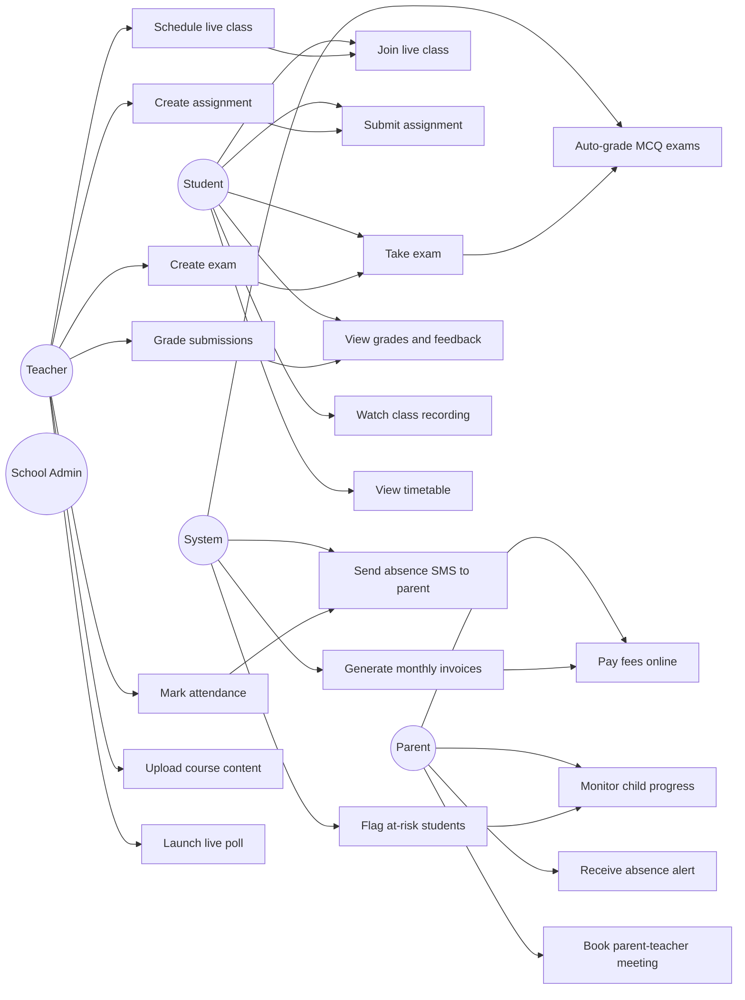
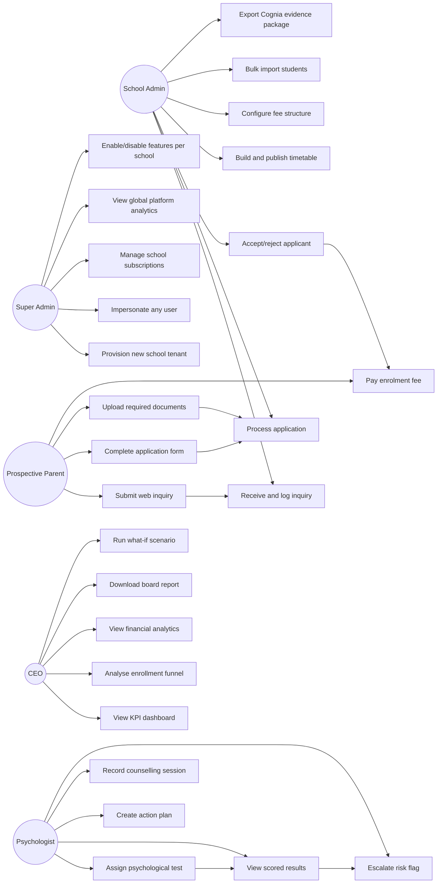

# PART 5 — USE CASES
## P1 — Learning Management System + School Management System
### Layer 2 — Product & Functional

**Status:** 🟡 Content Complete — Layer Gate Not Yet Passed
**Status:** Use case diagrams included below for the two highest-complexity module groups (Core Academic, Admissions & Platform); remaining modules follow the same UC-001 to UC-065 specification pattern in table form.

*One use case per user story defined in Part 4 (65 total, UC-001 to UC-065, mapping 1:1 to US-001 to US-065). Each specification includes actor, preconditions, main flow, alternate flows, exceptions, and postconditions.*

**Core Academic Use Cases**

**Admissions & Platform Use Cases**

---

## M01 — Admissions Module

### UC-001 — Log a Manual Inquiry

| Field | Detail |
|---|---|
| **Implements** | US-001 |
| **Actor** | School Admin |
| **Preconditions** | Admin is logged in with Admissions Module access. |
| **Main Flow** | 1. Admin selects "New Inquiry." 2. Admin enters applicant name, grade, parent contact details, and source (phone/walk-in). 3. Admin saves the inquiry. 4. System creates the inquiry record and adds it to the funnel alongside web-form inquiries. |
| **Alternate Flows** | A1. Admin assigns the inquiry to a specific admissions officer at creation, triggering a notification (LMS-FR-003). |
| **Exceptions** | E1. Required field (applicant name or contact) left blank — system blocks save and indicates missing field. |
| **Postconditions** | Inquiry record exists in the system, visible in funnel analytics with source correctly attributed. |

### UC-002 — Send Application Form Link

| Field | Detail |
|---|---|
| **Implements** | US-002 |
| **Actor** | School Admin |
| **Preconditions** | An inquiry record exists. |
| **Main Flow** | 1. Admin opens the inquiry record. 2. Admin selects "Send Application Form." 3. System generates a unique, branded form link. 4. System delivers the link via email and WhatsApp simultaneously. 5. Delivery status is shown to admin. |
| **Alternate Flows** | A1. Parent has only one contact channel on file — system delivers via that channel only and notes the limitation to admin. |
| **Exceptions** | E1. Both email and WhatsApp delivery fail — system flags the inquiry for manual follow-up. |
| **Postconditions** | Application form link is delivered and trackable; inquiry status updates to "Form Sent." |

### UC-003 — Resume a Saved Application

| Field | Detail |
|---|---|
| **Implements** | US-003 |
| **Actor** | Parent |
| **Preconditions** | Parent has previously started an application via the form link and closed it before submission. |
| **Main Flow** | 1. Parent reopens the original form link. 2. System retrieves the auto-saved draft. 3. Parent continues from the last completed field. 4. Parent submits the completed application. |
| **Alternate Flows** | A1. Parent uses a different device than originally used — system retrieves the same server-side draft regardless of device. |
| **Exceptions** | E1. Form link has expired per school-configured validity window — system displays an expiration message and provides a contact path for a new link. |
| **Postconditions** | Application is submitted with all data intact from across multiple sessions. |

### UC-004 — Verify Application Documents

| Field | Detail |
|---|---|
| **Implements** | US-004 |
| **Actor** | School Admin |
| **Preconditions** | An application has been submitted with at least one document uploaded. |
| **Main Flow** | 1. Admin opens the application's document checklist. 2. System displays each required document with status (Verified/Missing/Pending Review). 3. Admin reviews each uploaded document and marks it Verified or requests resubmission. 4. Once all required documents are Verified, system allows progression to Interview Scheduling. |
| **Alternate Flows** | A1. A document is rejected as invalid — system reverts its status to Missing and triggers a new reminder to the parent (LMS-FR-010). |
| **Exceptions** | E1. Admin attempts to move the application to Interview Scheduling with documents still Missing — blocked per BR-026. |
| **Postconditions** | Application document status is fully verified; application may proceed in the workflow. |

### UC-005 — Score an Admissions Interview

| Field | Detail |
|---|---|
| **Implements** | US-005 |
| **Actor** | Interviewer (Teacher or School Admin assigned as interviewer) |
| **Preconditions** | An interview has been scheduled and conducted for the applicant. |
| **Main Flow** | 1. Interviewer opens the structured feedback form for the applicant. 2. Interviewer scores each rubric criterion. 3. Interviewer adds supporting notes. 4. Interviewer submits the score. 5. System stores the score against the application, locked from further edits. |
| **Alternate Flows** | A1. School Admin requires a second interview round — a new feedback form instance is created for the second round, both retained. |
| **Exceptions** | E1. Interviewer attempts free-form scoring outside the rubric — not permitted; system only accepts rubric-defined values. |
| **Postconditions** | Interview score is permanently recorded and visible in the application summary. |

### UC-006 — Review Application Summary and Decide

| Field | Detail |
|---|---|
| **Implements** | US-006 |
| **Actor** | School Admin |
| **Preconditions** | Application has completed document verification and interview stages. |
| **Main Flow** | 1. Admin opens the consolidated application summary. 2. Admin reviews documents, interview score, and notes on one screen. 3. Admin selects a decision: Accept, Reject, Waitlist, or Conditional Accept. 4. System records the decision and triggers the corresponding next step (e.g. acceptance letter generation). |
| **Alternate Flows** | A1. Admin selects Conditional Accept — system records the specific condition (e.g. pending document) alongside the decision. |
| **Exceptions** | E1. Decision attempted on an application still missing required documents — system warns before allowing the decision to proceed. |
| **Postconditions** | Application has a recorded decision; downstream workflow (acceptance letter, waitlist, rejection notice) is triggered accordingly. |

### UC-007 — Pay Enrolment Fee from Acceptance Letter

| Field | Detail |
|---|---|
| **Implements** | US-007 |
| **Actor** | Parent |
| **Preconditions** | Applicant has received an "Accept" decision and acceptance letter. |
| **Main Flow** | 1. Parent opens the acceptance letter. 2. Parent selects the embedded payment link. 3. Parent completes payment via the school's configured gateway. 4. System confirms payment and updates application status. |
| **Alternate Flows** | A1. Parent pays a partial enrolment fee if the school allows installments — remaining balance tracked per BR-023. |
| **Exceptions** | E1. Payment link has expired or already been used — system displays an error and prompts admin to reissue. |
| **Postconditions** | Enrolment fee payment is confirmed and recorded, unblocking student account creation (LMS-FR-016). |

### UC-008 — Automatic Student Account Creation

| Field | Detail |
|---|---|
| **Implements** | US-008 |
| **Actor** | System (triggered by Parent's payment action) |
| **Preconditions** | Enrolment fee payment has been confirmed for an accepted applicant. |
| **Main Flow** | 1. System detects confirmed payment. 2. System generates a unique student ID. 3. System creates the student account and initial credentials. 4. System adds the student to the School Admin's student directory. 5. System notifies the parent of successful enrolment with login details. |
| **Alternate Flows** | None — this is a fully automated flow with no manual variation. |
| **Exceptions** | E1. Payment confirmation is received but applicant data is incomplete (e.g. missing date of birth) — account creation is held and admin is alerted to complete the record before the account activates. |
| **Postconditions** | A fully functional student account exists with no manual admin action required. |

### UC-009 — Automatic Waitlist Promotion

| Field | Detail |
|---|---|
| **Implements** | US-009 |
| **Actor** | System (triggered by a vacancy event) |
| **Preconditions** | A grade/section has an active ranked waitlist and a vacancy opens (e.g. via withdrawal, BP17). |
| **Main Flow** | 1. System detects the vacancy. 2. System identifies the highest-ranked waitlisted applicant. 3. System promotes that applicant's status to "Accepted." 4. System triggers acceptance letter generation (UC-006 downstream) and notifies the parent. |
| **Alternate Flows** | A1. Top-ranked applicant's documents have since expired — promotion is flagged for document re-verification before finalising, per the edge case defined in Part 4 M01. |
| **Exceptions** | E1. No applicants remain on the waitlist — vacancy remains open for new inquiries through the standard funnel. |
| **Postconditions** | Highest-ranked waitlisted applicant is promoted and notified without manual admin intervention. |

## M02 — Live Online Classes Module

### UC-010 — Schedule a Recurring Live Class

| Field | Detail |
|---|---|
| **Implements** | US-010 |
| **Actor** | Teacher |
| **Preconditions** | Teacher has an assigned class/section. |
| **Main Flow** | 1. Teacher selects "Schedule Class." 2. Teacher enters title, date/time, duration, class/section, and platform. 3. Teacher sets recurrence to "Weekly" with selected days. 4. Teacher attaches pre-class materials. 5. System generates all future session instances for the configured term. |
| **Alternate Flows** | A1. Teacher edits a single occurrence of the recurring series without affecting the others (e.g. one week's class is rescheduled). |
| **Exceptions** | E1. A generated occurrence conflicts with an existing scheduled class for that teacher — system flags the conflict per Timetable Module cross-check (M07). |
| **Postconditions** | All weekly sessions for the term exist as individual schedulable instances, inheriting shared settings. |

### UC-011 — Receive and Act on Class Reminders

| Field | Detail |
|---|---|
| **Implements** | US-011 |
| **Actor** | Student |
| **Preconditions** | Student is enrolled in a class with a scheduled live session. |
| **Main Flow** | 1. System sends a reminder at 24h before class. 2. System sends a reminder at 1h before class. 3. System sends a reminder at 15min before class. 4. Student receives reminders via their configured channels. |
| **Alternate Flows** | A1. Student has disabled one notification channel — reminders are sent only via remaining enabled channels. |
| **Exceptions** | E1. Class is cancelled after the 24h reminder was already sent — system sends a cancellation notice rather than the subsequent 1h/15min reminders. |
| **Postconditions** | Student is notified at all three intervals prior to class start, unless the class was cancelled. |

### UC-012 — Launch a Live Poll During Class

| Field | Detail |
|---|---|
| **Implements** | US-012 |
| **Actor** | Teacher |
| **Preconditions** | A live class session is in progress. |
| **Main Flow** | 1. Teacher selects "Launch Poll" from the in-class toolbar. 2. Teacher selects a saved poll template or creates one on the fly. 3. System displays the poll to all students currently in the session. 4. Students respond. 5. Teacher views real-time results without leaving the main class view. |
| **Alternate Flows** | A1. Teacher chooses to hide results from students and only view them privately. |
| **Exceptions** | E1. A student joins mid-poll — that student does not see the poll retroactively unless the teacher re-launches it. |
| **Postconditions** | Poll results are recorded and available in post-class analytics (LMS-FR-038). |

### UC-013 — Send a Private "I'm Lost" Signal

| Field | Detail |
|---|---|
| **Implements** | US-013 |
| **Actor** | Student |
| **Preconditions** | A live class session is in progress and the student is an active participant. |
| **Main Flow** | 1. Student selects the "I'm Lost" button. 2. System sends a private signal visible only in the teacher's interface, identifying the student and timestamp. 3. Teacher sees the signal and can choose to address it. |
| **Alternate Flows** | A1. Multiple students send the signal close together — teacher sees all signals listed, not merged into one. |
| **Exceptions** | None — this is a low-risk, simple signal action. |
| **Postconditions** | Teacher is privately aware of student confusion without public class disruption. |

### UC-014 — Automatic Attendance Marking from Live Class

| Field | Detail |
|---|---|
| **Implements** | US-014 |
| **Actor** | System |
| **Preconditions** | A live class session has concluded. |
| **Main Flow** | 1. System calculates each student's total join duration for the session. 2. System compares duration against the school-configured attendance threshold. 3. System marks each student Present or the configured fallback status. 4. System pushes the result into the Attendance Module (M06) automatically. |
| **Alternate Flows** | A1. Teacher reviews and manually overrides an auto-marked status before finalising the period's attendance. |
| **Exceptions** | E1. A student's connection dropped and reconnected multiple times — system sums all join intervals into one cumulative duration rather than using only the first session. |
| **Postconditions** | Attendance for the live class session is recorded in the Attendance Module with no manual teacher entry required. |

### UC-015 — Rewatch a Recording with Speed and Chapter Controls

| Field | Detail |
|---|---|
| **Implements** | US-015 |
| **Actor** | Student |
| **Preconditions** | A class recording has been published. |
| **Main Flow** | 1. Student opens the recording. 2. Student selects a chapter marker to jump to that point. 3. Student adjusts playback speed to 1.5x. 4. Student continues watching at the adjusted speed from the selected chapter. |
| **Alternate Flows** | A1. Student uses the searchable transcript to locate and jump to a specific spoken phrase instead of a chapter marker. |
| **Exceptions** | E1. Recording is not yet published (still processing) — student sees a "Recording processing" status instead of playback controls. |
| **Postconditions** | Student efficiently reviews only the relevant portion of the class at their preferred pace. |

## M03 — Assignment Module

### UC-016 — Build and Reuse a Rubric

| Field | Detail |
|---|---|
| **Implements** | US-016 |
| **Actor** | Teacher |
| **Preconditions** | Teacher is creating or editing an assignment. |
| **Main Flow** | 1. Teacher selects "Add Rubric." 2. Teacher defines criteria, point scale, and weighting. 3. Teacher saves the rubric to the reusable library. 4. On a future assignment, teacher selects the saved rubric from the library, which pre-fills all criteria automatically. |
| **Alternate Flows** | A1. Teacher duplicates an existing rubric and modifies it slightly for a new assignment rather than building from scratch. |
| **Exceptions** | E1. Teacher edits a rubric already used in past graded assignments — past assignments retain the original rubric snapshot, per the edge case in Part 4 M03. |
| **Postconditions** | Rubric is available for reuse across any future assignment without rebuilding. |

### UC-017 — Auto-Save an In-Progress Submission

| Field | Detail |
|---|---|
| **Implements** | US-017 |
| **Actor** | Student |
| **Preconditions** | Student has opened an assignment and begun work on a text or file submission. |
| **Main Flow** | 1. Student begins entering content. 2. System auto-saves the draft to the server every 30 seconds. 3. Student's browser crashes or closes unexpectedly. 4. Student reopens the assignment from any device. 5. System restores the most recently auto-saved draft. |
| **Alternate Flows** | A1. Student manually triggers a save at any point in addition to the automatic interval. |
| **Exceptions** | E1. Network connectivity is lost during editing — system queues the save and completes it once connectivity is restored, without data loss. |
| **Postconditions** | No submission progress is lost regardless of device or connectivity interruption. |

### UC-018 — Send Targeted Non-Submitter Reminders

| Field | Detail |
|---|---|
| **Implements** | US-018 |
| **Actor** | Teacher (reminder triggered automatically or manually) |
| **Preconditions** | An assignment has a deadline approaching and some students have not yet submitted. |
| **Main Flow** | 1. System (or teacher manually) triggers the reminder. 2. System identifies all students with status "Not Submitted." 3. System sends a reminder only to those students. 4. Students who have already submitted receive no reminder. |
| **Alternate Flows** | A1. A student submits between the reminder trigger and the actual send — system excludes them from the send at execution time, not just at trigger time. |
| **Exceptions** | None — this is a straightforward filtered notification flow. |
| **Postconditions** | Only non-submitting students are reminded, with no unnecessary notification to those who already submitted. |

### UC-019 — Leave Voice Feedback on a Submission

| Field | Detail |
|---|---|
| **Implements** | US-019 |
| **Actor** | Teacher |
| **Preconditions** | A student submission is open in the grading interface. |
| **Main Flow** | 1. Teacher selects "Record Voice Feedback." 2. Teacher records up to 5 minutes of audio feedback directly within the grading interface. 3. Teacher saves the recording attached to the submission. 4. Student later opens their feedback and plays the recording directly, with no separate download required. |
| **Alternate Flows** | A1. Teacher re-records if unsatisfied with the first take, before finalising and publishing feedback. |
| **Exceptions** | E1. Recording exceeds the 5-minute limit — system stops recording automatically at the limit and notifies the teacher. |
| **Postconditions** | Voice feedback is permanently attached to the submission and playable by the student. |

### UC-020 — Confirm Submission with Timestamp

| Field | Detail |
|---|---|
| **Implements** | US-020 |
| **Actor** | Student |
| **Preconditions** | Student has completed their work and is ready to submit. |
| **Main Flow** | 1. Student selects "Submit." 2. System displays a preview of the final submission. 3. Student confirms. 4. System records the exact submission timestamp and issues a confirmation receipt. 5. Teacher's submission list reflects the same timestamp. |
| **Alternate Flows** | A1. Student submits exactly at the deadline — treated as on-time per the edge case defined in Part 4 M03. |
| **Exceptions** | E1. Student attempts to submit beyond the configured attempt limit — submission blocked with a clear message (LMS-FR-044). |
| **Postconditions** | Submission is permanently timestamped and undisputable for both student and teacher. |

## M04 — Exam Module

### UC-021 — Generate AI-Drafted Exam Questions

| Field | Detail |
|---|---|
| **Implements** | US-021 |
| **Actor** | Teacher |
| **Preconditions** | Teacher is creating a new exam and has syllabus content available to the system. |
| **Main Flow** | 1. Teacher selects "Generate Questions with AI." 2. Teacher specifies subject, topic, difficulty, and question count. 3. System drafts questions and presents them in an editable state. 4. Teacher reviews, edits, deletes, or regenerates individual questions. 5. Teacher finalises the question set into the exam. |
| **Alternate Flows** | A1. Teacher regenerates the entire batch if dissatisfied with the initial draft. |
| **Exceptions** | E1. A generated question is later found factually incorrect after the exam was administered — handled per the edge case in Part 4 M04 (manual score adjustment with override reason). |
| **Postconditions** | Exam contains only teacher-approved questions; no AI-drafted question is published without review. |

### UC-022 — Warning for Unanswered Questions Before Submission

| Field | Detail |
|---|---|
| **Implements** | US-022 |
| **Actor** | Student |
| **Preconditions** | Student is taking an exam and attempts to submit. |
| **Main Flow** | 1. Student selects "Submit Exam." 2. System checks for unanswered questions. 3. System displays a warning listing the specific unanswered question numbers. 4. Student chooses to return and answer, or confirms "Submit Anyway." |
| **Alternate Flows** | A1. All questions are answered — system proceeds directly to submission confirmation with no warning needed. |
| **Exceptions** | E1. Time limit expires while the warning is displayed — system auto-submits as-is per the configured time limit rule. |
| **Postconditions** | Student is never unaware of unanswered questions at the point of submission. |

### UC-023 — Automatic Grading of Objective Questions

| Field | Detail |
|---|---|
| **Implements** | US-023 |
| **Actor** | System |
| **Preconditions** | A student has submitted an exam containing objective question types. |
| **Main Flow** | 1. System detects exam submission. 2. System grades all Multiple Choice, True/False, Matching, and exact-match Fill-in-the-Blank questions immediately. 3. System routes any Essay, Short Answer, or Coding questions to the manual grading queue. 4. Partial results (objective portion) are available to the teacher immediately. |
| **Alternate Flows** | None — this flow is fully automated with no manual variation for objective items. |
| **Exceptions** | E1. An objective question has an ambiguous answer key (e.g. two correct options not flagged as multi-select) — system flags this as a data quality issue for teacher review rather than silently misgrading. |
| **Postconditions** | Objective questions are graded with zero teacher effort; subjective questions await manual grading separately. |

### UC-024 — Submit and Resolve a Regrade Request

| Field | Detail |
|---|---|
| **Implements** | US-024 |
| **Actor** | Student, Teacher |
| **Preconditions** | A grade has been published and the regrade request window is still open. |
| **Main Flow** | 1. Student selects "Request Regrade" on the graded item. 2. Student enters a reason (minimum 10 characters). 3. Teacher reviews the original submission against the rubric. 4. Teacher approves (grade updated) or denies (original grade stands) with justification. 5. System logs the full audit trail and notifies the student of the outcome. |
| **Alternate Flows** | A1. For high-value assessments, School Admin requires a second-marker review before the final decision (BP18). |
| **Exceptions** | E1. Request submitted after the regrade window has closed — system blocks the request with a clear message (BR-007). |
| **Postconditions** | Grade dispute is resolved with a complete, transparent audit trail regardless of outcome. |

### UC-025 — Monitor Live Proctoring Dashboard

| Field | Detail |
|---|---|
| **Implements** | US-025 |
| **Actor** | Teacher / Proctor |
| **Preconditions** | A proctored exam session is in progress with proctoring enabled. |
| **Main Flow** | 1. Proctor opens the live proctoring dashboard. 2. System displays all currently active students' webcam feeds on one screen. 3. Proctor monitors for flagged events (tab-switch, multiple faces). 4. Proctor selects an individual feed to expand for closer review without losing visibility of others. |
| **Alternate Flows** | A1. A flagged event occurs — proctor receives a visual alert directing attention to that specific student's feed. |
| **Exceptions** | E1. A student's webcam feed disconnects mid-exam — dashboard shows a "Disconnected" status for that student rather than a frozen or blank feed. |
| **Postconditions** | Proctor maintains full session oversight throughout the exam without needing to switch between individual student views. |

## M05 — Gradebook Module

### UC-026 — Automatic Grade Flow from Source Modules

| Field | Detail |
|---|---|
| **Implements** | US-026 |
| **Actor** | System |
| **Preconditions** | A grade is finalised in the Assignment Module (M03) or Exam Module (M04). |
| **Main Flow** | 1. System detects the finalised grade in the source module. 2. System updates the corresponding entry in the Gradebook automatically. 3. The Gradebook's weighted calculation recalculates to reflect the new entry. |
| **Alternate Flows** | A1. A grade is later changed via regrade (UC-024) — the Gradebook updates again automatically to reflect the new value. |
| **Exceptions** | None — this is a fully automated synchronisation flow. |
| **Postconditions** | Gradebook always reflects the most current grade from source modules with zero manual re-entry. |

### UC-027 — Use the What-If Grade Calculator

| Field | Detail |
|---|---|
| **Implements** | US-027 |
| **Actor** | Student |
| **Preconditions** | Student has at least one ungraded item remaining in the current grading period. |
| **Main Flow** | 1. Student opens the what-if calculator. 2. Student enters a hypothetical score for a not-yet-graded item. 3. System calculates and displays the resulting projected final grade. 4. Student adjusts hypothetical values as desired. |
| **Alternate Flows** | A1. Student models multiple different hypothetical scenarios in succession. |
| **Exceptions** | None — hypothetical entries are never saved as real data, so no destructive exception path exists. |
| **Postconditions** | Student understands the score needed on remaining work to reach a target grade, with no impact on actual recorded data. |

### UC-028 — View Real-Time Grades as a Parent

| Field | Detail |
|---|---|
| **Implements** | US-028 |
| **Actor** | Parent |
| **Preconditions** | Parent's child has at least one published grade in the current term. |
| **Main Flow** | 1. Parent opens the child's grades view. 2. System displays the same real-time weighted calculation the teacher and student see. 3. Parent reviews grade breakdown by category. |
| **Alternate Flows** | A1. Parent toggles between multiple linked children's grade views (BP13). |
| **Exceptions** | E1. A specific item's grade is set to "Hidden" by the teacher (LMS-FR-082) — that item does not appear in the parent's view until published. |
| **Postconditions** | Parent has continuous visibility into academic standing, not only at report card time. |

### UC-029 — Apply a Grade Curve to a Class

| Field | Detail |
|---|---|
| **Implements** | US-029 |
| **Actor** | Teacher |
| **Preconditions** | A category of grades exists for the class that the teacher wishes to curve. |
| **Main Flow** | 1. Teacher selects the category to curve. 2. Teacher selects the curve method (linear or bell curve). 3. Teacher confirms the action. 4. System recalculates every affected student's grade in that category simultaneously. 5. System logs the curve method and date for audit purposes. |
| **Alternate Flows** | A1. A student's pre-curve score is later changed via regrade — system reapplies the curve automatically per the edge case in Part 4 M05. |
| **Exceptions** | E1. Teacher attempts to apply a curve to a category that includes excused-absence exclusions — system applies the curve only to non-excused entries in that category. |
| **Postconditions** | All affected students' grades are recalculated consistently in a single action with full audit logging. |

## M06 — Attendance Module

### UC-030 — Bulk Mark Attendance with Exceptions

| Field | Detail |
|---|---|
| **Implements** | US-030 |
| **Actor** | Teacher |
| **Preconditions** | A class period has begun and attendance needs to be recorded. |
| **Main Flow** | 1. Teacher selects "Mark All Present." 2. System sets every student's status to Present for that period. 3. Teacher adjusts individual students' status for any exceptions (absent, late, excused). 4. Teacher finalises the period's attendance. |
| **Alternate Flows** | A1. Teacher adds a note to a specific exception for context. |
| **Exceptions** | E1. Teacher attempts to finalise with one or more students lacking any status — blocked per the error state in Part 4 M06. |
| **Postconditions** | Full-class attendance is recorded in seconds with only genuine exceptions requiring individual action. |

### UC-031 — Receive Real-Time Absence Notification

| Field | Detail |
|---|---|
| **Implements** | US-031 |
| **Actor** | Parent |
| **Preconditions** | Parent's child has been marked absent for a period or full day. |
| **Main Flow** | 1. Teacher/system records the absence. 2. System triggers an automated notification within the same processing cycle. 3. Parent receives the notification via every configured channel. 4. Parent can submit an excuse directly from the notification. |
| **Alternate Flows** | A1. Parent has disabled one channel — notification is sent via remaining enabled channels only. |
| **Exceptions** | None — this is a direct automated trigger flow. |
| **Postconditions** | Parent is informed of the absence within minutes, with a direct path to respond. |

### UC-032 — Auto-Flag Chronic Absenteeism

| Field | Detail |
|---|---|
| **Implements** | US-032 |
| **Actor** | System |
| **Preconditions** | A student records a 3rd consecutive unexcused absence. |
| **Main Flow** | 1. System detects the 3rd consecutive unexcused absence. 2. System auto-flags the student as "Chronic Absenteeism Risk." 3. Flag appears on the School Admin dashboard with the specific absence dates. 4. Admin reviews and initiates the At-Risk Intervention Workflow (BP03) if appropriate. |
| **Alternate Flows** | A1. An "Excused" absence breaks the consecutive streak before reaching 3 — flag does not trigger, per the edge case in Part 4 M06. |
| **Exceptions** | None — this is a deterministic threshold-based flow. |
| **Postconditions** | Admin is proactively alerted to a chronic absenteeism pattern without manually reviewing every student's history. |

### UC-033 — Auto-Mark Attendance from Live Class Join Data

| Field | Detail |
|---|---|
| **Implements** | US-033 |
| **Actor** | System |
| **Preconditions** | A live class session has concluded (cross-references UC-014 in M02). |
| **Main Flow** | 1. System receives join-duration data from the Live Classes Module. 2. System applies the configured attendance threshold. 3. System marks each student's period attendance accordingly. 4. Teacher reviews and may override before finalising. |
| **Alternate Flows** | A1. Teacher overrides an auto-marked status, with the override logged distinctly from a standard manual entry. |
| **Exceptions** | None beyond those already defined in UC-014. |
| **Postconditions** | Attendance for online sessions requires no separate manual marking step from the teacher. |

## M07 — Timetable / Scheduling Module

### UC-034 — Generate an AI-Optimised Timetable Draft

| Field | Detail |
|---|---|
| **Implements** | US-034 |
| **Actor** | School Admin |
| **Preconditions** | Scheduling constraints (teacher availability, room capacity, subject frequency, break times) have been configured. |
| **Main Flow** | 1. Admin triggers the AI auto-scheduler. 2. System generates 2–3 draft timetable options. 3. Each draft displays a workload balance score and gap-minimisation summary. 4. Admin compares drafts and selects one to proceed with. |
| **Alternate Flows** | A1. Admin requests regeneration if no draft is satisfactory. |
| **Exceptions** | E1. Constraints are mutually impossible to satisfy fully (e.g. insufficient rooms for required sessions) — system generates the best-effort draft and flags the specific unmet constraints for admin awareness. |
| **Postconditions** | A workable draft timetable exists in minutes rather than days of manual construction. |

### UC-035 — Detect a Scheduling Conflict During Manual Edit

| Field | Detail |
|---|---|
| **Implements** | US-035 |
| **Actor** | School Admin |
| **Preconditions** | Admin is manually adjusting a draft or published timetable via drag-and-drop. |
| **Main Flow** | 1. Admin drags a class onto a new time slot. 2. System checks the change against teacher, room, and student/class conflicts in real time. 3. If a conflict exists, system displays an immediate visual indicator identifying the conflicting class and teacher. 4. Admin either resolves the conflict or reverts the change. |
| **Alternate Flows** | A1. Admin proceeds with an explicit override for a soft conflict (e.g. workload imbalance) that isn't a hard constraint violation. |
| **Exceptions** | None beyond the conflict detection itself. |
| **Postconditions** | No conflict is ever saved into a published timetable without the admin being explicitly aware of it. |

### UC-036 — Automatic Substitute Flagging on Leave Approval

| Field | Detail |
|---|---|
| **Implements** | US-036 |
| **Actor** | System (triggered by School Admin's leave approval action) |
| **Preconditions** | A staff member's leave request has been approved (M10). |
| **Main Flow** | 1. System detects the leave approval. 2. System identifies every class scheduled for that staff member during the leave period. 3. System flags each as requiring a substitute. 4. System surfaces substitute suggestions directly to the admin for action (LMS-FR-106). |
| **Alternate Flows** | A1. The originally suggested substitute later becomes unavailable — system re-triggers suggestions per the edge case in Part 4 M07. |
| **Exceptions** | None — this is a fully automated cross-module trigger. |
| **Postconditions** | Admin never has to manually cross-reference the timetable to determine which classes need coverage. |

### UC-037 — View Personalised Own Timetable

| Field | Detail |
|---|---|
| **Implements** | US-037 |
| **Actor** | Teacher, Student |
| **Preconditions** | A timetable has been published for the relevant class/section or teacher assignment. |
| **Main Flow** | 1. User opens their timetable view. 2. System displays only the classes relevant to that specific user (their own teaching schedule, or their own class/section's schedule). 3. User does not see any other user's schedule details. |
| **Alternate Flows** | None — this is a straightforward filtered view with no variation. |
| **Exceptions** | None. |
| **Postconditions** | Every user sees a clean, personalised schedule with zero irrelevant information. |

## M08 — Fee Management Module

### UC-038 — Pay Fees for All Children in One Session

| Field | Detail |
|---|---|
| **Implements** | US-038 |
| **Actor** | Parent |
| **Preconditions** | Parent has multiple children linked to their account (BP13), each with outstanding fees. |
| **Main Flow** | 1. Parent opens the consolidated fee view. 2. System displays all linked children's outstanding invoices together. 3. Parent selects invoices to pay across multiple children. 4. Parent completes payment in one session. 5. System settles each child's invoice and issues separate receipts. |
| **Alternate Flows** | A1. Gateway does not support a single multi-invoice transaction — system processes sequential linked transactions within the same session instead. |
| **Exceptions** | E1. Payment fails partway through a multi-invoice transaction — system clearly indicates which invoices were settled and which remain outstanding. |
| **Postconditions** | Parent settles fees for multiple children without navigating separate payment flows per child. |

### UC-039 — Generate Invoices in One Action

| Field | Detail |
|---|---|
| **Implements** | US-039 |
| **Actor** | School Admin |
| **Preconditions** | Fee structure is fully configured for the relevant grade(s)/term. |
| **Main Flow** | 1. Admin selects "Generate Invoices" for the billing cycle. 2. System creates individual invoices for every eligible student, applying each student's specific discounts automatically. 3. System holds invoices for admin preview. 4. Admin reviews and confirms bulk send. |
| **Alternate Flows** | A1. Some students have an incomplete fee structure — those are excluded from this batch with a clear list, while eligible students are still invoiced. |
| **Exceptions** | E1. Admin spots an error during preview and cancels the batch before sending — no invoices are sent until explicitly confirmed. |
| **Postconditions** | An entire school's invoices are generated and distributed in one action rather than one-by-one. |

### UC-040 — Receive a Receipt Automatically

| Field | Detail |
|---|---|
| **Implements** | US-040 |
| **Actor** | Parent |
| **Preconditions** | Parent has just completed a fee payment. |
| **Main Flow** | 1. Payment is confirmed by the gateway. 2. System generates a branded PDF receipt with a unique receipt number. 3. Receipt is made available for download immediately, with no separate request action. |
| **Alternate Flows** | None — this is a fully automated post-payment trigger. |
| **Exceptions** | E1. Receipt generation fails due to a system error — payment confirmation still stands; receipt is regenerated on retry without requiring re-payment. |
| **Postconditions** | Parent has proof of payment immediately, with zero manual request needed. |

### UC-041 — High-Value Discount Requests Route to CEO Automatically

| Field | Detail |
|---|---|
| **Implements** | US-041 |
| **Actor** | School Admin (initiator), CEO (approver) |
| **Preconditions** | A discount/scholarship request exceeds the School Admin's approval threshold. |
| **Main Flow** | 1. Admin submits the discount request. 2. System detects the request exceeds the configured threshold. 3. System routes the request to a CEO approval queue automatically. 4. CEO receives a notification and reviews. 5. CEO approves or denies; system applies the outcome to the invoice. |
| **Alternate Flows** | A1. Request is within School Admin's own threshold — applied directly without CEO routing. |
| **Exceptions** | None beyond the threshold-based routing logic itself. |
| **Postconditions** | No high-value discount is ever applied without CEO-level approval, with no reliance on Admin remembering to escalate. |

## M09 — School Financial Management (Accounting)

### UC-042 — Fee Payments Posted to Ledger Automatically

| Field | Detail |
|---|---|
| **Implements** | US-042 |
| **Actor** | System |
| **Preconditions** | A fee payment is confirmed in the Fee Management Module (M08). |
| **Main Flow** | 1. System detects the confirmed payment. 2. System posts a corresponding ledger entry with matching amount, date, and student reference. 3. Entry is reflected immediately in the school's financial reports. |
| **Alternate Flows** | None — this is a fully automated cross-module posting. |
| **Exceptions** | E1. A payment is later refunded — a new, separate ledger entry posts in the current period rather than retroactively editing a closed prior period, per the edge case in Part 4 M09. |
| **Postconditions** | Accountant never manually re-enters fee transactions into the ledger. |

### UC-043 — View P&L and Balance Sheet Without a Separate Tool

| Field | Detail |
|---|---|
| **Implements** | US-043 |
| **Actor** | CEO |
| **Preconditions** | Ledger entries exist for the period being reported. |
| **Main Flow** | 1. CEO selects a date range. 2. System generates the trial balance, P&L statement, and balance sheet for that range. 3. CEO reviews all three reports, which reconcile against each other. |
| **Alternate Flows** | A1. CEO exports the reports for board presentation (Part 3, RR-001). |
| **Exceptions** | None — generation is a direct query against existing ledger data. |
| **Postconditions** | CEO has full financial visibility without needing a separate accounting application. |

### UC-044 — Super Admin Support Without Export Access

| Field | Detail |
|---|---|
| **Implements** | US-044 |
| **Actor** | Super Admin |
| **Preconditions** | A school requests platform support involving their financial data. |
| **Main Flow** | 1. Super Admin opens the relevant school's financial data in View-only mode. 2. System logs the access with timestamp and reason. 3. Super Admin reviews the data to diagnose the issue. 4. No export or download control is available anywhere in this view. |
| **Alternate Flows** | None — there is no path to export by design. |
| **Exceptions** | E1. Super Admin attempts to access an export function defensively coded against (should not exist in UI) — action is blocked and logged as a security event. |
| **Postconditions** | Super Admin can support the school without ever extracting sensitive financial data, with a full audit trail of the access. |

## M10 — School Staff Management (HR)

### UC-045 — Leave Request Shows Remaining Balance

| Field | Detail |
|---|---|
| **Implements** | US-045 |
| **Actor** | Teacher / Staff |
| **Preconditions** | Staff member has an active leave balance configured for at least one leave type. |
| **Main Flow** | 1. Staff member opens the leave request form. 2. System displays current remaining balance for the selected leave type. 3. Staff member enters the requested dates. 4. System flags before submission if the request would exceed the available balance. 5. Staff member submits the request. |
| **Alternate Flows** | A1. Staff member submits despite exceeding balance — request is still submitted for admin discretion, flagged as exceeding balance. |
| **Exceptions** | None beyond the balance-exceeded flag itself. |
| **Postconditions** | Staff member always knows their balance status before submitting, with no surprises at approval time. |

### UC-046 — Substitute Coverage Queued on Leave Approval

| Field | Detail |
|---|---|
| **Implements** | US-046 |
| **Actor** | School Admin |
| **Preconditions** | A leave request is pending approval. |
| **Main Flow** | 1. Admin approves the leave request. 2. System immediately triggers the substitute-assignment workflow (cross-references UC-036 in M07). 3. Admin is presented with the affected classes and substitute suggestions in the same flow. |
| **Alternate Flows** | None beyond what's defined in UC-036. |
| **Exceptions** | None beyond what's defined in UC-036. |
| **Postconditions** | Leave approval and substitute coverage planning happen as a single connected action. |

### UC-047 — Performance Review Data Pre-Compiled

| Field | Detail |
|---|---|
| **Implements** | US-047 |
| **Actor** | School Admin |
| **Preconditions** | A performance review cycle (BP26) is scheduled for a staff member. |
| **Main Flow** | 1. System compiles objective data (class average trends, attendance/punctuality, grading turnaround) ahead of the scheduled review. 2. Staff member submits a self-assessment before the meeting. 3. Admin opens the review screen and sees both compiled data and self-assessment together. 4. Admin conducts the review meeting with all data already available. |
| **Alternate Flows** | A1. Self-assessment is not submitted before the meeting — admin proceeds with the meeting and is alerted to the missing input. |
| **Exceptions** | None beyond the missing self-assessment alert. |
| **Postconditions** | Admin enters every review meeting with objective data already prepared, with no manual compilation effort. |

## M11 — School Staff Payroll

### UC-048 — View and Download Own Payslip

| Field | Detail |
|---|---|
| **Implements** | US-048 |
| **Actor** | Teacher / Staff |
| **Preconditions** | At least one payroll cycle has been processed for the staff member. |
| **Main Flow** | 1. Staff member opens "My Payslips." 2. System displays all of that staff member's past payslips. 3. Staff member selects a payslip to view or download. |
| **Alternate Flows** | None — this is a simple, restricted self-service view. |
| **Exceptions** | E1. Staff member attempts to access another staff member's payslip via any role configuration — blocked entirely, with no exception path. |
| **Postconditions** | Staff member has independent, on-demand access to their own payroll history without contacting HR. |

### UC-049 — Payroll Cost Feeds into Budget Planning Automatically

| Field | Detail |
|---|---|
| **Implements** | US-049 |
| **Actor** | System |
| **Preconditions** | A payroll cycle has been processed (M11). |
| **Main Flow** | 1. System calculates total payroll cost for the cycle. 2. System posts the total automatically to the Accounting Module ledger (M09). 3. CEO's annual budget planning cycle (BP14) draws on this historical ledger data without manual compilation. |
| **Alternate Flows** | None — this is a fully automated cross-module posting. |
| **Exceptions** | None beyond what's already defined for payroll processing in Part 4 M11. |
| **Postconditions** | Annual budget planning always has accurate, up-to-date payroll cost history available with zero manual entry. |

## M12 — Digital Library Module

### UC-050 — Search the Digital Library by Subject

| Field | Detail |
|---|---|
| **Implements** | US-050 |
| **Actor** | Student |
| **Preconditions** | Library catalog has resources tagged with subject metadata and access permissions configured for the student's grade. |
| **Main Flow** | 1. Student opens the library search. 2. Student enters a subject keyword. 3. System returns matching resources the student's grade has access to. 4. Student opens a result directly. |
| **Alternate Flows** | A1. Student searches by author or title instead of subject. |
| **Exceptions** | E1. Student's search matches a resource outside their grade's access — that resource does not appear in results at all, rather than appearing and then being blocked. |
| **Postconditions** | Student finds relevant material instantly without needing a teacher to provide a link. |

### UC-051 — Librarian Sees Usage Data for Acquisition Decisions

| Field | Detail |
|---|---|
| **Implements** | US-051 |
| **Actor** | Librarian (Staff sub-role) |
| **Preconditions** | Resources have accumulated usage data over a meaningful period. |
| **Main Flow** | 1. Librarian opens usage analytics. 2. System displays view/download counts per resource over a selectable time period. 3. Librarian filters for resources below a configurable usage threshold. 4. Librarian flags low-usage resources for review/removal. |
| **Alternate Flows** | A1. Librarian sorts by highest usage instead, to identify what to acquire more of in that category. |
| **Exceptions** | None — this is a straightforward analytics and flagging flow. |
| **Postconditions** | Acquisition decisions are based on actual usage data rather than guesswork. |

## M13 — Communication Module

### UC-052 — Message a Teacher Through a Professional Channel

| Field | Detail |
|---|---|
| **Implements** | US-052 |
| **Actor** | Parent |
| **Preconditions** | Parent and teacher are both active users with messaging permission per Section 2.4. |
| **Main Flow** | 1. Parent opens messaging and selects the teacher. 2. Parent composes and sends a message, optionally with an attachment. 3. Teacher receives and responds within the same in-platform thread. 4. Full history is retained for both parties. |
| **Alternate Flows** | A1. School Admin reviews the message thread later for dispute resolution, if needed. |
| **Exceptions** | None — no personal contact information is ever exposed in this flow. |
| **Postconditions** | Parent and teacher communicate without either party's personal phone number or WhatsApp being exposed. |

### UC-053 — Emergency Broadcast Reaches All Channels

| Field | Detail |
|---|---|
| **Implements** | US-053 |
| **Actor** | School Admin |
| **Preconditions** | An emergency situation requires immediate, school-wide notification (BP08). |
| **Main Flow** | 1. Admin selects an emergency template (lockdown/weather/health) or composes a custom message. 2. Admin triggers the broadcast. 3. System sends simultaneously via SMS, email, push, and in-app for every recipient who has each channel configured. 4. Admin views per-recipient delivery status. |
| **Alternate Flows** | A1. One channel fails for a recipient (e.g. SMS gateway down) — delivery continues via remaining channels for that recipient automatically. |
| **Exceptions** | E1. A recipient's contact information is outdated and all channels fail — failure is logged distinctly and surfaced for admin follow-up, without blocking delivery confirmation for everyone else. |
| **Postconditions** | Every reachable recipient receives the emergency message through at least one channel, with full delivery tracking. |

### UC-054 — Book Multiple Teacher Meetings Without Double-Booking

| Field | Detail |
|---|---|
| **Implements** | US-054 |
| **Actor** | Parent |
| **Preconditions** | Multiple teachers have published available meeting slots for a conference day (BP29). |
| **Main Flow** | 1. Parent books a slot with Teacher A. 2. Parent attempts to book a slot with Teacher B at an overlapping time. 3. System detects the conflict against the parent's own existing booking. 4. System blocks or flags the overlapping booking before confirmation. |
| **Alternate Flows** | A1. Parent selects a different, non-overlapping slot with Teacher B instead. |
| **Exceptions** | None beyond the conflict detection itself. |
| **Postconditions** | Parent never ends up double-booked across multiple teachers on the same conference day. |

## M14 — Psychological Assessment Module

### UC-055 — Test Auto-Scores Immediately

| Field | Detail |
|---|---|
| **Implements** | US-055 |
| **Actor** | Student, System |
| **Preconditions** | Student is completing a supported test type (Personality, Career, Aptitude, IQ, or EQ). |
| **Main Flow** | 1. Student completes and submits the test. 2. System applies the predefined scoring algorithm immediately. 3. Score and visual results (radar chart/percentile/profile) are available without any Psychologist action. |
| **Alternate Flows** | A1. Test is an IQ test and the student attempted a retake within the 12-month restriction window — blocked entirely per BR-015, scoring flow does not begin. |
| **Exceptions** | None beyond the retake restriction. |
| **Postconditions** | No risk of manual scoring error on a sensitive psychological assessment. |

### UC-056 — Admin Only Notified for High/Critical Risk

| Field | Detail |
|---|---|
| **Implements** | US-056 |
| **Actor** | System |
| **Preconditions** | A test result or session triggers a risk-level evaluation (e.g. EQ score below 40, per BR-029). |
| **Main Flow** | 1. System evaluates the risk level: Low, Medium, High, or Critical. 2. For Low/Medium, only the Psychologist is notified. 3. For High, School Admin is added to the notification. 4. For Critical, CEO and emergency contacts are added immediately. |
| **Alternate Flows** | A1. Risk level changes mid-day from Medium to Critical based on new information — escalation triggers immediately, not on a batch schedule. |
| **Exceptions** | None — escalation thresholds are deterministic per BR-030. |
| **Postconditions** | School Admin's attention is reserved only for genuinely serious cases, never routine assessments. |

### UC-057 — Parent Sees Goals, Not Detailed Clinical Notes

| Field | Detail |
|---|---|
| **Implements** | US-057 |
| **Actor** | Parent |
| **Preconditions** | An action plan has been created for the parent's child by the Psychologist. |
| **Main Flow** | 1. Parent opens the child's action plan. 2. System displays goals and milestones (default Student/Parent/Teacher visibility). 3. Detailed intervention notes remain hidden, visible only to Student and Psychologist by default. |
| **Alternate Flows** | A1. Psychologist applies a Critical Case Override, making detailed notes visible to the parent for that specific case. |
| **Exceptions** | None beyond the override mechanism itself. |
| **Postconditions** | Parent can support their child's goals without inappropriate exposure to clinical detail, unless a deliberate override applies. |

## M15 — Transport Management Module

### UC-058 — Receive a Pickup Notification as the Bus Approaches

| Field | Detail |
|---|---|
| **Implements** | US-058 |
| **Actor** | Parent |
| **Preconditions** | Student is allocated to a transport route with GPS tracking enabled. |
| **Main Flow** | 1. Vehicle approaches the student's configured pickup/drop checkpoint. 2. System detects proximity via GPS or driver-confirmed checkpoint. 3. System sends an automated notification to the parent. |
| **Alternate Flows** | A1. GPS signal is lost — last known location remains visible with a "Signal Lost" indicator rather than a stale, unmarked location (per the edge case in Part 4 M15). |
| **Exceptions** | None beyond the signal-loss handling. |
| **Postconditions** | Parent knows exactly when to be ready, without needing to track the bus manually. |

## M16 — Cognia Evidence Management Module

### UC-059 — Accreditation Readiness Builds Continuously

| Field | Detail |
|---|---|
| **Implements** | US-059 |
| **Actor** | School Admin, Teacher |
| **Preconditions** | Cognia standards have been mapped to platform activities by School Admin. |
| **Main Flow** | 1. Teachers tag relevant evidence as part of normal platform use throughout the term. 2. System also automatically captures background evidence (attendance accuracy, grading consistency) without manual tagging. 3. Admin checks the readiness dashboard at any point and sees evidence completeness against the standards checklist, with gaps flagged. |
| **Alternate Flows** | A1. Cognia updates its standards framework mid-cycle — admin remaps evidence per the edge case in Part 4 M16, with prior tagging retained for review. |
| **Exceptions** | None beyond the remapping scenario. |
| **Postconditions** | Accreditation evidence is always current, with no last-minute scramble before an audit. |

## M17 — Platform & System Administration

### UC-060 — Structured School Onboarding

| Field | Detail |
|---|---|
| **Implements** | US-060 |
| **Actor** | Super Admin |
| **Preconditions** | A new school client is ready to be provisioned (BP05). |
| **Main Flow** | 1. Super Admin initiates new school onboarding. 2. Super Admin configures subdomain, initial branding, and subscription plan. 3. System creates an isolated tenant with zero data visibility into or from any existing school. 4. Super Admin completes the structured checklist through to go-live. |
| **Alternate Flows** | A1. Onboarding is paused partway through and resumed later — checklist state is preserved. |
| **Exceptions** | E1. Requested subdomain is already in use — system blocks creation and prompts for an alternative. |
| **Postconditions** | A new, fully isolated school tenant exists with nothing missed in setup. |

### UC-061 — Platform-Wide Trends Without Individual School Data

| Field | Detail |
|---|---|
| **Implements** | US-061 |
| **Actor** | Super Admin |
| **Preconditions** | Multiple school tenants have accumulated usage data. |
| **Main Flow** | 1. Super Admin opens platform-wide analytics. 2. System displays aggregated, anonymised metrics (DAU/MAU, feature adoption, etc.) across all schools. 3. Super Admin reviews trends with no individual school's financial, academic, or psychological data exposed anywhere in this view. |
| **Alternate Flows** | None — aggregation is enforced at the data layer, with no admin toggle to drill into individual school sensitive data from this view. |
| **Exceptions** | None. |
| **Postconditions** | Super Admin gains genuine platform insight while tenant isolation (BR-039) remains fully intact. |

## M18 — User & Role Management

### UC-062 — Bulk Import Students from a Spreadsheet

| Field | Detail |
|---|---|
| **Implements** | US-062 |
| **Actor** | School Admin |
| **Preconditions** | Admin has a properly formatted CSV/Excel file of student records. |
| **Main Flow** | 1. Admin selects "Bulk Import" and uploads the file. 2. System validates every row before creating any accounts. 3. Valid rows are processed into new student accounts. 4. Rows with errors are reported individually with the specific issue. |
| **Alternate Flows** | A1. Admin corrects flagged rows and re-imports only those, rather than re-uploading the entire file. |
| **Exceptions** | E1. A row references a duplicate email already in use — that row is blocked while unaffected rows still proceed. |
| **Postconditions** | A hundred or more accounts are created in one action rather than individually. |

### UC-063 — Custom Role Cannot Exceed Predefined Permissions

| Field | Detail |
|---|---|
| **Implements** | US-063 |
| **Actor** | School Admin |
| **Preconditions** | Admin needs to create a role for a position not covered by the 8 predefined roles (e.g. teaching assistant). |
| **Main Flow** | 1. Admin selects "Create Custom Role." 2. System presents only permission options that are subsets of existing predefined roles. 3. Admin selects the appropriate limited permission set. 4. System saves the custom role, with no path to grant platform-level access. |
| **Alternate Flows** | None — the permission ceiling is enforced structurally, not just by warning. |
| **Exceptions** | E1. Admin attempts to select a platform-level permission — that option is simply not present/selectable in the interface. |
| **Postconditions** | A custom role exists with appropriately scoped access, with no possibility of accidental privilege escalation. |

## M19 — Reports & Analytics (Cross-Module)

### UC-064 — Schedule a Custom Report for Recurring Delivery

| Field | Detail |
|---|---|
| **Implements** | US-064 |
| **Actor** | School Admin (or any role with reporting permission per Section 2.4) |
| **Preconditions** | Admin has access to the custom report builder. |
| **Main Flow** | 1. Admin builds a custom report using the drag-and-drop builder. 2. Admin saves it as a template. 3. Admin configures a recurring schedule (weekly/monthly/quarterly) and recipient. 4. System delivers the report automatically on schedule with no further manual trigger. |
| **Alternate Flows** | A1. Admin edits the schedule or recipient at any time without rebuilding the report. |
| **Exceptions** | E1. The configured recipient's account is later deactivated — scheduled delivery is automatically paused and flagged for reassignment, per the edge case in Part 4 M19. |
| **Postconditions** | A recurring reporting need is fully automated after a single setup action. |

## M20 — Settings & Configuration

### UC-065 — Branding Configured Once Applies Everywhere

| Field | Detail |
|---|---|
| **Implements** | US-065 |
| **Actor** | School Admin |
| **Preconditions** | Admin has access to school profile settings. |
| **Main Flow** | 1. Admin uploads the school logo and sets brand colours in Settings. 2. System applies this branding automatically across invoices (M08), report cards (M05), certificates, and acceptance letters (M01). 3. Admin verifies branding appears consistently by previewing a sample of each document type. |
| **Alternate Flows** | A1. Admin updates branding later — all future-generated documents reflect the update; already-generated historical documents retain their original branding for record consistency. |
| **Exceptions** | None — this is a straightforward global configuration propagation. |
| **Postconditions** | Consistent branding across every generated document with a single configuration action. |

---

*Lighthouse Global School System — P1 Master SRS — Part 5 — Layer 2 — Internal — v1.0*

