# PART 6 — UI/UX SPECIFICATIONS
## P1 — Learning Management System + School Management System
### Layer 3 — UI/UX & Experience

**Status:** 🟡 Content Complete — Layer Gate Not Yet Passed

---

## 6.1 Design Principles

| # | Principle | Application |
|---|---|---|
| 1 | Clarity over cleverness | Every screen states its purpose in its title and primary action; no hidden gestures required to discover core functionality. |
| 2 | Role-appropriate density | Admin/Teacher portals favour information density (tables, dashboards) since these are daily-use professional tools; Student/Parent portals favour simplicity and larger touch targets given mixed-age and mixed-literacy users. |
| 3 | One primary action per screen | Every screen has exactly one visually dominant call-to-action; secondary actions are visually subordinate. |
| 4 | Consistent navigation across portals | All 8 portals share the same navigation shell pattern (sidebar on desktop, bottom tab/hamburger on mobile) so users who hold multiple roles (e.g. a Teacher who is also a Parent) experience minimal relearning. |
| 5 | Mobile-first for Student and Parent portals | Given expected device usage patterns, Student and Parent portal screens are designed mobile-first and scaled up; Admin/Teacher/CEO/Super Admin/Psychologist/Staff portals are designed desktop-first and scaled down, reflecting actual primary device usage per role. |
| 6 | Immediate feedback | Every user action (save, submit, send) produces a visible confirmation within 1 second, per KPI targets (Part 1, Section 1.4). |
| 7 | Forgiving by default | Destructive actions (delete, deactivate, override) always require explicit confirmation; auto-save is the default wherever a user is composing content. |
| 8 | Accessible by default, not by retrofit | WCAG 2.1 AA requirements (Part 2, Section 2.5) are built into the base design system components, not applied as an afterthought per screen. |

---

## 6.2 Navigation Structure

*Each of the 8 portals shares the same top-level navigation shell. The structure below shows the full navigation tree per portal at a high level; individual screen-level detail is specified per screen in Part 7.*

```mermaid
graph TD
    ROOT[Platform Root\nschoolname.platform.com]

    ROOT --> LOGIN[Login / SSO]
    LOGIN --> SUPER_ADMIN_NAV[Super Admin Portal]
    LOGIN --> CEO_NAV[CEO Portal]
    LOGIN --> ADMIN_NAV[School Admin Portal]
    LOGIN --> TEACHER_NAV[Teacher Portal]
    LOGIN --> STUDENT_NAV[Student Portal]
    LOGIN --> PARENT_NAV[Parent Portal]
    LOGIN --> PSYCH_NAV[Psychologist Portal]

    ADMIN_NAV --> A1[Dashboard]
    ADMIN_NAV --> A2[Admissions]
    ADMIN_NAV --> A3[Students]
    ADMIN_NAV --> A4[Teachers & Staff]
    ADMIN_NAV --> A5[Academics\nClasses · Subjects · Timetable]
    ADMIN_NAV --> A6[Fee Management]
    ADMIN_NAV --> A7[Accounting]
    ADMIN_NAV --> A8[HR & Payroll]
    ADMIN_NAV --> A9[Library]
    ADMIN_NAV --> A10[Communication]
    ADMIN_NAV --> A11[Reports]
    ADMIN_NAV --> A12[Settings]

    TEACHER_NAV --> T1[Dashboard]
    TEACHER_NAV --> T2[My Classes]
    TEACHER_NAV --> T3[Live Classes]
    TEACHER_NAV --> T4[Assignments]
    TEACHER_NAV --> T5[Exams]
    TEACHER_NAV --> T6[Gradebook]
    TEACHER_NAV --> T7[Attendance]
    TEACHER_NAV --> T8[Messages]
    TEACHER_NAV --> T9[Analytics]

    STUDENT_NAV --> S1[Dashboard]
    STUDENT_NAV --> S2[My Courses]
    STUDENT_NAV --> S3[Live Classes]
    STUDENT_NAV --> S4[Assignments]
    STUDENT_NAV --> S5[Exams]
    STUDENT_NAV --> S6[Grades]
    STUDENT_NAV --> S7[Attendance]
    STUDENT_NAV --> S8[Schedule]
    STUDENT_NAV --> S9[Fees]
    STUDENT_NAV --> S10[Library]
    STUDENT_NAV --> S11[Psych Reports]
    STUDENT_NAV --> S12[Messages]
```

*Full navigation tree, root to portal-level — detailed per-screen breakdowns follow below in text form*

### Super Admin Portal
- Dashboard
- Schools (list, onboarding, configuration)
- Subscriptions & Billing
- Platform Analytics
- Security & Compliance
- Support Tickets
- System Settings

### CEO / Director Portal
- Dashboard
- Financial Overview (View-only per BR-041)
- Academic Performance (cross-school, own school only)
- Staff Broadcast (BR-035)
- Approvals (discount/scholarship escalations, BR-022)
- Reports

### School Admin Portal
- Dashboard
- Admissions
- Students
- Staff
- Academics (Timetable, Gradebook oversight)
- Attendance
- Fee Management
- Accounting
- Communication
- Library
- Transport
- Reports
- Settings

### Teacher Portal
- Dashboard
- My Classes
- Live Classes
- Assignments
- Exams
- Gradebook
- Attendance
- Messages
- My Schedule

### Student Portal
- Dashboard
- My Classes
- Assignments
- Exams
- Grades
- Library
- Messages
- My Schedule

### Parent Portal
- Dashboard
- My Children (switcher)
- Grades
- Attendance
- Fee Payments
- Messages
- Meetings

### Psychologist Portal
- Dashboard
- Assessments
- Cases (risk-flagged)
- Counselling Sessions
- Action Plans
- Reports (anonymised trends)

### Staff Portal (sub-role configurable, e.g. Librarian, Accountant)
- Dashboard (varies by sub-role)
- Module access per assigned sub-role permissions (Section 2.4)

---

## 6.3 Design System

### Typography

| Element | Font (Latin) | Font (Arabic/Urdu) | Size | Weight |
|---|---|---|---|---|
| H1 | Inter | Noto Sans Arabic / Noto Nastaliq Urdu | 28px | Bold (700) |
| H2 | Inter | Noto Sans Arabic / Noto Nastaliq Urdu | 22px | Semibold (600) |
| H3 | Inter | Noto Sans Arabic / Noto Nastaliq Urdu | 18px | Semibold (600) |
| Body | Inter | Noto Sans Arabic / Noto Nastaliq Urdu | 14px | Regular (400) |
| Caption/Label | Inter | Noto Sans Arabic / Noto Nastaliq Urdu | 12px | Regular (400) |

*Note: Urdu uses Nastaliq script conventions, which require distinct line-height and font selection from standard Arabic Naskh rendering used for Arabic text — these are configured independently per language, not assumed interchangeable (Part 1, S-item: full EN/AR/UR support).*

### Colour System

| Token | Purpose | Notes |
|---|---|---|
| `--color-primary` | Primary actions, active states | School-brandable per Settings Module (M20, LMS-FR-202) |
| `--color-secondary` | Secondary actions, accents | School-brandable |
| `--color-success` | Confirmations, "Present," "Paid," "Approved" | Fixed across all schools for consistency of meaning |
| `--color-warning` | "Pending," "Late," "Medium Risk" | Fixed across all schools |
| `--color-danger` | Errors, "Absent," "Critical Risk," destructive actions | Fixed across all schools |
| `--color-neutral-*` | Backgrounds, borders, disabled states | Fixed greyscale ramp |

*Risk/status colours (success/warning/danger) are intentionally non-brandable — a "Critical" psychological risk flag must always read as red regardless of school branding, since consistency of meaning takes priority over brand customisation for safety-relevant states.*

### Spacing & Grid

| Token | Value |
|---|---|
| `--space-xs` | 4px |
| `--space-sm` | 8px |
| `--space-md` | 16px |
| `--space-lg` | 24px |
| `--space-xl` | 32px |
| Grid (desktop) | 12-column, 24px gutter |
| Grid (tablet) | 8-column, 16px gutter |
| Grid (mobile) | 4-column, 8px gutter |

---

## 6.4 Responsive Breakpoints

| Breakpoint | Width Range | Primary Target |
|---|---|---|
| Mobile | 0–767px | Student, Parent portals (mobile-first) |
| Tablet | 768–1023px | All portals (secondary target) |
| Desktop | 1024px+ | Admin, Teacher, CEO, Super Admin, Psychologist, Staff portals (desktop-first) |

All 8 portals must remain fully functional (not merely viewable) at all three breakpoints, per the PWA always-in decision (Part 1 scope lock).

---

## 6.5 Accessibility Standards

Full accessibility requirements (WCAG 2.1 AA conformance target, screen reader support, contrast ratios, touch target sizing, keyboard navigation) are defined in Part 2, Section 2.5 and are not repeated here per Rule 5. The design system tokens in Section 6.3 above (colour, typography, spacing) are constructed to satisfy those requirements at the component level.

---

## 6.6 RTL Language Rules (Arabic + Urdu)

| Rule | Detail |
|---|---|
| Layout mirroring | Full UI mirrors horizontally in RTL mode: navigation moves to the right edge, icons that imply direction (back/forward arrows) flip, progress bars fill right-to-left. |
| Mixed-direction content | Numbers, dates, and any embedded Latin-script text (e.g. an English subject name like "Mathematics" within an Arabic sentence) remain LTR within the surrounding RTL text per the Unicode Bidirectional Algorithm — not manually reversed. |
| Form fields | Text input fields in RTL mode right-align text entry and right-align field labels. |
| Tables | Table column order mirrors in RTL mode; the first logical column (e.g. "Name") appears on the right. |
| Iconography | Directional icons (arrows, chevrons) mirror; non-directional icons (checkmarks, alert symbols) do not. |
| Mixed EN/AR/UR documents | Generated documents (invoices, report cards, certificates) that must support multiple languages display each language in its own correct direction within the same document, rather than forcing one global direction. |
| Per-user, not per-school, language switching | Language (and therefore text direction) is a per-user preference (Settings, LMS-FR-207), allowing a single school with English, Arabic, and Urdu-speaking parents to each see their own portal in their own language and direction simultaneously. |

---

*Lighthouse Global School System — P1 Master SRS — Part 6 — Layer 3 — Internal — v1.0*
