# PART 11 — INFRASTRUCTURE & DEVOPS
## P1 — Learning Management System + School Management System
### Layer 4 — Technical & Architecture

**Status:** 🟡 Content Complete — Layer Gate Not Yet Passed

---

## 11.1 Cloud Infrastructure

*Per the hybrid recommendation in Part 8.9: AWS for UAT and Production; self-managed VPS for Development and QA only. This split is on cost grounds, not capability — Development and QA carry neither compliance certification requirements nor the Part 10 reliability targets, since both are non-production environments used purely for engineering iteration and automated testing (Part 11.2).*

| Element | Specification |
|---|---|
| Provider — UAT & Production | AWS (Part 8.9) |
| Provider — Development & QA | Self-managed VPS (DigitalOcean or Hetzner, both SOC 2 certified — Part 8.9) |
| Primary region (AWS) | UAE (me-central-1) — selected over the newly-live Saudi region (General Availability January 2026) for its longer operational track record since 2022 |
| Disaster recovery region (AWS) | Bahrain — AWS's longest-established Middle East region (since 2019) |
| Availability zones (AWS) | Minimum 3 AZs in the primary region, with workloads distributed across all 3 to satisfy the 99.9% uptime target (Part 10.3) — this target applies to Production only; Development/QA carry no uptime SLA |

### Core AWS Services

| Service | Purpose |
|---|---|
| Amazon EKS | Kubernetes orchestration for all microservices (Section 11.4) |
| Amazon RDS for PostgreSQL | Primary relational data store (Part 8.6), Multi-AZ deployment |
| Amazon ElastiCache for Redis | Sessions, caching, BullMQ job queue backing store (Section 9.2) |
| Amazon DocumentDB | MongoDB-compatible store for logs, audit trail, analytics events (Part 8.6) |
| Amazon OpenSearch Service | Elasticsearch-compatible managed search (Part 8.6) |
| Amazon MQ | Managed RabbitMQ for inter-service async messaging (Section 9.2) |
| Amazon S3 | File storage, recordings, document uploads (Part 8.6) |
| Amazon CloudFront | CDN for static assets and recording delivery |
| Application Load Balancer | Public-facing entry point ahead of the API Gateway (Part 8.7) |
| AWS WAF | Web application firewall, OWASP Top 10 mitigation layer (Part 9.6) |
| AWS Secrets Manager | Per-school payment gateway credential storage (Part 9.3.4) and all other service credentials |
| Amazon CloudWatch | Metrics, logs, alerting (Section 11.5) |

### Sizing Specifications (AWS — UAT & Production)

*Development and QA run on self-managed VPS at a small fixed footprint (e.g. 2-4 VPS instances sized for engineering iteration, not production load) rather than scaling per the table below, since neither environment carries production traffic.*

| Resource | Launch Scale (2,000 concurrent users) | Year 1 Scale (20,000 concurrent users) |
|---|---|---|
| EKS worker nodes | 6 × m6i.xlarge | 24 × m6i.xlarge (auto-scaled per Section 11.4) |
| RDS PostgreSQL instance class | db.r6g.xlarge, Multi-AZ | db.r6g.4xlarge, Multi-AZ + 2 read replicas (Part 10.2) |
| ElastiCache Redis node | cache.r6g.large × 2 (primary + replica) | cache.r6g.xlarge × 3 (cluster mode) |
| OpenSearch cluster | 3 data nodes, r6g.large.search | 6 data nodes, r6g.xlarge.search |

## 11.2 Environment Strategy

| Environment | Purpose | Data Policy | Access Control |
|---|---|---|---|
| Development | Active feature development | Synthetic seed data only — no real student, parent, or psychological data under any circumstance | All engineers; no MFA enforcement requirement |
| QA | Automated and manual test execution | Synthetic seed data, refreshed weekly from the same seed scripts used in Development | QA team + engineering; no MFA enforcement requirement |
| UAT | Client acceptance testing (Part 15.3) | Anonymised production-shaped data (realistic volume and structure, no real PII) generated via an anonymisation pipeline, never a direct production copy | Client UAT testers + engineering leads; MFA required |
| Production | Live system | Real data, full security controls per Part 8.7 and Part 9.6 | Role-based per Section 2.4; MFA required for all admin-level roles (Old SRS 3.1.7) |

**Rule, all environments:** no environment other than Production ever receives a direct copy of production data. Anonymisation for UAT is one-directional and irreversible — there is no path to reconstruct real student identities from UAT data.

## 11.3 CI/CD Pipeline

```mermaid
graph LR
    subgraph Dev["Developer Workstation"]
        CODE[Write code\nClaude Code assisted]
        COMMIT[git commit]
        PR[Open Pull Request]
    end

    subgraph CI["CI Pipeline — triggered on PR"]
        LINT[Lint + Type check\nESLint · TypeScript compiler]
        UNIT[Unit tests\nJest / Pytest\n≥80% coverage gate]
        BUILD[Docker image build\nMulti-stage Dockerfile]
        SCAN[Dependency scan\nKnown CVE check]
        APPROVE[Peer review\nCombined Lead approval]
    end

    subgraph CD_DEV["CD — Dev Environment\n(VPS — auto-deploy on merge)"]
        DEPLOY_DEV[Deploy to Dev\nDocker Compose]
        SMOKE_DEV[Smoke test\nHealth check endpoints]
    end

    subgraph CD_QA["CD — QA Environment\n(VPS — auto-deploy on phase completion)"]
        DEPLOY_QA[Deploy to QA\nDocker Compose]
        INTEGRATION[Integration tests\nSupertest + Pact]
        E2E[E2E tests\nPlaywright\n10 user journeys]
    end

    subgraph CD_UAT["CD — UAT Environment\n(AWS — manual trigger, Phase 5)"]
        DEPLOY_UAT[Deploy to UAT\nECS Fargate]
        LOAD_TEST[Load tests\nk6 — Part 10.2 NFR gates]
        PEN_TEST[Penetration test\nSecurity Consultant Milestone M7]
        UAT_SIGN[UAT Sign-off\nClient — Milestone M8]
    end

    subgraph CD_PROD["CD — Production\n(AWS — manual trigger, Milestone M10)"]
        DEPLOY_PROD[Deploy to Production\nECS Fargate blue/green]
        HEALTH[Health check\nAll services]
        MONITOR[Monitoring live\nCloudWatch · X-Ray]
        ROLLBACK[Rollback ready\nPrevious task definition]
    end

    CODE --> COMMIT --> PR
    PR --> LINT
    LINT -->|Pass| UNIT
    LINT -->|Fail| CODE
    UNIT -->|Pass| BUILD
    UNIT -->|Fail| CODE
    BUILD --> SCAN
    SCAN --> APPROVE
    APPROVE -->|Approved| DEPLOY_DEV
    DEPLOY_DEV --> SMOKE_DEV
    SMOKE_DEV -->|Pass| DEPLOY_QA
    DEPLOY_QA --> INTEGRATION
    INTEGRATION --> E2E
    E2E -->|Phase complete| DEPLOY_UAT
    DEPLOY_UAT --> LOAD_TEST
    LOAD_TEST --> PEN_TEST
    PEN_TEST --> UAT_SIGN
    UAT_SIGN -->|Milestone M8 signed| DEPLOY_PROD
    DEPLOY_PROD --> HEALTH
    HEALTH --> MONITOR
    MONITOR -.->|Critical issue 72h window| ROLLBACK
```

*Full pipeline: PR → lint/test/scan → Dev → QA (integration+E2E) → UAT (load+pentest+sign-off) → Production*

| Stage | Trigger | Automated Checks | Gate |
|---|---|---|---|
| 1. Commit | Push to any feature branch | Lint, type-check, unit tests | Must pass to open a pull request |
| 2. Merge to `main` | Pull request approved by 1+ reviewer | SAST/dependency scan (Part 9.6, A03/A06), full unit + integration test suite | Must pass to merge |
| 3. Deploy to Development | Automatic on merge to `main` | Smoke test against the deployed environment | None — fully automatic |
| 4. Deploy to QA | Automatic, nightly batch of accumulated changes | Full automated E2E test suite | QA lead sign-off before promotion to UAT |
| 5. Deploy to UAT | Manual trigger, tagged release candidate | Full E2E suite + performance test against Part 10.1 targets | Client UAT sign-off (Part 15.3) before promotion to Production |
| 6. Deploy to Production | Manual trigger, requires UAT sign-off | Final smoke test against the production environment immediately post-deploy | Engineering lead approval; deployment requires 2-person authorisation (one engineer triggers, one engineer or lead approves) |

### Rollback Procedure

| Element | Specification |
|---|---|
| Deployment strategy | Blue-green deployment — the new version runs alongside the current version before traffic cutover |
| Automatic rollback trigger | Error rate > 5% or p95 API response time > 2x the Part 10.1 target, sustained for 3 minutes post-cutover |
| Automatic rollback time | < 5 minutes from trigger to full traffic reversion to the previous version |
| Manual rollback | Available at any time via a single pipeline action, independent of the automatic trigger |

## 11.4 Containerisation

| Element | Specification |
|---|---|
| Container runtime | Docker, one image per microservice (Part 8.4's 9 service boundaries) |
| Orchestration | Kubernetes via Amazon EKS |
| Scaling policy | Horizontal Pod Autoscaler — scale out at sustained CPU > 70% for 5 minutes (Part 10.2); scale back in at sustained CPU < 30% for 10 minutes, with a minimum of 2 replicas per service at all times |
| Health checks — liveness probe | HTTP GET `/health/live` every 10 seconds, 3 consecutive failures triggers pod restart |
| Health checks — readiness probe | HTTP GET `/health/ready` every 5 seconds, checks database and message queue connectivity; pod removed from load balancer rotation on failure until it passes again |

## 11.5 Monitoring & Alerting

| Element | Specification |
|---|---|
| APM tool | AWS CloudWatch + X-Ray for distributed tracing across the 9 microservices |
| Log aggregation | CloudWatch Logs, with audit-trail-specific logs additionally persisted to DocumentDB (Part 9.3.1) for the compliance-grade retention this requires |
| Uptime monitoring | Synthetic checks every 60 seconds (Part 10.3) |

### Alert Thresholds & Escalation

| Severity | Example Trigger | Initial Notification | Escalation |
|---|---|---|---|
| Sev 1 — Critical | Production down; error rate > 10%; database unreachable | Immediate page (SMS + call) to on-call engineer | Escalates to engineering lead if unacknowledged after 10 minutes |
| Sev 2 — Degraded | p95 response time > 2x target (Part 10.1) sustained 5+ minutes; job queue depth > 1,000 | Slack alert to engineering channel | Escalates to Sev 1 paging if unresolved after 30 minutes |
| Sev 3 — Warning | Disk utilisation > 80%; SSL certificate expiring within 14 days | Ticket auto-created in the engineering backlog | No automatic escalation; reviewed in the next business day |
| Sev 0 — Security | Failed login lockout threshold breached at unusual volume (Part 10.5); WAF blocking spike | Immediate page to on-call engineer + security lead | Escalates per the incident response plan (Part 17.4) |

## 11.6 Backup & Recovery

*RPO, RTO, backup frequency, retention period, and DR drill frequency for the primary PostgreSQL store are defined in Part 10.4 and not restated here per Rule 5. This section covers what is backed up beyond PostgreSQL, and the restoration procedure.*

| Data Store | Backup Method | Retention |
|---|---|---|
| PostgreSQL (primary) | Continuous WAL archiving + daily snapshot (Part 10.4) | 35 days |
| DocumentDB (logs/audit trail) | Daily snapshot | 90 days — longer than the primary store given audit/compliance retention needs (Part 3, Section 3.5) |
| Amazon S3 (files, recordings) | Versioning enabled + cross-region replication to the Bahrain DR region | Indefinite for active files; recording retention follows the school-configurable period set in Part 4, M02 (LMS-FR settings under Old SRS 4.1.4) |
| ElastiCache Redis | Not backed up — session/cache data is fully reconstructible and not authoritative for any record | N/A by design |
| OpenSearch | Daily snapshot to S3 | 14 days — search indices are rebuildable from PostgreSQL/DocumentDB source data if needed beyond this window |

### Restoration Procedure

| Step | Action |
|---|---|
| 1 | Identify the target recovery point (timestamp) based on the incident |
| 2 | Restore the most recent PostgreSQL snapshot prior to that point, then replay WAL logs up to the exact target timestamp |
| 3 | Validate data integrity via automated row-count and checksum comparison against pre-incident monitoring baselines |
| 4 | Restore dependent stores (DocumentDB, OpenSearch) to the nearest consistent point |
| 5 | Run the full automated smoke test suite (Section 11.3) against the restored environment before cutover |
| 6 | Cut traffic over to the restored environment |
| 7 | Conduct a post-incident review within 5 business days, logged per the incident response plan (Part 17.4) |

### Test Schedule

| Test Type | Frequency |
|---|---|
| Full disaster recovery drill (regional failover) | 2 per year (Part 10.4) |
| Single-table/point-in-time restore test | Monthly, against a non-production environment |
| Backup integrity verification (automated checksum) | Daily, automatic |

---

*Lighthouse Global School System — P1 Master SRS — Part 11 — Layer 4 — Internal — v1.0*
