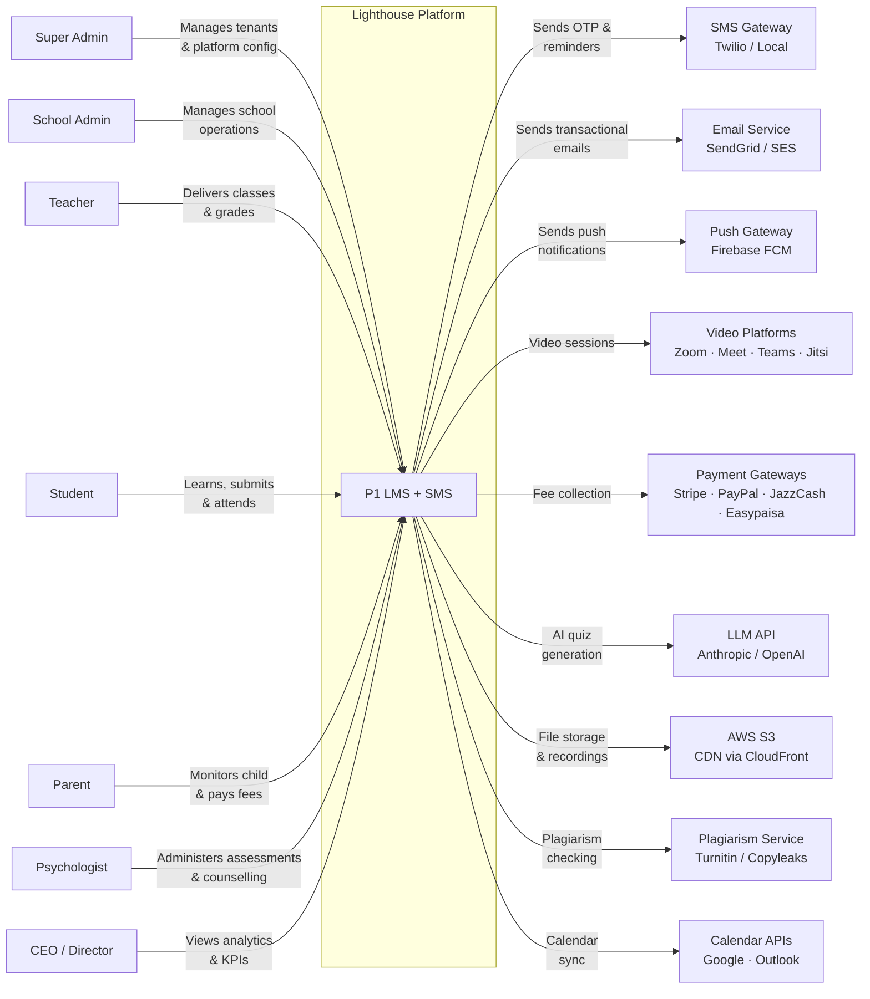
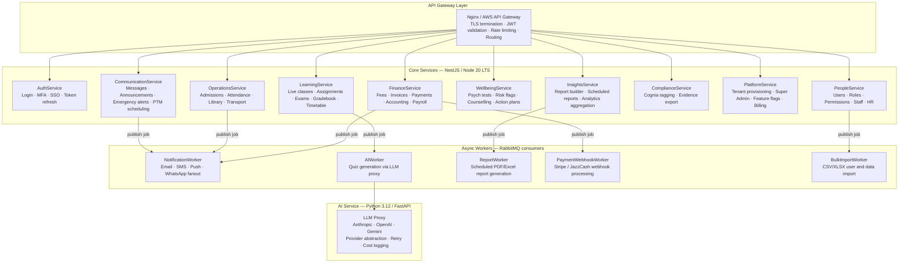
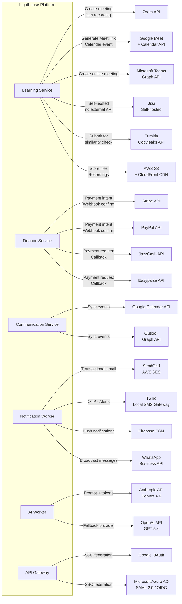
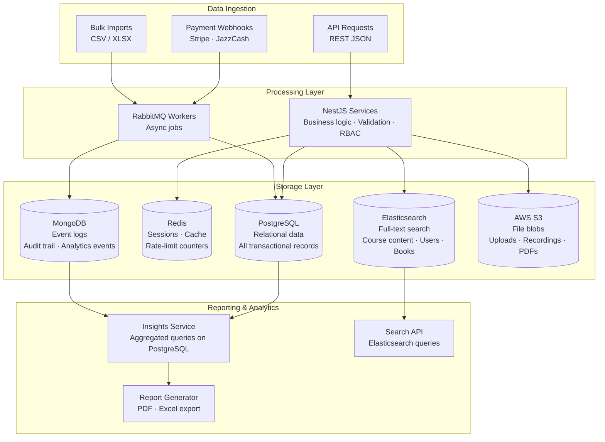
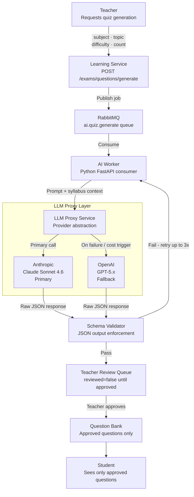
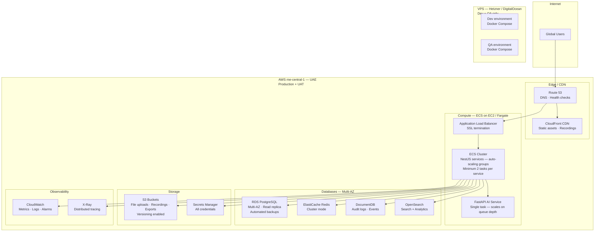

# PART 8 — SOLUTION ARCHITECTURE
## P1 — Learning Management System + School Management System
### Layer 4 — Technical & Architecture

**Status:** 🟡 Content Complete — Layer Gate Not Yet Passed
**Resolved:** Section 8.9 cloud provider — AWS confirmed by client for UAT/Production (2026-06-18). OCI and full self-host VPS documented as evaluated alternatives.

*Architecture diagrams (high-level, context, component, integration, data, security, cloud) are visual artifacts batched with all other outstanding diagrams across this document. This section provides the full textual specification each diagram will visualise — the technical content lives here; the diagram is a navigational aid layered on top of it.*

---

## 8.1 Platform Analysis & Recommendation

The client's input brief named four open-source bases for evaluation: Odoo+OpenEduCat, Moodle, Open edX, and Frappe/ERPNext. Five additional credible open-source candidates were added to widen the evaluation: Canvas LMS (open-source core), Fedena, OpenSIS, Gibbon, and RosarioSIS. Each was evaluated against the specific scope already locked in Parts 1–7 of this SRS — not against generic "best LMS" criteria.

These nine platforms split into two categories that rarely overlap in practice, which is itself a finding worth stating plainly: **no single open-source platform on the market combines course/live-learning delivery with school administration and finance at the depth this project requires.** Real-world deployments of these platforms typically pair one from each table below (e.g. OpenSIS + Moodle, or Fedena + a bolted-on LMS) rather than running one platform alone.

### Table A — LMS-Focused Platforms (course & live-learning delivery)

| Criterion | Moodle | Open edX | Canvas LMS (open-source core) |
|---|---|---|---|
| Native admissions/SIS | None | None | None |
| Native accounting/HR/payroll | None | None | None |
| Live class delivery across Zoom/Meet/Teams/Jitsi with proctoring | None native — third-party plugin per platform | None — asynchronous MOOC delivery model, not built for scheduled live video | None native |
| AI-assisted quiz/question generation | None native | None native | None native |
| Psychological assessment / Cognia evidence management | None | None | None |
| Multi-tenant SaaS at 100,000+ scale | Single-tenant by default | Built for MOOC scale, not per-school multi-tenancy | Single-tenant by default; Instructure's commercial Canvas Cloud handles multi-tenancy, not the open-source core |
| RTL Arabic/Urdu support | Language packages; RTL is plugin-quality | Strong i18n (125 languages via Transifex) but Urdu Nastaliq depth unconfirmed | Not confirmed as first-class |
| Operational complexity | Low | High — 20+ containers in default Docker install | Moderate — still requires PostgreSQL, Redis, Elasticsearch, RabbitMQ, multiple Rails services for self-hosting |
| Licence | GPL | AGPLv3 | AGPLv3 (core); Canvas Cloud is Instructure's separate commercial SaaS layer |

### Table B — SMS/SIS-Focused Platforms (school administration & finance)

| Criterion | Frappe/ERPNext | Odoo + OpenEduCat | Fedena | OpenSIS | Gibbon | RosarioSIS |
|---|---|---|---|---|---|---|
| Native admissions/SIS | Native | Native | Native | Native (core SIS strength) | Native | Native |
| Native accounting | Native (ERPNext core) | Native (Odoo Accounting) | Included in paid tiers; free/open "core" tier is more limited | None — designed for SIS, not finance | None | Native accounting/billing module |
| Native HR & payroll | Native | Native | HR portal included | None | None | None |
| Native fee management with regional gateways | Razorpay out-of-box; Stripe/PayPal/JazzCash/Easypaisa need custom connectors | Stripe/PayPal via Odoo's payment framework; JazzCash/Easypaisa need custom connectors | Built-in financial management, gateway specifics vary by edition | None native | None | Built-in billing, gateway specifics not confirmed at this depth |
| Live class / proctoring / AI quiz / psych assessment / Cognia | None of these | None of these | None of these | None of these | Includes a virtual classroom management feature — the only one of the nine with any native live-class capability, though without proctoring | None of these |
| RTL Arabic/Urdu | Not confirmed first-class | Not confirmed first-class | Multilingual; RTL depth unconfirmed | Not confirmed | Not confirmed | **Confirmed RTL support for Arabic and Persian scripts** — the only platform in this evaluation with this explicitly documented |
| Multi-tenant SaaS at 100,000+ scale | Multi-site via Frappe Cloud, closer to separate installs than shared multi-tenancy | Multi-company model designed for one org's branches, not unrelated tenant schools | Not designed for multi-tenant SaaS at this scale | Not designed for multi-tenant SaaS at this scale | Not designed for multi-tenant SaaS at this scale | Not designed for multi-tenant SaaS at this scale |
| Scale/track record | Strong (large global ERPNext install base) | Moderate | 15,000+ schools, 7M+ students (incl. Kerala state government deployment) | 30,000+ institutions, 12M+ students | Smaller community, teacher-built/teacher-focused | Smaller community |
| Licence | GPL | LGPL (Odoo Community) | Apache 2.0 (core); Pro/Pro Plus tiers are commercial | Open source (community edition has feature gaps vs. commercial edition per independent reviews) | GPL | GPL |

*Sources: platform feature claims verified via current vendor documentation and independent 2026 comparison analyses, including each platform's own feature pages, GitHub repositories, and third-party open-source school-software roundups, as of June 2026.*

### Recommendation

**Build a custom microservices architecture, as already directionally established in this SRS's locked system architecture (Part 1), rather than adopt any of the nine platforms evaluated — individually or in combination — as a base.**

**Justification:** Expanding the evaluation from four to nine platforms strengthens rather than changes the conclusion. Frappe/ERPNext remains the strongest single-platform fit for the administrative/financial half of this project (native accounting, HR, payroll, admissions), and RosarioSIS is the only platform with explicitly confirmed RTL support — but no platform, and no realistic pairing of one LMS-focused platform with one SMS-focused platform, natively covers live classes with multi-platform proctoring, AI-assisted question generation, the five-test-type psychological assessment platform with risk escalation, or Cognia evidence management. Gibbon's virtual classroom feature is the closest any candidate comes to live-class capability, and it has no proctoring layer. Even the best-case off-the-shelf scenario for this project would mean operating two separate platforms (one SIS/ERP, one LMS) integrated via custom middleware, then building the four genuinely novel capability areas above as additional custom services regardless — at which point the "off-the-shelf foundation" contributes administrative/financial record-keeping only, while inheriting two separate platforms' upgrade paths, data models, and technical debt.

This recommendation does not discard the open-source ecosystem entirely: ERPNext's accounting and payroll data models remain a referenced design input for Part 9.3 (Database Design), and RosarioSIS's documented approach to Arabic/Persian RTL rendering is a useful reference point for Part 6.6's RTL implementation — without adopting either platform itself. Jitsi, already locked as the self-hosted video component (Part 1 scope lock), remains in use for the same reason: open source, fits the specific need, no platform adoption required around it.

### Platform References

| Platform | Official Site / Repository |
|---|---|
| Moodle | [moodle.org](https://moodle.org/) |
| Open edX | [openedx.org](https://openedx.org/) |
| Canvas LMS (open-source core) | [github.com/instructure/canvas-lms](https://github.com/instructure/canvas-lms) |
| Frappe Framework / ERPNext / Frappe Education | [frappe.io](https://frappe.io/) · [frappe.io/education](https://frappe.io/education) · [erpnext.com](https://erpnext.com/) |
| Odoo | [odoo.com](https://www.odoo.com/) |
| OpenEduCat | [openeducat.org](https://openeducat.org/) |
| Fedena | [fedena.com](https://fedena.com/) · [github.com/projectfedena/fedena](https://github.com/projectfedena/fedena) |
| OpenSIS | [opensis.com](https://www.opensis.com/) · [github.com/OS4ED/openSIS-Classic](https://github.com/OS4ED/openSIS-Classic) |
| Gibbon | [gibbonedu.org](https://gibbonedu.org/) |
| RosarioSIS | [rosariosis.org](https://www.rosariosis.org/) |
| Jitsi (referenced — already locked, Part 1) | [jitsi.org](https://jitsi.org/) |
---

## 8.2 High-Level Architecture

The system follows the microservices architecture already defined in Part 1 (Section 1, System Architecture reference) and the original client-provided high-level SRS:

| Layer | Components |
|---|---|
| Client Layer | Web App (React), iOS App, Android App, PWA (frontend stack comparison and final framework decision in Part 9.1) |
| API Gateway | Rate limiting, authentication, load balancing, request routing |
| Application Layer | Auth Service, LMS Service, SMS Service, Notification Service, Live Class Service, Payment Service, Analytics Service, File Storage Service, AI Quiz Service, Psychological Assessment Service |
| Data Layer | PostgreSQL (primary relational data), Redis (cache/sessions), MongoDB (logs/analytics), Elasticsearch (search/analytics) |

```mermaid
graph TD
    subgraph Clients["Client Layer"]
        WEB[Web App\nReact + TypeScript]
        MOB[Mobile App\nReact Native iOS/Android]
        PWA[PWA\nOffline-capable]
    end

    subgraph Gateway["API Gateway"]
        GW[API Gateway\nRate Limiting · Auth · Routing]
    end

    subgraph Services["Application Layer — Microservices"]
        AUTH[Auth Service\nJWT · MFA · SSO]
        LEARN[Learning Service\nClasses · Assignments · Exams · Gradebook]
        OPS[Operations Service\nAdmissions · Attendance · Library · Transport]
        FIN[Finance Service\nFees · Accounting · Payroll]
        PEOPLE[People Service\nHR · Users · Roles]
        WELL[Wellbeing Service\nPsych Assessment · Counselling]
        COMM[Communication Service\nMessaging · Announcements · Alerts]
        COMPLY[Compliance Service\nCognia Evidence]
        PLATFORM[Platform Service\nMulti-tenant · Super Admin]
        INSIGHTS[Insights Service\nReports · Analytics]
        NOTIFY[Notification Service\nEmail · SMS · Push · WhatsApp]
        AI[AI Service\nQuiz Generation · LLM Proxy]
        STORAGE[File Storage Service\nAWS S3]
    end

    subgraph Data["Data Layer"]
        PG[(PostgreSQL\nPrimary DB)]
        REDIS[(Redis\nCache · Sessions)]
        MONGO[(MongoDB\nLogs · Events)]
        ES[(Elasticsearch\nFull-text Search)]
    end

    WEB --> GW
    MOB --> GW
    PWA --> GW
    GW --> AUTH
    GW --> LEARN
    GW --> OPS
    GW --> FIN
    GW --> PEOPLE
    GW --> WELL
    GW --> COMM
    GW --> COMPLY
    GW --> PLATFORM
    GW --> INSIGHTS
    LEARN --> NOTIFY
    OPS --> NOTIFY
    FIN --> NOTIFY
    WELL --> NOTIFY
    LEARN --> AI
    LEARN --> STORAGE
    OPS --> STORAGE
    AUTH --> REDIS
    LEARN --> PG
    OPS --> PG
    FIN --> PG
    PEOPLE --> PG
    WELL --> PG
    COMM --> PG
    COMPLY --> PG
    PLATFORM --> PG
    INSIGHTS --> PG
    INSIGHTS --> MONGO
    INSIGHTS --> ES
```




---

## 8.3 System Context

The system sits as a single black-box platform with the following external actors and systems at its boundary:

**External actors:** Super Admin, CEO, School Admin, Teacher, Student, Parent, Psychologist, Staff (the 8 portal roles defined in Part 2).

**External systems:**
- Payment gateways: Stripe, PayPal, JazzCash, Easypaisa (per-school configuration, BR-040)
- Video conferencing: Zoom, Google Meet, Microsoft Teams, Jitsi (self-hosted default)
- Cambridge Assessment International Education systems (BP02)
- SMS/Email/WhatsApp Business API gateways
- Cloud storage and CDN (provider per Section 8.9)
- P3 (AI Student Coach) — receives data via API hooks only; P1 does not call into P3 (Part 1 scope lock)




---

## 8.4 Component Architecture

Internal components map directly to the 20 functional modules defined in Part 4, grouped into the following service boundaries for the microservices layer:

| Service | Modules Covered |
|---|---|
| Academic Service | Live Online Classes (M02), Assignment (M03), Exam (M04), Gradebook (M05), Timetable (M07) |
| Operations Service | Admissions (M01), Attendance (M06), Library (M12), Transport (M15) |
| Finance Service | Fee Management (M08), School Financial Management/Accounting (M09) |
| People Service | School Staff Management/HR (M10), School Staff Payroll (M11), User & Role Management (M18) |
| Wellbeing Service | Psychological Assessment (M14) — isolated as its own service given its stricter data sensitivity and visibility rules (BR-031, BR-032) |
| Communication Service | Communication Module (M13) |
| Compliance Service | Cognia Evidence Management (M16) |
| Platform Service | Platform & System Administration (M17), Settings & Configuration (M20) |
| Insights Service | Reports & Analytics (M19) — queries across all other services' data rather than owning data itself |




---

## 8.5 Integration Architecture

| Integration | Purpose | Direction | Failure Handling |
|---|---|---|---|
| Stripe / PayPal / JazzCash / Easypaisa | Fee collection, invoicing, refunds | Outbound (initiate) + Inbound (webhook confirmation) | Failed transaction does not mark invoice paid; webhook retried per provider's standard retry policy; reconciliation report flags any payment confirmed by provider but not reflected in system within a defined SLA |
| Zoom / Google Meet / Microsoft Teams API/SDK | Live class creation, participant management, recordings | Outbound (create meeting) + Inbound (webhook for recording-ready events) | Falls back to Jitsi per the error state defined in Part 4, M02 |
| Jitsi (self-hosted) | Default built-in video conferencing | Bidirectional (system controls the self-hosted instance directly) | No external dependency — failure handling is infrastructure-level (Part 11) |
| Cambridge Assessment systems | Candidate exam entry and results submission | Outbound (submit) + Inbound (confirmation/results) | Validation against Cambridge's required data format occurs before submission (BP02); failed submissions are queued for manual admin review, not silently dropped |
| SMS Gateway (Twilio/MessageBird/local providers) | OTP, alerts, reminders | Outbound only | Falls back to remaining configured channels per BR-033 |
| Email Service (SendGrid/AWS SES/SMTP) | Transactional email, newsletters | Outbound only | Falls back to remaining configured channels per BR-033 |
| WhatsApp Business API | Application links, reminders, parent communication | Outbound only (v1.0 scope) | Falls back to email/SMS if WhatsApp delivery fails |
| Cloud Storage & CDN | File storage, recording storage, global content delivery | Bidirectional | Provider selected in Section 8.9 |
| P3 (AI Student Coach) API hooks | Expose student academic/assessment data for P3's consumption | Outbound only — P1 exposes data, never calls into P3 (Part 1 scope lock) | P3's availability has no bearing on P1's own functionality, since the dependency is one-directional and non-blocking |




---

## 8.6 Data Architecture Overview

| Data Domain | Primary Store | Rationale |
|---|---|---|
| Core transactional data (students, staff, grades, fees, ledger, HR/payroll) | PostgreSQL | Relational integrity required for financial and academic records; supports the double-entry accounting constraint (debits = credits) at the database level |
| Sessions & caching | Redis | Sub-second session lookups and frequently-accessed data caching to meet the <300ms p95 API response target (Part 10) |
| Logs, audit trail, analytics events | MongoDB | High-volume, schema-flexible event data (every login, every action) that would otherwise bloat the relational store |
| Full-text and faceted search | Elasticsearch | Powers library catalog search (M12), student/staff directory search, and report builder filtering (M19) |
| File storage (documents, recordings, uploads) | Cloud object storage (provider per Section 8.9) | Binary content does not belong in any of the above; referenced by URL from PostgreSQL records |

**Tenant isolation principle (BR-039):** every PostgreSQL table containing school-specific data carries a `school_id` partition key enforced at the database query layer, not merely at the application layer, so that a coding error in one service cannot accidentally leak cross-tenant data.




---

## 8.7 Security Architecture

| Layer | Controls |
|---|---|
| Network | TLS 1.3 everywhere; API Gateway as the single public-facing entry point; internal service-to-service traffic on a private network segment, not publicly routable |
| Authentication | JWT-based authentication; MFA enforceable globally or per school (Old SRS 3.1.7); SSO support (Google OAuth, Microsoft Azure AD, SAML 2.0) |
| Authorization | Role-Based Access Control enforcing the full permissions matrix (Part 2, Section 2.4) at the API layer, not only the UI layer — a direct API call cannot bypass a permission the UI hides |
| Data protection | AES-256 encryption at rest; TLS 1.3 in transit; tenant isolation per Section 8.6 |
| Application security | OWASP Top 10 mitigations mapped in Part 9, Section 9.6 |
| Audit | Every authentication event, data change, and admin action logged per the audit trail requirements (Old SRS 3.1.7) |

```mermaid
graph TD
    subgraph Internet["Internet"]
        USER[User\nBrowser / Mobile]
    end

    subgraph Edge["Edge Layer"]
        CF[AWS CloudFront\nDDoS mitigation · WAF · TLS 1.3 termination]
        WAF[AWS WAF\nOWASP rule set · IP blocklist · Rate limiting]
    end

    subgraph AppLayer["Application Layer"]
        GW[API Gateway\nJWT validation · Tenant isolation check\nRole-Based Access Control]
        SERVICES[Microservices\nRow-level tenant filter on every DB query\nInput validation · Output encoding]
    end

    subgraph DataLayer["Data Layer"]
        PG[(PostgreSQL\nAES-256 at rest\nTenant-scoped schemas)]
        S3[(AWS S3\nAES-256 SSE\nPrivate buckets · Pre-signed URLs only)]
        SECRETS[AWS Secrets Manager\nAPI keys · DB credentials\nNever in environment variables or code)]
    end

    subgraph Identity["Identity & Access"]
        AUTH[Auth Service\nJWT · MFA · Session timeout 30 min\nPassword policy enforcement]
        SSO[SSO Providers\nGoogle OAuth · Azure AD · SAML 2.0]
        AUDIT[Audit Log\nAll access + mutations logged\nImmutable append-only in MongoDB]
    end

    USER -->|HTTPS| CF
    CF --> WAF
    WAF --> GW
    GW -->|Valid JWT only| SERVICES
    GW --> AUTH
    AUTH --> SSO
    SERVICES --> PG
    SERVICES --> S3
    SERVICES --> SECRETS
    SERVICES --> AUDIT
    GW --> AUDIT
```


---

## 8.8 AI Architecture

*Scope: the AI Quiz Generation Bot (LMS-FR-057) and the API hooks exposed for P3 (AI Student Coach) consumption. P1 does not host any AI tutoring, coaching, or RevOps logic itself — that is P2 and P3's domain, built and documented separately.*

| Element | Specification |
|---|---|
| LLM provider | Provider-agnostic API layer supporting OpenAI, Anthropic, and Google Gemini interchangeably, consistent with the multi-LLM approach already established for P2/P3 — avoiding single-vendor lock-in and allowing cost/quality optimisation per request type |
| Use case | Drafts exam questions from teacher-supplied syllabus content across the 10 supported question types (Part 4, M04) |
| Guardrail — mandatory human review | Every AI-drafted question enters an editable draft state and is never published to an exam without explicit teacher review and approval (LMS-FR-057). This is a hard architectural constraint, not a configurable setting — there is no path for an AI-drafted question to reach a student unreviewed. |
| Guardrail — no autonomous grading override | The AI Quiz Service only drafts question content; it has no write access to grades, regrade decisions, or any data outside the question bank it is drafting into |
| P3 integration hooks | A read-only API exposing a student's academic history, assessment results, and learning profile data, scoped per BR-IDs already governing that data's visibility (e.g. psychological assessment data exposure follows the same BR-031/032 visibility rules regardless of which system is consuming the API) |
| Data sent to LLM providers | Syllabus content and question-generation prompts only — no student personal data, grades, or psychological assessment data is ever sent to an LLM provider as part of quiz generation |




---

## 8.9 Cloud Architecture

### Middle East Regional Presence (verified June 2026)

| Provider | Middle East Regions | Notes |
|---|---|---|
| AWS | Bahrain (since 2019), UAE/me-central-1 (since 2022), Saudi Arabia/me-central-2 (General Availability January 2026, 3 Availability Zones) | Broadest regional footprint of the three managed-cloud providers as of this SRS's writing |
| Microsoft Azure | UAE — Abu Dhabi and Dubai regions (live); Qatar region also available | Was first of the three major managed-cloud providers to open dedicated Middle East data centers |
| Oracle Cloud Infrastructure (OCI) | UAE — Dubai (since 2019) and Abu Dhabi (since 2021); Saudi Arabia — Jeddah | Genuinely certified sovereign-tier regions, not points of presence; verified substantially cheaper than AWS for equivalent specs (see Cost Comparison below) |
| Google Cloud Platform | Doha, Qatar; Dammam, Saudi Arabia (since 2023) | — |
| Self-Managed VPS (DigitalOcean, Linode, Hetzner, Vultr, regional resellers) | No major budget VPS provider operates a certified, dedicated in-region data center matching AWS/Azure/GCP's regulatory-recognised regional presence; several (e.g. LightNode) offer points of presence in Dubai, Saudi Arabia, and Bahrain primarily for latency, not data-residency certification | Pakistani VPS resellers (e.g. CloudVPS.pk, PK-Host) typically resell capacity in these same regional points of presence rather than operating certified infrastructure of their own |

None of the three managed-cloud providers operates a region physically within Pakistan; all three Gulf regions offer comparable latency from Pakistan and are the relevant comparison points for both current Pakistan-primary operations and the GCC expansion named in the project vision (Part 1).

### Four-Way Comparison: AWS vs. Azure vs. OCI vs. Self-Managed VPS

| Criterion | AWS | Azure | Oracle Cloud Infrastructure (OCI) | Self-Managed VPS |
|---|---|---|---|---|
| Raw compute cost | Highest of the four | Comparable to AWS | Substantially lower — Oracle's own published comparison shows standard compute shapes ~50-57% cheaper than equivalent AWS instances, block storage ~70-78% cheaper, data egress ~10-13x cheaper | Lowest — typically 40-60% less than AWS for equivalent raw CPU/RAM at established providers, but with no managed services included |
| Managed database (HA PostgreSQL) | Native (RDS Multi-AZ) | Native (Azure Database for PostgreSQL) | Native (OCI Database with PostgreSQL, or Autonomous Database) | None — must be self-built and self-operated (e.g. Patroni for HA failover) |
| Managed Kubernetes | Native (EKS) | Native (AKS) | Native (OKE — Oracle Container Engine for Kubernetes) | None — must self-host (k3s/kubeadm/RKE2) |
| Compliance certifications inherited from the provider | SOC 2, ISO 27001, PCI DSS Level 1 | Same certifications held by Microsoft | Same category of enterprise certifications; support for production workloads included in the base price at no extra charge | Varies by provider — major players (DigitalOcean, Linode) hold some; most regional resellers hold none |
| Data residency recognition for GCC expansion (Saudi PDPL / UAE PDPL) | Regulatory-recognised in-country regions in both UAE and Saudi Arabia | Regulatory-recognised in-country UAE region | Regulatory-recognised in-country regions in both UAE (Dubai, Abu Dhabi) and Saudi Arabia (Jeddah) | Regional points of presence exist (e.g. LightNode in Dubai/Saudi/Bahrain) but are not regulator-recognised certified cloud regions — a real compliance gap |
| Ecosystem maturity / tooling | Most mature of the four; largest talent pool, most third-party tooling and documentation | Strong, especially for Microsoft-stack-adjacent teams | Smaller global market share (~3% vs. AWS's ~29%); console and tooling generally regarded as less polished than AWS's | Minimal platform tooling — most operational tooling must be assembled by the team |
| Achieving the 99.9% uptime / 15-min RPO / 4-hr RTO targets (Part 10) | Close to default behaviour via native multi-AZ failover and managed replication | Same | Same — equivalent managed HA capability | Achievable only through continuous, well-resourced in-house SRE discipline; a real ongoing operational risk if that discipline lapses |
| Scaling to Year 3 target (100,000 concurrent users, Part 10.2) | Built-in elastic auto-scaling | Same | Same | Requires the team to build its own capacity-planning and scaling automation |
| Operational overhead before any product feature work begins | Low | Low | Low | High — HA database, HA Kubernetes, monitoring, and backup automation must all be built first |

### Decision

**AWS — confirmed by the client for both UAT and Production**, on ecosystem maturity grounds, with the cost premium over OCI explicitly accepted. This closes DEC-P1-025/027 (Decision Log).

OCI was evaluated as a genuine, credible cost-saving alternative — it offers regulatory-recognised regions in the same UAE and Saudi locations as AWS, equivalent managed database/Kubernetes capability, and substantially lower published pricing (Section above) — and remains documented here as the lower-cost path not taken, should infrastructure cost become a constraint later in the project.

Self-managed VPS (including full self-hosting on providers such as Hetzner or LightNode, across all environments rather than only Dev/QA) was also evaluated as a full-ownership alternative and was not selected for UAT or Production. The deciding factors: no major self-managed VPS provider — including those with Middle East server locations — operates a regulator-recognised certified cloud region matching AWS/Azure/OCI's UAE and Saudi presence, which is a direct gap against the GCC data residency requirements in Part 3.5; and the 99.9% uptime, 15-minute RPO, and 4-hour RTO targets in Part 10 would depend entirely on continuously-maintained in-house SRE capability rather than provider-managed infrastructure. This remains a technically viable path if the client later prefers full infrastructure ownership and is prepared to accept and resource against this gap explicitly — it is logged as an evaluated alternative in the Risk Register (Part 16) rather than discarded outright.

**Confirmed split:** AWS for UAT and Production; self-managed VPS (DigitalOcean or Hetzner) for Development and QA only, per Part 11.1 and Part 11.2 — this part of the hybrid was not in question and stands as previously documented.



---

*Lighthouse Global School System — P1 Master SRS — Part 8 — Layer 4 — Internal — v1.0*
