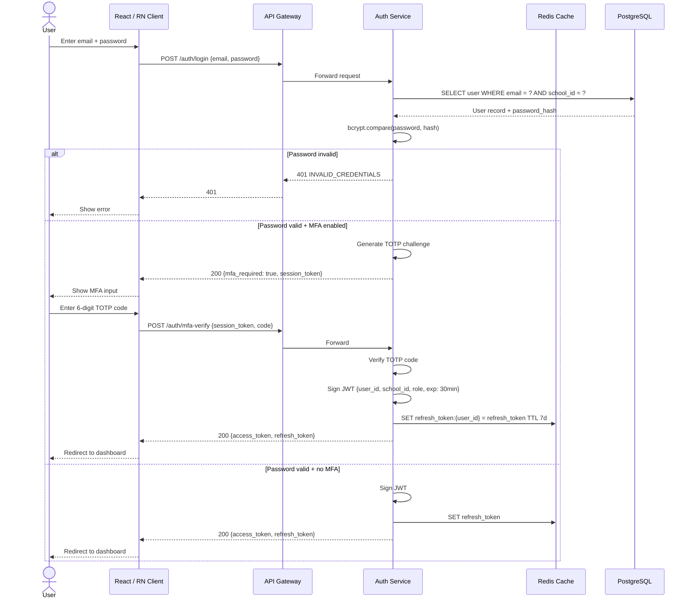
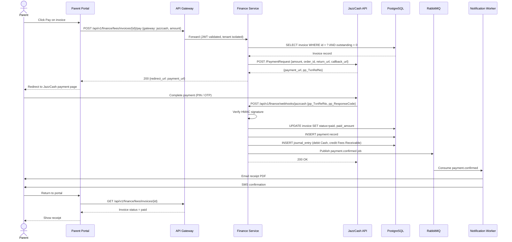
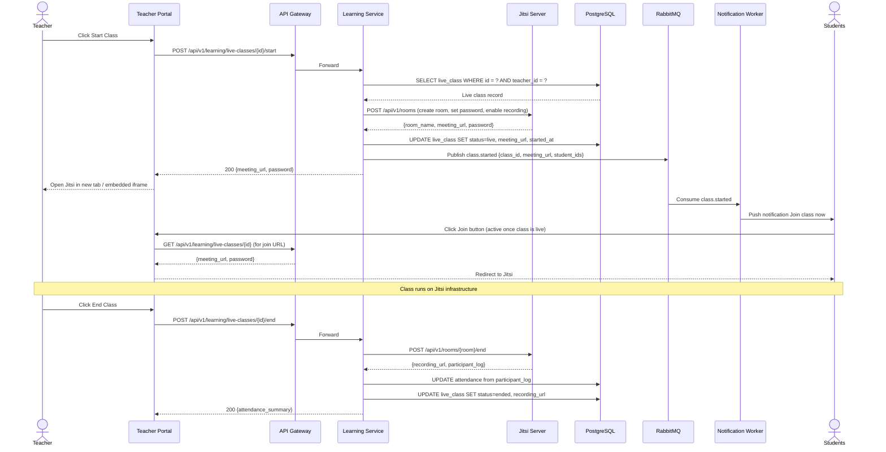
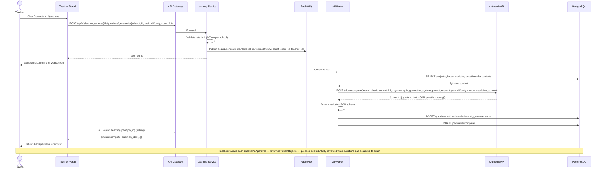
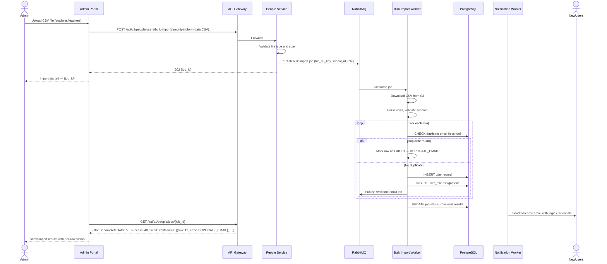
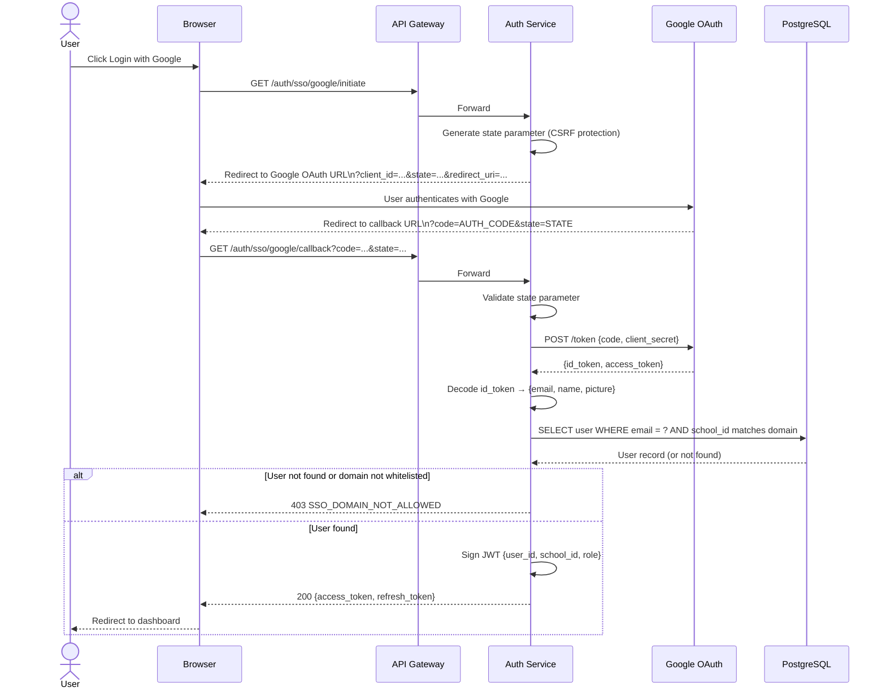
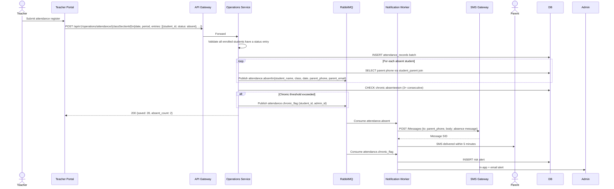

# PART 9 — TECHNICAL SPECIFICATIONS
## P1 — Learning Management System + School Management System
### Layer 4 — Technical & Architecture

**Status:** 🟡 Content Complete — Layer Gate Not Yet Passed
**Open Item:** Section 9.1 mobile framework recommendation (React Native, reversing the original native Swift/Kotlin brief) flagged for client confirmation

---

## 9.1 Frontend Stack

| Element | Specification |
|---|---|
| Web framework | React 18+ with TypeScript |
| State management | Redux Toolkit (predictable state for complex cross-module views like the Gradebook and Timetable Builder) |
| Build tooling | Vite |
| Mobile — **decision required, recommendation below** | React Native with TypeScript |
| PWA | Built on the same React codebase per Part 1 scope lock (PWA always-in) |

### Mobile: Native vs. Cross-Platform (deferred decision from Part 1 scope lock)

| Criterion | True Native (Swift + Kotlin) | React Native | Flutter |
|---|---|---|---|
| Codebase | Two fully separate codebases, two specialist skill sets (Swift/iOS, Kotlin/Android) | One shared codebase (JavaScript/TypeScript) | One shared codebase (Dart) |
| Code sharing with the web app | None — web team and mobile teams are fully separate, no shared logic | High — shares TypeScript types, validation logic, and in some cases UI logic with the React web app, since both speak the same language | None — Dart is not shared with the React/TypeScript web codebase |
| Development cost & speed | Slowest, most expensive — every feature built twice end to end | Fastest, lowest cost — most features built once and deployed to both platforms | Fast — comparable to React Native in most cases, sometimes faster for highly custom UI since Flutter renders its own widgets rather than bridging to native UI components |
| Performance | Best possible — direct compiled native code, zero bridging overhead | Very good for the vast majority of screens; a JS bridge exists for native module calls, which is irrelevant for typical UI/data screens but a real factor for camera-intensive or high-frequency real-time work (e.g. webcam proctoring capture) | Very good — Flutter compiles to native ARM code (no JS bridge), generally benchmarks slightly ahead of React Native on raw rendering performance, though the difference is rarely noticeable outside graphics-heavy use cases |
| Proctoring lockdown (full-screen lock, screen-recording prevention, tab-switch detection equivalent) | Full, direct OS API access by default | Achievable, but the small number of true OS-level lockdown features need a custom native module bridge written in Swift/Kotlin specifically for that one screen — not pure JavaScript | Same situation as React Native — Flutter has its own plugin bridge (written in Swift/Kotlin under the hood) for the same OS-level features; neither cross-platform framework avoids this requirement entirely |
| Biometric/RFID attendance integration (M06) | Native by default | Mature, well-maintained community libraries available | Mature, well-maintained community libraries available (slightly smaller plugin ecosystem than React Native's, since React Native has the larger overall community) |
| Talent pool / hiring | Requires two specialist hiring tracks (iOS Swift devs, Android Kotlin devs) — typically the hardest and most expensive to staff | Largest cross-platform talent pool globally, and overlaps directly with the web team's existing React/TypeScript skill set | Smaller talent pool than React Native, growing but still a more specialised hire; no overlap with the React web team's skill set |
| Long-term maintenance | Highest cost — every bug fix, every OS update compatibility issue, handled twice | Lower cost — most maintenance done once; React Native's upgrade cycle has historically had more breaking-change friction than Flutter's | Lower cost — Flutter/Dart has had a notably smoother upgrade history than React Native in recent years, with fewer breaking changes between versions |
| UI consistency with platform conventions | Perfect by definition — it is the platform's own UI toolkit | Good — typically renders actual native UI components under the hood, so platform look-and-feel is generally preserved unless heavily customised | Good but distinct — Flutter renders its own widgets rather than native OS components, so it can look slightly "Flutter" rather than perfectly matching iOS/Android conventions unless deliberately themed to match each platform |

### Recommendation

**React Native**, as a cross-platform approach. The deciding factor is the direct code- and skill-overlap with the web team: this project already commits to React/TypeScript for the web app (this section, frontend stack), and React Native lets the same engineers and a large share of the same logic serve both. Flutter is a credible, technically comparable alternative — its performance and upgrade stability are arguably slightly better than React Native's — but it introduces a third language (Dart) with zero overlap with the rest of the stack, meaning a fully separate hiring track and no shared code with the web team, which narrows its advantage over true native without fully matching React Native's team-efficiency benefit.

True native (Swift + Kotlin) remains the right call only if OS-level proctoring lockdown is later found to be infeasible through React Native's native module bridge during technical discovery — in which case the documented fallback is a hybrid model: React Native for all screens except the exam-taking/proctoring screen, built natively per platform for that one screen only.

This reverses the original client brief's "Native iOS (Swift) and Android (Kotlin) apps" framing (Old SRS, Section 6.1) on cost/velocity/team-efficiency grounds — flagged here explicitly as a deviation requiring final client confirmation, not a silent substitution.

## 9.2 Backend Stack

| Element | Specification |
|---|---|
| Primary language | TypeScript 5.4 |
| Primary framework | NestJS 10.x, running on Node.js 20 LTS |
| AI Quiz Service language/framework | Python 3.12, FastAPI 0.110.x |
| API protocol | REST (OpenAPI 3.1 / Swagger, full catalog in Section 9.4); WebSocket (Socket.IO) for real-time features: live chat, live class signaling, live poll results, in-app notifications |
| Inter-service communication | REST over the internal private network segment (Part 8.7) for synchronous calls; RabbitMQ 3.13 for asynchronous workflows that do not require an immediate response |
| Background job processing | BullMQ on Redis 7.x for scheduled and long-running jobs |
| ORM / database access | Prisma 5.x (PostgreSQL) for all Node.js services; SQLAlchemy 2.x for the Python AI Quiz Service's own metadata storage |

### Key Dependencies by Service Type

| Concern | Library/Tool | Used For |
|---|---|---|
| Authentication | `@nestjs/passport` + `passport-jwt` | JWT validation (Section 9.4.1) |
| Validation | `class-validator` / `zod` | Request body validation against Part 4's field-level rules |
| Background jobs | `bullmq` | Report scheduling (LMS-FR-199), reminder dispatch (LMS-FR-117, LMS-FR-024), AI quiz generation job orchestration |
| Async messaging | `amqplib` (RabbitMQ client) | Bulk invoice generation (LMS-FR-113), bulk notification dispatch |
| Real-time | `socket.io` | Live class signaling, live polls, in-app notifications |
| LLM access (AI Quiz Service only) | Provider SDKs: `openai`, `anthropic`, `google-generativeai` | Question generation (Part 8.8) |

### Asynchronous Workflows Requiring the Job Queue or Message Queue (Not Direct Synchronous Calls)

| Workflow | Mechanism | Reason |
|---|---|---|
| Bulk invoice generation (LMS-FR-113) | RabbitMQ → worker | May process thousands of invoices; a synchronous HTTP request cannot hold a connection open that long |
| Emergency broadcast (LMS-FR-155) | RabbitMQ → worker, fanned out per channel (SMS/email/push/in-app) | Must dispatch to every channel and every recipient without one slow channel blocking the others |
| Scheduled report delivery (LMS-FR-199) | BullMQ recurring job | Runs on a schedule with no live HTTP request triggering it |
| AI quiz generation (LMS-FR-057) | BullMQ job, polled by the client (Section 9.4.3) | LLM response time is variable and can exceed a synchronous request budget |

**Rationale for TypeScript/NestJS as the primary backend stack:** sharing TypeScript types between the React/React Native frontend (Section 9.1) and the backend API reduces integration bugs and lets engineers move between frontend and backend work, which matters specifically because this project is staffed as one consolidated team rather than fully separate specialist teams per layer (Part 12 will confirm final team structure).

## 9.3 Database Design

*Full colour-coded ER diagrams for all 7 data domains are maintained in [Appendix A — ER Diagrams](../../Appendices/Appendix_A_ER_Diagrams.md) (the canonical location per the production guide's Appendix structure). This section provides the data dictionary, table specifications, and constraints each diagram visualises. Tenant isolation (`school_id` column, Part 8.6) applies to every table below except the global Platform domain. Full detail is given for the 5 domains with the most complex relationships or sensitivity requirements; the remaining domains are given a compressed table inventory, since their structure follows the same conventions established below and the field-level business rules already live in Part 4's Validation Rules tables per module (Rule 5).*

### 9.3.1 — Domain: Users & Roles (Full Detail)

| Table | Key Columns | Type | Constraints | Notes |
|---|---|---|---|---|
| `schools` | `id` (PK, UUID), `subdomain`, `name`, `timezone`, `currency`, `subscription_plan_id` (FK), `status` | — | `subdomain` UNIQUE globally | Root tenant table; every other table's `school_id` FKs here |
| `users` | `id` (PK, UUID), `school_id` (FK), `email`, `password_hash`, `role` (ENUM: super_admin/ceo/school_admin/teacher/student/parent/psychologist/staff), `status`, `mfa_enabled` | — | `email` UNIQUE per `school_id`; `super_admin`/`ceo` rows have `school_id` NULL (platform-level) | Base identity table for all 8 roles |
| `student_profiles` | `user_id` (PK+FK → users), `student_number`, `date_of_birth`, `grade_id` (FK), `section_id` (FK), `enrolment_date`, `status` | — | — | 1:1 extension of `users` where `role = student` |
| `parent_profiles` | `user_id` (PK+FK → users), `occupation`, `notification_preferences` (JSONB) | — | — | 1:1 extension |
| `parent_student_links` | `id` (PK), `parent_user_id` (FK → users), `student_user_id` (FK → users), `relationship_type` | — | UNIQUE (`parent_user_id`, `student_user_id`) | Many-to-many — supports multiple parents per child (Part 4, M18 edge case) |
| `staff_profiles` | `user_id` (PK+FK → users), `sub_role` (ENUM: librarian/accountant/other), `contract_start_date`, `contract_end_date` | — | — | 1:1 extension for Staff Portal (DEC-P1-020) |
| `custom_roles` | `id` (PK), `school_id` (FK), `name`, `base_role_template` (FK to predefined role), `permission_overrides` (JSONB) | — | `permission_overrides` validated at the application layer against `base_role_template`'s permission ceiling (BR-042) | — |
| `audit_logs` | `id` (PK), `school_id` (FK, nullable for platform-level events), `actor_user_id` (FK), `action`, `entity_type`, `entity_id`, `before_value` (JSONB), `after_value` (JSONB), `ip_address`, `timestamp` | — | Indexed on (`school_id`, `timestamp`) and (`actor_user_id`, `timestamp`) | Stored in MongoDB per Part 8.6, not PostgreSQL, given volume |

### 9.3.2 — Domain: Admissions (Full Detail)

| Table | Key Columns | Type | Constraints | Notes |
|---|---|---|---|---|
| `inquiries` | `id` (PK), `school_id` (FK), `applicant_name`, `grade_applying_for`, `source`, `assigned_to_user_id` (FK, nullable), `status`, `created_at` | — | — | — |
| `applications` | `id` (PK), `inquiry_id` (FK), `school_id` (FK), `applicant_dob`, `parent_email`, `parent_phone`, `stage` (ENUM per BP01), `decision` (ENUM, nullable), `decision_condition` (TEXT, nullable), `created_at` | — | — | — |
| `application_documents` | `id` (PK), `application_id` (FK), `document_type`, `file_url`, `status` (ENUM: verified/missing/pending_review), `uploaded_at` | — | — | — |
| `interviews` | `id` (PK), `application_id` (FK), `interviewer_user_id` (FK), `scheduled_at`, `rubric_id` (FK), `score` (JSONB), `notes`, `submitted_at` | — | `submitted_at` NOT NULL implies score is immutable (Part 5, UC-005) | — |
| `waitlist_entries` | `id` (PK), `application_id` (FK), `grade_section_id` (FK), `rank`, `promoted_at` (nullable) | — | UNIQUE (`grade_section_id`, `rank`) | — |

### 9.3.3 — Domain: Academic Core (Full Detail)

| Table | Key Columns | Type | Constraints | Notes |
|---|---|---|---|---|
| `classes_sections` | `id` (PK), `school_id` (FK), `grade`, `section_name`, `capacity`, `class_teacher_id` (FK → users) | — | — | — |
| `subjects` | `id` (PK), `school_id` (FK), `name`, `code`, `credit_hours` | — | — | — |
| `enrolments` | `id` (PK), `student_user_id` (FK), `class_section_id` (FK), `academic_year_id` (FK), `status` | — | — | — |
| `assignments` | `id` (PK), `school_id` (FK), `class_section_id` (FK), `subject_id` (FK), `type` (ENUM, 6 types per LMS-FR-041), `due_at`, `late_rule` (ENUM), `attempt_limit`, `rubric_id` (FK, nullable) | — | — | — |
| `submissions` | `id` (PK), `assignment_id` (FK), `student_user_id` (FK), `content_url`, `submitted_at`, `is_late` (boolean), `grade` (decimal, nullable), `graded_at` (nullable) | — | UNIQUE (`assignment_id`, `student_user_id`, `attempt_number`) | — |
| `rubrics` | `id` (PK), `school_id` (FK), `name`, `criteria` (JSONB: array of {name, point_scale, weight}) | — | — | Reusable library per LMS-FR-042 |
| `exams` | `id` (PK), `school_id` (FK), `class_section_id` (FK), `subject_id` (FK), `total_marks`, `passing_marks`, `time_limit_minutes`, `proctoring_settings` (JSONB) | — | — | — |
| `questions` | `id` (PK), `school_id` (FK), `subject_id` (FK), `type` (ENUM, 10 types per LMS-FR-056), `content` (JSONB), `difficulty`, `marks`, `ai_generated` (boolean), `reviewed_by_user_id` (FK, nullable) | — | `ai_generated = true` requires `reviewed_by_user_id` NOT NULL before the question can be attached to a published exam (enforces LMS-FR-057 at the schema level) | — |
| `exam_attempts` | `id` (PK), `exam_id` (FK), `student_user_id` (FK), `started_at`, `submitted_at`, `score` (decimal, nullable), `proctoring_flags` (JSONB array) | — | — | — |
| `gradebook_entries` | `id` (PK), `student_user_id` (FK), `class_section_id` (FK), `category`, `weight`, `score`, `is_override` (boolean), `override_reason` (TEXT, nullable) | — | `override_reason` NOT NULL when `is_override = true` (enforces BR-003 at schema level) | — |

### 9.3.4 — Domain: Fee & Accounting (Full Detail)

| Table | Key Columns | Type | Constraints | Notes |
|---|---|---|---|---|
| `fee_structures` | `id` (PK), `school_id` (FK), `fee_head`, `grade`, `amount`, `plan_type` (ENUM) | — | — | — |
| `invoices` | `id` (PK), `school_id` (FK), `student_user_id` (FK), `amount`, `due_date`, `status` (ENUM: unpaid/partial/paid/overdue), `discount_applied` (decimal) | — | — | — |
| `payments` | `id` (PK), `invoice_id` (FK), `gateway_provider` (ENUM: stripe/paypal/jazzcash/easypaisa), `amount`, `transaction_ref`, `confirmed_at` | — | — | `gateway_provider` credentials live in `school_payment_gateway_configs`, never duplicated here |
| `school_payment_gateway_configs` | `id` (PK), `school_id` (FK), `provider`, `credentials_encrypted` (TEXT) | — | UNIQUE (`school_id`, `provider`) | Super Admin's View-only access (LMS-FR-184) excludes `credentials_encrypted` from any query Super Admin can run — enforced at the API layer, not just by convention |
| `chart_of_accounts` | `id` (PK), `school_id` (FK), `account_code`, `account_name`, `account_type` | — | UNIQUE (`school_id`, `account_code`) | — |
| `ledger_entries` | `id` (PK), `school_id` (FK), `account_id` (FK), `debit`, `credit`, `reference_type` (ENUM: payment/payroll/manual), `reference_id`, `posted_at` | — | CHECK: every transaction's total debits = total credits across its grouped entries (BR — journal balance rule) | — |
| `payroll_runs` | `id` (PK), `school_id` (FK), `staff_user_id` (FK), `pay_period`, `base_salary`, `deductions` (JSONB), `net_pay`, `posted_to_ledger_at` | — | — | — |

### 9.3.5 — Domain: Psychological Assessment (Full Detail)

| Table | Key Columns | Type | Constraints | Notes |
|---|---|---|---|---|
| `psych_tests` | `id` (PK), `school_id` (FK), `type` (ENUM: personality/career/aptitude/iq/eq), `student_user_id` (FK), `assigned_by_user_id` (FK), `completed_at`, `score_data` (JSONB) | — | IQ-type rows have an application-layer check preventing a new row for the same student within 12 months of the most recent (BR-015) | The most access-restricted table in the schema — query-layer enforcement of BR-031/032 visibility rules, not just API-layer |
| `risk_flags` | `id` (PK), `student_user_id` (FK), `risk_level` (ENUM: low/medium/high/critical), `triggered_by` (TEXT), `created_at` | — | `risk_level` transition to `critical` triggers the escalation workflow (BR-030) via an application-layer event, not a database trigger, to keep escalation logic auditable in code rather than hidden in the schema | — |
| `action_plans` | `id` (PK), `student_user_id` (FK), `psychologist_user_id` (FK), `goals` (JSONB), `interventions` (JSONB), `visibility_override` (boolean), `created_at` | — | `interventions` field is never returned by the API to a `parent` or `teacher` role unless `visibility_override = true` (BR-032) | — |
| `counselling_sessions` | `id` (PK), `student_user_id` (FK), `psychologist_user_id` (FK), `scheduled_at`, `confidential_notes` (TEXT), `shareable_summary` (TEXT, nullable) | — | `confidential_notes` has no API path that returns it to any role other than the authoring psychologist (BR-031) | — |

### 9.3.6 — Remaining Domains (Compressed Table Inventory)

| Table | Purpose | Key Fields | FK Relationships |
|---|---|---|---|
| `live_classes` | Scheduled/launched live sessions | title, scheduled_at, platform, meeting_link, recurrence_rule | class_section_id, teacher_user_id |
| `live_class_recordings` | Published recordings | file_url, chapters (JSONB), published_at | live_class_id |
| `live_class_attendance` | Join/leave timestamps per student per session | joined_at, left_at, cumulative_duration | live_class_id, student_user_id |
| `attendance_records` | Daily/period attendance | date, period, status (ENUM) | student_user_id, class_section_id |
| `leave_requests` | Staff leave requests | leave_type, start_date, end_date, status | staff_user_id |
| `timetable_entries` | Published schedule slots | day_of_week, start_time, end_time, room | class_section_id, subject_id, teacher_user_id |
| `substitutions` | Substitute teacher assignments | date, reason | original_teacher_id, substitute_teacher_id, timetable_entry_id |
| `library_resources` | Digital catalog items | title, author, subject, grade_access (JSONB), file_url | school_id |
| `library_usage_logs` | View/download events | event_type, timestamp | resource_id, user_id |
| `messages` | Threaded messages | body, sent_at, read_at | sender_user_id, recipient_user_id, thread_id |
| `announcements` | Posted announcements | content, priority, target_scope (JSONB), scheduled_for | school_id, posted_by_user_id |
| `meeting_bookings` | Parent-teacher meeting slots | slot_time, status | teacher_user_id, parent_user_id |
| `transport_routes` | Route definitions | route_name, vehicle_capacity | school_id |
| `transport_allocations` | Student-to-route assignment | pickup_point, drop_point | student_user_id, route_id |
| `cognia_evidence_tags` | Evidence tagged against standards | standard_reference, evidence_type, tagged_at | school_id, tagged_by_user_id |
| `saved_reports` | Custom report templates | filters (JSONB), schedule_config (JSONB) | school_id, created_by_user_id |
| `subscription_plans` | Platform-level plan definitions | tier_name, feature_flags (JSONB), billing_cycle | — (platform-level, no school_id) |

## 9.4 API Specifications

*Full sequence diagrams for the 7 most complex multi-service flows follow below. Every endpoint below uses its full path, including the service prefix — there is no abbreviated or implied path anywhere in this section. Standard errors (400/401/403/404/429) apply globally per Section 9.4.2 and are not restated per endpoint; only error codes specific to that endpoint's own business rules are listed in its "Notable Errors" column. Full multi-field request/response schemas are given for 4 representative complex endpoints in Section 9.4.3; every other endpoint in Section 9.4.4 still states its real description and key request/response fields — none are listed by requirement ID alone.*

### 9.4.1 Authentication & Rate Limiting (Global)

| Element | Specification |
|---|---|
| Auth scheme | Bearer JWT in the `Authorization` header for all endpoints except `POST /api/v1/auth/login` and `POST /api/v1/auth/refresh` |
| Token lifetime | Access token: 15 minutes. Refresh token: 7 days, rotated on every use. |
| Rate limiting | 100 requests/minute per authenticated user for standard endpoints; 10 requests/minute for bulk operations (bulk import, bulk invoice generation, emergency broadcast) |
| Rate limit response | HTTP 429 with a `Retry-After` header stating the number of seconds until the next allowed request |

### 9.4.2 Error Code Matrix (Global)

| HTTP Status | Meaning | Example Trigger |
|---|---|---|
| 400 | Validation error | Request field fails a Part 4 validation rule (e.g. malformed email) |
| 401 | Unauthenticated | Missing, expired, or invalid token |
| 403 | Unauthorized | Valid token, but the role lacks permission for this action per Section 2.4 |
| 404 | Not found | Resource ID does not exist, or exists in a different tenant and is therefore invisible to this caller |
| 409 | Conflict | State conflict specific to the endpoint (e.g. scheduling clash, duplicate subdomain) — see each endpoint's Notable Errors |
| 422 | Business rule violation | Request is well-formed but violates a business rule (e.g. category weights not summing to 100%) — see each endpoint's Notable Errors |
| 429 | Rate limited | See Section 9.4.1 |
| 500 | Internal error | Unhandled server fault, logged to the audit trail with a correlation ID returned to the client |

#### Sequence Diagrams — Complex Multi-Service Flows

**Authentication Flow — JWT Login with MFA**

**Payment Flow — JazzCash Fee Payment**

**Live Class Start Flow**

**AI Quiz Generation Flow**

**Bulk User Import Flow**

**SSO Login Flow (Google OAuth)**

**Attendance Auto-SMS Notification Flow**

---

### 9.4.3 Representative Full Endpoint Specifications

**POST `/api/v1/operations/admissions/applications/{id}/decision`**

| Element | Specification |
|---|---|
| Description | Records the School Admin's decision on an application and triggers the corresponding downstream action (acceptance letter generation, rejection notice, or waitlist entry). |
| Auth | School Admin only |
| Request body | `{ "decision": "accept" \| "reject" \| "waitlist" \| "conditional_accept", "condition_note": string }` — `condition_note` required only when `decision = "conditional_accept"` |
| Response (200) | `{ "application_id": uuid, "decision": string, "acceptance_letter_url": string }` — `acceptance_letter_url` present only when `decision = "accept"` |
| Notable Errors | 422 `DOCUMENTS_INCOMPLETE` if required documents are still Missing (BR-026) |
| Implements | LMS-FR-014, LMS-FR-015, UC-006 |

**POST `/api/v1/academic/exams/{examId}/attempts/{attemptId}/submit`**

| Element | Specification |
|---|---|
| Description | Submits a student's exam attempt, triggers automatic grading of objective questions, and routes subjective questions to the manual grading queue. |
| Auth | Student — only the owner of `attemptId` |
| Request body | `{ "answers": [{ "question_id": uuid, "response": object }], "force_submit": boolean }` |
| Response (200) | `{ "attempt_id": uuid, "submitted_at": timestamp, "objective_score": decimal, "pending_manual_grading": boolean }` |
| Notable Errors | 422 `UNANSWERED_QUESTIONS` with body `{ "unanswered_question_ids": [uuid] }` when `force_submit = false` and questions remain unanswered (LMS-FR-068) |
| Implements | UC-022, UC-023 |

**POST `/api/v1/finance/fees/invoices/batch-generate`**

| Element | Specification |
|---|---|
| Description | Bulk-generates invoices for every eligible student in the specified billing cycle, applying each student's discounts automatically. Runs as an asynchronous job (Section 9.2) since the volume can exceed a synchronous request budget. |
| Auth | School Admin only |
| Request body | `{ "billing_cycle_id": uuid, "grade_filter": [string] }` — `grade_filter` optional; omitting it targets all grades |
| Response (202 Accepted) | `{ "job_id": uuid }` |
| Polling endpoint | `GET /api/v1/jobs/{job_id}` → `{ "status": "processing" \| "completed" \| "partial_failure", "results": { "generated": integer, "excluded": [{ "student_id": uuid, "reason": string }] } }` |
| Notable Errors | None at submission time — incomplete fee structures are reported per-student in the job's `results.excluded` array, not as a request-level error (Part 4, M08) |
| Implements | LMS-FR-113, UC-039 |

**GET `/api/v1/wellbeing/students/{studentId}/action-plan`**

| Element | Specification |
|---|---|
| Description | Retrieves a student's psychological action plan. Response shape varies by the caller's role per BR-032's visibility rules. |
| Auth | Student (own only), Parent (linked child only), Teacher (goals section only), Psychologist (full record), School Admin (full record, only when `visibility_override = true`) |
| Response (200) — Psychologist/Student/overridden Admin | `{ "student_id": uuid, "goals": [object], "milestones": [object], "interventions": [object] }` |
| Response (200) — Parent/Teacher, no override | `{ "student_id": uuid, "goals": [object], "milestones": [object] }` — the `interventions` field is omitted entirely from the JSON body, not returned as null, enforced server-side per the schema constraint in Section 9.3.5 |
| Notable Errors | 403 `NOT_LINKED` if the requesting Parent has no `parent_student_links` row for this student |
| Implements | LMS-FR-167, UC-057 |

### 9.4.4 Full Endpoint Catalog (by Service)

**Academic Service — base path `/api/v1/academic`**

| Method | Path | Auth | Description | Key Request/Response Fields | Notable Errors |
|---|---|---|---|---|---|
| GET | `/live-classes` | All enrolled roles | Lists scheduled live classes for the caller's class/section. | Response: array of `{ id, title, scheduled_at, platform, status }` | — |
| POST | `/live-classes` | Teacher | Schedules a new live class, including recurrence (LMS-FR-021, LMS-FR-022). | Request: `{ title, scheduled_at, duration_minutes, platform, recurrence_rule }` | 409 `TEACHER_DOUBLE_BOOKED` if the slot conflicts with the teacher's existing timetable |
| POST | `/live-classes/{id}/start` | Teacher | Launches the session and generates the meeting link/password (LMS-FR-025). | Response: `{ meeting_url, password }` | — |
| GET | `/live-classes/{id}/recording` | Enrolled roles | Fetches the published recording, including chapter markers (LMS-FR-033, LMS-FR-034). | Response: `{ file_url, chapters: [{ label, timestamp_seconds }], transcript_url }` | 404 if the recording is not yet published |
| GET | `/assignments` | Teacher (all own), Student (own) | Lists assignments for a class/section, filtered by status for students. | Response: array of `{ id, title, type, due_at, status }` | — |
| POST | `/assignments` | Teacher | Creates a new assignment (LMS-FR-041, LMS-FR-043). | Request: `{ title, type, due_at, late_rule, attempt_limit, rubric_id }` | — |
| POST | `/assignments/{id}/submissions` | Student | Submits work for an assignment (LMS-FR-046). | Request: `{ content_url, submission_text }` | 422 `ATTEMPT_LIMIT_EXCEEDED`; 422 `LATE_SUBMISSIONS_NOT_ACCEPTED` per the assignment's `late_rule` |
| POST | `/assignments/{id}/submissions/{subId}/grade` | Teacher | Records a grade and feedback for a submission (LMS-FR-049, LMS-FR-053). | Request: `{ score, rubric_scores, voice_feedback_url, override_reason }` — `override_reason` required if overriding an auto-calculated score | — |
| GET | `/exams` | Teacher (all own), Student (own) | Lists exams for a class/section. | Response: array of `{ id, title, type, time_limit_minutes, status }` | — |
| POST | `/exams` | Teacher | Creates a new exam (LMS-FR-056, LMS-FR-060). | Request: `{ title, total_marks, passing_marks, time_limit_minutes, proctoring_settings, question_ids }` | — |
| POST | `/exams/{id}/questions/generate` | Teacher | Drafts AI-generated questions for teacher review; never publishes directly (LMS-FR-057). | Request: `{ subject_id, topic, difficulty, count }` → Response: array of draft `{ question_id, content, type }`, all with `reviewed = false` | — |
| GET | `/gradebook/{classSectionId}` | Teacher (write access), Student/Parent (read own) | Retrieves the weighted gradebook view for a class/section (LMS-FR-073, LMS-FR-074). | Response: `{ categories: [{ name, weight }], students: [{ student_id, grades, calculated_total }] }` | — |
| POST | `/gradebook/{classSectionId}/curve` | Teacher | Applies a grade curve to a category (LMS-FR-078). | Request: `{ category, method: "linear" \| "bell" }` | — |
| GET | `/timetable/{classSectionId}` | All (read own) | Retrieves the published timetable for a class/section. | Response: array of `{ subject_id, teacher_id, day_of_week, start_time, end_time, room }` | — |
| POST | `/timetable/auto-generate` | School Admin | Triggers AI-assisted draft timetable generation (LMS-FR-100). | Request: `{ academic_year_id, constraints }` → Response: `{ job_id }` (async per Section 9.2) | — |

**Operations Service — base path `/api/v1/operations`**

| Method | Path | Auth | Description | Key Request/Response Fields | Notable Errors |
|---|---|---|---|---|---|
| GET | `/admissions/inquiries` | School Admin | Lists admissions inquiries with funnel status (LMS-FR-001). | Response: array of `{ id, applicant_name, source, status }` | — |
| POST | `/admissions/inquiries` | School Admin | Manually logs a phone/walk-in inquiry (LMS-FR-002). | Request: `{ applicant_name, grade, parent_contact, source }` | — |
| GET | `/admissions/applications` | School Admin (all), Parent (own) | Lists applications with stage status (LMS-FR-008). | Response: array of `{ id, applicant_name, stage, decision }` | — |
| POST | `/admissions/applications/{id}/documents` | Parent | Uploads a required application document (LMS-FR-009). | Request: multipart file upload + `{ document_type }` | 400 `FILE_TOO_LARGE` if over 500MB; 400 `UNSUPPORTED_FILE_TYPE` |
| GET | `/attendance/{classSectionId}` | Teacher (write), Student/Parent (read own) | Retrieves attendance records for a class/section and date range (LMS-FR-087). | Response: array of `{ student_id, date, status }` | — |
| POST | `/attendance/{classSectionId}` | Teacher | Records attendance for a period, supporting bulk mark-all-present (LMS-FR-088). | Request: `{ date, period, entries: [{ student_id, status }] }` | 422 `INCOMPLETE_ATTENDANCE` if any enrolled student has no status set |
| POST | `/attendance/leave-requests` | Parent/Student | Submits a leave/absence excuse request (LMS-FR-092). | Request: `{ date_range, reason, supporting_document_url }` | — |
| GET | `/library/resources` | All (filtered by grade access) | Searches the digital library catalog (LMS-FR-149). | Query params: `q, subject, author` → Response: array of `{ id, title, author, subject }` | — |
| POST | `/library/resources` | School Admin/Librarian | Adds a resource to the catalog (LMS-FR-147). | Request: `{ title, author, subject, grade_access: [string], file_url }` | — |
| GET | `/transport/routes` | School Admin | Lists configured transport routes. | Response: array of `{ id, route_name, vehicle_capacity, allocated_count }` | — |
| POST | `/transport/routes` | School Admin | Creates a transport route (LMS-FR-171). | Request: `{ route_name, vehicle_id, capacity }` | — |

**Finance Service — base path `/api/v1/finance`**

| Method | Path | Auth | Description | Key Request/Response Fields | Notable Errors |
|---|---|---|---|---|---|
| GET | `/fees/structures` | School Admin | Lists configured fee heads and amounts per grade (LMS-FR-110). | Response: array of `{ id, fee_head, grade, amount, plan_type }` | — |
| POST | `/fees/structures` | School Admin | Creates/updates a fee structure entry. | Request: `{ fee_head, grade, amount, plan_type }` | — |
| GET | `/fees/invoices` | School Admin (all), Parent (own children) | Lists invoices, filterable by student/status (LMS-FR-113). | Response: array of `{ id, student_id, amount, due_date, status }` | — |
| POST | `/fees/invoices/{id}/pay` | Parent | Initiates payment for an invoice through the school's configured gateway (LMS-FR-114). | Request: `{ gateway_provider, payment_method_token, amount }` | 402 `PAYMENT_DECLINED` with the gateway's reason message |
| GET | `/accounting/ledger` | School Admin/Accountant; Super Admin (View-only, credentials excluded per LMS-FR-184) | Retrieves ledger entries for a date range (LMS-FR-127). | Response: array of `{ account_id, debit, credit, reference_type, posted_at }` | — |
| GET | `/accounting/statements` | CEO, School Admin/Accountant | Generates trial balance, P&L, or balance sheet for a period (LMS-FR-129). | Query params: `statement_type, start_date, end_date` | — |
| POST | `/payroll/runs` | School Admin/Accountant | Processes payroll for a pay period (LMS-FR-142, LMS-FR-143). | Request: `{ pay_period }` → Response: `{ job_id }` (async) | 422 `INCOMPLETE_PAYROLL_PROFILE` listing affected staff IDs |
| GET | `/payroll/payslips/{staffId}` | Staff — only the owner of `staffId` | Retrieves a staff member's own payslip history (LMS-FR-144). | Response: array of `{ pay_period, net_pay, pdf_url }` | 403 if `staffId` is not the caller |

**People Service — base path `/api/v1/people`**

| Method | Path | Auth | Description | Key Request/Response Fields | Notable Errors |
|---|---|---|---|---|---|
| GET | `/staff` | School Admin | Lists staff directory (LMS-FR-134). | Response: array of `{ id, name, sub_role, contract_status }` | — |
| POST | `/staff/leave-requests` | Staff | Submits a leave request, showing remaining balance (LMS-FR-135). | Request: `{ leave_type, start_date, end_date, reason }` | — |
| POST | `/staff/leave-requests/{id}/approve` | School Admin | Approves a leave request; triggers substitute-flagging automatically (LMS-FR-136, LMS-FR-137). | Request: `{ approved: boolean, note }` | — |
| POST | `/users/bulk-import` | School Admin | Bulk-creates user accounts from an uploaded file (LMS-FR-191). | Request: multipart CSV/XLSX upload → Response: `{ job_id }` (async); job result includes per-row success/failure | 400 per-row `DUPLICATE_EMAIL` in the job result, not a request-level failure |
| GET | `/roles/custom` | School Admin | Lists custom roles defined for the school (LMS-FR-193). | Response: array of `{ id, name, base_role_template, permission_overrides }` | — |
| POST | `/roles/custom` | School Admin | Creates a custom role, constrained to a subset of an existing predefined role's permissions (BR-042). | Request: `{ name, base_role_template, permissions: [string] }` — only permissions belonging to `base_role_template` are accepted | 422 `PERMISSION_EXCEEDS_TEMPLATE` if a requested permission is not part of the base role |

**Wellbeing Service — base path `/api/v1/wellbeing`**

| Method | Path | Auth | Description | Key Request/Response Fields | Notable Errors |
|---|---|---|---|---|---|
| POST | `/tests` | Psychologist | Assigns a test to a student/class/grade (LMS-FR-161). | Request: `{ test_type, target: { student_ids \| class_section_id \| grade } }` | — |
| GET | `/students/{id}/results` | Per BR-031/032 visibility rules | Retrieves a student's scored test results. | Response shape varies by role — see Section 9.4.3's action-plan example for the same visibility pattern | — |
| GET | `/risk-flags` | Psychologist (all), School Admin (High/Critical only), CEO (Critical only) | Lists currently risk-flagged students per the caller's escalation level (LMS-FR-164, LMS-FR-165). | Response: array of `{ student_id, risk_level, triggered_by, created_at }` | — |
| POST | `/counselling-sessions` | Psychologist | Records a counselling session, with confidential and shareable note fields (LMS-FR-168). | Request: `{ student_id, scheduled_at, confidential_notes, shareable_summary }` | — |

**Communication, Compliance, Platform & Insights Services**

| Method | Path | Auth | Description | Key Request/Response Fields | Notable Errors |
|---|---|---|---|---|---|
| GET | `/api/v1/communication/messages` | All (per Section 2.4) | Retrieves message threads for the caller. | Response: array of `{ thread_id, participants, last_message, unread_count }` | — |
| POST | `/api/v1/communication/announcements/emergency-broadcast` | School Admin | Triggers a multi-channel emergency broadcast (LMS-FR-155). | Request: `{ template_id, message_body, recipient_scope }` → Response: `{ job_id }` (async, fanned out per channel) | — |
| GET | `/api/v1/compliance/cognia/evidence-tags` | Teacher, School Admin | Lists evidence tagged against Cognia standards (LMS-FR-176). | Response: array of `{ standard_reference, evidence_type, tagged_at }` | — |
| POST | `/api/v1/compliance/cognia/evidence-tags` | Teacher | Tags evidence against a mapped standard. | Request: `{ standard_reference, evidence_type, reference_id }` | 400 `STANDARD_NOT_MAPPED` if the standard hasn't been configured by School Admin |
| POST | `/api/v1/platform/schools` | Super Admin | Provisions a new school tenant (LMS-FR-180). | Request: `{ subdomain, name, timezone, currency, subscription_plan_id }` | 409 `SUBDOMAIN_TAKEN` |
| GET | `/api/v1/platform/analytics` | Super Admin | Retrieves aggregated, anonymised platform usage trends (LMS-FR-187). | Response: aggregated metrics only — no individual school identifiable in the payload (BR-039) | — |
| POST | `/api/v1/insights/reports/custom` | Per Section 2.4 | Saves a custom report definition built via the report builder (LMS-FR-196). | Request: `{ name, filters, columns }` | — |
| POST | `/api/v1/insights/reports/custom/{id}/schedule` | Per Section 2.4 | Schedules a saved report for recurring delivery (LMS-FR-199). | Request: `{ frequency, recipient_email }` | — |

## 9.5 Third-Party Integrations

*Purpose and failure handling for each integration are defined in Part 8, Section 8.5 and not repeated here per Rule 5. This section adds the technical integration detail: API type, auth method, data exchanged, and frequency.*

| Integration | API Type | Auth Method | Data Exchanged | Frequency |
|---|---|---|---|---|
| Stripe | REST + Webhooks | API key (secret key server-side, publishable key client-side) | Payment amount, invoice reference, customer email | Real-time (on payment initiation + webhook confirmation) |
| PayPal | REST + Webhooks | OAuth 2.0 client credentials | Payment amount, invoice reference | Real-time |
| JazzCash | REST (provider-specific) | Merchant ID + secured hash per transaction | Payment amount, invoice reference, mobile number | Real-time |
| Easypaisa | REST (provider-specific) | Merchant ID + secured hash per transaction | Payment amount, invoice reference, mobile number | Real-time |
| Zoom API/SDK | REST + Webhooks | OAuth 2.0 (Server-to-Server) | Meeting metadata, participant list, recording URLs | Real-time (create/start) + async (recording-ready webhook) |
| Google Meet | REST (Calendar API + Meet API) | OAuth 2.0 | Meeting link generation, calendar event data | Real-time |
| Microsoft Teams | REST (Graph API) | OAuth 2.0 | Meeting metadata, participant list | Real-time |
| Jitsi (self-hosted) | Internal REST + JWT room auth | Internal service-to-service JWT (Part 8.7) | Room creation, participant tokens | Real-time |
| Cambridge Assessment systems | REST (per Cambridge Developer Portal spec) | API key issued by Cambridge per Centre Number | Candidate entries, exam results | Per submission window (BP02) — not continuous |
| Twilio / MessageBird (SMS) | REST | API key | Phone number, message body | Real-time |
| SendGrid / AWS SES (Email) | REST/SMTP | API key | Recipient email, message content | Real-time |
| WhatsApp Business API | REST + Webhooks | Access token (Meta Business) | Recipient phone number, message template/content | Real-time |
| Cloud Storage (provider per Part 8.9) | REST (S3-compatible or provider SDK) | IAM role / access key | File binaries, metadata | Real-time (upload/download) |
| CDN (provider per Part 8.9) | Edge config, not a runtime API call | IAM role | Cached static assets, recordings | Continuous (edge caching) |
| OpenAI / Anthropic / Gemini (AI Quiz Service) | REST | API key | Syllabus content + generation prompt only — no student PII (Part 8.8) | On-demand (teacher-triggered) |
| Google OAuth / Microsoft Azure AD / SAML 2.0 (SSO) | OAuth 2.0 / SAML | Provider-issued client credentials | Identity claims (email, name) — no password ever transmitted to or stored by these providers' credentials within our system | Per login |

## 9.6 Security Specifications

*Per OWASP Top 10 (2021 edition, current at time of writing), mapped to this system's specific implementation and testing method.*

| OWASP Risk | Implementation | Testing Method |
|---|---|---|
| A01 — Broken Access Control | RBAC enforced at the API layer per the full permissions matrix (Section 2.4), not only the UI; tenant isolation via `school_id` enforced at the query layer (Part 8.6) | Automated permission-matrix test suite covering every role × every endpoint; manual penetration testing pre-launch and annually |
| A02 — Cryptographic Failures | AES-256 at rest, TLS 1.3 in transit (Part 8.7); payment gateway credentials encrypted at the column level (Section 9.3.4) | Encryption configuration audit; verification that no sensitive field is ever logged in plaintext |
| A03 — Injection | Parameterised queries / ORM usage exclusively — no raw string-concatenated SQL anywhere in the codebase | Static analysis (SAST) in CI/CD pipeline (Part 11.3); automated SQL injection test suite |
| A04 — Insecure Design | Threat modelling conducted per service during design (Part 11); critical workflows (payment, regrade, risk escalation) reviewed for abuse-case scenarios before implementation | Design review checklist per service, signed off before development begins |
| A05 — Security Misconfiguration | Infrastructure-as-code (Part 11.1) ensures consistent, version-controlled configuration across environments; no manual server configuration | Automated configuration scanning (e.g. cloud security posture management) in CI/CD |
| A06 — Vulnerable and Outdated Components | Automated dependency scanning on every build; defined patch SLA for critical vulnerabilities | Dependency scanning tool integrated into CI/CD pipeline (Part 11.3) |
| A07 — Identification and Authentication Failures | MFA enforceable per school (Old SRS 3.1.7); JWT with short-lived access tokens and rotating refresh tokens (Section 9.4.1); account lockout after configurable failed attempt threshold | Authentication flow penetration testing; brute-force/lockout testing |
| A08 — Software and Data Integrity Failures | CI/CD pipeline requires signed commits and passing automated tests before deployment (Part 11.3); no unreviewed code reaches production | Pipeline audit; deployment approval gate review |
| A09 — Security Logging and Monitoring Failures | Full audit trail (Section 9.3.1, `audit_logs`) for every authentication event, data change, and admin action; monitoring/alerting per Part 11.5 | Log completeness audit; simulated incident response drill |
| A10 — Server-Side Request Forgery (SSRF) | Outbound requests from application services restricted to an explicit allowlist of third-party integration endpoints (Section 9.5) — no service accepts and fetches an arbitrary user-supplied URL | SSRF-specific penetration test cases |

