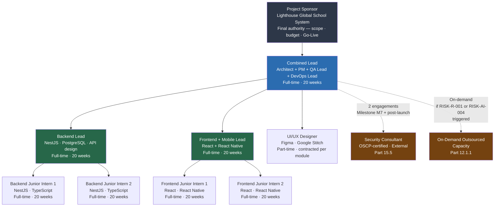

# PART 12 — RESOURCE PLAN
## P1 — Learning Management System + School Management System
### Layer 5 — Project & Financial

**Status:** 🟡 Content Complete — Layer Gate Not Yet Passed

*This Resource Plan reflects the client's explicit decision to cross-utilise roles for a lean permanent team, confirmed 2026-06-18, superseding the larger 16-role structure originally drafted. The decision and its accepted risks are logged in the Decision Log and carried forward into Part 16's Risk Register (Resource category) once that part is written.*

---

## 12.1 Team Structure

*Org chart below; reporting lines and on-demand/external engagement relationships are shown as dashed connectors.*

| Role | Reports To | Notes |
|---|---|---|
| Combined Lead (Solution Architect + Project Manager + QA Lead + DevOps Lead + BA liaison) | Client Sponsor | Single role covering 4 leadership functions per client decision (2026-06-18) |
| Backend Lead | Combined Lead | — |
| Junior Backend Intern (×2) | Backend Lead | — |
| Frontend Lead (Web + Mobile/React Native) | Combined Lead | Covers mobile per the Part 9.1 code-sharing rationale — confirmed by client to fold under this role rather than a separate mobile allocation |
| Junior Frontend/Mobile Intern (×2) | Frontend Lead | — |
| UI/UX Designer | Combined Lead | Part-time/contracted — confirmed by client to remain a dedicated (if part-time) function rather than be absorbed by the Frontend Lead |
| Security Consultant | Combined Lead | External/contracted, 2 engagements/year (Part 10.5) — confirmed by client to remain external regardless of the lean permanent team, given the compliance stakes in Part 3.5 |
| Outsourced/On-Demand Developers (Backend or Frontend, as needed) | Combined Lead | Engaged on demand rather than carried permanently — see Section 12.1.1 |

**Permanent full-time headcount: 7** (Combined Lead, Backend Lead, 2 Backend Interns, Frontend Lead, 2 Frontend/Mobile Interns), plus 2 part-time/contracted specialist roles (UI/UX, Security).

### 12.1.1 On-Demand Outsourced Capacity

This is a deliberate resourcing lever, not an informal fallback, engaged specifically when either of the two risks created by the lean structure above materialises:

| Trigger | Outsourced Response |
|---|---|
| Combined Lead is unavailable (leave, illness, overload across the 4 combined functions) | A contracted senior engineer or PM/QA specialist is engaged short-term to cover the specific function at risk (architecture review, sprint coordination, or QA sign-off), rather than letting all 4 functions stall simultaneously |
| Backend Lead + 2 interns, or Frontend Lead + 2 interns, fall behind the Part 14 timeline for a given module or phase | A contracted mid/senior engineer is engaged for the duration of that module's build to restore velocity, scoped to a single module rather than a standing headcount increase |
| A specialised skill gap emerges (e.g. a specific native-module bridging issue on the React Native proctoring screen, Part 9.1) | A contracted specialist is engaged for that specific technical problem only |

**This is the documented mitigation for the single-point-of-failure risk inherent in the Combined Lead role, and for the timeline risk inherent in running core development with 2 leads + 4 interns against the workload in Section 12.3.** Both risks are real and are not eliminated by this lever — engaging outsourced help takes lead time and isn't instantaneous — but the lever exists and is budgeted for in Part 13 rather than being an unplanned, ad hoc decision if and when the need arises.

## 12.2 Roles & Responsibilities

| Role | Responsibilities | Required Skills | Seniority | Allocation |
|---|---|---|---|---|
| Combined Lead | Architecture decisions (Part 8), schedule/stakeholder management, QA strategy and sign-off, DevOps/infrastructure ownership (Part 11), requirements liaison with client | AWS, microservices design, Agile delivery, Kubernetes, test strategy design | Senior | Full-time |
| Backend Lead | Implements and code-reviews the 9 services (Part 8.4) and API catalog (Part 9.4); tests own team's work given no separate QA execution role | NestJS, TypeScript, PostgreSQL, Prisma, Python/FastAPI familiarity for AI Quiz Service support | Senior | Full-time |
| Junior Backend Intern (×2) | Implements backend features under Backend Lead's direction and review; writes and executes tests for own work | TypeScript fundamentals, SQL fundamentals | Junior | Full-time |
| Frontend Lead | Implements and code-reviews the 100 screens (Part 7) across web and React Native mobile (including the native module bridge for proctoring, Part 9.1); tests own team's work | React, React Native, TypeScript, Redux Toolkit, basic Swift/Kotlin for the native bridge | Senior | Full-time |
| Junior Frontend/Mobile Intern (×2) | Implements frontend/mobile features under Frontend Lead's direction and review; writes and executes tests for own work | React fundamentals, TypeScript fundamentals | Junior | Full-time |
| UI/UX Designer | Produces wireframes and design assets for the 100 screens (Part 7), maintains the design system (Part 6.3), RTL layout design (Part 6.6) | Figma, responsive design, RTL/multilingual design experience | Mid-Senior | Part-time/contracted |
| Security Consultant | Conducts the penetration tests required by Part 10.5 | OWASP methodology, OSCP or equivalent | Senior | Contracted, 2 engagements/year |
| Outsourced Developer (on-demand) | Engaged per Section 12.1.1's triggers, scoped to a specific module or function | Matches the specific gap being filled | Mid-Senior | Contracted, as-needed |

## 12.3 Hours Matrix (Role × Module)

*Recomputed from the original 7-role breakdown to reflect the lean structure: QA execution hours are redistributed into Backend and Frontend proportionally to each module's existing backend/frontend split — "the team that builds a feature tests it" — rather than appearing as a separate QA column. Mobile hours are folded into Frontend per the client's confirmed decision. DevOps and Business Analyst hands-on hours are consolidated into the Lead column, distinct from the Lead's general architecture/PM/QA-strategy overhead, which remains a fixed cost in Part 13.3, not a per-module allocation. UI/UX hours are unchanged and now explicitly attributed to the contracted designer. Total hours are unchanged (4,278 → 4,281, difference is rounding only) — the lean structure changes who does the work and over what calendar time, not how much work exists.*

| ID | Module | Backend | Frontend (incl. Mobile) | UIUX | Lead | **Total** |
|---|---|---|---|---|---|---|
| M01 | Admissions | 101 | 115 | 14 | 10 | **240** |
| M02 | Live Online Classes | 138 | 185 | 19 | 38 | **380** |
| M03 | Assignment | 92 | 105 | 13 | 9 | **219** |
| M04 | Exam | 151 | 173 | 22 | 14 | **360** |
| M05 | Gradebook | 84 | 96 | 12 | 8 | **200** |
| M06 | Attendance | 63 | 72 | 9 | 6 | **150** |
| M07 | Timetable/Scheduling | 101 | 115 | 14 | 10 | **240** |
| M08 | Fee Management | 109 | 125 | 16 | 10 | **260** |
| M09 | Accounting | 183 | 130 | 17 | 10 | **340** |
| M10 | HR (Staff Management) | 86 | 61 | 8 | 5 | **160** |
| M11 | Payroll | 118 | 84 | 11 | 7 | **220** |
| M12 | Library Management | 59 | 67 | 8 | 6 | **140** |
| M13 | Communication | 76 | 87 | 11 | 7 | **181** |
| M14 | Psychological Assessment | 134 | 153 | 19 | 13 | **319** |
| M15 | Transport | 38 | 43 | 5 | 4 | **90** |
| M16 | Cognia Evidence Management | 54 | 38 | 5 | 3 | **100** |
| M17 | Platform & System Administration | 108 | 76 | 10 | 6 | **200** |
| M18 | User & Role Management | 118 | 84 | 11 | 7 | **220** |
| M19 | Reports & Analytics | 76 | 87 | 11 | 7 | **181** |
| M20 | Settings & Configuration | 44 | 31 | 4 | 2 | **81** |
| | **TOTAL** | **1933** | **1927** | **239** | **182** | **4281** |

**Effective capacity note:** the Backend column (1,933 hours) is delivered by 1 Backend Lead + 2 Junior Interns, and the Frontend column (1,927 hours) by 1 Frontend Lead + 2 Junior Interns. Junior interns typically operate at reduced effective velocity relative to a mid-level engineer, particularly in the first several months. Part 14's timeline must size sprint capacity against this reality, not against raw headcount — this is the direct, honest consequence of the cross-utilisation decision and is the basis for engaging Section 12.1.1's on-demand outsourced capacity if a module's build falls behind schedule.

## 12.4 Skill Requirements

| Role | Specific Required Skills | Minimum Proficiency |
|---|---|---|
| Combined Lead | AWS system design at 100,000-user scale (Part 10.2); Kubernetes/CI-CD ownership (Part 11); Agile delivery; test strategy design; requirements traceability | Verified via a system-design technical interview covering multi-service architecture at scale, plus reference checks confirming prior delivery of a comparable platform |
| Backend Lead | TypeScript 5.x, NestJS 10.x, Prisma ORM, PostgreSQL query optimisation (Part 9.2/9.3), working Python/FastAPI familiarity | Pass a live or take-home technical assessment covering service design, query optimisation, and code review of junior-written code; reference check confirming prior team-lead experience |
| Junior Backend Intern | TypeScript fundamentals, SQL fundamentals, willingness to work under close code review | Pass an entry-level TypeScript/SQL coding assessment administered by the Backend Lead |
| Frontend Lead | React 18+, TypeScript, Redux Toolkit, React Native including native module bridging in Swift and Kotlin (Part 9.1), Core Web Vitals optimisation (Part 10.6) | Pass a live coding assessment covering React/React Native architecture and the native module bridge pattern; portfolio review confirming at least one shipped React Native application |
| Junior Frontend/Mobile Intern | React fundamentals, TypeScript fundamentals, willingness to work under close code review | Pass an entry-level React/TypeScript coding assessment administered by the Frontend Lead |
| UI/UX Designer | Figma, WCAG 2.1 AA accessibility design, RTL layout design for Arabic/Urdu (Part 6.6) | Portfolio review confirming at least one shipped RTL or multilingual design project, reviewed and approved by the Combined Lead before contracting |
| Security Consultant | OWASP Top 10 penetration testing methodology (Part 9.6) | OSCP or equivalent industry certification; demonstrable prior penetration test reports |
| Outsourced Developer (on-demand) | Varies by engagement — matched to the specific module or skill gap triggering the engagement (Section 12.1.1) | Technical assessment matched to the specific skill gap being filled, administered by the Combined Lead before engagement |

---

*Lighthouse Global School System — P1 Master SRS — Part 12 — Layer 5 — Internal — v1.0*
