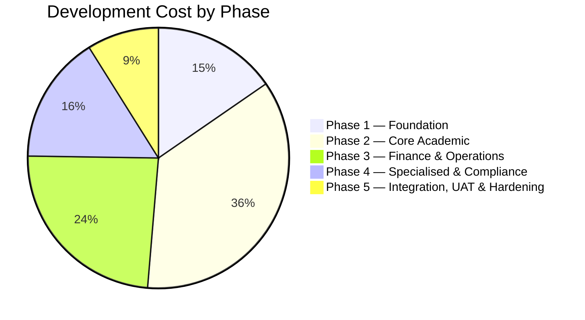
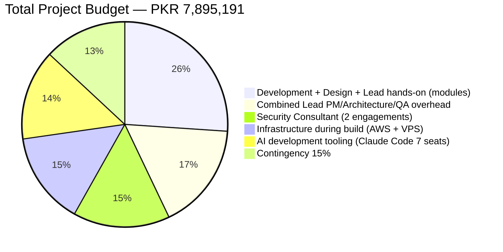

# PART 13 — BUDGET PLAN
## P1 — Learning Management System + School Management System
### Layer 5 — Project & Financial

**Status:** ✅ Content Complete — Concluded 2026-06-18 with detailed AI tooling pricing (Section 13.7)

*Revised 2026-06-18 per client direction: (1) labour rates restated in PKR against actual Pakistan IT market salaries, replacing the earlier international-remote-contractor-equivalent USD rates; (2) hours reduced to reflect AI-assisted development tooling (Claude Code, Codex-class assistants, Google Antigravity for backend/frontend implementation; Google Stitch and Claude-assisted design workflows for UI/UX) — applied as a stated, justified percentage reduction per role category, not an arbitrary cut; (3) resulting project duration recalculated from these adjusted hours rather than asserted, landing at ~20 weeks (~4.6 months) against the requested 5-month ceiling.*

## Costing Assumptions

| Assumption | Value | Basis |
|---|---|---|
| Combined Lead monthly salary | PKR 350,000 | Pakistan market rate for a senior combined Architect/PM/QA-Lead/DevOps-Lead role |
| Backend/Frontend Lead monthly salary | PKR 200,000 | Pakistan market rate, senior developer |
| Junior Intern monthly salary | PKR 50,000 | Pakistan market rate, junior/intern developer |
| Hourly conversion basis | ÷170 working hours/month | Standard full-time monthly-to-hourly conversion |
| Combined Lead hourly rate | PKR 2,059/hr | — |
| Backend/Frontend Lead hourly rate | PKR 1,176/hr | — |
| Junior Intern hourly rate | PKR 294/hr | — |
| Backend/Frontend blended rate | PKR 647/hr | 40% Lead + 60% the 2 Junior Interns, per Part 12's team mix |
| UI/UX Designer rate | PKR 700/hr | Part-time/contracted |
| Security Consultant | PKR 600,000/engagement | Flat per-engagement, 2 engagements (Part 10.5) |
| USD/PKR exchange rate | 278 | Current rate, June 2026 — used only to convert the USD-denominated AWS/cloud infrastructure line, since AWS bills in USD regardless of team location |

### AI-Assisted Development Productivity Adjustment

| Role Category | Hours Reduction | Justification |
|---|---|---|
| Backend implementation | 35% | Claude Code/Codex-class assistants materially accelerate CRUD service implementation, boilerplate API endpoints, and test-case generation — the bulk of the 9 services' implementation work (Part 8.4) |
| Frontend implementation | 35% | Same tooling class accelerates the templated majority of the 100 screens (Part 7); complex interactive screens (live class controls, exam proctoring UI) benefit less and are not assumed to compress as much, but the 35% figure is an aggregate across all screens, not a per-screen claim |
| UI/UX design | 30% | Google Stitch and AI-assisted design workflows accelerate templated/list/form screen layouts, which make up most of the 100 screens; RTL layout correctness and accessibility review (Part 6.5/6.6) still require human judgment and are not assumed to compress |
| Combined Lead — hands-on DevOps/BA work | 15% | Infrastructure-as-code and CI/CD pipeline scripting (Part 11.3) benefit from AI code assistance; requirements liaison and stakeholder communication do not, so a smaller reduction is applied here than to pure implementation roles |
| Combined Lead — PM/Architecture/QA-strategy overhead | 0% | Not reduced — architectural judgment, schedule management, and quality strategy are not accelerated by code-generation tooling |
| Phase 5 — Integration, UAT, Hardening | 15% only | Real-device testing, UAT scheduling, and penetration testing (Part 10.5) are not code-generation-bound and are not assumed to compress at the same rate as implementation work |

**This is a stated, bounded assumption, not a guarantee.** If the AI-assisted tooling underperforms this assumption on any given module — particularly the more novel, less-templated work such as the AI Quiz Service itself or the live-class proctoring screen — Section 12.1.1's on-demand outsourced capacity and this Part's 15% contingency (Section 13.6) are the funded mechanisms for absorbing that variance, not a silent schedule slip.

## 13.1 Cost per Module (AI-Adjusted Hours, PKR)

| ID | Module | Backend Hrs | Frontend Hrs | UI/UX Hrs | Lead Hrs | **Module Total (PKR)** |
|---|---|---|---|---|---|---|
| M01 | Admissions | 66 | 75 | 10 | 8 | PKR 114,699 |
| M02 | Live Online Classes | 90 | 120 | 13 | 32 | PKR 210,858 |
| M03 | Assignment | 60 | 68 | 9 | 8 | PKR 105,588 |
| M04 | Exam | 98 | 112 | 15 | 12 | PKR 171,078 |
| M05 | Gradebook | 55 | 62 | 8 | 7 | PKR 95,712 |
| M06 | Attendance | 41 | 47 | 6 | 5 | PKR 71,431 |
| M07 | Timetable/Scheduling | 66 | 75 | 10 | 8 | PKR 114,699 |
| M08 | Fee Management | 71 | 81 | 11 | 8 | PKR 122,516 |
| M09 | Accounting | 119 | 84 | 12 | 8 | PKR 156,213 |
| M10 | HR (Staff Management) | 56 | 40 | 6 | 4 | PKR 74,548 |
| M11 | Payroll | 77 | 55 | 8 | 6 | PKR 103,358 |
| M12 | Library Management | 38 | 44 | 6 | 5 | PKR 67,549 |
| M13 | Communication | 49 | 57 | 8 | 6 | PKR 86,536 |
| M14 | Psychological Assessment | 87 | 99 | 13 | 11 | PKR 152,091 |
| M15 | Transport | 25 | 28 | 4 | 3 | PKR 43,268 |
| M16 | Cognia Evidence Management | 35 | 25 | 4 | 3 | PKR 47,797 |
| M17 | Platform & System Administration | 70 | 49 | 7 | 5 | PKR 92,188 |
| M18 | User & Role Management | 77 | 55 | 8 | 6 | PKR 103,358 |
| M19 | Reports & Analytics | 49 | 57 | 8 | 6 | PKR 86,536 |
| M20 | Settings & Configuration | 29 | 20 | 3 | 2 | PKR 37,921 |
| | **TOTAL** | **1258** | **1253** | **169** | **153** | **PKR 2,057,944** |

(USD equivalent of module-level total: $7,403)

*Module-level total: PKR 2,057,944 (≈ \$7,403). This covers Backend, Frontend, UI/UX, and the Combined Lead's hands-on per-module work only — PM/Architecture/QA-strategy overhead, Security Consultant fees, and infrastructure are project-wide costs added in Section 13.3, not attributable to any single module.*

## 13.2 Cost per Phase & Revised Timeline

*Approximate cost weight by phase*

*Effective weekly capacity per discipline team is recalculated at 96 hours/week (1 Lead at 40 hrs + 2 Junior Interns, now assumed at 70% effective velocity rather than the original 60% — AI-assisted tooling closes part of the junior/senior productivity gap, not just the senior's own output). Phase durations below are computed directly from the AI-adjusted hours against this capacity, not asserted.*

| Phase | Modules | Backend Hrs (AI-adj.) | Frontend Hrs (AI-adj.) | Duration |
|---|---|---|---|---|
| Phase 1 — Foundation & Platform Core | M17, M18, M20 | 176 | 124 | 1.8 weeks |
| Phase 2 — Core Academic | M01-M07 | 476 | 559 | 5.8 weeks |
| Phase 3 — Finance & Operations | M08, M09, M10, M11, M12, M15 | 386 | 332 | 4.0 weeks |
| Phase 4 — Specialised & Compliance | M13, M14, M16, M19 | 220 | 238 | 2.5 weeks |
| **Subtotal — Development Phases** | | | | **14.2 weeks** |
| Phase 5 — Integration, UAT & Hardening | All (cross-cutting) | — | — | 5.1 weeks (15% reduction only, per the AI-adjustment table above) |
| **Total estimated duration** | | | | **~19.3 weeks** |
| **Budgeted duration (with schedule buffer)** | | | | **20 weeks (≈4.6 months)** — 1.6 weeks of buffer against the requested 5-month ceiling |

## 13.3 Total Project Budget

*Visual budget distribution — see table below for exact figures*

| Category | Cost (PKR) | USD Equivalent | Source |
|---|---|---|---|
| Development + Design + Lead hands-on (all modules) | PKR 2,057,944 | \$7,403 | Section 13.1 |
| Combined Lead — PM/Architecture/QA-strategy overhead | PKR 1,332,173 | \$4,792 | 647 hrs (800 hrs full-time capacity over 20 weeks, minus the 153 hrs already counted in 13.1) at PKR 2,059/hr |
| Security Consultant (2 engagements) | PKR 1,200,000 | \$4,317 | Part 10.5 cadence |
| Infrastructure during build (Dev/QA VPS + UAT/Production AWS ramp-up, USD-denominated) | PKR 1,151,710 | \$4,143 | Section 13.5 — converted at 278 PKR/USD |
| AI development tooling (Claude Code, Team Premium, 7 seats, full build duration) | PKR 1,123,557 | \$4,042 | Section 13.7 — USD-denominated, converted at 278 PKR/USD |
| **Subtotal** | **PKR 6,865,384** | **\$24,696** | |
| Contingency (15%) | PKR 1,029,808 | \$3,704 | Section 13.6 |
| **TOTAL PROJECT BUDGET** | **PKR 7,895,191** | **≈ \$28,400** | |

*The USD column is shown for reference only, since the AWS infrastructure line is genuinely USD-denominated and will appear on an AWS invoice in USD regardless of where the team is based. The PKR total is the operative figure for all labour-cost budgeting and client invoicing.*

## 13.4 Operational Costs (Post-Launch, Monthly)

| Cost Category | Monthly Estimate (Launch Scale) | Basis |
|---|---|---|
| AWS — Production infrastructure | \$2,300 (≈ PKR 639,400) | Part 11.1 Launch-scale sizing — **estimate pending verification against the AWS Pricing Calculator for the me-central-1 region specifically before final sign-off** |
| AI API costs (LLM usage, AI Quiz Service) | \$21-84 (≈ PKR 5,800-23,400) | Section 13.7 — precise per-token calculation, not a flat guess; range reflects moderate vs. heavy adoption |
| Third-party integrations (SMS/email/WhatsApp gateway fees) | \$150 (≈ PKR 41,700) | Usage-based, scales with school count and notification volume |
| Payment gateway fees | Transaction-based, not flat monthly | Stripe/PayPal/JazzCash/Easypaisa each charge per-transaction — a pass-through cost tied to fee collection volume, not a platform operating cost |
| SaaS tooling (CI/CD, monitoring add-ons, project management) | \$200 (≈ PKR 55,600) | Section 13.5 |
| Security Consultant (amortised) | PKR 100,000 | PKR 600,000 per engagement × 2/year ÷ 12 months |
| **Total estimated monthly OpEx (Launch scale)** | **≈ \$2,671-2,734 + PKR 100,000 ≈ PKR 842,500-860,000/month total** | Scales upward at Year 1 and Year 3 per the sizing progression in Part 11.1 and Part 10.2 |

## 13.5 Licence & Infrastructure Costs (Itemised)

| Item | Type | Cost |
|---|---|---|
| AWS (Production + UAT) | Cloud infrastructure | Per Section 13.4 — USD-denominated regardless of team location |
| DigitalOcean or Hetzner (Dev + QA) | Self-managed VPS | ~\$150/month combined during active development (Part 11.1) |
| GitHub (or equivalent) | SaaS — source control, CI/CD runners | ~\$50/month |
| Project management tooling (e.g. Jira/Linear) | SaaS | ~\$50/month |
| Figma | SaaS — UI/UX Designer's primary tool | ~\$20/month, single seat |
| Google Stitch / AI design tooling | SaaS | Cost depends on final tool selection — to be confirmed before Phase 1 |
| Claude Code / Codex-class AI coding assistant seats | SaaS, per-developer | Cost depends on final tool and seat count selection — to be confirmed before Phase 1; this is the line item underwriting the productivity assumption in this Part's AI-Adjustment table, and should be budgeted explicitly rather than assumed free |
| Monitoring add-ons beyond native CloudWatch (if adopted) | SaaS | ~\$80/month — optional |
| OSCP-certified Security Consultant | Contracted service | PKR 600,000/engagement, 2/year (Part 10.5) |
| No off-the-shelf platform licence costs | — | Per Part 8.1, no platform was adopted; Jitsi (self-hosted, Part 1 scope lock) carries no licence fee |

## 13.6 Contingency

**15% applied to the pre-contingency subtotal.**

**Justification:** the AI-tooling productivity adjustment in this Part's opening section is itself a contingency-relevant risk, not just a cost-saving assumption — it is a stated bound (35%/30%/15% reductions by role), and the actual realised productivity gain on any given module may land below it, particularly on less-templated work such as the AI Quiz Service or the live-class proctoring screen's native module bridge (Part 9.1). Beyond that, the same three factors from the original contingency justification still apply: the JazzCash/Easypaisa custom payment connector work (Part 8.1, Part 8.5), the inherent estimation variance of the AI Quiz Service as a genuinely novel integration, and the lean team structure's timeline risk (Part 12.1.1). The 15% figure is the funded counterpart to Section 12.1.1's on-demand outsourced capacity lever — it exists so that lever can actually be engaged if any of these risks materialises, rather than being a documented mitigation with no budget behind it.

## 13.7 AI Tooling — Development and Runtime Costs (Detailed Pricing)

*This section prices every AI tool named for this project, distinguishing development-time tooling (used by the team to build faster, costed into Section 13.3) from runtime tooling (used by the live product, costed into Section 13.4). All prices below are verified against current vendor pricing as of June 2026, not estimated.*

### AI-Assisted Coding Tools (Development-Time)

| Tool | Current Pricing | Assessment for This Project |
|---|---|---|
| **Claude Code (Anthropic) — PRIMARY RECOMMENDATION** | Pro: \$20/seat/month. Max 5x: \$100/seat/month. Max 20x: \$200/seat/month. **Team Premium: \$100-125/seat/month, minimum 5 seats, includes centralized billing and admin controls.** | Recommended for all 7 hands-on roles (Backend Lead + 2 Interns, Frontend Lead + 2 Interns, Combined Lead's hands-on DevOps/IaC work) via **Team Premium**, given centralized billing is appropriate for a contracted client engagement. Budgeted at \$125/seat (upper end of the cited range, for budget conservatism) — see Section 13.3. |
| OpenAI Codex | Included in ChatGPT Plus (\$20/month) or ChatGPT Pro (\$200/month); API pay-per-token also available (\$1.50/1M input, \$6.00/1M output tokens) | Evaluated as a supplementary option, not budgeted into the primary total — adding a second full coding-agent subscription per developer on top of Claude Code would be redundant spend for largely overlapping capability. If the team wants Codex specifically for its cloud-sandboxed parallel-task workflow, the cheapest path is a \$20/month ChatGPT Plus seat per developer who wants it, added individually rather than team-wide. |
| Google Antigravity | Free tier available. AI Pro: ~\$20-22/month. AI Ultra: ~\$100/month (5x). AI Ultra Max: ~\$200/month (20x). | **Not recommended as a primary dependency.** Independent reviews through June 2026 consistently report an opaque, quota-based credit system and multi-day usage lockouts mid-session for paid users — a real reliability risk for a project on a fixed 20-week timeline. Antigravity's free tier is reasonable to let individual developers experiment with, but the project should not depend on it for committed delivery work. |

### AI-Assisted Design Tools (Development-Time)

| Tool | Current Pricing | Assessment for This Project |
|---|---|---|
| **Google Stitch — currently free** | \$0/month — Google Labs beta, 350 Standard + 200 Pro generations/month, no paid tier exists yet | Usable now at zero cost for templated/list/form screen generation (the majority of the 100 screens, Part 7). **Real risk, not hypothetical:** industry analysts expect Stitch to exit Google Labs and introduce paid tiers as early as Q4 2026 — within this project's build window if the timeline slips. Budgeted at \$0 since that is the current, verified price; if Stitch introduces paid tiers mid-build, the resulting cost is exactly the kind of variance this Part's 15% contingency (Section 13.6) exists to absorb. |
| Claude Design (Anthropic) | Bundled within Claude Pro and above (Pro+) — no separate fee | Already covered by the Claude Code Team Premium seats budgeted above; no additional line item needed. |

### AI Quiz Service — Runtime API Cost (Production, Post-Launch)

| Element | Value |
|---|---|
| Model | Claude Sonnet 4.6 (Part 8.8's provider-agnostic layer also supports OpenAI/Gemini at comparable rates) |
| Token rate | \$3/million input tokens, \$15/million output tokens |
| Assumed tokens per batch of 10 questions | ~8,000 input (syllabus context + prompt), ~4,000 output |
| Cost per batch of 10 questions | **\$0.084** |
| Moderate adoption (50 teachers × 5 batches/month = 250 batches/month) | **\$21/month** (≈ PKR 5,800) |
| Heavy adoption (200 teachers × 5 batches/month = 1,000 batches/month) | **\$84/month** (≈ PKR 23,400) |

This replaces the earlier flat \$100/month placeholder in Section 13.4 with an actual per-token calculation — the real cost is lower than originally estimated and scales transparently with adoption, not a fixed guess.

---

*Lighthouse Global School System — P1 Master SRS — Part 13 — Layer 5 — Internal — v1.0*
