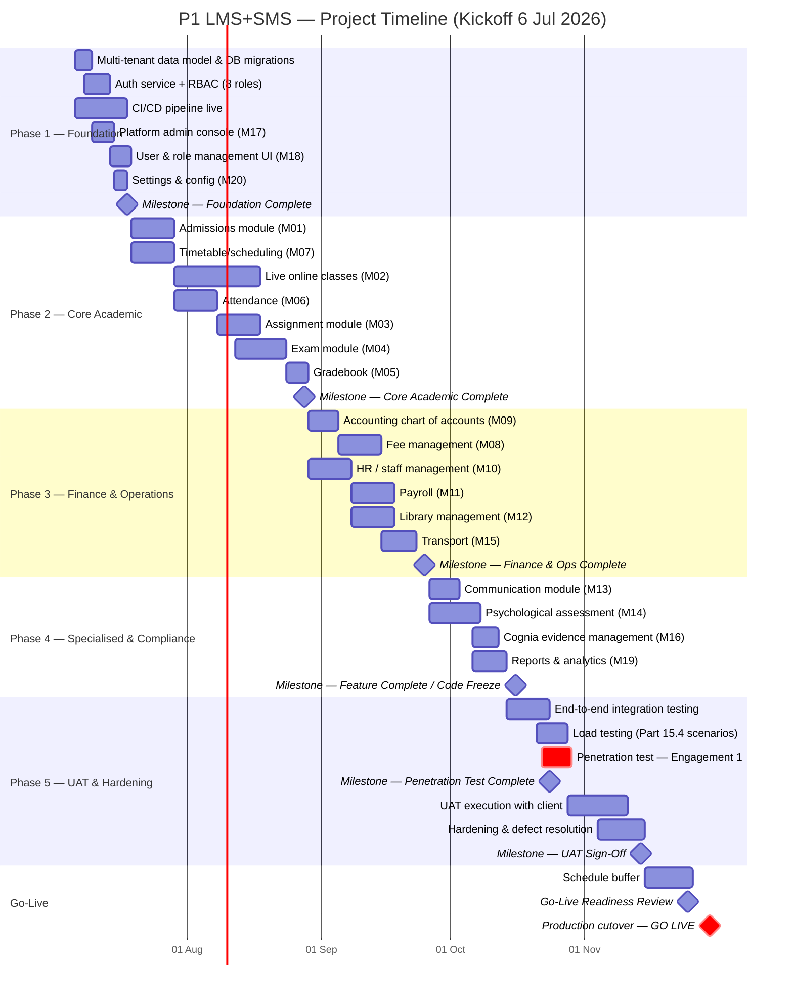
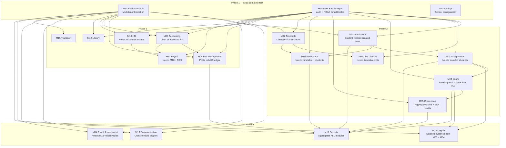
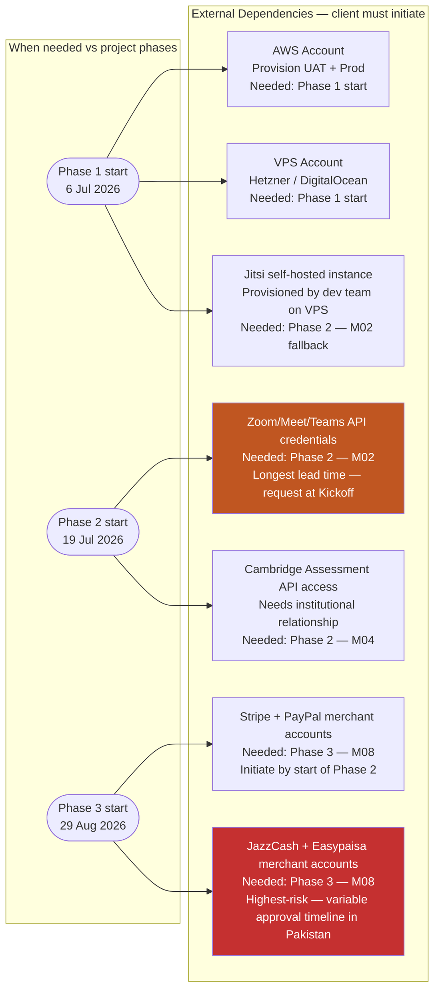

# PART 14 — PROJECT TIMELINE
## P1 — Learning Management System + School Management System
### Layer 5 — Project & Financial

**Status:** 🟡 Content Complete — Layer Gate Not Yet Passed

*All dates assume project kickoff on Monday, 6 July 2026, immediately following Scope Lock Agreement signature — if signature is delayed, every date below shifts by the same number of days, but phase durations and the critical path are unaffected.*

---

## 14.1 Development Phases

| Phase | Objectives | Key Deliverables | Duration |
|---|---|---|---|
| Phase 1 — Foundation & Platform Core | Stand up multi-tenant infrastructure, authentication, RBAC, and core platform settings before any feature work depends on them | Working auth/RBAC across all 8 roles (Part 2.4); tenant isolation enforced (Part 8.6); CI/CD pipeline live (Part 11.3) | 1.8 weeks |
| Phase 2 — Core Academic | Deliver the modules that define the product's primary value: admissions through to live classes, assignments, exams, gradebook, attendance, timetable | M01, M02, M03, M04, M05, M06, M07 functionally complete and unit-tested | 5.8 weeks |
| Phase 3 — Finance & Operations | Deliver fee collection, accounting, HR/payroll, library, and transport — the operational backbone schools need beyond pure academics | M08, M09, M10, M11, M12, M15 functionally complete and unit-tested | 4.0 weeks |
| Phase 4 — Specialised & Compliance | Deliver communication, psychological assessment, Cognia evidence management, and reporting — the modules with the most sensitive data handling and the most specialised review needs | M13, M14, M16, M19 functionally complete and unit-tested | 2.5 weeks |
| Phase 5 — Integration, UAT & Hardening | Integrate all modules end-to-end, run the full test strategy (Part 15), conduct the first Security Consultant penetration test (Part 10.5), and complete client UAT sign-off | Signed UAT acceptance (Part 15.3); first penetration test report; all Part 10 NFR targets verified under load | 5.1 weeks |
| Schedule Buffer | Absorb variance against the AI-tooling productivity assumption (Part 13, AI-Adjustment table) and any on-demand outsourced capacity lead time (Part 12.1.1) | — | 1.6 weeks |

## 14.2 Milestone Schedule

| Milestone | Deliverable | Target Date | Owner | Acceptance Criteria |
|---|---|---|---|---|
| M1 — Kickoff | Scope Lock signed, team onboarded, AWS/VPS accounts provisioned | 6 Jul 2026 | Combined Lead | Scope Lock Agreement signature on file; all 9 third-party integration accounts (Part 9.5) requested |
| M2 — Foundation Complete | Phase 1 deliverables live in Dev/QA | 18 Jul 2026 | Combined Lead | Auth/RBAC test suite passes for all 8 roles; tenant isolation verified via penetration-style query test (Part 8.6) |
| M3 — Core Academic Complete | Phase 2 deliverables live in QA | 28 Aug 2026 | Backend Lead, Frontend Lead | All M01-M07 acceptance criteria from Part 4 pass in QA |
| M4 — Finance & Operations Complete | Phase 3 deliverables live in QA | 25 Sep 2026 | Backend Lead, Frontend Lead | All M08-M12, M15 acceptance criteria from Part 4 pass in QA; double-entry ledger balance constraint (Part 9.3.4) verified |
| M5 — Specialised & Compliance Complete | Phase 4 deliverables live in QA | 13 Oct 2026 | Backend Lead, Frontend Lead | All M13, M14, M16, M19 acceptance criteria pass; BR-031/032 visibility rules verified via role-matrix test (Part 9.4.3) |
| M6 — Feature Complete / Code Freeze | All 20 modules merged to `main`, deployed to UAT | 16 Oct 2026 | Combined Lead | UAT environment matches Part 11.2's data policy; no open Sev-1/Sev-2 defects |
| M7 — First Penetration Test | Security Consultant engagement #1 complete | 24 Oct 2026 | Security Consultant | Penetration test report delivered; all critical/high findings remediated before UAT sign-off |
| M8 — UAT Sign-Off | Client acceptance of UAT (Part 15.3) | 14 Nov 2026 | Project Sponsor (client) | Signed UAT acceptance document; all acceptance criteria in Part 15.7's matrix marked pass |
| M9 — Go-Live Readiness Review | Pre-launch checklist (Section 14.6) complete | 25 Nov 2026 | Combined Lead | Every item in Section 14.6's checklist checked off |
| M10 — Go-Live | Production cutover | 30 Nov 2026 | Combined Lead | Production environment serving live traffic; rollback plan (Section 14.6) on standby for 72 hours |

## 14.3 Gantt Chart

 (Task-Level Specification)

*The Gantt chart below renders the full task-level breakdown — each task's owner and duration trace directly to Part 12's hours matrix, distributed across the phase's calendar window in build order (foundational tasks within a phase first, integration tasks last).*

| Phase | Task | Owner | Duration (within phase) | Depends On |
|---|---|---|---|---|
| Phase 1 | Multi-tenant data model & migrations | Backend Lead | Days 1-4 | AWS account provisioned (M1) |
| Phase 1 | Auth service + RBAC (8 roles) | Backend Lead + 1 Intern | Days 3-8 | Multi-tenant data model |
| Phase 1 | Platform admin console (M17) | Frontend Lead + 1 Intern | Days 5-10 | Auth service |
| Phase 1 | User & role management UI (M18) | Frontend Lead + 1 Intern | Days 6-11 | Auth service |
| Phase 1 | Settings & configuration (M20) | Backend Intern + Frontend Intern | Days 9-12 | Platform admin console |
| Phase 1 | CI/CD pipeline live | Combined Lead | Days 1-12 (parallel) | AWS + VPS accounts provisioned |
| Phase 2 | Admissions (M01) | Backend Lead + Frontend Lead (shared) | Weeks 1-2 of phase | RBAC live |
| Phase 2 | Timetable/Scheduling (M07) | Backend + Frontend Interns | Weeks 1-2 of phase | Admissions (section/class structure) |
| Phase 2 | Live Online Classes (M02) | Frontend Lead (RN bridge) + Backend Lead | Weeks 2-4 of phase | Timetable; Zoom/Meet/Teams API credentials (external dependency, Section 14.5) |
| Phase 2 | Attendance (M06) | Backend + Frontend Interns | Weeks 2-3 of phase | Timetable |
| Phase 2 | Assignment (M03) | Backend Lead + Frontend Intern | Weeks 3-4 of phase | Admissions |
| Phase 2 | Exam (M04) | Backend Lead + Frontend Lead | Weeks 4-5 of phase | Assignment (shared question-bank infrastructure); Cambridge Assessment API access (external dependency) |
| Phase 2 | Gradebook (M05) | Backend Intern + Frontend Intern | Weeks 5-6 of phase | Exam (grade calculation depends on exam results) |
| Phase 3 | Accounting (M09) — chart of accounts first | Backend Lead | Week 1 of phase | Phase 1 complete |
| Phase 3 | Fee Management (M08) | Backend Lead + Frontend Lead | Weeks 1-2 of phase | Accounting's chart of accounts must exist first |
| Phase 3 | HR / Staff Management (M10) | Backend Intern | Weeks 1-2 of phase | User & role management (M18) |
| Phase 3 | Payroll (M11) | Backend Lead + Backend Intern | Weeks 2-3 of phase | HR (staff records); Accounting (ledger posting) |
| Phase 3 | Library Management (M12) | Frontend Intern | Weeks 2-3 of phase | Admissions (student records) |
| Phase 3 | Transport (M15) | Backend Intern + Frontend Intern | Weeks 3-4 of phase | Admissions (student records) |
| Phase 4 | Communication (M13) | Backend + Frontend Interns | Week 1 of phase | All prior modules (cross-cutting notification triggers) |
| Phase 4 | Psychological Assessment (M14) | Backend Lead + Frontend Lead | Weeks 1-2 of phase | User & role management (visibility rules, BR-031/032) |
| Phase 4 | Cognia Evidence Management (M16) | Backend Intern | Week 2 of phase | Assignment, Exam (evidence sources) |
| Phase 4 | Reports & Analytics (M19) | Frontend Lead + Backend Lead | Weeks 2-3 of phase | All other modules (aggregates their data) |
| Phase 5 | End-to-end integration testing | Full team | Week 1-2 of phase | Code freeze (M6) |
| Phase 5 | Load testing against Part 10.2 targets | Backend Lead | Week 2 of phase | Integration testing |
| Phase 5 | First penetration test | Security Consultant | Week 2-3 of phase (M7) | Code freeze |
| Phase 5 | UAT execution with client | Full team + Project Sponsor | Week 3-4 of phase | Penetration test findings remediated |
| Phase 5 | Hardening & defect resolution | Full team | Week 4-5 of phase | UAT findings |

## 14.4 Critical Path

**The entire Phase 1 → Phase 2 → Phase 3 → Phase 4 → Phase 5 chain is the critical path.** This is a direct consequence of the lean team structure confirmed in Part 12 (DEC-P1-029): with only one Backend Lead, one Frontend Lead, and two Junior Interns per discipline, the team has no spare parallel capacity to run two phases simultaneously. Every phase's start date depends on the prior phase's completion, and there is no slack to absorb — a delay in any single phase pushes Go-Live by the same number of days, with no internal parallelism available to claw the time back.

This is precisely the scenario Section 12.1.1's on-demand outsourced capacity was designed to fund. If any phase is at risk of slipping — most likely Phase 2 (the largest, at 5.8 weeks) or Phase 5 (penetration test findings and UAT feedback are inherently unpredictable in volume) — engaging outsourced capacity to run a deprioritised module in parallel (e.g., Library Management or Transport, both relatively self-contained and low-dependency per Section 14.5) is the only lever available to recover schedule without simply extending the Go-Live date. This lever is funded by Part 13.6's 15% contingency, not assumed to be free.

## 14.5 Dependencies Map

*Internal module dependencies*

*External third-party account/credential dependencies*

### Internal Dependencies

| Dependent Module | Depends On | Why |
|---|---|---|
| Nearly all modules (M01-M16, M19) | M18 — User & Role Management | Every screen's visibility and every API endpoint's authorization (Part 9.4) checks against the role model established in M18; building any feature module before this exists means re-work |
| Nearly all modules | M17 — Platform & System Administration | Multi-tenant isolation (Part 8.6) is enforced at the platform layer; feature modules assume this boundary already exists |
| M08 — Fee Management | M09 — Accounting | Fee Management posts every collected payment to a ledger account; that chart of accounts must exist before Fee Management's posting logic can be built or tested |
| M11 — Payroll | M10 — HR (Staff Management), M09 — Accounting | Payroll calculates against staff records (M10) and posts to the same ledger (M09) |
| M05 — Gradebook | M04 — Exam | Final grades are computed from exam results; Gradebook cannot be meaningfully tested without Exam data flowing into it |
| M19 — Reports & Analytics | All other modules | Reports aggregate data produced by every other module — this is why it sits last in Phase 4 |
| M14 — Psychological Assessment | M18 — User & Role Management | The BR-031/032 visibility rules restricting assessment data to specific roles cannot be implemented before the role model exists |

### External Dependencies

| Dependency | Required Before | Owner of the Request |
|---|---|---|
| AWS account provisioning (Production + UAT) | Phase 1 start | Combined Lead — must be requested at Kickoff (M1) |
| DigitalOcean/Hetzner VPS provisioning (Dev/QA) | Phase 1 start | Combined Lead |
| Zoom/Google Meet/Microsoft Teams API credentials (Part 9.5) | M02 — Live Online Classes (Phase 2) | Combined Lead, requested from client's preferred conferencing vendor at Kickoff — this is the longest-lead external dependency and should be requested first |
| Cambridge Assessment API access (Part 9.5) | M04 — Exam (Phase 2) | Combined Lead, requires the client's existing Cambridge institutional relationship to sponsor API access |
| Stripe / PayPal merchant accounts | M08 — Fee Management (Phase 3) | Client (Project Sponsor) — merchant account approval is outside the development team's control and should be initiated no later than the start of Phase 2 to avoid blocking Phase 3 |
| JazzCash / Easypaisa merchant accounts | M08 — Fee Management (Phase 3) | Client (Project Sponsor) — same lead-time risk as above; local payment gateway onboarding in Pakistan has historically variable approval timelines and is the single external dependency most likely to threaten Phase 3's start date |
| Jitsi self-hosted instance provisioning | M02 — Live Online Classes (Phase 2) | Combined Lead — provisioned alongside AWS infrastructure, no external vendor dependency since this is self-hosted (Part 1 scope lock) |

**The JazzCash/Easypaisa and Stripe/PayPal merchant account approvals are flagged as the highest-risk external dependency on this entire timeline** — they are the one dependency the development team cannot accelerate by working harder or engaging outsourced capacity, since approval timelines are set by the payment processors and (for the local gateways) Pakistani banking partners, not by this project. This should be carried into Part 16's Risk Register as a schedule risk requiring the client to initiate applications at or before Kickoff, not at the start of Phase 3 when the team is ready to build against them.

## 14.6 Go-Live Plan

### Pre-Launch Checklist

| Item | Verified Against |
|---|---|
| First penetration test passed, critical/high findings remediated | Milestone M7, Part 10.5 |
| UAT signed off by client | Milestone M8, Part 15.3 |
| Backup and restore procedure tested end-to-end (not just configured) | Part 11.6 |
| DNS and SSL/TLS certificates configured for production domain | Part 11.1 |
| Monitoring and alerting live and verified against Part 11.5's tiers | Part 11.5 |
| Support runbooks written and handed to the Combined Lead's on-call rotation | Part 11.5 |
| Production AWS environment matches the sizing specified for Launch scale (2,000 concurrent users) | Part 10.2, Part 11.1 |
| All NFR targets from Part 10 verified under production-equivalent load, not just in QA | Part 10.2, Section 14.3's load testing task |

### Data Migration Plan

Lighthouse's founding-cohort student, staff, and fee data is migrated using the platform's own bulk-import tooling — specifically the `/users/bulk-import` endpoint and the Admissions module's bulk student-import capability (Part 9.4) — rather than a separate one-off migration script. This is a deliberate choice: it exercises the same validation, duplicate-detection, and error-reporting logic that the platform will later use for every subsequent school onboarding, so the migration doubles as the first real-world test of that capability rather than being throwaway work.

The migration runs in three passes during Phase 5's hardening window, each validated against the source data before proceeding: (1) staff and role assignments, since nearly every other record references a staff member as creator or assignee; (2) student and guardian records via Admissions' bulk import; (3) historical fee ledger opening balances via Accounting's chart of accounts, so Fee Management starts from accurate balances rather than zero.

### Cutover Procedure

1. Final data migration pass completed and validated against the source system, no later than 48 hours before the Go-Live date.
2. DNS cutover to the production environment, performed during Lighthouse's lowest-traffic window (outside school hours, per the client's academic calendar).
3. Monitoring intensified to the highest alert tier (Part 11.5) for the first 48-72 hours post-cutover — the Combined Lead and Backend Lead are both on active call during this window, not just on standby.
4. Smoke test of the critical paths (login across all 8 roles, fee payment, exam submission) executed immediately after DNS propagation completes, before the cutover is declared successful.

### Rollback Plan

If a critical (Sev-1) issue is identified within the first 72 hours that cannot be hotfixed within 2 hours, the rollback procedure is: (1) revert DNS to point back at the pre-cutover environment; (2) restore the production database from the pre-cutover snapshot taken immediately before the cutover began, following Part 11.6's restoration procedure; (3) notify the client of the rollback and the revised Go-Live date before re-attempting cutover. This plan deliberately does not promise zero data loss for any transactions accepted between cutover and rollback — that gap is the reason the smoke test in the Cutover Procedure happens immediately, before real user traffic is assumed to be flowing.

---

*Lighthouse Global School System — P1 Master SRS — Part 14 — Layer 5 — Internal — v1.0*
