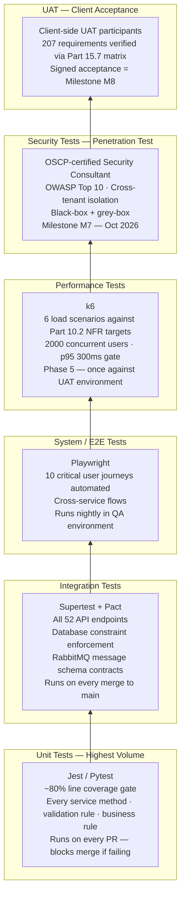

# PART 15 — TESTING & QA PLAN
## P1 — Learning Management System + School Management System
### Layer 5 — Project & Financial

**Status:** ✅ Content Complete

---

## 15.1 Testing Strategy

The testing strategy follows a standard pyramid: the highest volume of tests at the unit layer (fast, cheap, automated), a smaller but comprehensive set at the integration layer (verifying service contracts and database constraints), system-level tests covering critical user paths end-to-end, and UAT as the final human-verified acceptance gate before Go-Live.

Given the lean team structure (Part 12), QA execution is distributed across the developers who build each module — there is no dedicated QA role separate from the Combined Lead's QA-strategy responsibility. The Combined Lead writes and maintains the acceptance criteria and the test case library (Appendix E); Backend and Frontend Leads write and maintain the unit and integration tests for the modules they build. This is a stated, acknowledged trade-off (DEC-P1-029), not an oversight. The 15% contingency (Part 13.6) and the on-demand outsourced capacity lever (Part 12.1.1) exist precisely because this structure reduces test independence.

*Testing pyramid — coverage and ownership at each layer*

| Test Layer | Scope | Who Executes | When | Target Coverage |
|---|---|---|---|---|
| Unit | Individual functions, service methods, validation rules, business rules from Part 4 | Developer who wrote the code | Continuous — every PR | ≥ 80% line coverage per service |
| Integration | API endpoint contracts, database constraint enforcement, cross-service message flows via RabbitMQ (Part 9.2) | Backend Lead | End of each Phase within Phase 5's integration window | All 45 endpoints in Part 9.4's catalog covered |
| System / E2E | Critical user journeys per Part 2.3 (student submits assignment, parent pays fee, teacher marks attendance, admin generates report card) | Frontend Lead (automated via Playwright) + Combined Lead (manual exploratory) | Phase 5 weeks 1-2 | All 10 user journeys from Part 2.3 automated |
| Performance | Load targets from Part 10.2 (2,000 concurrent users at launch, API p95 < 300ms, video latency < 500ms) | Backend Lead (k6) | Phase 5 week 2 | All 6 NFR categories from Part 10 verified |
| Security | OWASP Top 10 (Part 9.6), penetration test against production-equivalent environment | Security Consultant (engagement #1, Part 10.5) | Phase 5 weeks 2-3 (Milestone M7) | Full OWASP Top 10; all critical/high findings remediated before UAT |
| UAT | Acceptance against Part 15.7's criteria matrix, using real Lighthouse data | Client (Project Sponsor) + representative teachers/parents/students | Phase 5 weeks 3-4 (Milestone M8) | 100% of Part 15.7's criteria marked pass |
| Regression | Re-run of unit + integration + E2E suite after each defect fix during Phase 5 hardening | Automated CI/CD (Part 11.3) | After every merge to `main` during Phase 5 | Zero Sev-1/Sev-2 regressions introduced by fixes |

## 15.2 Test Types & Coverage

### Unit Testing

| Element | Specification |
|---|---|
| Framework | Jest (TypeScript services, Part 9.1/9.2); Pytest (Python FastAPI AI service, Part 9.2) |
| Minimum coverage gate | 80% line coverage — enforced as a CI/CD pipeline gate (Part 11.3); PRs failing this gate are blocked from merge |
| What is tested | Service-layer business logic, validation rule enforcement (Part 4's Validation Rules tables per module), business rule enforcement (Part 4's Business Rules per module), edge cases flagged in Part 4's Edge Cases tables |
| What is not tested at unit level | Database query results (that is an integration test concern), UI rendering (that is an E2E concern), infrastructure (that is a smoke test concern) |

### Integration Testing

| Element | Specification |
|---|---|
| Framework | Supertest (REST API endpoint testing against a test database instance) |
| Database state | Each integration test run provisions a fresh test schema, seeds with the minimum required reference data, and tears down after the run — no shared mutable state between test runs |
| Scope per module | Every endpoint in Part 9.4's catalog: verify correct response schema, correct HTTP status codes, correct error responses against Part 9.4's error code matrix, correct RBAC enforcement (a request carrying a role that lacks permission must receive HTTP 403, not 200 with empty data) |
| Contract testing | Each RabbitMQ message schema (Part 9.2) is tested as a producer-consumer pair — the publishing service and the consuming service must agree on the schema, verified via Pact |

### System / End-to-End Testing

| Journey | Scenario Covered |
|---|---|
| Student submits assignment | Student logs in → navigates to assignment → uploads file → submits → receives confirmation timestamp |
| Teacher grades and returns assignment | Teacher opens submission queue → annotates submission → enters grade via rubric → publishes feedback → student receives notification |
| Parent pays outstanding fee | Parent logs in → views outstanding balance → clicks Pay → completes Stripe/JazzCash payment → receipt generated |
| Admin generates report card | Admin selects class → triggers report card generation → PDF generated for all students → distributed to parent portal |
| Teacher marks daily attendance | Teacher opens today's register → marks all present → marks 2 exceptions → submits → parent of absent student receives auto-SMS |
| Student takes exam | Student joins exam → completes all questions under proctoring → submits → auto-graded MCQ results appear immediately |
| Psychologist assigns and student views action plan | Psychologist creates action plan → sets visibility → student sees goals tab in portal → marks milestone complete |
| School admin onboards a new student | Admin uploads CSV → validation errors shown for malformed rows → corrected rows committed → new student accounts created with welcome emails |
| Teacher schedules and launches live class | Teacher creates class → recurrence set → students receive reminder → teacher starts class → students join → attendance auto-marked |
| Super admin creates a new school tenant | Super admin creates school → assigns plan → school admin account provisioned → school admin logs in to isolated tenant |

### Performance Testing

Tooling: k6 (load generation), CloudWatch (metrics collection), Grafana (results visualisation). Test scenarios are derived directly from Part 10.2's scalability targets — these are not aspirational; they are pass/fail gates.

| Scenario | Simulated Load | Pass Criterion |
|---|---|---|
| Concurrent API users (launch scale) | 2,000 concurrent users, 10-minute sustained | API p95 response < 300ms (Part 10.1); error rate < 0.1% |
| Fee payment burst (month-end collection) | 500 simultaneous payment initiations | Payment service p95 < 300ms; zero failed transactions attributable to platform (not payment gateway) |
| Live class join surge | 300 students joining the same class within 2 minutes | WebRTC/SFU signalling p95 < 500ms (Part 10.1); no participant ejected due to server overload |
| Exam concurrent submission | 200 students submitting exam answers simultaneously | Auto-grade response < 2 seconds; no answer lost |
| Report card generation bulk | Admin generates PDFs for 500 students simultaneously | All PDFs generated within 5 minutes; no timeout errors |
| Database read replica load | 2,000 concurrent read queries across replicas | p95 DB query time < 100ms (Part 10.1) |

## 15.3 UAT Plan

### UAT Participants

| Role | Responsibility |
|---|---|
| Project Sponsor (client-side) | Final sign-off authority; reviews summary results and signs Milestone M8 acceptance |
| School Admin representative | Executes UAT scenarios for the Admin Portal, Admissions, Fee Management |
| Teacher representative (2) | Executes UAT scenarios for the Teacher Portal, Assignment, Exam, Gradebook, Live Classes |
| Student representative (2) | Executes UAT scenarios for the Student Portal, Exam-taking, Assignment submission |
| Parent representative (1) | Executes UAT scenarios for the Parent Portal, Fee payment, Attendance viewing |
| Psychologist representative | Executes UAT scenarios for the Psychologist Portal, Test administration, Action Plans |

### UAT Environment

The UAT environment (Part 11.2) is provisioned with anonymised but structurally realistic Lighthouse data — real grade structures, realistic student counts, real subject names — loaded via the data migration procedure in Part 14.6. It does not contain real personal data (names, contact details, payment information) at UAT stage; these are replaced with synthetic equivalents.

### UAT Script Template

Each UAT scenario uses this format. The complete library is in Appendix E.

| Field | Content |
|---|---|
| Scenario ID | UAT-[MODULE]-[NUMBER] |
| Role | Which user role executes this scenario |
| Preconditions | What data and system state must exist before the scenario begins |
| Steps | Numbered — what the user does at each step |
| Expected result per step | What the system must display or do — observable, not inferred |
| Pass / Fail | Tester marks per step |
| Defect reference | If fail, link to defect ticket |

### UAT Sign-Off Criteria

UAT sign-off (Milestone M8) requires:
1. Zero open Sev-1 defects (system unusable for a primary use case).
2. Zero open Sev-2 defects (major feature broken, no workaround).
3. All Sev-3 defects (minor issues with workaround) have agreed remediation dates — they do not block sign-off.
4. Project Sponsor signature on the Milestone M8 acceptance document.

## 15.4 Performance Test Scenarios

*Full scenario specifications live in the table in Section 15.2. This section provides the k6 test configuration parameters the Backend Lead uses to execute them.*

| Parameter | Value |
|---|---|
| Tool | k6 v0.54+ |
| Base URL | UAT environment URL (not production) |
| Ramp-up | 0 → target concurrency over 2 minutes (simulates realistic join behaviour, not a vertical hammer) |
| Sustained load | 10 minutes at target concurrency |
| Ramp-down | Target → 0 over 1 minute |
| Metrics collected | p50/p95/p99 response time; error rate; throughput (req/s); DB CPU and connection count via CloudWatch |
| Pass gate | API p95 < 300ms, error rate < 0.1% — both must pass simultaneously |
| Result format | k6 HTML report + CloudWatch dashboard screenshot archived in the test evidence package for Appendix E |

## 15.5 Security Test Requirements

### OWASP Top 10 Coverage

The Security Consultant's first engagement (Milestone M7) must address all 10 OWASP Top 10 categories as they apply to this system. The table maps each category to the relevant implementation control (Part 9.6) so the penetration test scope is unambiguous.

| OWASP Category | Relevant Attack Surface | Implementation Control (Part 9.6) |
|---|---|---|
| A01 — Broken Access Control | All 45 API endpoints; all 7 portals | RBAC enforced at API gateway + service layer; row-level tenant isolation (Part 8.6) |
| A02 — Cryptographic Failures | Stored passwords; personal/financial data at rest; data in transit | AES-256 at rest; TLS 1.3 in transit; bcrypt for password hashing |
| A03 — Injection | All database queries; all search inputs; file upload metadata | Parameterised queries only (Prisma ORM); input sanitisation at API gateway |
| A04 — Insecure Design | Psychological assessment data visibility (BR-031/032); payment flow | Privacy-by-design in data model (Part 9.3); payment data never stored on platform (tokenised by Stripe/PayPal) |
| A05 — Security Misconfiguration | AWS IAM policies; Docker container configuration; default credentials | Principle of least privilege on all IAM roles; no default credentials; secrets in AWS Secrets Manager only |
| A06 — Vulnerable Components | npm packages; Python dependencies; Docker base images | Automated dependency scanning in CI/CD pipeline (Part 11.3); no dependencies with known CVEs at deploy time |
| A07 — Auth Failures | Login endpoint; JWT token handling; session timeout | Rate limiting on login (Part 10.4); JWT expiry enforced; MFA enforcement for Admin roles (Part 10.4) |
| A08 — Software & Data Integrity | Signed release artifacts; webhook signature verification | Signed Docker images; webhook payloads verified with HMAC |
| A09 — Logging & Monitoring Failures | Audit trail completeness; alert response time | Full audit trail (Part 11.5); alert response targets by tier (Part 11.5) |
| A10 — SSRF | Any URL-fetching functionality (calendar sync, integration webhooks) | Allowlist of permitted outbound domains at network egress level |

### Penetration Test Scope

| Item | Specification |
|---|---|
| Environment | Production-equivalent UAT environment, not production itself |
| Methodology | Black-box initial recon + grey-box with API specification provided for depth |
| Deliverable | Written report: findings by severity (Critical/High/Medium/Low/Informational), evidence, remediation guidance per finding |
| Remediation gate | All Critical and High findings remediated and re-verified before Milestone M8 UAT sign-off |
| Evidence archival | Report stored in Appendix F (Compliance Checklists) of the Master SRS deliverable package |

## 15.6 AI Evaluation Framework (AI Quiz Service)

The AI Quiz Service (Part 8.8) is the only AI component in P1's scope. It generates quiz questions from teacher-provided syllabus content using Claude Sonnet 4.6 (Part 13.7). Standard functional testing cannot evaluate its output quality — the questions it generates may be syntactically correct (valid JSON, correct question format) but pedagogically poor (trivial questions, misleading distractors, questions testing the wrong learning objective). This section defines the evaluation criteria and process that determines whether the service's output is acceptable, not just whether the service returns a response.

### Evaluation Dimensions

| Dimension | Definition | Measurement Method |
|---|---|---|
| Curricular alignment | Generated questions test the stated learning objective, not adjacent content | Human review by a teacher SME — blind review of 50 generated questions per subject area; rate as Aligned / Partially Aligned / Not Aligned |
| Difficulty calibration | The difficulty level requested (Easy / Medium / Hard) produces questions of noticeably different cognitive demand | Teacher SME rates each question on Bloom's taxonomy level; confirm that Hard questions are Level 4+ (Analysis and above) more than 80% of the time |
| Distractor quality (MCQ) | Wrong-answer options are plausible but unambiguously incorrect — not trick questions, not randomly irrelevant | Teacher SME flags any distractor that is either trivially wrong or potentially arguable-as-correct; target: < 10% of distractors flagged |
| Hallucination rate | Generated questions do not contain factually incorrect statements about the subject matter | Teacher SME flags factual errors; target: 0 critical factual errors (errors that would teach a student a wrong fact) per 50 questions |
| Format compliance | Output JSON matches the schema defined in Part 9.4's `/ai/quiz/generate` endpoint response specification | Automated — enforced by the schema validator in the AI service; pass rate must be 100% |

### Evaluation Process

1. Before Phase 5 UAT, the Backend Lead generates 50 quiz-question batches (10 questions each) across 5 subject areas (10 batches per subject) using the live AI service against the UAT environment.
2. Questions are stripped of their generation metadata and given to the teacher SME participants from the UAT group (Section 15.3) for blind review.
3. SME reviewers score each question against the four human-evaluated dimensions above using a structured rubric.
4. The Combined Lead aggregates scores against the pass criteria below.
5. If any dimension fails its pass criterion, the prompt template in the AI service is revised and the evaluation repeated before UAT proceeds.

### Pass Criteria

| Dimension | Pass Criterion |
|---|---|
| Curricular alignment | ≥ 85% of questions rated Aligned |
| Difficulty calibration | Hard questions rated Bloom's Level 4+ ≥ 80% of the time |
| Distractor quality | < 10% of distractors flagged by SME |
| Hallucination rate | 0 critical factual errors per 50-question set |
| Format compliance | 100% schema-valid responses (enforced in CI/CD) |

## 15.7 Acceptance Criteria Matrix

*The full matrix — every requirement ID from Part 4 traced to a test case ID — lives in Appendix D (Requirement Traceability Matrix) and Appendix E (Test Case Library). The table below lists the acceptance criteria for each module at the feature-level, grouped as the minimum set required for Milestone M8 UAT sign-off. A module is accepted when every criterion in its row is marked Pass.*

| Module | Acceptance Criterion | Test Case Ref |
|---|---|---|
| M01 — Admissions | Application form submits successfully with all required documents; auto-email dispatched on stage transition; accepted applicant converts to enrolled student with account auto-created | TC-M01-001 to TC-M01-008 |
| M02 — Live Online Classes | Class starts and students join via one-click link; attendance auto-marked at correct threshold; recording available within 30 minutes of class end; breakout rooms create and close correctly | TC-M02-001 to TC-M02-012 |
| M03 — Assignment | Teacher creates assignment with rubric and deadline; student uploads file; teacher annotates and grades; feedback visible to student; late submission rule enforced correctly | TC-M03-001 to TC-M03-009 |
| M04 — Exam | Exam launches with full-screen lock; auto-save every 30 seconds; MCQ auto-graded immediately on submission; manual grading queue presents essay questions; regrade request workflow completes | TC-M04-001 to TC-M04-015 |
| M05 — Gradebook | Weighted category calculation matches manual calculation; drop-lowest-score rule applied correctly; grade published and visible to student; what-if calculator produces correct projections | TC-M05-001 to TC-M05-007 |
| M06 — Attendance | Daily attendance marked and saved; auto-SMS dispatched to parent of absent student within 5 minutes; chronic absenteeism flag triggered at correct threshold; attendance percentage on report card is accurate | TC-M06-001 to TC-M06-006 |
| M07 — Timetable/Scheduling | Conflict detection prevents double-booking teacher; timetable published to student and teacher portals; substitution assigned and notifications dispatched; calendar sync generates valid iCal | TC-M07-001 to TC-M07-008 |
| M08 — Fee Management | Invoice generated with correct amount and branding; Stripe and JazzCash payment flows complete end-to-end in test mode; partial payment accepted and balance updated; overdue reminder dispatched on correct schedule | TC-M08-001 to TC-M08-012 |
| M09 — Accounting | Double-entry constraint enforced (debit = credit); trial balance sums to zero; P&L report matches manually computed total; bank reconciliation marks matched transactions | TC-M09-001 to TC-M09-010 |
| M10 — HR (Staff Management) | Staff profile created with qualifications; leave application approved and attendance record updated; teacher workload report shows correct hours | TC-M10-001 to TC-M10-005 |
| M11 — Payroll | Payslip calculated correctly for basic + deductions + allowances; payroll run posted to accounting ledger; payslip PDF generated and accessible to staff member | TC-M11-001 to TC-M11-007 |
| M12 — Library Management | Book issued with correct due date; overdue fine calculated correctly; reservation system queues correctly; digital resource accessible after checkout | TC-M12-001 to TC-M12-006 |
| M13 — Communication | Bulk SMS reaches all targeted recipients within 5 minutes; announcement targeted by role visible only to that role; emergency alert delivered via all 4 channels; parent-teacher meeting booking produces calendar invite | TC-M13-001 to TC-M13-008 |
| M14 — Psychological Assessment | Test deployed to student; auto-scored correctly against reference algorithm; BR-031/032 visibility rules enforced (teacher sees summary only, not raw scores); action plan created and visible to student per visibility settings | TC-M14-001 to TC-M14-010 |
| M15 — Transport | Route assigned to student; GPS tracking widget displays on parent portal; pickup/drop notification dispatched at correct trigger | TC-M15-001 to TC-M15-004 |
| M16 — Cognia Evidence Management | Assignment submission automatically tagged as evidence artefact; evidence repository filtered by standard correctly; evidence export generates compliant package | TC-M16-001 to TC-M16-005 |
| M17 — Platform Administration | New school tenant created with isolated data; module enable/disable takes effect immediately without restart; global announcement targets correct audience | TC-M17-001 to TC-M17-006 |
| M18 — User & Role Management | Custom role created with granular permissions; permission change takes effect on next request (not requiring re-login); bulk import creates accounts with correct roles; impersonation produces full audit log entry | TC-M18-001 to TC-M18-008 |
| M19 — Reports & Analytics | Enrollment report data matches source records; custom report builder exports to PDF and Excel correctly; scheduled report delivered by email at correct time | TC-M19-001 to TC-M19-006 |
| M20 — Settings & Configuration | Grading scale change recalculates all existing grades correctly; notification template renders merge fields correctly; backup triggered manually completes and restore verified | TC-M20-001 to TC-M20-004 |

---

*Lighthouse Global School System — P1 Master SRS — Part 15 — Layer 5 — Internal — v1.0*
