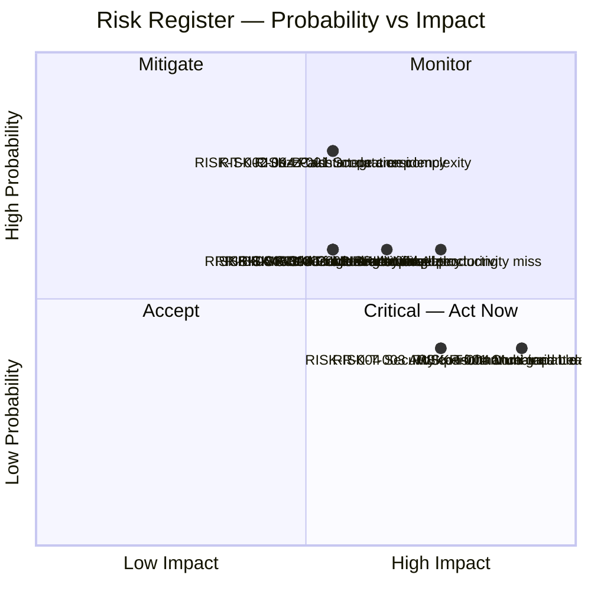

# PART 16 — RISK REGISTER
## P1 — Learning Management System + School Management System
### Layer 5 — Project & Financial

**Status:** ✅ Content Complete

*Probability and Impact are scored 1-5. Risk Score = Probability × Impact. Risks with Score ≥ 12 are flagged HIGH and require immediate mitigation action. Risks with Score ≥ 6 are MEDIUM. Risks with Score < 6 are LOW.*

*Four risks were pre-flagged during earlier Parts and must appear here: (1) Combined Lead single-point-of-failure (Part 12 / DEC-P1-029); (2) AI-tooling productivity assumption underperformance (Part 13 / DEC-P1-030); (3) JazzCash/Easypaisa merchant account approval delays (Part 14.5); (4) Google Stitch monetisation mid-build (Part 13.7 / DEC-P1-031).*

---

*Probability/Impact distribution — selected highest-scoring risks across all categories*

## 16.1 Technical Risks

| ID | Risk | Probability (1-5) | Impact (1-5) | Score | Mitigation | Contingency | Owner | Review Date |
|---|---|---|---|---|---|---|---|---|
| RISK-T-001 | React Native proctoring screen fails to enforce full-screen lock reliably on iOS or Android, requiring a native module bridge that takes longer than estimated | 3 | 4 | **12** | Part 9.1 documents this specific risk and defines a native-module fallback: write only the exam proctoring screen as native Swift (iOS) and Kotlin (Android) code if RN's capabilities prove insufficient during Phase 2 testing | If native bridge cannot be completed within Phase 2's window, descope the mobile proctoring screen for v1.0 and deliver exam-proctoring as web-only; flag in Scope Lock's deferred list and communicate to client at Phase 2 review | Frontend Lead | Phase 2 completion review (28 Aug 2026) |
| RISK-T-002 | JazzCash or Easypaisa integration is more complex than the Stripe/PayPal integration due to undocumented API behaviours, extending Phase 3 beyond its 4.0-week estimate | 4 | 3 | **12** | Allocate the Backend Lead (not an intern) to the JazzCash/Easypaisa connector; begin integration spike in Phase 2's final week so blockers are discovered before Phase 3 officially starts | If integration cannot be stabilised within Phase 3, defer JazzCash/Easypaisa to a v1.1 patch release and deliver Stripe/PayPal only at Go-Live; flag to client at Phase 3 review | Backend Lead | Start of Phase 3 (29 Aug 2026) |
| RISK-T-003 | AWS performance under load does not meet Part 10.2's 2,000 concurrent user target at Launch-scale sizing, requiring additional instance types or caching layers not in the original infrastructure specification | 2 | 4 | **8** | Performance tests (Part 15.4) are run in Phase 5 against the UAT environment, which Part 11.2 mandates mirrors Production sizing — issues will be caught before Go-Live, not after | Scale up the relevant AWS service (additional EC2 capacity, ElastiCache cluster, or read replica) — AWS's elastic scaling means this is a cost increase, not a rebuild; budget adjustment funded by Part 13.6's contingency | Backend Lead | Phase 5 performance test completion (Oct 2026) |
| RISK-T-004 | Multi-tenant data isolation has a gap — a query or API endpoint leaks data from one school tenant to another under specific edge-case conditions | 2 | 5 | **10** | Tenant isolation tested explicitly in the integration test suite as a first-class concern (Part 15.2); the Security Consultant's penetration test (Part 15.5) includes cross-tenant data leakage as an explicit test case | Immediate incident response: take the affected endpoint offline, patch the query, re-test before re-enabling; notify affected tenants per Part 8.3's audit and compliance framework | Combined Lead | Security penetration test completion (M7, 24 Oct 2026) |
| RISK-T-005 | Zoom/Google Meet/Microsoft Teams API credentials are not provided by the client before Phase 2's Live Classes module begins (external dependency, Part 14.5), blocking M02 | 3 | 3 | **9** | Jitsi (self-hosted, Part 8.1) is always available as a fallback — development can proceed against Jitsi; the Zoom/Teams/Meet adaptors are added once credentials arrive | If credentials arrive after Phase 2 completes, the third-party video platform adaptors are built in Phase 5's hardening window as a parallel track, since Jitsi already validates the full live-class feature set | Combined Lead | Kickoff meeting (M1, 6 Jul 2026) — credentials must be requested at this meeting |

## 16.2 Business Risks

| ID | Risk | Probability (1-5) | Impact (1-5) | Score | Mitigation | Contingency | Owner | Review Date |
|---|---|---|---|---|---|---|---|---|
| RISK-B-001 | Scope creep — client requests additions to Part 1.3's In Scope list after the Scope Lock Agreement is signed, consuming development time without a corresponding budget/timeline adjustment | 4 | 3 | **12** | Part 17.1's Change Request Process is the formal mechanism: every post-sign-off addition requires a formal CR with impact assessment and client approval before any development begins | Any approved CR that extends the timeline shifts the Go-Live date by the estimated additional weeks; it does not compress earlier phases to absorb the extra work | Combined Lead | Every Phase completion review |
| RISK-B-002 | Key client-side stakeholder changes mid-project (Project Sponsor leaves, new decision-maker has different priorities), causing previously agreed requirements to be re-opened | 2 | 4 | **8** | The Scope Lock Agreement signature (Part 17.1) binds the organisation, not an individual — ensure the agreement is signed at the organisational level, not just by one person | If a new stakeholder attempts to re-open locked requirements, use the signed Scope Lock Agreement as the contractual reference; offer a structured discovery session to understand new priorities, with any changes processed as formal CRs under Part 17.1 | Project Sponsor (client) + Combined Lead | At every Phase milestone |
| RISK-B-003 | Lighthouse's founding-cohort student intake is smaller than projected, reducing UAT participant availability — teacher/student/parent UAT roles cannot be filled with real users in Phase 5's timeline | 3 | 2 | **6** | Confirm UAT participant availability from the client at Kickoff (M1); identify alternates for each role at that point | If real users are unavailable, the Combined Lead and client-side admin staff role-play student/parent scenarios using the UAT script templates (Part 15.3); the acceptance criteria are testable in this mode, though with reduced real-world signal | Project Sponsor (client) | Kickoff (M1, 6 Jul 2026) |
| RISK-B-004 | Cambridge Assessment API access cannot be arranged through the client's institutional relationship in time for Phase 2's Exam module, blocking the Cambridge-curriculum-specific exam configuration | 3 | 3 | **9** | The Exam module's core functionality (question bank, auto-grading, proctoring) is not dependent on the Cambridge API — it can be built and tested without it; the Cambridge-specific configuration is a thin integration layer that can be added when access arrives | If Cambridge API access arrives after Phase 2, complete the Exam module without the Cambridge-specific question-paper format integration; deliver this as a Phase 5 parallel track or v1.1 release | Combined Lead + Project Sponsor | Start of Phase 2 (19 Jul 2026) |
| RISK-B-005 | Budget overrun beyond the 15% contingency — actual development hours exceed AI-adjusted estimates by more than the contingency can absorb | 2 | 4 | **8** | The contingency is sized at 15% specifically to cover the AI-tooling productivity risk and the lean-team timeline risk (Part 13.6); the on-demand outsourced capacity lever (Part 12.1.1) is an alternative to spending contingency — it adds capacity rather than burning reserve | If both the contingency and outsourced capacity are insufficient, the project must formally scope-down: identify the lowest-priority modules (M15 Transport and M12 Library are the most self-contained and lowest-dependency per Part 14.3) and defer them to v1.1 | Combined Lead | Monthly — every Phase review |

## 16.3 Compliance Risks

| ID | Risk | Probability (1-5) | Impact (1-5) | Score | Mitigation | Contingency | Owner | Review Date |
|---|---|---|---|---|---|---|---|---|
| RISK-C-001 | GDPR data subject request (right to deletion) cannot be fully fulfilled because student records are referenced by financial ledger entries that have statutory retention requirements — the system cannot delete a record that accounting regulations require it to retain | 3 | 3 | **9** | The data model (Part 9.3) implements a soft-delete + anonymisation pattern for personal data: the ledger entry is retained (to meet accounting regulation), but the personal identifier is replaced with an anonymised token; the student profile is deleted | If the anonymisation approach is challenged as insufficient by a data subject or regulator, engage a GDPR-specialist legal advisor (this is outside the consultant's scope — it is a legal question, not a technical one); the technical capability to perform selective anonymisation is built in v1.0 | Combined Lead + Project Sponsor | Before Go-Live |
| RISK-C-002 | Cognia accreditation evidence artefacts do not meet the evidentiary standard required — generated PDFs and export packages are accepted by the platform but rejected by Cognia reviewers as insufficiently documented | 2 | 4 | **8** | M16's evidence management requirements (Part 4) were derived from the client's Specs_of_Detailed_SRS.pdf Cognia readiness requirements; the Appendix F compliance checklist maps each M16 feature to a specific Cognia evidence requirement | If Cognia rejects a specific artefact type, the export format is a configuration change (not a rebuild) in M16 — the evidence data is collected; only the export template needs updating | Project Sponsor (client — Cognia relationship holder) | Pre-Go-Live Cognia readiness review (Appendix F) |
| RISK-C-003 | Cambridge curriculum structure changes after the system is built, requiring updates to the academic year / grading scale configuration the system encodes | 2 | 2 | **4** | The grading scale, academic year structure, and Cambridge-specific configuration are all admin-configurable (Part 3.3.3 Academic Management), not hardcoded — the School Admin can update them without a code change | No contingency needed beyond the admin configuration capability already in scope | School Admin (client) | Annual — each new Cambridge academic year |
| RISK-C-004 | Pakistan's data residency requirements (PDPA or successor regulation) mandate that student data for Pakistani residents is stored in Pakistan, but the AWS me-central-1 region (UAE) is the selected production region | 3 | 4 | **12** | At the time of writing (June 2026), Pakistan does not have an AWS region; the nearest compliant region for GCC/ME customers is me-central-1 (UAE). The mitigation is the contractual and legal due diligence the client (Lighthouse) conducts with Pakistani legal counsel before Go-Live — this is outside the development consultant's scope, but the system architecture (Part 8.9) uses a single-region AWS deployment that can be migrated to a Pakistan-local region if and when one becomes available, at infrastructure cost only (no code changes) | If a Pakistani data residency mandate takes effect before Go-Live, the client must decide whether to delay Go-Live, use a Pakistan-local VPS provider as the primary region (with the limitations documented in Part 8.9's VPS evaluation), or accept the legal risk and proceed with UAE hosting while migration is planned | Project Sponsor (client) + legal counsel | Before Go-Live; reviewed annually |
| RISK-C-005 | FERPA compliance gap — the system serves US students (if Lighthouse enrolls them internationally) but does not have all FERPA-required consent and access-request workflows in v1.0 | 2 | 3 | **6** | FERPA requirements are documented in Appendix F; the core FERPA controls (parental consent, access to education records, amendment request workflow) are covered by the Parent Portal's functionality and the data export/deletion capability | If a FERPA-specific workflow gap is identified at Appendix F review, it is scoped as a must-fix before Go-Live, not deferred — FERPA non-compliance carries financial liability for the institution | Combined Lead | Appendix F compliance checklist review, pre-Go-Live |

## 16.4 Security Risks

| ID | Risk | Probability (1-5) | Impact (1-5) | Score | Mitigation | Contingency | Owner | Review Date |
|---|---|---|---|---|---|---|---|---|
| RISK-S-001 | Sensitive student psychological assessment data (Part 3.7 / M14) is exposed to unauthorised roles due to a misconfigured visibility rule — a teacher or parent sees raw assessment scores they are not permitted to view | 2 | 5 | **10** | BR-031/032 (Part 4, M14) defines the visibility matrix; these rules are enforced at the API response layer (the data is never sent to an unauthorised client, not filtered in the UI); integration tests verify every role-combination against the visibility matrix (Part 15.2) | Immediate: revoke access to the affected endpoint; audit log review to determine scope of exposure; notify affected students and guardians per Part 8.3; patch the rule; re-test before restoring | Combined Lead | Security penetration test (M7) + Phase 4 integration tests |
| RISK-S-002 | Payment data breach — a security flaw allows an attacker to intercept or access payment card data | 1 | 5 | **5** | Payment card data is never stored on the platform; Stripe/PayPal tokenise at the gateway level (Part 4, M08); the platform stores only the transaction reference token, not card numbers or CVVs; PCI-DSS compliance is therefore the payment gateway's responsibility, not the platform's | If a breach occurs, the blast radius is limited to transaction reference tokens only (which cannot be used to charge a card); notify affected users per Part 8.3; engage the payment gateway's security team | Backend Lead | At integration testing of M08 and at penetration test (M7) |
| RISK-S-003 | Credential stuffing attack on the student/parent login endpoint — automated bot uses leaked credentials from other services to attempt account takeover | 3 | 3 | **9** | Rate limiting on the login endpoint (Part 10.4 — 5 failed attempts triggers 15-minute lockout); CAPTCHA on login (configurable per school, Part 3.1.6); breach detection via Have I Been Pwned API on account creation; MFA enforcement for admin roles | If an account takeover wave is detected via anomalous login monitoring (Part 11.5), the Super Admin can trigger a forced password reset for affected accounts (Part 3.1.4) and temporarily lower the lockout threshold | Combined Lead | Phase 5 penetration test |
| RISK-S-004 | Exam proctoring bypass — a student discovers a technique to circumvent the proctoring controls (full-screen lock, tab-switch detection) without triggering the AI suspicious-behaviour detection | 3 | 3 | **9** | Multi-layered proctoring (Part 4.3 / M04): full-screen lock + tab-switch detection + webcam captures + AI behaviour analysis — defeating all layers simultaneously requires significant effort; the live proctor dashboard (teacher can monitor all webcam feeds in real time) is a human override | Maintain a manual review workflow: the teacher reviews flagged webcam captures for any student whose behaviour score exceeds the threshold, regardless of whether the AI flagged them as suspicious; the decision to invalidate a submission remains with the teacher, not the system | Frontend Lead (proctoring screen) + Combined Lead | Phase 2 acceptance testing for M04 |
| RISK-S-005 | Server-side code injection via file upload — a student uploads a malicious file disguised as a PDF or DOCX assignment submission, which is processed by the file-handling service in a way that executes the payload | 2 | 4 | **8** | File uploads are stored in AWS S3 with no execute permissions; files are served via pre-signed URLs, never executed server-side; file type is validated against the MIME type and file header (magic bytes), not just the extension; virus scanning via ClamAV on all uploaded files before the upload is marked complete | If a malicious file is detected, the upload is quarantined (not deleted) and the submitting account is flagged for review; the teacher is notified that the submission was blocked and the student must resubmit | Backend Lead | Integration testing of M03 (Assignment) and M04 (Exam) |

## 16.5 AI-Specific Risks

| ID | Risk | Probability (1-5) | Impact (1-5) | Score | Mitigation | Contingency | Owner | Review Date |
|---|---|---|---|---|---|---|---|---|
| RISK-AI-001 | AI Quiz Service generates a question with a factually incorrect statement — a student learns a wrong fact from an AI-generated quiz | 3 | 3 | **9** | Part 15.6's AI evaluation framework sets a pass criterion of zero critical factual errors per 50-question set before UAT; the teacher review workflow means every generated quiz is reviewed by the assigning teacher before students see it — the AI output is not student-facing without human approval | Teacher is always the final gatekeeper before a quiz is published; no AI-generated content reaches students without explicit teacher approval; if a factual error slips through post-launch, the teacher can unpublish the quiz and the student's attempt is voided | Combined Lead | AI evaluation review (Part 15.6), before Phase 5 UAT |
| RISK-AI-002 | AI Quiz Service prompt injection — a teacher enters a malicious system prompt as the syllabus input, attempting to override the AI service's behaviour | 2 | 3 | **6** | The AI service (Part 8.8) uses a system prompt that is not user-controllable; teacher input is inserted as a structured data field, not as free-form instruction text — it is treated as data, not as instruction; the Anthropic API's guardrails apply | Monitor the AI service's response logs for anomalous outputs; if a prompt injection is confirmed, temporarily disable the AI quiz generation feature while the input sanitisation is hardened | Backend Lead | Phase 4 security testing (before penetration test M7) |
| RISK-AI-003 | Anthropic API pricing increase makes the AI Quiz Service's runtime cost materially higher than the $21-84/month estimate in Part 13.7 | 2 | 2 | **4** | The AI service (Part 8.8) is built against the provider-agnostic LLM proxy layer — switching from Anthropic Sonnet to an equivalent-capability model (OpenAI GPT-5.x, Gemini Pro) requires a configuration change, not a code change; the lowest-cost provider can be selected at any time | If Anthropic pricing increases materially, switch to the lowest-cost provider that meets Part 15.6's accuracy criteria; the switching cost is zero beyond re-running the Part 15.6 evaluation against the new provider | Backend Lead | Quarterly cost review post-launch |
| RISK-AI-004 | AI-assisted development productivity (Part 13's 35%/30%/15% reductions) is lower than assumed — the team achieves only 15-20% reduction rather than 35%, extending the timeline beyond 20 weeks | 3 | 4 | **12** | This risk is explicitly acknowledged in Part 13's AI-Adjustment table as a stated, bounded assumption; the 15% contingency (Part 13.6) is sized partly to fund the response to this risk | Engage on-demand outsourced capacity (Part 12.1.1) to run a deprioritised parallel module track; this is funded from Part 13.6's contingency. If both levers are insufficient, defer the lowest-priority modules (M15 Transport, M12 Library) to v1.1 and maintain the Go-Live date | Combined Lead | Phase 2 completion review (28 Aug 2026) — first real signal on AI-assisted velocity |
| RISK-AI-005 | Claude Code (Team Premium) or the AI coding assistant subscription is unavailable due to service outage for multiple days during a critical build phase | 2 | 3 | **6** | AI-assisted tooling accelerates delivery but does not make the build impossible — the team can build without it, at the pre-AI-adjustment velocity; the schedule buffer (1.6 weeks, Part 13.2) absorbs short outages | If outage exceeds 5 business days, re-assess timeline against the original (pre-AI-adjustment) velocity; if the buffer is consumed, invoke RISK-AI-004's contingency | Combined Lead | Weekly, during active build phases |

## 16.6 Resource Risks

| ID | Risk | Probability (1-5) | Impact (1-5) | Score | Mitigation | Contingency | Owner | Review Date |
|---|---|---|---|---|---|---|---|---|
| RISK-R-001 ⚠️ | **Combined Lead single-point-of-failure** — the Combined Lead holds four critical functions simultaneously (Architecture, PM, QA-strategy, DevOps Lead). If this person is unavailable for 2+ weeks during the build, the project has no fallback for any of these functions | 2 | 5 | **10** | Part 12.1.1 documents this risk explicitly; the mitigation is documentation discipline: architecture decisions are logged in the Decision Log (current at all times), infrastructure configuration is in code (IaC, Part 11.1), and no single decision lives only in the Combined Lead's head | Engage on-demand outsourced capacity at short notice (Part 12.1.1's named trigger); split the role temporarily: an outsourced senior architect covers the technical functions while the client-side Project Sponsor assumes the PM communication role; the QA-strategy (acceptance criteria and test cases) are documented in Appendix E and executable by the Backend/Frontend Leads without the Combined Lead | Project Sponsor (client) + Combined Lead | Monthly |
| RISK-R-002 | Junior Intern attrition — one or both Junior Interns leave mid-project, reducing Backend or Frontend capacity by 60% (since each discipline team is Lead + 2 Interns, and the interns represent 60% of the hours) | 3 | 3 | **9** | Ensure intern contracts cover the full 20-week build period (or the equivalent notice period); maintain a short-list of replacement candidates at all times; onboarding documentation is kept current so a replacement can reach productive velocity within 1 week | Replace immediately via Part 12.1.1's on-demand outsourced capacity lever; a junior developer from an outsourced pool can be onboarded faster than a junior intern because they arrive with existing working habits | Combined Lead | Monthly |
| RISK-R-003 | Google Stitch exits Google Labs and introduces paid tiers mid-build — the UI/UX Designer's workflow is disrupted and the budgeted \$0 design-tooling cost increases | 3 | 2 | **6** | Part 13.7 explicitly flags this as a real risk with a stated probability; the response is simple: Figma at \$20/month per seat is a mature, fully capable alternative that can replace Stitch with one day of workflow adjustment | If Stitch introduces paid tiers, adopt Figma immediately; the incremental cost (Figma at \$20/month vs Stitch at \$0) is absorbed by Part 13.6's contingency | UI/UX Designer | At any point during build |
| RISK-R-004 | Security Consultant unavailable at the planned engagement dates (Phase 5 weeks 2-3 for Milestone M7) — penetration test delayed, which delays UAT and Go-Live | 2 | 4 | **8** | Book the Security Consultant engagement at Kickoff (M1), not at the start of Phase 5; a 3-month advance booking for a mid-October engagement initiated in July should be achievable | If the primary Security Consultant is unavailable, engage a second-tier OSCP-certified consultant — Part 10.5's requirement is methodology and certification, not a named individual; delivery timeline impact is only the days needed to brief a new consultant | Combined Lead | At Kickoff (M1, 6 Jul 2026) |
| RISK-R-005 | Skill gap in the intern cohort — Junior Interns do not meet the proficiency criteria in Part 12.4 (specifically: the entry-level coding assessment and the TypeScript/NestJS/React Native minimum capability), requiring more senior lead supervision than the hours matrix assumes | 3 | 3 | **9** | Part 12.4 mandates a formal entry-level coding assessment before onboarding — interns who do not pass the assessment are not onboarded; the assessment is not waivable | If an intern fails the assessment after onboarding has begun (due to misrepresented capabilities), replace via Part 12.1.1's on-demand outsourced capacity; the assessment gap manifests within the first 2-week sprint and can be caught early | Combined Lead | End of Phase 1 (18 Jul 2026) — first real signal on intern capability |

---

*Lighthouse Global School System — P1 Master SRS — Part 16 — Layer 5 — Internal — v1.0*
