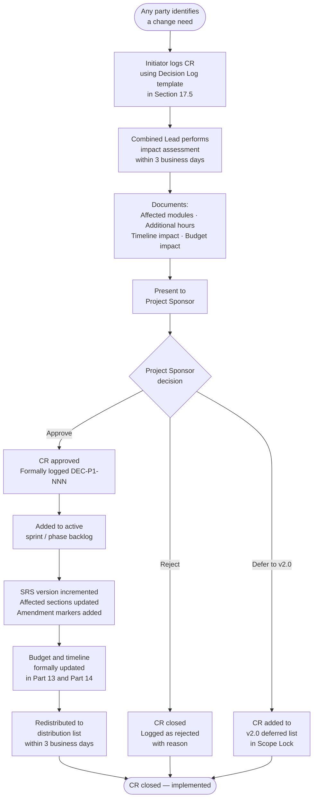
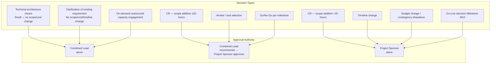
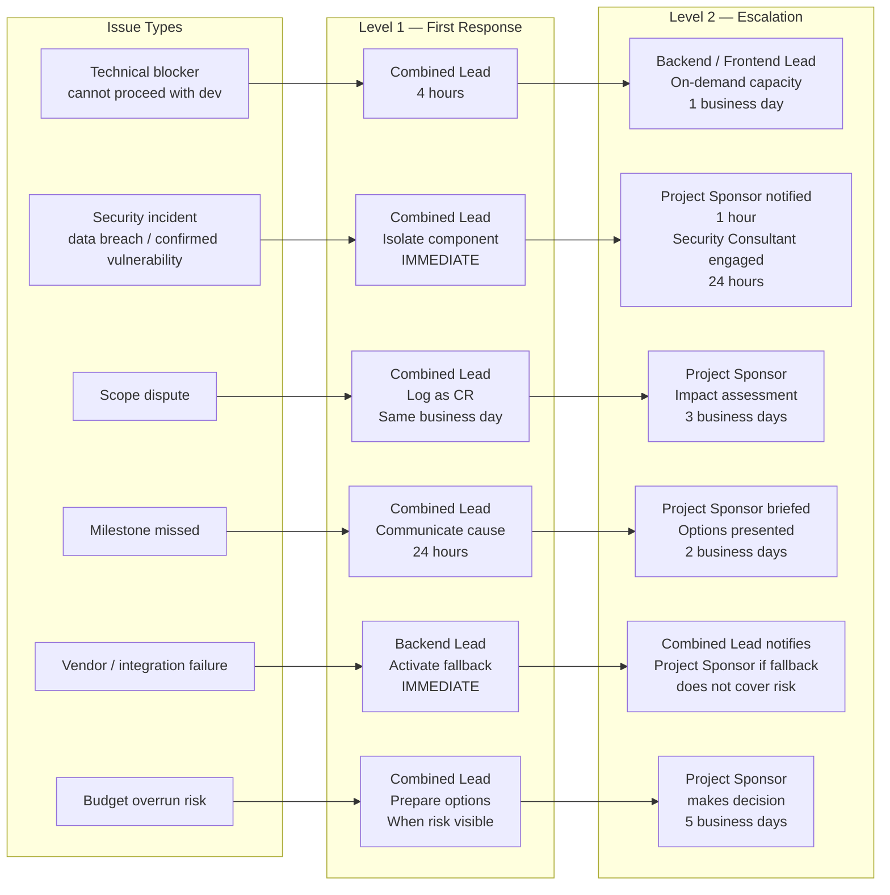

# PART 17 — GOVERNANCE
## P1 — Learning Management System + School Management System
### Layer 5 — Project & Financial

**Status:** ✅ Content Complete

---

## 17.1 Change Request Process

Any addition, removal, or modification to the requirements in this SRS after the Scope Lock Agreement is signed requires a formal Change Request (CR). No development work begins on any change until the CR is approved.

### Flowchart

1. **Initiator** identifies a change need and raises a CR using the template in Section 17.5.
2. **Combined Lead** performs an impact assessment within 3 business days: affected modules, estimated additional hours, timeline impact, budget impact.
3. **Combined Lead** presents the impact assessment to the **Project Sponsor**.
4. **Project Sponsor** approves (proceed) or rejects (close CR) or defers (add to v2.0 deferred list).
5. If approved: CR is added to the active sprint/phase backlog; budget and timeline are formally updated in the relevant SRS sections (new version increment); the SRS version history table (Part 0) is updated.
6. The approved CR and its impact assessment are logged in Section 17.5's Decision Log.

### Change Authority Matrix

| Change Type | Approval Authority |
|---|---|
| Clarification of existing requirement (no scope, cost, or timeline change) | Combined Lead alone |
| Addition to In Scope (increases hours ≤ 20) | Combined Lead + Project Sponsor |
| Addition to In Scope (increases hours > 20) | Project Sponsor + formal CR documentation |
| Removal from In Scope | Project Sponsor + formal CR (scope reduction does not automatically reduce budget) |
| Timeline change | Project Sponsor |
| Budget change | Project Sponsor |
| Deferral to v2.0 | Project Sponsor |

## 17.2 Approval Workflow

*Decision authority matrix — visual form of the table below*

| Decision Type | Decides | Recommends | Consulted | Informed |
|---|---|---|---|---|
| Technical architecture choice | Combined Lead | — | Backend Lead, Frontend Lead | Project Sponsor |
| Module scope change | Project Sponsor | Combined Lead | Affected team members | All team |
| Go/No-Go for each Phase milestone | Project Sponsor | Combined Lead | UAT participants (Phase 5 only) | All team |
| Go-Live decision (Milestone M10) | Project Sponsor | Combined Lead | Security Consultant | All team |
| Vendor/tool selection (e.g., payment gateway) | Project Sponsor | Combined Lead | Backend Lead | All team |
| Contingency budget drawdown | Project Sponsor | Combined Lead | — | — |
| On-demand outsourced capacity engagement | Combined Lead | — | Project Sponsor | Project Sponsor |

## 17.3 Communication Plan

| Stakeholder | Information | Frequency | Channel | Owner |
|---|---|---|---|---|
| Project Sponsor | Phase completion status, milestone sign-offs, risk escalations, CR approvals | Weekly written status update + Phase completion review meeting | Email (weekly) + Video call (milestones) | Combined Lead |
| Project Sponsor | Budget tracking against Part 13.3; contingency drawdown events | Monthly (or immediately on drawdown event) | Email | Combined Lead |
| Backend Lead, Frontend Lead | Sprint tasks, technical decisions, blockers | Daily standup (15 minutes) | Video call or chat | Combined Lead |
| UI/UX Designer | Design brief per module, feedback on wireframes | Per module, as needed during Phase 2-4 | Async (Figma comments + chat) | Frontend Lead |
| Security Consultant | Engagement briefing (scope, environment, API specification) | Once at engagement booking + once at engagement start | Email + handover document | Combined Lead |
| Client UAT participants | UAT script distribution, training session, defect reporting process | Once, at the start of Phase 5 UAT window | Video call (training) + written scripts | Combined Lead |

## 17.4 Escalation Matrix

*Escalation paths by issue type — visual form of the table below*

| Issue Type | Level 1 — First Response | Level 2 — Escalation | Level 3 — Final Authority | Timeframe |
|---|---|---|---|---|
| Technical blocker (cannot proceed with development) | Combined Lead assesses within 4 hours | Backend/Frontend Lead brought in; on-demand outsourced capacity initiated if needed | Project Sponsor notified if blocker extends beyond 2 business days | L1: 4 hours; L2: 1 business day; L3: 2 business days |
| Security incident (data breach, confirmed vulnerability) | Combined Lead isolates affected component immediately | Project Sponsor notified within 1 hour; Security Consultant engaged within 24 hours | Project Sponsor decides on disclosure and remediation timeline | L1: immediate; L2: 1 hour; L3: 24 hours |
| Scope dispute (client requests work outside the signed Scope Lock) | Combined Lead logs as a CR and explains the formal CR process | Combined Lead presents impact assessment to Project Sponsor | Project Sponsor makes final decision per Section 17.1 | L1: same business day; L2: 3 business days; L3: 5 business days |
| Milestone missed (phase does not complete on the scheduled date) | Combined Lead communicates cause and revised date within 24 hours | Project Sponsor briefed; contingency options presented (buffer, outsourced capacity, scope deferral) | Project Sponsor approves revised Go-Live date if buffer is consumed | L1: 24 hours; L2: 2 business days |
| Vendor/integration failure (payment gateway, video conferencing API outage during build) | Backend Lead activates fallback (Jitsi for video; Stripe for payments) per Part 14.5's external dependencies plan | Combined Lead notifies Project Sponsor if fallback covers the risk | Project Sponsor decides if delay is required | L1: immediate; L2: 4 hours; L3: 1 business day |
| Budget overrun risk (spend tracking indicates Part 13.6 contingency will be exhausted) | Combined Lead prepares options analysis (scope reduction, timeline extension, additional budget) | Project Sponsor makes the decision | — | L1: when risk becomes visible; L2: 5 business days |

## 17.5 Decision Log Template

All significant decisions — technical, commercial, or governance — are logged here using the format below. The current Decision Log is maintained at `_Shared/Decision_Log.md` in the project repository and is reproduced in full as Appendix I of this Master SRS at the time of delivery.

| Field | Content |
|---|---|
| Decision ID | DEC-P1-[NNN] — sequential, never reused |
| Date | Date the decision was made |
| Decision made | One clear statement of what was decided |
| Alternatives rejected | What other options were considered and why they were not chosen |
| Rationale | Why this decision was made |
| Approver | Who made or confirmed the decision |
| Impact on SRS | Which Part(s) of this document are affected |

*Decisions through DEC-P1-031 are already logged in the Decision Log and are included in Appendix I of this document.*

## 17.6 Amendment Process

After this document is delivered and signed, amendments follow this process:

1. The initiating party (client or consultant) raises an amendment request referencing the specific Part, section, and requirement ID affected.
2. The Combined Lead assesses whether the amendment is a clarification (no scope/cost/timeline change) or a change (triggers the CR process in Section 17.1).
3. If a clarification: the SRS is updated, the version history table (Part 0) is incremented by a minor version (e.g., v1.0 → v1.1), and the amendment is logged in Section 17.5.
4. If a change: the CR process in Section 17.1 is followed first; only after approval is the SRS updated.
5. Amended sections are marked with a change bar in the margin (or a `**[AMENDED v1.x]**` tag inline) so reviewers can identify what changed.
6. The amended document is re-distributed to the distribution list in Part 0 within 3 business days of the amendment being approved.

---

*Lighthouse Global School System — P1 Master SRS — Part 17 — Layer 5 — Internal — v1.0*
