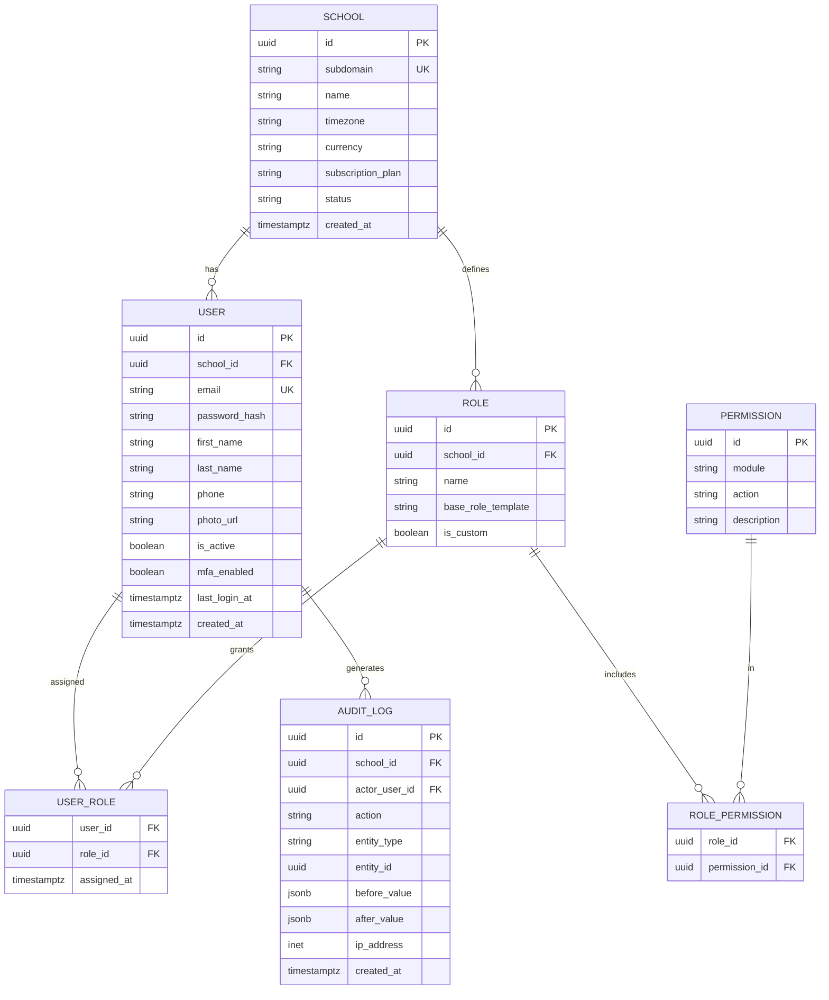
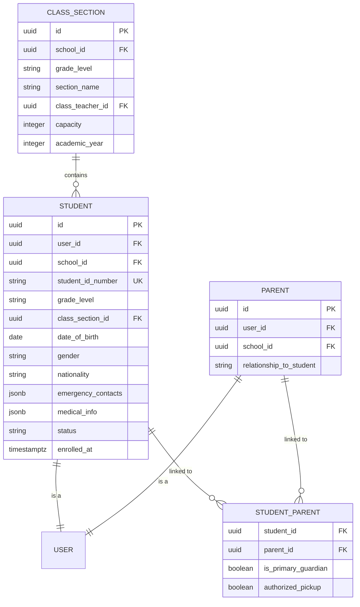
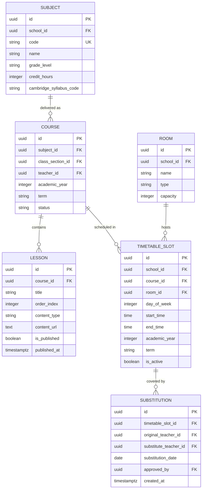
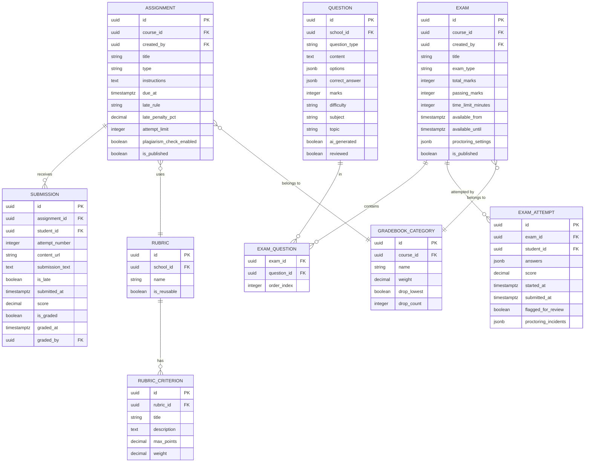
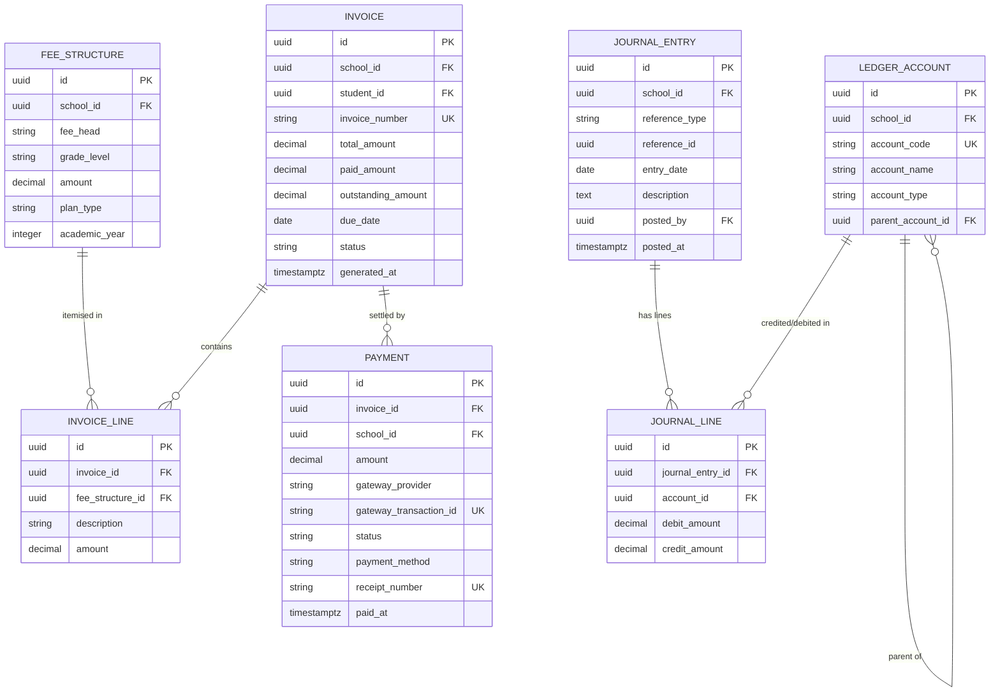
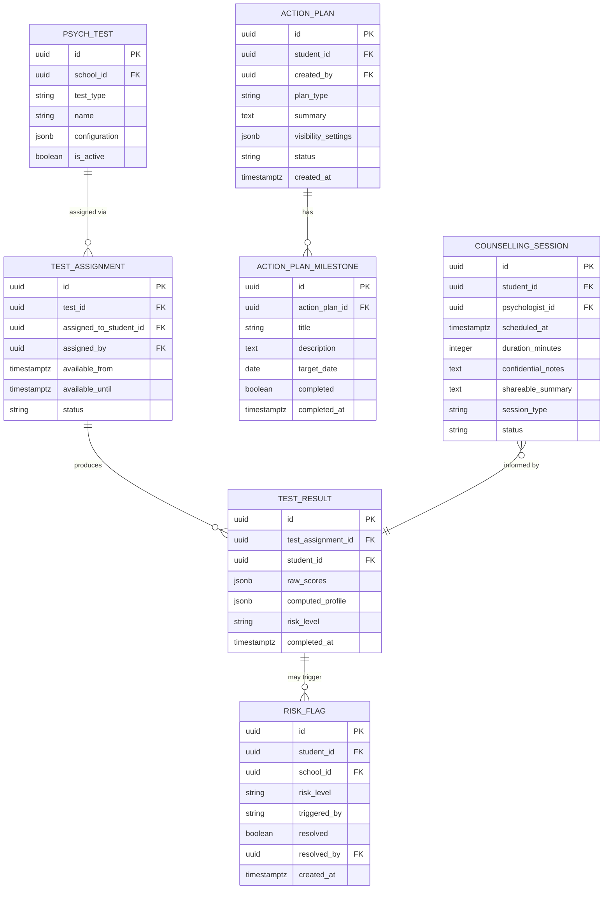
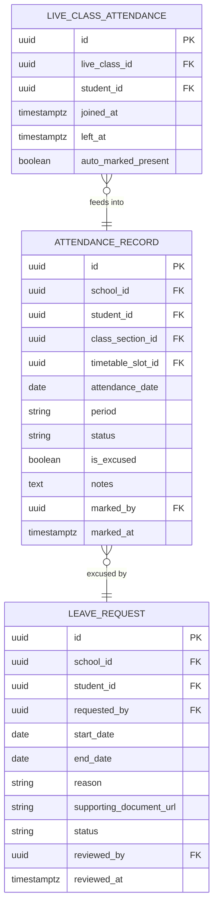

# APPENDIX A — ER DIAGRAMS
## P1 — LMS + SMS | All entity relationship diagrams (Mermaid erDiagram)

*Colour coding by domain is described in headings since Mermaid erDiagram does not support node colours. Five domains: Identity (users/roles), Academic (courses/classes), Assessment (assignments/exams), Financial (fees/accounting), Wellbeing (psych/health).*

---

## A.1 Identity Domain — Users, Roles, Tenants

---

## A.2 Student & Parent Domain

---

## A.3 Academic Domain — Courses, Subjects, Timetable

---

## A.4 Assessment Domain — Assignments, Exams, Grades

---

## A.5 Financial Domain — Fees, Payments, Accounting

---

## A.6 Wellbeing Domain — Psychological Assessment

---

## A.7 Attendance Domain

---

*Lighthouse Global School System — P1 Master SRS — Appendix A — Internal — v1.0*
