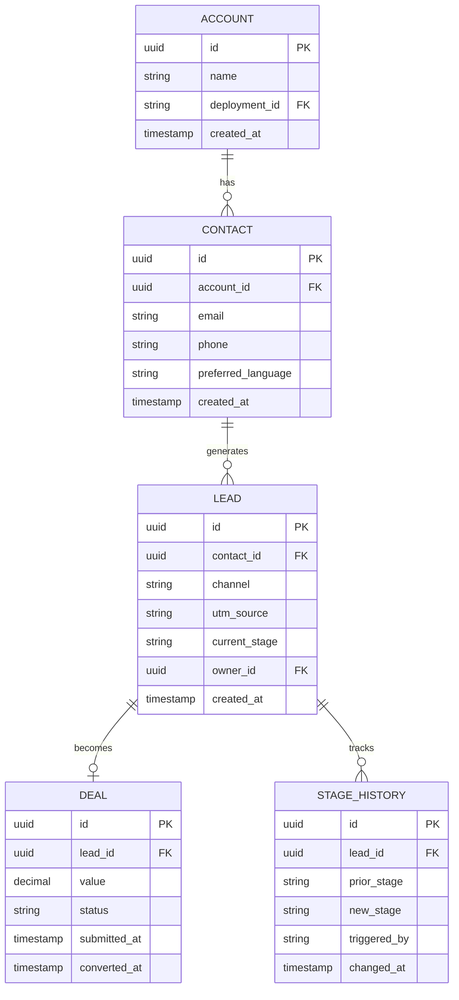
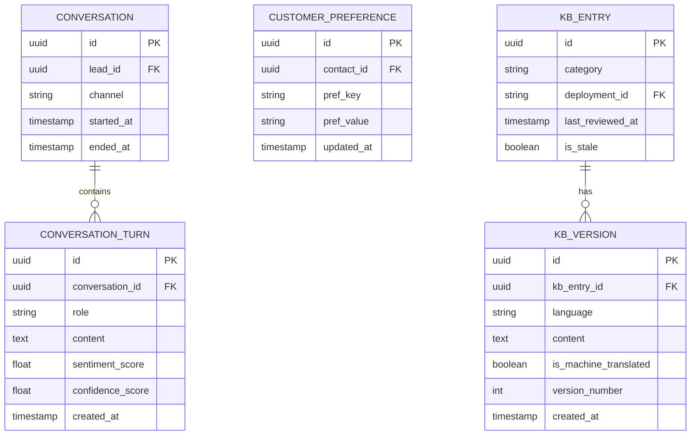
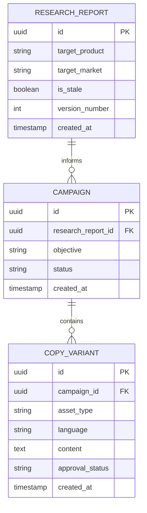
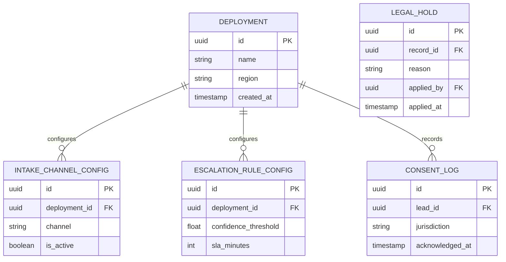

# APPENDICES
## Product: P2 — AI Marketing & Sales RevOps Engine

---

## Appendix A — ER Diagrams (Complete Set)

### CRM Domain

### Conversation & Knowledge Domain

### Campaign & Content Domain

### Configuration & Compliance Domain

Every entity referenced anywhere in Parts 4–9 appears in exactly one of these four diagrams.

## Appendix B — Wireframes Package

All 22 screens (SCR-P2-001 through SCR-P2-022) have annotated layout descriptions at all three breakpoints in Part 7. Pixel-precise visual wireframe files (Figma) are a separate visual-design-phase deliverable, produced once Part 7's content is approved.

| Screen | Wireframe Description | Pixel-Precise Visual File |
|---|---|---|
| SCR-P2-001 through SCR-P2-022 | ✅ Complete (Part 7) | ⏳ Pending visual design phase |

## Appendix C — API Catalog (Expanded)

| Module | Primary Endpoint(s) |
|---|---|
| 1 — Lead Intake | `POST /api/v1/leads`, `POST /api/v1/leads/whatsapp-webhook`, `POST /api/v1/leads/email-webhook` |
| 2 — Qualification Agent | `POST /api/v1/conversations/{id}/qualify` |
| 3 — Voice & Chat Engagement | `POST /api/v1/conversations/{id}/messages`, `POST /api/v1/calls/initiate`, `POST /api/v1/calls/{id}/webhook` |
| 4 — Research Agent | `POST /api/v1/research-requests`, `GET /api/v1/reports/{id}` |
| 5 — Marketing Agent | `POST /api/v1/campaigns`, `POST /api/v1/campaigns/{id}/approve` |
| 6 — Copywriting Agent | `POST /api/v1/copy-variants`, `POST /api/v1/copy-variants/{id}/approve` |
| 7 — Deal-Closing Agent | `POST /api/v1/deals/{id}/payment-link`, `POST /api/v1/deals/{id}/approve-close` |
| 8 — CRM/Pipeline | `GET /api/v1/leads/{id}`, `PATCH /api/v1/leads/{id}/stage`, `POST /api/v1/leads/import` |
| 9 — Escalation | `POST /api/v1/escalations/{id}/claim` |
| 10 — Conversation Memory | `GET /api/v1/leads/{id}/memory` |
| 11 — Admin Config | `POST /api/v1/admin/api-keys`, `POST /api/v1/admin/deployments` |
| 12 — Analytics | `GET /api/v1/reports/pipeline-conversion`, `GET /api/v1/reports/cost-monitoring` |
| 13 — Integration & Sync | `POST /api/v1/sync/field-mapping`, `GET /api/v1/sync/health` |
| 14 — Compliance | `POST /api/v1/compliance/legal-hold`, `POST /api/v1/compliance/rtbf-request` |
| 15 — Knowledge Base | `GET /api/v1/kb/entries`, `POST /api/v1/kb/entries` |
| 16 — Notification | `GET /api/v1/admin/alert-rules` |
| 17 — Localization | `POST /api/v1/admin/languages` |

*The authoritative, fully-detailed API reference is the generated OpenAPI/Swagger spec from the FastAPI codebase — this table is the human-readable index.*

## Appendix D — Requirement Traceability Matrix (Sample)

| Requirement ID | Design Ref | Dev Ticket | Test Case ID | Acceptance Status |
|---|---|---|---|---|
| AI-FR-001 | SCR-P2-021 (chat widget) | DEV-0001 | TC-0001 | Pending |
| AI-BR-001 | Module 9 escalation engine | DEV-0023 | TC-0008 | Pending |
| AI-FR-046 | SCR-P2-003 (deal status panel) | DEV-0044 | TC-0040 | Pending |
| AI-BR-005 | Module 7 approval gate | DEV-0045 | TC-0044 | Pending |
| AI-FR-116 | SCR-P2-015 (admin import) | DEV-0058 | TC-0058 | Pending |

*Full matrix — all 118 functional requirements and 48 business rules — is the content of Deliverable File 03 (Traceability Matrix, XLSX), generated once development tickets are created.*

## Appendix E — Test Case Library (Sample)

| Field | TC-0001 | TC-0044 |
|---|---|---|
| ID | TC-0001 | TC-0044 |
| Description | Web form lead creates a CRM record within 2s | Deal close requires human approval, no autonomous path |
| Preconditions | At least one intake channel active (Module 1) | Lead at "Submitted" stage with proposal data captured |
| Steps | 1. Submit web form with valid contact info. 2. Record submission timestamp. 3. Query CRM for matching record. 4. Compare timestamps. | 1. Reach "Submitted" stage. 2. Attempt to query for a "Converted" status without an approval record. 3. Confirm none exists. 4. Have Human Agent approve. 5. Confirm "Converted" only appears post-approval. |
| Expected Result | Record exists, timestamp delta < 2s | Stage never reaches "Converted" without a logged `approved_by` value |

*Full library — covering all acceptance criteria across all 17 modules — follows this same field structure, compiled at final delivery.*

## Appendix F — Compliance Checklists

*Note: Cambridge, Cognia, and FERPA checklists from the Master Production Guide's general template do not apply to P2 — those are specific to the school-vertical product (P1). P2 is vertical-agnostic per its locked scope (Part 1).*

| Checklist Item (GDPR) | Status | Reference |
|---|---|---|
| Consent capture before recording | ✅ Designed | AI-BR-007, Module 3/14 |
| Right to erasure (right to be forgotten) | ✅ Designed | AI-FR-095, Module 14 |
| Data minimization (retention windows) | ✅ Designed | AI-BR-008/032 |
| Data portability (export on request) | ⏳ Not yet specified as a feature | Flagged gap |
| Lawful basis documentation per jurisdiction | ✅ Designed | Module 14, jurisdiction mapping |

| Checklist Item (WCAG 2.1 AA) | Status | Reference |
|---|---|---|
| Color contrast ratios | ✅ Designed | Part 2.5, Part 6.5 |
| Keyboard navigation | ✅ Designed | Part 6.5 |
| Screen reader support | ✅ Designed | Part 6.5 |
| RTL language support | ✅ Designed | Part 6.6 |

**Flagged gap**: GDPR data portability (export a customer's data in a structured format on request) is not yet a specified feature — recommend adding to Module 14 in a future revision.

## Appendix G — Open Source Evaluation Report

| Criterion (weight) | LangGraph | CrewAI | AutoGen | Custom |
|---|---|---|---|---|
| Multi-agent state management (30%) | 9 | 6 | 6 | 5 |
| Model-tier routing support (25%) | 8 | 5 | 5 | 10 |
| Community/maintenance (20%) | 9 | 7 | 9 | 0 |
| Learning curve (15%) | 6 | 8 | 6 | 3 |
| Cost (10%) | 10 | 10 | 10 | 7 |
| **Weighted score** | **8.35** | **6.55** | **6.65** | **5.15** |

| Criterion (weight) | Custom PostgreSQL | Open-Source CRM | Commercial CRM API |
|---|---|---|---|
| Schema flexibility (35%) | 10 | 4 | 3 |
| Cost (25%) | 9 | 9 | 4 |
| Vendor independence (25%) | 10 | 7 | 2 |
| Time to first deploy (15%) | 6 | 8 | 9 |
| **Weighted score** | **9.05** | **6.65** | **3.90** |

*Confirms the Part 8.1 recommendations (LangGraph, Custom PostgreSQL) with numeric scoring.*

## Appendix H — Glossary

| Term | Definition |
|---|---|
| RevOps | Revenue Operations |
| LLM | Large Language Model |
| RAG | Retrieval-Augmented Generation |
| LangGraph | Multi-agent orchestration framework using state graphs |
| Jambonz | Open-source programmable voice/CPaaS platform |
| SIP | Session Initiation Protocol |
| WAL | Write-Ahead Log (PostgreSQL durability mechanism) |
| RPO / RTO | Recovery Point Objective / Recovery Time Objective |
| OWASP | Open Web Application Security Project |
| JWT | JSON Web Token |
| RBAC | Role-Based Access Control |
| HNSW | Hierarchical Navigable Small World (vector index algorithm) |
| STT / TTS | Speech-to-Text / Text-to-Speech |
| CRM | Customer Relationship Management |
| FTE | Full-Time Equivalent |
| RTBF | Right to Be Forgotten |

*(Plus all terms already defined in Part 1.10.)*

## Appendix I — Final Acceptance Sign-Off

| Role | Name | Signature | Date |
|---|---|---|---|
| Client Representative | [TBD] | | |
| Consultant Representative | [TBD] | | |

*Not executed — activates at the end of the process defined in Section 12 of the Master Production Guide (Step 14: Client signs Final Acceptance), after UAT sign-off (Part 15.3) and delivery checklist completion.*

---

**All 9 Appendices content-complete. This closes out the full P2 Master SRS — 17 Parts + Appendices.**
