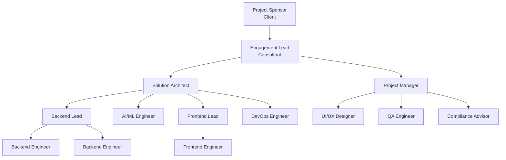

# PART 12 — RESOURCE PLAN
## Product: P2 — AI Marketing & Sales RevOps Engine
### Layer 5 — Project & Financial | Audience: PMO, Finance, Resource Managers

---

## 12.1 Team Structure

## 12.2 Roles & Responsibilities

| Role | Responsibilities | Required Skills | Seniority | Allocation |
|---|---|---|---|---|
| Solution Architect | Owns Parts 8–9, technical decisions, code review | Python, distributed system design, LangGraph, PostgreSQL | Senior | 0.5 FTE |
| Backend Lead | Leads agent service implementation, API design | Python/FastAPI, LangGraph, SQLAlchemy | Senior | 1.0 FTE |
| Backend Engineer (×2) | Implements Module 1–17 services | Python/FastAPI | Mid | 1.0 FTE each |
| AI/ML Engineer | LLM routing, RAG pipeline, prompt engineering, guardrails | Python, LangGraph, vector databases, prompt engineering | Senior | 1.0 FTE |
| Frontend Lead | Admin web app architecture, design system implementation | React/TypeScript, Tailwind | Senior | 1.0 FTE |
| Frontend Engineer | Screen implementation (Part 7) | React/TypeScript | Mid | 1.0 FTE |
| UI/UX Designer | Wireframes/visual design (Parts 6–7), design system | Figma, design systems, accessibility | Mid-Senior | 0.5 FTE |
| DevOps Engineer | CI/CD, Kubernetes, monitoring (Part 11) | Kubernetes, IaC (Terraform), Prometheus | Senior | 0.5 FTE |
| QA Engineer | Test plan execution, automation | Test automation, API testing | Mid | 1.0 FTE |
| Project Manager | Timeline, client communication, scope control | PM methodology, stakeholder management | Senior | 0.5 FTE |
| Compliance/Legal Advisor | Reviews consent/retention/jurisdiction rules (Module 14) | Data privacy law (GDPR and equivalents) | Senior | 0.1 FTE (advisory) |

## 12.3 Hours Matrix — Role × Module

| Module | Backend | Frontend | AI/ML | QA | Design |
|---|---|---|---|---|---|
| 1 — Lead Intake | 60 | 20 | 10 | 20 | 8 |
| 2 — Qualification Agent | 50 | 15 | 60 | 25 | 5 |
| 3 — Voice & Chat Engagement | 80 | 30 | 70 | 35 | 15 |
| 4 — Research Agent | 50 | 20 | 60 | 20 | 8 |
| 5 — Marketing Agent | 50 | 25 | 50 | 20 | 10 |
| 6 — Copywriting Agent | 40 | 20 | 50 | 18 | 8 |
| 7 — Deal-Closing Agent | 60 | 20 | 20 | 25 | 8 |
| 8 — CRM / Pipeline Management | 90 | 40 | 5 | 30 | 12 |
| 9 — Escalation & Human Handoff | 60 | 25 | 15 | 25 | 8 |
| 10 — Conversation Memory | 70 | 10 | 40 | 20 | 4 |
| 11 — Admin Configuration | 60 | 35 | 5 | 25 | 12 |
| 12 — Analytics & Reporting | 50 | 45 | 5 | 25 | 15 |
| 13 — Integration & Sync | 70 | 15 | 0 | 25 | 4 |
| 14 — Consent & Compliance | 50 | 25 | 5 | 25 | 8 |
| 15 — Knowledge Base | 60 | 25 | 50 | 22 | 8 |
| 16 — Notification & Alerting | 40 | 20 | 0 | 18 | 6 |
| 17 — Language & Localization | 50 | 20 | 15 | 20 | 6 |
| **Module subtotal** | **990** | **410** | **460** | **398** | **145** |

Plus cross-cutting: Architecture 120 hours, DevOps 100 hours, Project Management 150 hours, Compliance Advisory 20 hours.

**Total module-level hours: 2,403. Total project hours including cross-cutting: 2,793.**

## 12.4 Skill Requirements

| Role | Required Skill | Minimum Proficiency |
|---|---|---|
| Backend Engineer | Python/FastAPI | Advanced (3+ years) |
| Backend Engineer | SQLAlchemy/PostgreSQL | Intermediate |
| AI/ML Engineer | LangGraph/LLM orchestration | Advanced |
| AI/ML Engineer | Prompt engineering & RAG | Advanced |
| AI/ML Engineer | Vector databases (pgvector) | Intermediate |
| Frontend Engineer | React/TypeScript | Advanced |
| Frontend Engineer | Accessibility (WCAG 2.1 AA) | Intermediate |
| DevOps Engineer | Kubernetes | Advanced |
| DevOps Engineer | Infrastructure as Code (Terraform) | Intermediate |
| QA Engineer | API test automation (Pytest/Postman) | Intermediate |
| UI/UX Designer | Figma + design systems | Advanced |
| Solution Architect | Distributed systems design | Advanced |
| Compliance Advisor | GDPR/data privacy law | Advanced |

---

**Layer 5 Gate Check, Part 12:** ✅ Org chart present. ✅ All roles defined with skills/seniority/allocation. ✅ Hours matrix complete — every role × every module. ✅ Skill requirements with minimum proficiency levels.

*P2 Master SRS — Part 12 of 17 + Appendices.*
