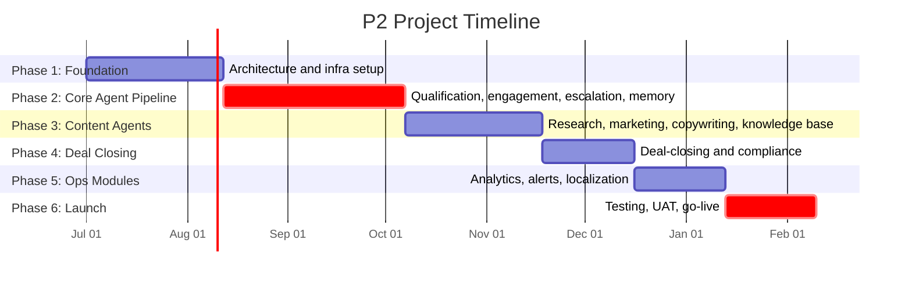

# PART 14 — PROJECT TIMELINE
## Product: P2 — AI Marketing & Sales RevOps Engine
### Layer 5 — Project & Financial | Audience: PMO, Client, Board

*Timeline assumes a kickoff date of 1 July 2026 — adjust all dates once actual kickoff is confirmed against Scope Lock signature.*

---

## 14.1 Development Phases

| Phase | Objective | Deliverables | Duration |
|---|---|---|---|
| 1 — Foundation & Architecture | Stand up core infra, CRM schema, admin config, sync framework | PostgreSQL schema deployed, Kubernetes cluster live, Modules 1/8/11/13 functional, CI/CD operational | 6 weeks |
| 2 — Core Agent Pipeline | Build qualification, engagement, escalation, memory | Modules 2/3/9/10 functional, LangGraph state machine operational, voice integration (Jambonz/Telnyx) live in QA | 8 weeks |
| 3 — Content & Marketing Agents | Build research, marketing, copywriting, knowledge base | Modules 4/5/6/15 functional, RAG pipeline operational | 6 weeks |
| 4 — Deal Closing & Compliance | Build deal-closing agent and compliance management | Modules 7/14 functional, consent/retention workflows live | 4 weeks |
| 5 — Analytics, Alerts & Localization | Build remaining ops modules | Modules 12/16/17 functional | 4 weeks |
| 6 — Testing, UAT, Launch | Full system test, UAT, go-live | Signed UAT, production cutover | 4 weeks |

**Total duration: 32 weeks (~7.4 months).**

## 14.2 Milestone Schedule

| Milestone | Deliverable | Target Date | Owner | Acceptance Criteria |
|---|---|---|---|---|
| M1 — Architecture & Infra Complete | End of Phase 1 | 9 Aug 2026 | Solution Architect | CI/CD pipeline green; CRM schema migrated; staging environment live |
| M2 — Core Agent Pipeline Complete | End of Phase 2 | 4 Oct 2026 | Backend Lead / AI-ML Engineer | End-to-end qualification→escalation flow passes integration tests |
| M3 — Content & Marketing Agents Complete | End of Phase 3 | 15 Nov 2026 | AI/ML Engineer | Research report generated within 48h SLA in test; campaign approval flow functional |
| M4 — Deal Closing & Compliance Complete | End of Phase 4 | 13 Dec 2026 | Backend Lead / Compliance Advisor | Payment link + human approval gate tested; consent/retention workflows pass compliance review |
| M5 — Full Feature Complete | End of Phase 5 | 10 Jan 2027 | Project Manager | All 17 modules functional in QA |
| M6 — UAT Sign-off | Mid Phase 6 | 24 Jan 2027 | Client + PM | Client signs UAT acceptance (Part 15.3) |
| M7 — Production Go-Live | End of Phase 6 | 7 Feb 2027 | DevOps / PM | Production cutover successful; monitoring green for 48 hours |

## 14.3 Gantt Chart

## 14.4 Critical Path

**Phase 2 (Core Agent Pipeline, 8 weeks) and Phase 6 (Testing/UAT/Launch, 4 weeks) are on the critical path.** Phase 2 is the longest single phase and gates everything downstream, since the LangGraph state machine and Memory Service (Module 10) must be stable before Phase 3's content agents can integrate retrieval and escalation. Within Phase 2, voice integration (Jambonz/Telnyx) is the highest-risk task — it depends on external SIP trunk provisioning with lead time outside the team's direct control.

**Critical path sequence**: Module 8 (CRM schema, Phase 1) → Module 10 (Memory) + Module 3 (Voice integration, Phase 2) → Module 15 (Knowledge Base, depends on Memory/RAG infra, Phase 3) → Module 7 (Deal-Closing, depends on CRM + Escalation, Phase 4) → UAT/Launch (Phase 6).

## 14.5 Dependencies Map

**Internal dependencies**:
- Module 8 (CRM) must exist before Module 1 (Intake) can write records.
- Module 10 (Memory) must exist before Module 3 (Engagement) can persist conversation context.
- Module 15 (Knowledge Base) must exist before Modules 2/3/4/6 can retrieve RAG content.
- Module 9 (Escalation) depends on trigger conditions defined in Modules 2/3.
- Module 11 (Admin Config) must exist before any module's configurable settings can be exposed in the UI.

**External dependencies**:
- Telnyx SIP account provisioning (lead time ~1–2 weeks) — must start in Phase 1 to be ready for Phase 2 voice integration.
- LLM provider API key procurement (OpenAI/Anthropic/Gemini) — ~1 week lead time.
- GPU neocloud account provisioning (RunPod/Lambda-class) — ~3–5 days lead time.
- Client's target market/geography decision for initial Knowledge Base seeding — needed before Phase 3 Research Agent testing can be meaningful.

## 14.6 Go-Live Plan

**Pre-launch checklist**: All 17 modules pass QA; security scan clean; load test meets Part 10 NFR targets; UAT signed; backup/restore drill completed (Part 11.6); consent notices configured for the go-live jurisdiction(s); API keys rotated to production values and masked; DNS/cutover plan reviewed; historical lead CSV prepared and column-mapped before cutover (see Data Migration Plan below).

**Data migration plan**: P2 supports CSV import of historical leads at go-live (AI-FR-116–118, Module 8), with column mapping, full-file validation before commit, and a 24-hour rollback window. This was confirmed as in-scope during project review (Decision Log DEC-P2-006, Part 17.5).

**Cutover procedure**: Blue-green deployment (Part 11.3) — deploy to production alongside any existing system, switch traffic during the lowest-traffic window for the deployment's timezone, monitor health checks for 1 hour before decommissioning parallel staging traffic.

**Rollback plan**: Automatic rollback if production health checks fail within the monitoring window (Part 11.3); manual rollback control remains available for 24 hours post-deploy.

---

**Layer 5 Gate Check, Part 14:** ✅ All milestones have dates and acceptance criteria. ✅ Critical path identified and highlighted. ✅ Gantt chart present.

*P2 Master SRS — Part 14 of 17 + Appendices.*
