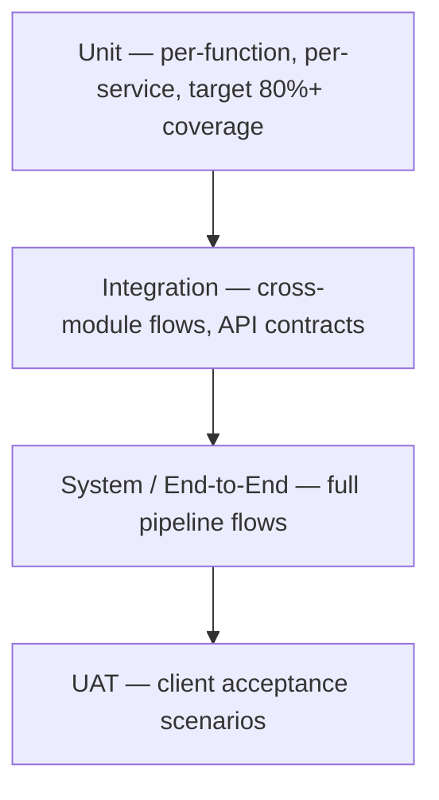

# PART 15 — TESTING & QA PLAN
## Product: P2 — AI Marketing & Sales RevOps Engine
### Layer 5 — Project & Financial | Audience: QA, PMO, Client

---

## 15.1 Testing Strategy

*Pyramid reads bottom-to-top: unit (broadest base) → integration → system/E2E → UAT (narrowest top).*

## 15.2 Test Types & Coverage

| Test Type | Scope | Tools | Pass Criteria | Responsibility |
|---|---|---|---|---|
| Unit | Individual functions/classes per service (Modules 1–17) | Pytest | ≥80% code coverage per service | Backend/AI-ML Engineers |
| Integration | Cross-module flows (e.g., Intake → Qualification → Escalation) | Pytest + test containers (PostgreSQL/Redis test instances) | All Part 5 use cases pass | Backend Lead |
| API/Contract | Endpoint catalog (Part 9.4) | Postman / Schemathesis | 100% endpoint coverage, schema validation passes | QA Engineer |
| System/E2E | Full pipeline (lead → conversion), admin workflows | Playwright + custom agent simulators | All Part 4 acceptance criteria pass | QA Engineer |
| Performance/Load | Per Part 10.1/10.2 targets | k6 or Locust | Meets NFR targets at Year-1 scale | DevOps + QA |
| Security | OWASP Top 10, penetration | OWASP ZAP, manual pentest | Zero unresolved Critical/High findings | DevOps + external pentester |
| AI Evaluation | Agent response quality, hallucination rate | Custom eval harness + human review | Per Section 15.6 thresholds | AI/ML Engineer |
| UAT | Client-facing acceptance scenarios | Manual, UAT script | Client sign-off | Client + PM |

## 15.3 UAT Plan

**UAT script template**: Scenario ID / Module / Steps / Expected Result / Actual Result / Pass-Fail / Tester / Date.

| Scenario | Module(s) | Description |
|---|---|---|
| UAT-001 | 1, 2 | Submit a lead via web form; confirm qualification chat starts within 5 minutes |
| UAT-002 | 3, 9 | Trigger an escalation via low-confidence simulation; confirm Human Agent handoff with full context |
| UAT-003 | 4 | Request a research report; confirm 48-hour delivery with all required sections |
| UAT-004 | 5 | Approve a campaign; confirm publish eligibility |
| UAT-005 | 7 | Complete a deal closure end-to-end, including the human-approval gate |
| UAT-006 | 14 | Apply a legal hold; confirm a right-to-be-forgotten request is blocked from auto-deleting that record |
| UAT-007 | 8 | Import a historical lead CSV; confirm row-level validation and successful commit |

**Sign-off process**: Client representative executes each scenario, marking pass/fail. Any failure opens a defect ticket. UAT is considered signed when 100% of Must-priority scenarios pass and any open Should-priority issues have an agreed remediation plan. Formal sign-off is captured against the Part 0.5 Approvals table.

## 15.4 Performance Test Scenarios

| Scenario | User/Load Count | Data Volume | Target |
|---|---|---|---|
| Concurrent chat conversations | 100 (launch), 500 (Year 1) | 50,000 leads | Agent response p95 < 5s (Part 10.1) |
| Concurrent voice calls | 20 simultaneous | N/A | Call connect latency < 2s |
| Pipeline dashboard under load | 50 concurrent admin users | 500,000 lead records (Year 1 volume) | Dashboard load < 2s, API p95 < 300ms |
| Bulk CSV import | N/A | 50,000-row file (max per AI-FR-116 validation) | Import validation completes within 5 minutes |
| Cost monitoring under sustained load | N/A | 30 days of billing data | Dashboard reflects within 1 hour of new data |

## 15.5 Security Test Requirements

- **OWASP coverage**: All 10 categories per Part 9.6's mapping.
- **Penetration test scope**: External-facing endpoints (chat widget API, voice webhook, payment webhook), admin authentication flows, API key management endpoints.
- **Vulnerability scan requirements**: Automated dependency scan on every build; SAST scan on every build (Part 11.3); DAST scan pre-release; annual third-party penetration test (Part 10.5).

## 15.6 AI Evaluation Framework

| Metric | Target | Measurement Method |
|---|---|---|
| Intent classification accuracy | ≥ 90%, per language (EN/AR/UR) | Labeled test set, evaluated per release |
| Knowledge Base retrieval relevance (top-3 hit rate) | ≥ 85% | Sampled retrieval evaluation |
| Hallucination rate | < 2% of responses contain a claim not traceable to Knowledge Base/Research Agent output | Sampled human review, 200 conversations/month |
| Response quality score | ≥ 4.0 average (1–5 scale) | Human-rated sample: relevance, tone-profile adherence (AI-BR-025), language correctness |
| Escalation appropriateness | True-positive rate ≥ 90%, false-escalation rate < 10% | Sampled review against AI-BR-001–004 trigger logs |

## 15.7 Acceptance Criteria Matrix (Representative Sample)

| Module | Feature | Acceptance Criterion | Test Case ID | Pass/Fail |
|---|---|---|---|---|
| 1 | Web form capture | Lead record created within 2 seconds | TC-0001 | Pending |
| 2 | Escalation trigger | Confidence <70% for 2 turns escalates (AI-BR-001) | TC-0008 | Pending |
| 7 | Human approval gate | No autonomous final close (AI-BR-005) | TC-0044 | Pending |
| 8 | Bulk import | Invalid row blocks entire import (AI-BR-048) | TC-0058 | Pending |
| 14 | Legal hold | Hold overrides scheduled deletion (AI-BR-019/040) | TC-0094 | Pending |

*Full acceptance criteria matrix — covering all Part 4 acceptance criteria across all 17 modules — is compiled in Appendix D at final delivery.*

---

**Layer 5 Gate Check, Part 15:** ✅ All test types covered. ✅ UAT script template complete with real scenarios. ✅ Performance scenarios match NFR targets. ✅ Security tests mapped to OWASP. ✅ AI evaluation framework included. ✅ Acceptance criteria matrix present.

*P2 Master SRS — Part 15 of 17 + Appendices.*
