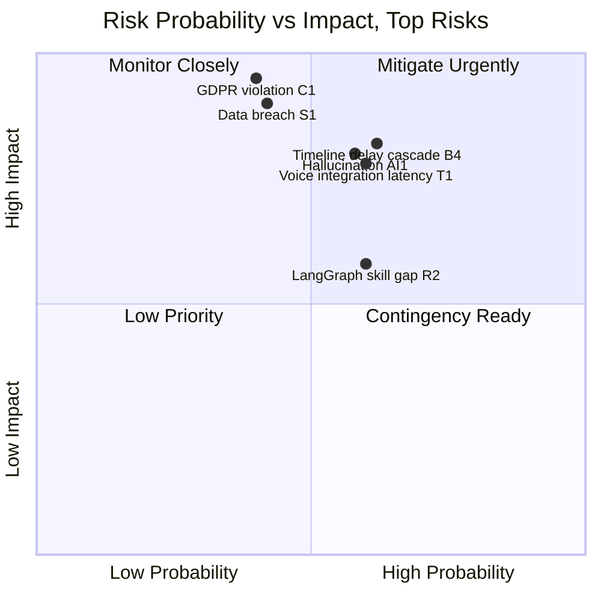

# PART 16 — RISK REGISTER
## Product: P2 — AI Marketing & Sales RevOps Engine
### Layer 5 — Project & Financial | Audience: PMO, Client

---

## Technical Risks

| ID | Risk Description | Prob (1–5) | Impact (1–5) | Score | Mitigation | Contingency | Owner | Review Date |
|---|---|---|---|---|---|---|---|---|
| T1 | Voice integration (Jambonz/Telnyx) fails to meet latency targets | 3 | 4 | 12 | Early Phase 1 SIP provisioning + load testing in Phase 2 | Fallback to commercial CPaaS (Twilio) | DevOps Engineer | Monthly |
| T2 | Self-hosted GPU instance underperforms or becomes unavailable | 3 | 3 | 9 | LLM Router API-tier fallback | Shift load to commercial API tier, absorb short-term cost | AI/ML Engineer | Monthly |
| T3 | Cross-module integration failures during Phase 2–3 handoffs | 3 | 3 | 9 | Integration test suite (Part 15.2) | Dedicated integration sprint buffer | Backend Lead | Bi-weekly |
| T4 | Open-source LLM model quality insufficient for high-volume tasks | 2 | 3 | 6 | Benchmark candidate models in Phase 1 | Route more conversation types to commercial API tier | AI/ML Engineer | Monthly |
| T5 | Performance at scale (Part 10.2 targets) not met by current architecture | 2 | 4 | 8 | Load testing before each major release (Part 15.4) | Pre-validated horizontal scaling plan (Part 11.4) | Solution Architect | Quarterly |

## Business Risks

| ID | Risk Description | Prob | Impact | Score | Mitigation | Contingency | Owner | Review Date |
|---|---|---|---|---|---|---|---|---|
| B1 | Scope creep beyond the 17 locked modules | 3 | 3 | 9 | Scope Lock Agreement signed before build | Formal change request process (Part 17.1) | PM | Bi-weekly |
| B2 | Stakeholder turnover (client-side sponsor change) | 2 | 3 | 6 | Documented decisions/rationale (this SRS) | Re-confirm locked decisions with new stakeholder | Engagement Lead | Monthly |
| B3 | Budget overrun beyond contingency (Part 13.6) | 2 | 4 | 8 | Monthly budget tracking against Part 13.1/13.3 | Re-prioritize Should-priority features | PM | Monthly |
| B4 | Timeline delays cascading from critical path (Part 14.4) | 3 | 4 | 12 | Critical path monitored weekly; external lead times tracked | Parallelize non-dependent Phase 3/5 work | PM | Weekly |
| B5 | Client decision delays on open items | 3 | 2 | 6 | Gaps flagged immediately with owner/date | Proceed with documented default, flag for later confirmation | PM | Weekly |

## Compliance Risks

| ID | Risk Description | Prob | Impact | Score | Mitigation | Contingency | Owner | Review Date |
|---|---|---|---|---|---|---|---|---|
| C1 | GDPR violation in an EU-deployed instance | 2 | 5 | 10 | Module 14 built to GDPR pattern (consent/retention/RTBF) | Legal review (Compliance Advisor) before EU go-live | Compliance Officer | Per deployment |
| C2 | Data residency requirement violated for a deployment region | 2 | 4 | 8 | Configurable hosting region per deployment (Part 8.9) | Re-provision database in correct region before go-live | System Admin | Per deployment |
| C3 | Telemarketing/consent law violation in a strict jurisdiction | 2 | 4 | 8 | Cold-calling out of scope; consent notice enforced (AI-BR-007) | Jurisdiction-specific call-time window enforcement | Compliance Officer | Per deployment |
| C4 | Audit/logging gap discovered during a regulator request | 2 | 3 | 6 | Compliance Audit Report designed for 5-minute retrieval | Manual log reconstruction from audit tables | Compliance Officer | Quarterly |
| C5 | Regulatory misalignment when P2 is reused for a new vertical | 3 | 3 | 9 | Jurisdiction/vertical rules configurable, not hardcoded | Compliance review per new vertical before activation | Compliance Officer | Per new deployment |

## Security Risks

| ID | Risk Description | Prob | Impact | Score | Mitigation | Contingency | Owner | Review Date |
|---|---|---|---|---|---|---|---|---|
| S1 | Data breach exposing prospect/customer PII | 2 | 5 | 10 | AES-256 at rest, TLS 1.3 in transit, RBAC | Incident response runbook, breach notification process | DevOps/Security | Quarterly |
| S2 | Unauthorized access via compromised admin credentials | 2 | 4 | 8 | SSO/JWT with 8-hour expiry, 30-min idle timeout | Forced credential rotation + session invalidation | System Admin | Monthly |
| S3 | API key leakage (LLM/telephony providers) | 2 | 4 | 8 | Masked display, encrypted at rest (AI-BR-034) | Immediate key rotation procedure | System Admin | Monthly |
| S4 | Prompt injection attempting to manipulate agent behavior | 3 | 3 | 9 | Knowledge-Base-only factual grounding limits exploitable surface | Flag anomalous input for human review | AI/ML Engineer | Monthly |
| S5 | Denial-of-service against public chat/voice ingress | 2 | 3 | 6 | Rate limiting (Part 9.4) | Temporary IP-based throttling, CDN/WAF escalation | DevOps | Monthly |

## AI-Specific Risks

| ID | Risk Description | Prob | Impact | Score | Mitigation | Contingency | Owner | Review Date |
|---|---|---|---|---|---|---|---|---|
| AI1 | Hallucination — agent states unverified facts | 3 | 4 | 12 | No-fabrication discipline + RAG grounding (AI-BR-018/020/024/042) | Sampled monitoring with rapid Knowledge Base correction | AI/ML Engineer | Monthly |
| AI2 | Bias in qualification/escalation decisions across languages/demographics | 2 | 4 | 8 | Per-language accuracy benchmarking (Part 15.6) | Model/prompt adjustment on detected bias | AI/ML Engineer | Quarterly |
| AI3 | Prompt injection causing unintended agent behavior | 3 | 3 | 9 | Same grounding discipline as S4 | Same as S4 | AI/ML Engineer | Monthly |
| AI4 | AI API cost overrun beyond the <$1,000/month ceiling | 3 | 3 | 9 | Cost dashboard with alerts (Module 11/16), hybrid routing | Temporarily restrict high-cost conversation types to self-hosted-only | System Admin | Weekly |
| AI5 | Model deprecation by a commercial LLM provider | 2 | 3 | 6 | Multi-provider routing avoids single-vendor dependency | Re-route to alternate provider via LLM Router config | AI/ML Engineer | Quarterly |

## Resource Risks

| ID | Risk Description | Prob | Impact | Score | Mitigation | Contingency | Owner | Review Date |
|---|---|---|---|---|---|---|---|---|
| R1 | Key-person dependency (e.g., sole AI/ML Engineer departs) | 2 | 4 | 8 | Documentation-first practice, pair programming on critical modules | Contractor backfill from consultant bench | PM | Monthly |
| R2 | Skill gaps in LangGraph/RAG among hired engineers | 3 | 3 | 9 | Skill requirements defined upfront (Part 12.4), targeted onboarding | Short-term specialist contractor engagement | PM | Monthly |
| R3 | Team availability conflicts with other concurrent engagements (P1/P3/P4) | 3 | 3 | 9 | Resource plan allocated per product, tracked centrally | Re-sequence phases or add contractor capacity | PM | Bi-weekly |
| R4 | Vendor dependency on Telnyx/Jambonz community support (no paid SLA) | 2 | 3 | 6 | Jambonz community is active; Telnyx offers paid support tiers | Upgrade to paid Telnyx support tier if issues recur | DevOps | Quarterly |
| R5 | GPU neocloud provider capacity unavailable when needed | 2 | 3 | 6 | Reserve instance where cost-effective, monitor availability | Temporary full reliance on commercial API tier | DevOps | Monthly |

---

**Layer 5 Gate Check, Part 16:** ✅ 5 risks per category (30 total). ✅ Every risk has both mitigation AND contingency. ✅ Probability/impact quadrant chart present.

*P2 Master SRS — Part 16 of 17 + Appendices.*
