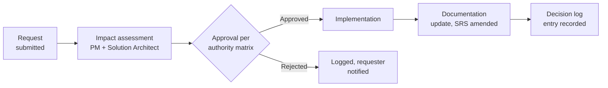

# PART 17 — GOVERNANCE
## Product: P2 — AI Marketing & Sales RevOps Engine
### Layer 5 — Project & Financial | Audience: PMO, Client, Board

---

## 17.1 Change Request Process

## 17.2 Approval Workflow

| Decision Type | Value/Scope | Approver |
|---|---|---|
| Scope addition (new feature/module) | Any | Client Sponsor + Engagement Lead (joint) |
| Scope addition | < 8 hours effort | PM (client notified) |
| Budget change | < 5% of total budget | PM |
| Budget change | ≥ 5% of total budget | Client Sponsor + Engagement Lead |
| Timeline change | < 1 week | PM |
| Timeline change | ≥ 1 week | Client Sponsor + Engagement Lead |
| Architecture change (Parts 8–9) | Any | Solution Architect + Engagement Lead |
| Compliance rule change (Module 14) | Any | Compliance Officer + Compliance Advisor |
| Security control change | Any | Solution Architect + Security/DevOps |

## 17.3 Communication Plan

| Stakeholder | Information | Frequency | Channel | Owner |
|---|---|---|---|---|
| Client Sponsor | Status summary, milestone progress | Weekly | Email/call | PM |
| Executive/Board | ROI summary | Quarterly | PDF report (Module 12) | PM |
| Future end users (Sales Ops Manager, etc.) | Feature preview/UAT readiness | Per milestone | Demo session | PM |
| Compliance Officer | Compliance-relevant changes | As needed, minimum monthly | Email + audit log | Compliance Advisor |
| Engineering team | Sprint priorities | Weekly | Standup | Engagement Lead |
| All stakeholders | Risk register updates | Per Part 16 review dates | Dashboard/report | PM |

## 17.4 Escalation Matrix

| Issue Type | Level 1 | Level 2 | Level 3 | Timeframe per Level |
|---|---|---|---|---|
| Technical defect (non-critical) | Backend/AI-ML Engineer | Solution Architect | Engagement Lead | L1: 24h, L2: 48h, L3: 1 week |
| Production outage (Critical) | On-call Engineer | DevOps Lead + Solution Architect | Engagement Lead + Client Sponsor | L1: 15 min, L2: 1 hour, L3: 4 hours |
| Compliance incident | Compliance Officer | Compliance Advisor | Client Sponsor + Legal | L1: same day, L2: 48h, L3: 1 week |
| Budget/timeline risk materializing | PM | Engagement Lead | Client Sponsor | L1: same day, L2: 3 days, L3: 1 week |
| Scope dispute | PM | Engagement Lead + Client Sponsor | Formal change request (17.1) | L1: 3 days, L2: 1 week, L3: per CR process |

## 17.5 Decision Log Template

| Decision ID | Date | Decision Made | Alternatives Rejected | Rationale | Approver |
|---|---|---|---|---|---|
| DEC-P2-001 | 21 Jun 2026 | P2 scope is vertical-agnostic, not school-confined | School-confined admissions bot | Client explicitly directed a reusable RevOps engine | Client |
| DEC-P2-002 | 21 Jun 2026 | P2 owns a standalone, generic CRM database | Connector-only agent layer with no DB | Reusability and independence from host system schema | Client |
| DEC-P2-003 | 21 Jun 2026 | Hybrid self-hosted GPU + commercial API LLM routing | Pure commercial API only | <$1,000/month cost ceiling required | Client/Consultant |
| DEC-P2-004 | 21 Jun 2026 | Jambonz (open-source) + Telnyx SIP for voice | Twilio-only commercial stack | Economical, open-source-first preference | Client/Consultant |
| DEC-P2-005 | 25 Jun 2026 | Documentation format: .md + mermaid diagrams, no .docx | PDF + DOCX per original guide | Client directive; portable, version-controllable format | Client |
| DEC-P2-006 | 25 Jun 2026 | P2 supports historical lead CSV import at go-live | Greenfield, zero records at launch | Client directive during Part 14 review | Client |

*This template is maintained going forward — every locked decision in this document traces back to a row here.*

## 17.6 Amendment Process

1. Any change to a locked Part requires a Change Request (Section 17.1) and impact assessment.
2. Approved changes increment the document version (e.g., v1.0 → v1.1) per Part 0.3's Version History.
3. The Decision Log (Section 17.5) records the change with rationale.
4. Affected downstream Parts are reviewed for consistency — e.g., a Part 1 scope change cascades to a review of Parts 3–9.
5. Re-approval/sign-off is required only for changes affecting Final Acceptance-relevant content (Part 0.5); minor clarifications do not require full re-signature.

---

**Layer 5 Gate Check, Part 17:** ✅ Change request flowchart present. ✅ Decision authority matrix. ✅ Communication plan. ✅ Escalation matrix with timeframes. ✅ Decision log populated. ✅ Amendment process defined.

**This completes all 17 Parts of the P2 Master SRS content.**

*P2 Master SRS — Part 17 of 17.*
