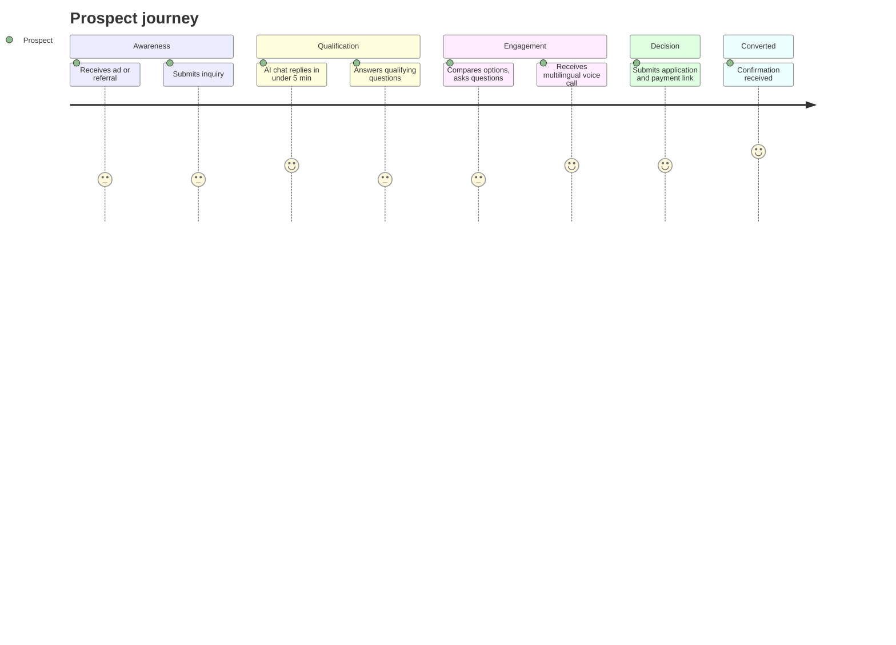
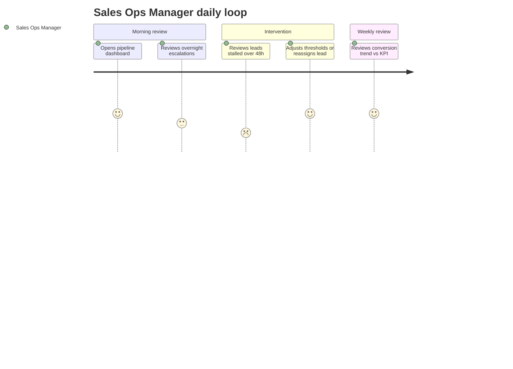
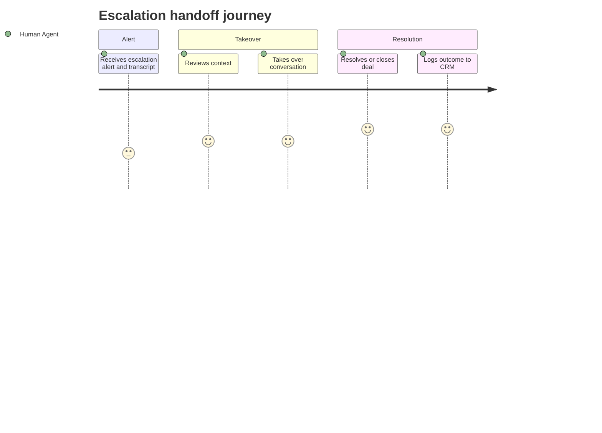

# PART 2 — STAKEHOLDERS & USERS
## Product: P2 — AI Marketing & Sales RevOps Engine
### Layer 1 — Business & Strategy | Audience: CEO, Board, Client, Investors

---

## 2.1 Stakeholder Register

| Role | Interest | Influence | Communication Need |
|---|---|---|---|
| Deploying Organization (Business Owner) | ROI, conversion rate, staffing reduction | High | Monthly KPI dashboard, quarterly ROI review |
| Sales Ops Manager | Pipeline health, escalation volume, agent performance | High | Real-time pipeline dashboard, weekly escalation report |
| Marketing Manager | Campaign output quality, brand consistency | Medium | Campaign approval queue, content review interface |
| Human Sales/Support Agent | Escalation handoff quality, conversation context | Medium | Escalation alert with full conversation history attached |
| Compliance Officer | Consent capture, data retention, jurisdiction rules | High | Audit log access, retention policy configuration panel |
| System Administrator / Integrator | CRM sync health, LLM routing config, GPU/API cost monitoring | High | System health dashboard, cost-monitoring alerts |
| Executive / Board | ROI, conversion trend, cost-per-deal | Medium | Quarterly executive summary report |
| Prospect (external) | Fast, relevant answers; not feeling "handled by a bot" | Low (no system access) | Chat/voice interaction only — no portal access |
| Customer (post-conversion, external) | Confirmation, smooth handoff to fulfillment | Low (no system access) | Confirmation messages, receipt/follow-up via chat or email |

## 2.2 User Personas

### Persona: Sales Ops Manager
| Field | Detail |
|---|---|
| Role | Configures escalation thresholds, monitors pipeline, reviews AI agent performance |
| Goals | Maximize conversion rate without increasing headcount; catch escalation failures early |
| Frustrations | Generic dashboards that don't show why a lead stalled; alert fatigue from over-broad thresholds |
| Tech comfort | High — comfortable with CRM tools and configuration panels, not a developer |
| Usage frequency | Daily |
| Quote | "I don't need every alert — I need the three leads that are about to walk." |

### Persona: Compliance Officer
| Field | Detail |
|---|---|
| Role | Sets retention policy, reviews consent logs, approves jurisdiction-specific call rules |
| Goals | Zero regulatory exposure; clean audit trail on demand |
| Frustrations | Systems that bury consent/retention settings inside engineering config instead of an accessible admin panel |
| Tech comfort | Medium — needs UI-level configuration, not code |
| Usage frequency | Weekly, plus ad hoc during audits |
| Quote | "If I can't pull a consent log in under five minutes, the feature doesn't exist for me." |

### Persona: Human Sales/Support Agent (Escalation Recipient)
| Field | Detail |
|---|---|
| Role | Receives escalated conversations per AI-BR-001–004, takes over chat/voice from the AI agent |
| Goals | Full context on handoff — no re-asking the prospect what they already told the bot |
| Frustrations | Cold handoffs with no conversation history; ambiguous reason for escalation |
| Tech comfort | Medium |
| Usage frequency | Daily, volume varies with escalation rate |
| Quote | "Don't make my first question to the customer be one they already answered twice." |

### Persona: System Administrator / Integrator
| Field | Detail |
|---|---|
| Role | Configures LLM routing, GPU/API cost thresholds, CRM sync rules, target-market parameters |
| Goals | Predictable cost, reliable sync, fast diagnosis when something breaks |
| Frustrations | Hidden cost spikes from voice/API usage; silent sync failures between P2 and host systems |
| Tech comfort | High — developer/DevOps background |
| Usage frequency | Daily during setup; ad hoc thereafter |
| Quote | "I want to know about a cost spike before the invoice does, not after." |

### Persona: Prospect (external, primary chat/voice user)
| Field | Detail |
|---|---|
| Role | Initiates inquiry, interacts with AI agent across chat/voice in their preferred language |
| Goals | Fast, accurate answers; clear next step; doesn't want to feel stuck in a bot loop |
| Frustrations | Repetitive questions, no path to a human, language switching mid-conversation |
| Tech comfort | Variable — not assumed to be technical |
| Usage frequency | One-time to a few sessions across the lead lifecycle |
| Quote | "Just tell me what happens next and let me talk to someone if I need to." |

## 2.3 User Journey Maps

### Figure 1 — Prospect Journey

### Figure 2 — Sales Ops Manager Daily Loop

### Figure 3 — Escalation Handoff Journey

## 2.4 Roles & Permissions Matrix

| Feature | Business Owner | Sales Ops Manager | Marketing Manager | Human Agent | Compliance Officer | Sys Admin | Executive |
|---|---|---|---|---|---|---|---|
| Configure target markets (AI-BR-006) | No | Yes | No | No | No | Yes | No |
| Configure cost thresholds | No | No | No | No | No | Yes | No |
| Configure escalation thresholds (AI-BR-001/002) | No | Yes | No | No | No | Yes | No |
| View pipeline / leads | Yes | Yes | Yes | Yes (assigned only) | No | Yes | Yes (aggregate only) |
| Edit lead/deal record | No | Yes | No | Yes (assigned only) | No | Yes | No |
| Take escalated conversation | No | No | No | Yes | No | No | No |
| Approve campaign content | No | No | Yes | No | No | No | No |
| View analytics/ROI reports | Yes | Yes | Yes (campaign metrics only) | No | No | Yes | Yes |
| Configure CRM sync (host integration) | No | No | No | No | No | Yes | No |
| Access call recordings | No | Yes (own team) | No | Yes (own calls) | Yes (all, audit) | Yes (technical) | No |
| Configure consent/retention policy (AI-BR-007/008) | No | No | No | No | Yes | Yes (implementation) | No |
| Trigger market research report | No | Yes | Yes | No | No | No | No |

*No blank cells — every role/feature combination is explicitly Yes/No.*

## 2.5 Accessibility Requirements

1. All internal admin interfaces (Sales Ops dashboard, Compliance panel, System Admin console) shall meet WCAG 2.1 AA.
2. All admin interfaces shall support RTL layout for Arabic-language admin users.
3. Color contrast ratio shall be ≥ 4.5:1 for normal text, ≥ 3:1 for large text, per WCAG 2.1 AA.
4. All admin interfaces shall be fully operable via keyboard navigation, with visible focus indicators.
5. Voice agent conversations shall provide a text-based transcript in real time for any prospect requiring accessibility accommodation.

---
*P2 Master SRS — Part 2 of 17 + Appendices. See Part 3 for Business Requirements.*
