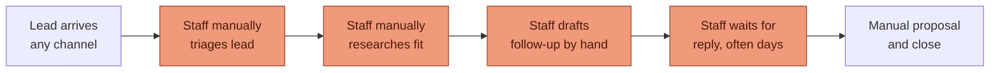
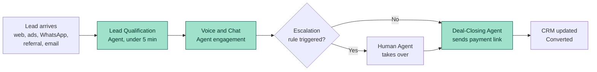
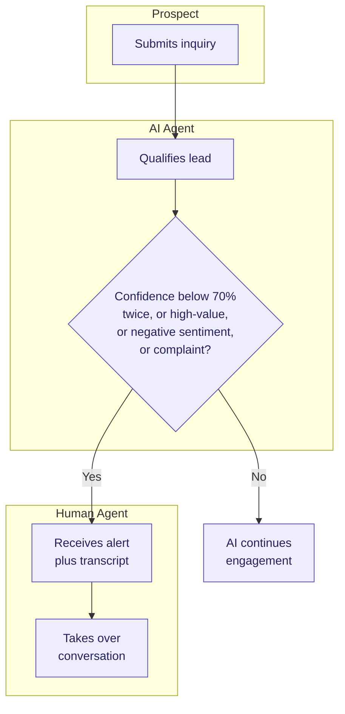

# PART 3 — BUSINESS REQUIREMENTS
## Product: P2 — AI Marketing & Sales RevOps Engine
### Layer 1 — Business & Strategy | Audience: CEO, Board, Client, Investors

---

## 3.1 Current State

### Figure 4 — Current State Process (manual, bottlenecks marked)

| Pain Point | Impact |
|---|---|
| Manual lead triage | Leads sit unattended outside business hours; no 24/7 coverage |
| Manual research per inquiry | Research quality and turnaround vary by staff member; no standard output |
| Manual follow-up drafting | Response time measured in hours/days, not minutes |
| Single-language staff coverage | Leads in unsupported languages get delayed or dropped |
| No unified lead record across channels | Same prospect contacting via two channels creates duplicate, disconnected records |

| Gap | Detail |
|---|---|
| No qualification scoring | All leads receive equal staff attention regardless of fit |
| No conversation memory | Each staff interaction starts without prior context |
| No standardized escalation rule | Escalation depends on individual staff judgment, not a defined threshold |

## 3.2 Future State

### Figure 5 — Future State Process (AI-driven)

| Benefit | Stakeholder |
|---|---|
| 24/7 lead response under 5 minutes (Part 1.4 KPI) | Prospect, Business Owner |
| Standardized, configurable escalation (AI-BR-001–005) | Sales Ops Manager, Human Agent |
| Single CRM record per lead, multi-channel (AI-BR-009/010) | Sales Ops Manager, System Admin |
| Consistent multilingual coverage (EN/AR/UR) | Prospect |
| Auditable consent and retention (AI-BR-007/008) | Compliance Officer |

## 3.3 Business Process Flows

### Figure 6 — Lead Qualification & Escalation (Swimlane)

### Process 2 — Market Research & Campaign Generation

1. Sales Ops or Marketing Manager triggers a research request for a configurable target market (AI-BR-006).
2. Research Agent compiles market/competitor/pricing data within 48 hours (Part 1.2, Objective 3).
3. Marketing Agent drafts campaign assets; Copywriting Agent generates copy variants.
4. Marketing Manager reviews and approves before publish (per permissions matrix, Part 2.4).

## 3.4 Business Rules

*(Continuing numbering from Part 1's AI-BR-001–008)*

9. **AI-BR-009**: Every lead shall receive a unique CRM identifier regardless of entry channel (web, ads, WhatsApp, referral, email).
10. **AI-BR-010**: If an inbound contact's phone number or email matches an existing CRM record within 90 days, the system shall merge the new interaction into the existing record rather than create a duplicate.
11. **AI-BR-011**: Campaign content generated by the Marketing or Copywriting Agent shall not publish without Marketing Manager approval.
12. **AI-BR-012**: Conversation memory (customer profile, history, preferences) shall persist across channels — a prospect switching from chat to voice retains full prior context.
13. **AI-BR-013**: The Research Agent's output shall be timestamped and versioned; a market report older than 90 days shall be flagged as stale on display.

## 3.5 Compliance Requirements

| Regulation/Requirement | Applies When | How the System Meets It |
|---|---|---|
| GDPR (EU) | Deployment configured for an EU market | Consent capture (AI-BR-007), 90-day audio retention with hard delete (AI-BR-008), data export/deletion on request |
| Regional telemarketing consent laws (e.g., TCPA-equivalent) | Any market with inbound-call regulation | System restricted to inquiry-based contact only — no outbound cold-calling in scope (Part 1.3, Out of Scope) |
| Data residency requirements | Market-dependent, varies by deployment | CRM hosting region is a configurable deployment parameter (carried to Part 8, Cloud Architecture) |
| WCAG 2.1 AA | All internal admin interfaces | Per Part 2.5 Accessibility Requirements |

## 3.6 Reporting Requirements

| Report | Audience | Frequency | Data Source | Format |
|---|---|---|---|---|
| Pipeline Conversion Report | Sales Ops Manager | Weekly | CRM | Dashboard + CSV export |
| Escalation Volume Report | Sales Ops Manager, Compliance Officer | Weekly | CRM, call/chat logs | Dashboard |
| Cost Monitoring Report | System Administrator, Business Owner | Weekly | LLM API billing, GPU usage logs | Dashboard + email alert on threshold breach |
| Executive ROI Summary | Business Owner, Executive/Board | Quarterly | CRM + cost data | PDF (per Part 1.6, Expected ROI) |
| Compliance Audit Report | Compliance Officer | On-demand | Consent logs, retention logs | Exportable log (CSV/PDF) |

---
*P2 Master SRS — Part 3 of 17 + Appendices. Layer 1 (Parts 0–3) complete. Layer 2 begins at Part 4 — Functional Requirements.*
