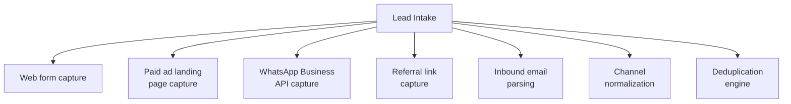

# PART 4 — FUNCTIONAL REQUIREMENTS
## Module 1: Lead Intake & Multi-Channel Capture
### Product: P2 — AI Marketing & Sales RevOps Engine | Layer 2 — Product & Functional

---

## Module Overview
This module captures inbound prospect contact from five channels (web forms, paid ad landing pages, WhatsApp Business API, referral links, inbound email) and creates or merges a CRM lead record. It normalizes channel-specific payloads into a single generic lead schema and enforces deduplication before handing off to Module 2 (Lead Qualification Agent).

## Feature Map

## Requirement List

| ID | Requirement Statement | Priority | Source |
|---|---|---|---|
| AI-FR-001 | The system shall capture lead data submitted through a web form and create a CRM lead record within 2 seconds of submission. | Must | Part 1.3 scope |
| AI-FR-002 | The system shall capture lead data from paid ad landing pages via a UTM parameter set and associate it with the originating campaign. | Must | Part 1.3 scope |
| AI-FR-003 | The system shall capture inbound WhatsApp Business API messages and create or update a CRM lead record. | Must | Part 1.3 scope |
| AI-FR-004 | The system shall capture referral-link clicks with a referral source identifier and associate it with the referring contact if known. | Should | Part 1.3 scope |
| AI-FR-005 | The system shall parse inbound email to a designated intake address and extract sender, subject, and body into a CRM lead record. | Must | Part 1.3 scope |
| AI-FR-006 | The system shall normalize all channel-specific payloads into a single generic lead schema (Lead, Account, Contact) before storage. | Must | Part 1.8, Constraint 3 |
| AI-FR-007 | The system shall apply the deduplication rule (AI-BR-010) to every newly captured lead before creating a new record. | Must | AI-BR-010 |

## User Stories

- As a Prospect, I can submit my contact details through a web form so that I receive a qualifying response without delay.
- As a Marketing Manager, I can see which channel a lead came from so that I can measure channel performance.
- As a System Administrator, I can enable or disable any intake channel per deployment so that intake matches the client's actual marketing footprint.

## Acceptance Criteria

1. Submitting a web form creates exactly one CRM lead record within 2 seconds, verified against submission timestamp.
2. A landing page visit with a UTM parameter set produces a lead record with the UTM source field populated, matching the original parameter value.
3. A WhatsApp message creates a lead record with channel = "WhatsApp" if no matching record exists within the dedup window (AI-BR-010); otherwise it appends to the existing transcript.
4. An inbound email to the intake address produces a lead record with sender email populated; a malformed/empty sender field routes to an error queue, not a silent drop.
5. Two leads submitted from different channels within 90 days using the same phone number merge into a single record (AI-BR-010), verifiable by querying for that phone number and confirming one record with two channel-touch entries.

## Business Rules

14. **AI-BR-014**: Each captured lead shall record its originating channel and, where available, campaign/UTM attribution data, immutably at time of creation.
15. **AI-BR-015**: An admin user shall be able to enable or disable any of the five intake channels per deployment without a code change.

## Permission Rules

| Feature | Business Owner | Sales Ops Manager | Marketing Manager | System Admin |
|---|---|---|---|---|
| Enable/disable intake channel | No | No | No | Yes |
| View intake channel attribution | Yes | Yes | Yes | Yes |
| Configure email intake address | No | No | No | Yes |
| Configure WhatsApp Business API credentials | No | No | No | Yes |

## Validation Rules

| Field | Type | Format | Required | Min/Max |
|---|---|---|---|---|
| Email (web form) | String | RFC 5322 | Yes | Max 254 chars |
| Phone (web form) | String | E.164 | Conditional (if voice/WhatsApp follow-up planned) | Max 15 digits |
| UTM source | String | Alphanumeric, no spaces | No | Max 100 chars |
| WhatsApp sender ID | String | E.164 phone format | Yes (auto-captured) | Max 15 digits |
| Inbound email sender | String | RFC 5322 | Yes | Max 254 chars |

## Error States

| Trigger | Message Shown | System Action |
|---|---|---|
| Web form submitted with invalid email format | "Please enter a valid email address." | Submission blocked client-side; no record created |
| WhatsApp message with media only, no text | None (internal) | Record created, flagged "needs manual review," routed to Sales Ops queue |
| Inbound email with malformed/empty sender | None (internal) | Routed to error queue; System Admin notified (Module 16) |
| Duplicate-merge conflict (concurrent writes) | None (internal) | Most recent write wins; conflict logged for audit |

## Edge Cases

1. Same prospect submits a web form, then messages WhatsApp from a different phone number — no phone match possible; system falls back to email match, otherwise creates a second record flagged "possible duplicate, unconfirmed" for manual review.
2. Web form submitted with a disposable/temporary email domain — record is still created (not blocked) but flagged "low-confidence contact."
3. Concurrent submissions from the same contact across two channels within the same second — deduplication engine processes sequentially and merges rather than creating a race-condition duplicate.
4. An intake channel (e.g., WhatsApp Business API) goes offline — system queues retries for up to 24 hours and alerts System Admin if down beyond 1 hour (Module 16).

---

**Layer 2 Gate Check:** ✅ All gates passed — requirement IDs, priorities, testable acceptance criteria, validation rules, error states, 4 edge cases.

*P2 Master SRS — Part 4, Module 1 of 17.*
