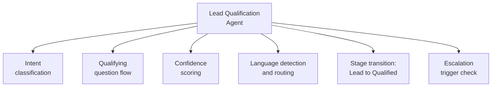

# PART 4 — FUNCTIONAL REQUIREMENTS
## Module 2: Lead Qualification Agent
### Product: P2 — AI Marketing & Sales RevOps Engine | Layer 2 — Product & Functional

---

## Module Overview
This agent evaluates each newly captured lead (Module 1) through an LLM-driven chat conversation to determine intent, fit, and qualification score within 5 minutes of capture (Part 1.2, Objective 2). It classifies leads from "Lead" to "Qualified" stage and triggers escalation per AI-BR-001/002 when confidence or value thresholds are met. It operates in English, Arabic, and Urdu, routed through the hybrid self-hosted/API model layer (Part 1, Constraint 1).

## Feature Map

## Requirement List

| ID | Requirement Statement | Priority | Source |
|---|---|---|---|
| AI-FR-008 | The system shall initiate a qualifying chat conversation within 5 minutes of lead intake. | Must | Part 1.2, Objective 2 |
| AI-FR-009 | The system shall detect the prospect's language (EN/AR/UR) from their first message and respond in that language unless the prospect switches. | Must | Part 1.3 scope |
| AI-FR-010 | The system shall ask a configurable set of qualifying questions and record responses against the lead's CRM record. | Must | Part 1.3 |
| AI-FR-011 | The system shall compute an intent-classification confidence score for each conversational turn. | Must | AI-BR-001 dependency |
| AI-FR-012 | The system shall transition a lead's CRM stage from "Lead" to "Qualified" when configurable qualifying criteria are met. | Must | Part 1.3, CRM pipeline |
| AI-FR-013 | The system shall trigger escalation per AI-BR-001 when confidence score is below 70% for two consecutive turns. | Must | AI-BR-001 |
| AI-FR-014 | The system shall trigger escalation per AI-BR-002 when a lead matches the configurable high-value threshold. | Must | AI-BR-002 |
| AI-FR-015 | The system shall route routine qualification conversations to the self-hosted model tier by default, escalating to the commercial API tier only on low confidence or detected complexity. | Must | Part 1, Constraint 1 |

## User Stories

- As a Prospect, I can answer a few qualifying questions in my own language so that I quickly find out if this fits my need.
- As a Sales Ops Manager, I can configure the qualifying question set so that criteria match the specific product/service being sold.
- As a System Administrator, I can see which model tier handled each conversation so that I can monitor cost.

## Acceptance Criteria

1. A new lead receives a first qualifying message within 5 minutes of CRM record creation.
2. A prospect writing in Arabic receives all subsequent responses in Arabic until they switch language, verified by a per-turn language log.
3. A lead answering all configured qualifying questions transitions to "Qualified" stage, verified by stage field change.
4. A conversation with confidence score <70% on turns 1 and 2 triggers an escalation event logged against AI-BR-001.
5. A conversation matching the high-value threshold triggers escalation regardless of confidence score, logged against AI-BR-002.

## Business Rules

16. **AI-BR-016**: The qualifying question set shall be configurable per deployment by an authorized admin user, without a code change.
17. **AI-BR-017**: A conversation shall not transition to "Qualified" without at least one recorded qualifying-question response — empty/skipped qualification does not auto-advance stage.

## Permission Rules

| Feature | Sales Ops Manager | Marketing Manager | Human Agent | System Admin |
|---|---|---|---|---|
| Configure qualifying question set | Yes | No | No | Yes |
| View qualification confidence scores | Yes | No | No | Yes |
| Override lead's CRM stage manually | Yes | No | Yes (assigned only) | Yes |
| Configure model-tier routing rules | No | No | No | Yes |

## Validation Rules

| Field | Type | Format | Required | Min/Max |
|---|---|---|---|---|
| Qualifying question response | String/Enum | Configurable per question | Yes, per configured question | Max 500 chars free text |
| Confidence score | Float | 0.00–1.00 | System-generated | N/A |
| Detected language | Enum | en / ar / ur | System-generated | N/A |

## Error States

| Trigger | Message Shown | System Action |
|---|---|---|
| No prospect response within 24h | "Just checking in — are you still interested?" (one auto follow-up) | If still no response, lead flagged "unresponsive," stage held at "Lead" |
| Ambiguous/mixed-language input | Defaults to English, with one-time prompt to switch | Logged for language-detection model review |
| Confidence score cannot be computed (model timeout) | None (internal) | Auto-escalated to Human Agent as fail-safe |

## Edge Cases

1. Prospect code-switches languages mid-conversation — system responds in the most recently detected language per turn, not the first-detected one.
2. Prospect gives contradictory answers across two qualifying questions — flagged "inconsistent responses" for Sales Ops review rather than silently disqualified.
3. A previously qualified lead re-contacts with materially different requirements — system re-runs qualification rather than treating prior qualification as permanent.
4. High-value threshold and low-confidence triggers occur simultaneously — both escalation reasons are logged, not just the first match.

---

**Layer 2 Gate Check:** ✅ All gates passed.

*P2 Master SRS — Part 4, Module 2 of 17.*
