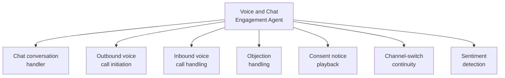

# PART 4 — FUNCTIONAL REQUIREMENTS
## Module 3: Voice & Chat Engagement Agent
### Product: P2 — AI Marketing & Sales RevOps Engine | Layer 2 — Product & Functional

---

## Module Overview
This agent carries a "Qualified" lead through ongoing chat and voice engagement to the "Engaged" stage — answering questions, handling objections, and conducting calls via Jambonz + Telnyx. It preserves conversation context across channel switches (AI-BR-012), draws answers from the Knowledge Base (Module 15), and applies the same escalation logic as Module 2 plus sentiment-based triggers.

## Feature Map

## Requirement List

| ID | Requirement Statement | Priority | Source |
|---|---|---|---|
| AI-FR-016 | The system shall continue a chat conversation with a "Qualified" lead, drawing on Conversation Memory and the Knowledge Base for consistent answers. | Must | Modules 10, 15 |
| AI-FR-017 | The system shall initiate an outbound voice call to a qualified lead when configured to do so, using Jambonz + Telnyx infrastructure. | Must | Part 1 scope |
| AI-FR-018 | The system shall answer inbound voice calls to the configured number(s) and route them to the Voice Agent pipeline. | Must | Part 1 scope |
| AI-FR-019 | The system shall play a recorded-call consent notice at the start of every voice interaction per AI-BR-007. | Must | AI-BR-007 |
| AI-FR-020 | The system shall detect sentiment per conversational turn and trigger escalation per AI-BR-003 on two or more negative turns. | Must | AI-BR-003 |
| AI-FR-021 | The system shall preserve full conversation context across a chat-to-voice or voice-to-chat channel switch, per AI-BR-012. | Must | AI-BR-012 |
| AI-FR-022 | The system shall transition a lead's CRM stage from "Qualified" to "Engaged" once a configurable minimum engagement turn count has occurred. | Must | Part 1.3, CRM pipeline |
| AI-FR-023 | The system shall record call audio and apply the 90-day retention/hard-delete policy per AI-BR-008. | Must | AI-BR-008 |

## User Stories

- As a Prospect, I can ask follow-up questions by chat or voice and get consistent answers either way.
- As a Prospect, I can hear a clear consent notice before any call is recorded.
- As a Sales Ops Manager, I can see sentiment trend per conversation so that I can identify at-risk deals.

## Acceptance Criteria

1. A prospect who qualifies via chat then calls in reaches a voice agent that already knows their prior chat context, verified against the call transcript.
2. Every recorded voice call begins with the consent notice played before any other agent speech.
3. Two consecutive turns with negative sentiment trigger escalation, logged against AI-BR-003.
4. A lead's stage updates to "Engaged" once the configured minimum turn count is reached.
5. Call audio older than 90 days is hard-deleted unless a legal-hold flag is present.

## Business Rules

18. **AI-BR-018**: The Knowledge Base (Module 15) shall be the single source for factual answers given by the Voice/Chat Agent — the agent shall not generate unverified factual claims about pricing, dates, or guarantees outside Knowledge Base content.
19. **AI-BR-019**: A legal-hold flag on a call record overrides the 90-day deletion rule (AI-BR-008) until removed by a Compliance Officer.

## Permission Rules

| Feature | Sales Ops Manager | Human Agent | Compliance Officer | System Admin |
|---|---|---|---|---|
| Configure outbound call triggers/schedule | Yes | No | No | Yes |
| Apply legal hold to a call record | No | No | Yes | No |
| View sentiment trend per conversation | Yes | Yes (own) | No | Yes |
| Listen to call recordings | Yes (own team) | Yes (own calls) | Yes (all, audit) | Yes (technical) |

## Validation Rules

| Field | Type | Format | Required | Min/Max |
|---|---|---|---|---|
| Outbound call target phone | String | E.164 | Yes | Max 15 digits |
| Sentiment score | Float | -1.00 to +1.00 | System-generated | N/A |
| Minimum engagement turn count (config) | Integer | Whole number | Yes, admin-set | Min 1, Max 50 |

## Error States

| Trigger | Message Shown | System Action |
|---|---|---|
| Outbound call fails to connect | None (internal) | Retry per schedule (e.g., +2h, +1 day), max 3 attempts, then flag for Human Agent |
| Voice call drops mid-conversation | "We seem to have lost the connection — we'll call back shortly." (via chat/SMS if available) | Auto-retry once; if unreachable, escalate to Human Agent |
| Consent notice playback fails (TTS/audio error) | Call does not proceed | Call aborted, logged, technical alert sent to System Admin (Module 16) |

## Edge Cases

1. Prospect explicitly declines call-recording consent — system does not proceed with a recorded call; offers chat-only continuation instead.
2. Prospect is on a voice call and sends a chat message mid-call from a different device — both interactions link to the same lead record without duplication or lost context.
3. Sentiment detection has low confidence due to non-native language input — system still escalates per AI-BR-003 (fail-safe toward human review) but logs the language caveat for the Human Agent.
4. Outbound call is attempted outside an appropriate calling-hours window for the prospect's time zone — system shall not place outbound calls outside a configurable allowed call-time window per target region.

---

**Layer 2 Gate Check:** ✅ All gates passed.

*P2 Master SRS — Part 4, Module 3 of 17.*
