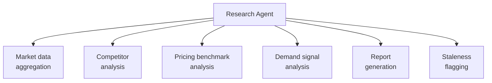

# PART 4 — FUNCTIONAL REQUIREMENTS
## Module 4: Research Agent
### Product: P2 — AI Marketing & Sales RevOps Engine | Layer 2 — Product & Functional

---

## Module Overview
This agent compiles market, competitor, and pricing research for any configured target product, market, or geography (AI-BR-006) within 48 hours of request (Part 1.2, Objective 3), without manual analyst input. Output feeds the Marketing Agent (Module 5) and is timestamped/versioned per AI-BR-013.

## Feature Map

## Requirement List

| ID | Requirement Statement | Priority | Source |
|---|---|---|---|
| AI-FR-024 | The system shall accept a research request specifying a target product/service and geography/market as configurable inputs (AI-BR-006). | Must | AI-BR-006 |
| AI-FR-025 | The system shall aggregate publicly available market data relevant to the requested product/market within 48 hours. | Must | Part 1.2, Objective 3 |
| AI-FR-026 | The system shall identify and summarize competitor offerings and pricing for the requested market. | Must | Part 1.2 |
| AI-FR-027 | The system shall generate a structured research report (market overview, competitors, pricing benchmarks, demand signals) in a standard template. | Must | Part 1.2 |
| AI-FR-028 | The system shall timestamp and version every research report per AI-BR-013, flagging reports older than 90 days as stale. | Must | AI-BR-013 |
| AI-FR-029 | The system shall notify the requesting user when the report is ready, or if the 48-hour SLA will be missed. | Should | Part 1.2 |

## User Stories

- As a Marketing Manager, I can request research on a new target market so that I can plan a campaign without commissioning manual analyst work.
- As a Sales Ops Manager, I can see when a research report is becoming stale so that I don't rely on outdated pricing data.

## Acceptance Criteria

1. A research request produces a completed report within 48 hours, verified by request timestamp vs. completion timestamp.
2. The report includes, at minimum: market overview, 3+ identified competitors (where available), pricing benchmark range, and demand signal summary — any missing section is explicitly flagged, not silently omitted.
3. A report older than 90 days displays a "stale — refresh recommended" flag.
4. If data for a requested market/product is insufficient, the report states this explicitly rather than fabricating placeholder competitors.

## Business Rules

20. **AI-BR-020**: The Research Agent shall not present fabricated or unverifiable competitor/pricing data; where data is unavailable, the report states "insufficient public data" for that section rather than estimating without basis.
21. **AI-BR-021**: A research report shall be attributed to its source data origin (search query, date accessed) for auditability.

## Permission Rules

| Feature | Sales Ops Manager | Marketing Manager | Executive | System Admin |
|---|---|---|---|---|
| Submit research request | Yes | Yes | No | Yes |
| View completed research reports | Yes | Yes | Yes (aggregate) | Yes |
| Configure target market parameters (AI-BR-006) | Yes | No | No | Yes |

## Validation Rules

| Field | Type | Format | Required | Min/Max |
|---|---|---|---|---|
| Target product/service name | String | Free text | Yes | Max 200 chars |
| Target market/geography | String | Country/region code or free text | Yes | Max 100 chars |
| Report request priority | Enum | Normal/Urgent | No, default Normal | N/A |

## Error States

| Trigger | Message Shown | System Action |
|---|---|---|
| Empty target market field | "Please specify a target market or geography." | Submission blocked, no request created |
| 48-hour SLA at risk | "Your research report may be delayed beyond 48 hours." | Logged; flagged for System Admin if it recurs |
| No usable public data found | Report generated with "insufficient public data" sections (AI-BR-020) | Requester notified report is partial |

## Edge Cases

1. Two users request research on the same product/market within the same 48-hour window — system reuses/extends the in-progress report rather than duplicating effort.
2. Conflicting publicly available pricing data across sources — system presents a pricing range with source count, not a fabricated single average.
3. Target market specified is too broad (e.g., "global") — system flags the request as low-precision and recommends narrowing, rather than silently producing a low-value report.

---

**Layer 2 Gate Check:** ✅ All gates passed.

*P2 Master SRS — Part 4, Module 4 of 17.*
