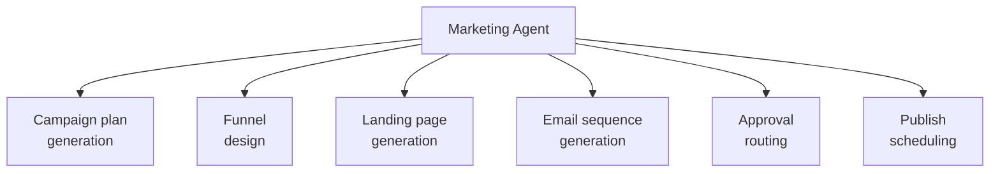

# PART 4 — FUNCTIONAL REQUIREMENTS
## Module 5: Marketing Agent
### Product: P2 — AI Marketing & Sales RevOps Engine | Layer 2 — Product & Functional

---

## Module Overview
This agent generates campaigns, funnels, landing pages, and email sequences from Research Agent output (Module 4) and Knowledge Base content (Module 15). All output routes through Marketing Manager approval (AI-BR-011) before publish — the agent drafts, it does not ship.

## Feature Map

## Requirement List

| ID | Requirement Statement | Priority | Source |
|---|---|---|---|
| AI-FR-030 | The system shall generate a campaign plan (objective, target segment, channel mix, timeline) from a completed Research Agent report. | Must | Module 4 |
| AI-FR-031 | The system shall generate funnel structure aligned to the CRM pipeline stages. | Must | Part 1.3 |
| AI-FR-032 | The system shall generate landing page content drafts in the configured languages (EN/AR/UR). | Must | Part 1.3 |
| AI-FR-033 | The system shall generate email sequence drafts (subject, body, send timing) for nurture campaigns. | Must | Part 1.3 |
| AI-FR-034 | The system shall route all generated campaign content to a Marketing Manager for approval before publish, per AI-BR-011. | Must | AI-BR-011 |
| AI-FR-035 | The system shall allow scheduling of approved campaign content for future publish dates. | Should | Part 1.3 |
| AI-FR-036 | The system shall not publish any campaign content without explicit Marketing Manager approval. | Must | AI-BR-011 |

## User Stories

- As a Marketing Manager, I can review and approve or reject AI-generated campaign content before it goes live.
- As a Marketing Manager, I can generate a campaign plan derived directly from a Research Agent report so that strategy and execution stay consistent.
- As a System Administrator, I can see which campaigns are pending approval so I can flag any bottleneck in the queue.

## Acceptance Criteria

1. A campaign plan generated from a Research Agent report references that report's ID via a traceability link.
2. Landing page drafts are generated in all three configured languages for a single campaign request.
3. No campaign content reaches "published" status without a logged approval action by an authorized Marketing Manager.
4. A rejected campaign draft returns to "draft" status with the rejection reason attached, not silently deleted.

## Business Rules

22. **AI-BR-022**: Rejected campaign content shall be retained in draft status with rejection reason logged, not deleted, for revision and audit purposes.
23. **AI-BR-023**: A campaign plan shall not be generated from a Research Agent report flagged "stale" (AI-BR-013) without an explicit override and acknowledgment by the requesting Marketing Manager.

## Permission Rules

| Feature | Sales Ops Manager | Marketing Manager | System Admin |
|---|---|---|---|
| Generate campaign plan/draft | No | Yes | Yes |
| Approve/reject campaign content | No | Yes | No |
| Schedule approved content for publish | No | Yes | No |
| View approval queue/bottlenecks | Yes | Yes | Yes |

## Validation Rules

| Field | Type | Format | Required | Min/Max |
|---|---|---|---|---|
| Campaign objective | String | Free text | Yes | Max 300 chars |
| Target segment | String | Free text or CRM filter | Yes | Max 300 chars |
| Scheduled publish date | Date/time | ISO 8601 | No | Must be future date if set |
| Language variant selection | Multi-select enum | en/ar/ur | Yes, at least one | N/A |

## Error States

| Trigger | Message Shown | System Action |
|---|---|---|
| Campaign generation requested from a stale research report | "This research report is over 90 days old. Confirm to proceed anyway." | Blocked until Marketing Manager confirms override (AI-BR-023) |
| Scheduled publish date set in the past | "Publish date must be in the future." | Submission blocked |
| Approval action attempted by unauthorized role | "You do not have permission to approve campaign content." | Action blocked, logged |

## Edge Cases

1. A campaign is approved, then its underlying research report is later flagged stale before the scheduled publish date — system flags the scheduled campaign for re-review rather than publishing on stale data silently.
2. Marketing Manager approves one language variant but rejects another for the same campaign — system supports per-language partial approval rather than treating the campaign as all-or-nothing.
3. Two Marketing Managers attempt to approve/reject the same content simultaneously — system applies the first recorded action and logs the conflicting second attempt rather than allowing contradictory states.

---

**Layer 2 Gate Check:** ✅ All gates passed.

*P2 Master SRS — Part 4, Module 5 of 17.*
