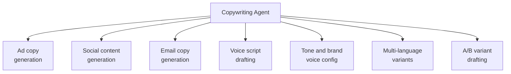

# PART 4 — FUNCTIONAL REQUIREMENTS
## Module 6: Copywriting Agent
### Product: P2 — AI Marketing & Sales RevOps Engine | Layer 2 — Product & Functional

---

## Module Overview
This agent generates copy variants (ad copy, social posts, email subject/body, voice agent scripts) in EN/AR/UR for assets defined by the Marketing Agent (Module 5), drawing on the Knowledge Base (Module 15) for factual accuracy and a configurable brand tone profile. Output feeds Module 5's approval pipeline and is reused by the Voice & Chat Agent (Module 3) for objection-handling scripts.

## Feature Map

## Requirement List

| ID | Requirement Statement | Priority | Source |
|---|---|---|---|
| AI-FR-037 | The system shall generate ad copy variants for a given campaign/channel, in configured languages. | Must | Module 5 |
| AI-FR-038 | The system shall generate social media post drafts aligned to the campaign objective. | Must | Module 5 |
| AI-FR-039 | The system shall generate email copy (subject + body) for sequences defined by the Marketing Agent. | Must | Module 5 |
| AI-FR-040 | The system shall generate voice agent script snippets for use by the Voice & Chat Engagement Agent. | Must | Module 3 |
| AI-FR-041 | The system shall apply a configurable brand tone profile consistently across all generated copy for a deployment. | Must | Part 1.3 |
| AI-FR-042 | The system shall generate at least 2 tagged copy variants per asset when A/B testing is requested. | Should | Part 1.3 |
| AI-FR-043 | The system shall route all generated copy through the same approval gate as Module 5 (AI-BR-011) before use. | Must | AI-BR-011 |

## User Stories

- As a Marketing Manager, I can generate multiple ad copy variants quickly so I can test which messaging resonates.
- As a System Administrator, I can configure the brand tone profile once so that all generated copy stays consistent without per-asset instruction.
- As a Sales Ops Manager, I can review voice agent objection-handling scripts before they go live in conversations.

## Acceptance Criteria

1. Ad copy generated for a campaign is produced in all configured languages for that deployment.
2. Two copy variants are generated and uniquely tagged when an A/B test is requested.
3. Generated copy under a "formal" tone profile does not include casual/colloquial phrasing, spot-checked against the tone configuration.
4. Voice agent script content is not used live by Module 3 until it passes the Module 5 approval gate.

## Business Rules

24. **AI-BR-024**: All copy generated by this module is subject to the same no-fabricated-claims discipline as the Research Agent (AI-BR-020) — generated copy shall not state factual claims (pricing, guarantees, dates) not present in the Knowledge Base.
25. **AI-BR-025**: A brand tone profile change applies only to newly generated copy going forward; previously approved/published copy is not retroactively altered.

## Permission Rules

| Feature | Marketing Manager | Sales Ops Manager | System Admin |
|---|---|---|---|
| Generate copy variants | Yes | No | Yes |
| Configure brand tone profile | Yes | No | Yes |
| Approve voice agent scripts for live use | Yes | No | No |
| Request A/B variant generation | Yes | No | Yes |

## Validation Rules

| Field | Type | Format | Required | Min/Max |
|---|---|---|---|---|
| Brand tone profile | Enum | Formal/Casual/Technical/Custom | Yes, default Formal | N/A |
| Number of A/B variants requested | Integer | Whole number | No, default 2 | Min 2, Max 5 |
| Copy asset language | Multi-select enum | en/ar/ur | Yes | N/A |

## Error States

| Trigger | Message Shown | System Action |
|---|---|---|
| Copy references a fact not in Knowledge Base | "One or more details could not be verified against the Knowledge Base." | Copy generated with the unverifiable claim omitted; flagged section highlighted |
| A/B variant count exceeds max (5) | "Maximum 5 variants per asset." | Request capped at 5, user notified |
| Voice script activated without approval | "This script has not been approved for live use." | Activation blocked |

## Edge Cases

1. Brand tone profile changes mid-campaign — unapproved draft copy regenerates under the new tone on request, but already-published copy is unchanged (AI-BR-025).
2. Copy is requested in a language not yet enabled in deployment config — request rejected with a message to enable the language first (Module 17), rather than silently generating unsupported output.
3. Two near-identical A/B variants are generated with no meaningful difference — system flags low-variance variant sets for Marketing Manager review rather than presenting them as a valid A/B test.

---

**Layer 2 Gate Check:** ✅ All gates passed.

*P2 Master SRS — Part 4, Module 6 of 17.*
