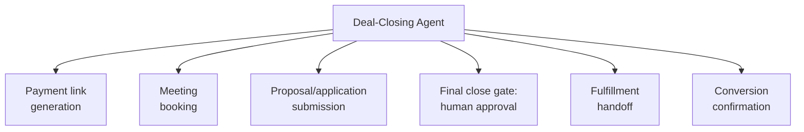

# PART 4 — FUNCTIONAL REQUIREMENTS
## Module 7: Deal-Closing Agent
### Product: P2 — AI Marketing & Sales RevOps Engine | Layer 2 — Product & Functional

---

## Module Overview
This agent moves an "Engaged" lead through "Submitted" to "Converted" by sending payment links, booking meetings, and capturing proposal/application data. The final close always passes through a human-approval gate (AI-BR-005) — this agent never autonomously confirms conversion or alters pricing.

## Feature Map

## Requirement List

| ID | Requirement Statement | Priority | Source |
|---|---|---|---|
| AI-FR-044 | The system shall generate and send a payment link when an "Engaged" lead requests to proceed. | Must | Part 1.3 |
| AI-FR-045 | The system shall offer calendar-based meeting booking for leads requiring a human conversation before closing. | Must | Part 1.3 |
| AI-FR-046 | The system shall capture proposal/application details and transition CRM stage to "Submitted." | Must | Part 1.3, CRM pipeline |
| AI-FR-047 | The system shall NOT autonomously confirm final conversion or alter pricing, per AI-BR-005. | Must | AI-BR-005 |
| AI-FR-048 | The system shall hand off a "Submitted" lead to a configured fulfillment system upon human approval. | Must | AI-BR-005 |
| AI-FR-049 | The system shall transition CRM stage to "Converted" only after fulfillment handoff confirms success. | Must | Part 1.3 |
| AI-FR-050 | The system shall send a confirmation message to the customer upon successful conversion. | Must | Part 1.3 |

## User Stories

- As a Prospect, I can receive a secure payment link in chat or via voice follow-up so that I can complete my purchase/application without delay.
- As a Human Agent, I must approve the final close before a deal is marked Converted, so that pricing and terms are always human-verified.
- As a System Administrator, I can configure which fulfillment system receives handoff data for a given deployment.

## Acceptance Criteria

1. A payment link is unique per transaction and expires per a configurable validity window.
2. CRM stage updates to "Submitted" immediately upon proposal/application capture.
3. No lead's stage updates to "Converted" without a recorded human-approval action, logged against AI-BR-005.
4. Fulfillment handoff failure does not silently mark the lead Converted — stage remains "Submitted" with an error flag until handoff succeeds.

## Business Rules

26. **AI-BR-026**: A payment link shall expire after a configurable validity window (default 7 days) and shall not be reused after expiry.
27. **AI-BR-027**: Fulfillment handoff failure shall block stage transition to "Converted" and shall raise an alert (Module 16) to the Sales Ops Manager.

## Permission Rules

| Feature | Sales Ops Manager | Human Agent | System Admin |
|---|---|---|---|
| Approve final close (AI-BR-005) | Yes | Yes (assigned) | No |
| Configure fulfillment handoff target | No | No | Yes |
| Configure payment link validity window | Yes | No | Yes |
| Manually resend payment link | Yes | Yes (assigned) | No |

## Validation Rules

| Field | Type | Format | Required | Min/Max |
|---|---|---|---|---|
| Payment link validity window | Integer (days) | Whole number | Yes, default 7 | Min 1, Max 30 |
| Proposal/application submitted data | Structured, configurable per deployment | N/A | Yes | N/A |
| Fulfillment handoff endpoint | URL | Valid HTTPS | Yes, admin-set | N/A |

## Error States

| Trigger | Message Shown | System Action |
|---|---|---|
| Payment link clicked after expiry | "This payment link has expired. Request a new one." | New link offered; old link invalidated |
| Fulfillment handoff target unreachable | None (internal) | Stage stays "Submitted," error flag raised, Sales Ops Manager alerted (AI-BR-027) |
| Unauthorized approval attempt | "You do not have permission to approve this close." | Action blocked, logged |

## Edge Cases

1. Prospect attempts to pay twice (two tabs, double-click) — system prevents duplicate payment processing and reconciles to a single transaction.
2. Human Agent approves close, but fulfillment handoff fails afterward — the approval record is not retroactively revoked; handoff failure is logged separately and retried without requiring re-approval.
3. Lead reaches "Submitted" but goes unresponsive before human approval — system flags the stalled approval after a configurable SLA (e.g., 48 hours) for Sales Ops Manager visibility.

---

**Layer 2 Gate Check:** ✅ All gates passed.

*P2 Master SRS — Part 4, Module 7 of 17.*
