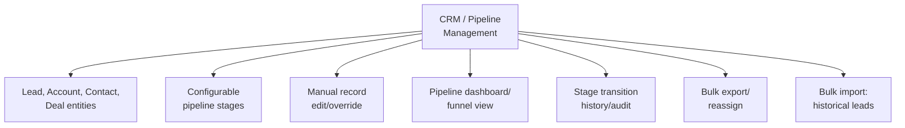

# PART 4 — FUNCTIONAL REQUIREMENTS
## Module 8: CRM / Pipeline Management
### Product: P2 — AI Marketing & Sales RevOps Engine | Layer 2 — Product & Functional

---

## Module Overview
This module is P2's own standalone, vertical-agnostic CRM (per the G9 architecture decision) — system of record for Lead, Account, Contact, and Deal entities, the configurable pipeline stage structure, and the manual-override/reporting surface. Every other agent module reads and writes against this data layer.

## Feature Map

*Addendum (v1.1): AI-FR-116–118 and AI-BR-048 added below to support historical lead import at go-live, per client decision during Part 14 review.*

## Requirement List

| ID | Requirement Statement | Priority | Source |
|---|---|---|---|
| AI-FR-051 | The system shall store Lead, Account, Contact, and Deal entities using a generic, vertical-agnostic schema. | Must | Part 1.8, Constraint 3 |
| AI-FR-052 | The system shall support a configurable pipeline stage sequence per deployment, defaulting to Lead → Qualified → Engaged → Submitted → Converted. | Must | Part 1.3 |
| AI-FR-053 | The system shall allow an authorized user to manually edit any lead/deal record field, with the edit logged. | Must | Part 2.4 |
| AI-FR-054 | The system shall display a real-time pipeline/funnel dashboard showing lead count per stage. | Must | Part 2.1 |
| AI-FR-055 | The system shall retain a complete stage-transition history per record (timestamp, prior stage, new stage, triggering agent or user). | Must | Part 2.4 |
| AI-FR-056 | The system shall support bulk export of CRM records to CSV. | Should | Part 3.6 |
| AI-FR-057 | The system shall support bulk reassignment of leads/deals between Human Agents. | Should | Part 2.4 |
| AI-FR-058 | The system shall enforce deduplication (AI-BR-010) at the database level, not only at intake. | Must | AI-BR-010 |
| AI-FR-116 | The system shall support bulk import of historical lead records via CSV upload, with column mapping from the CSV file to CRM fields (Lead, Contact). | Must | Part 14.6 (go-live decision) |
| AI-FR-117 | The system shall validate every row of an import file before committing any row, displaying validation errors with the originating row number. | Must | Master Production Guide §3.1.10 pattern |
| AI-FR-118 | The system shall allow an authorized user to roll back a completed import within 24 hours of completion. | Should | Master Production Guide §3.1.10 pattern |

## User Stories

- As a Sales Ops Manager, I can view a real-time funnel showing how many leads are at each stage so I can spot bottlenecks.
- As a Sales Ops Manager, I can manually override a lead's stage when the AI agent's automatic transition doesn't reflect reality.
- As a System Administrator, I can configure pipeline stage labels and sequence for a new deployment without a code change.
- As a System Administrator, I can import a CSV of historical leads at go-live so the pipeline isn't starting from zero.

## Acceptance Criteria

1. The pipeline dashboard reflects a stage change within 5 seconds of the underlying record update.
2. Every manual edit produces an audit entry: user ID, field changed, old value, new value, timestamp.
3. A deployment with custom stage labels (e.g., renaming "Submitted" to "Application Received") displays consistently across dashboard, reports, and agent logic — no per-surface reconfiguration needed.
4. Bulk export produces a CSV with all visible fields for the filtered record set, row count matching the filter result.
5. A bulk import with one or more invalid rows commits zero rows and returns a row-numbered error list, rather than partially importing.
6. An import rolled back within 24 hours removes exactly the records that import created, verified by record count matching the original import count.

## Business Rules

28. **AI-BR-028**: Pipeline stage configuration (labels, sequence) shall be defined once per deployment and referenced everywhere else — no second hardcoded copy of stage names anywhere in the system.
29. **AI-BR-029**: A manual stage override by an authorized user shall always take precedence over a pending automated stage-transition recommendation from any agent module.
48. **AI-BR-048**: A bulk import shall validate all rows before committing any row; imported leads are subject to the same deduplication rule (AI-BR-010) as any other intake channel, tagged with channel = "Imported."

## Permission Rules

| Feature | Sales Ops Manager | Human Agent | System Admin | Executive |
|---|---|---|---|---|
| Manually edit lead/deal record | Yes | Yes (assigned only) | Yes | No |
| Configure pipeline stage labels/sequence | Yes | No | Yes | No |
| View pipeline dashboard | Yes | Yes (assigned) | Yes | Yes (aggregate) |
| Bulk export records | Yes | No | Yes | No |
| Bulk reassign leads | Yes | No | Yes | No |
| Bulk import historical leads (CSV) | No | No | Yes | No |
| Roll back a completed import | No | No | Yes | No |

## Validation Rules

| Field | Type | Format | Required | Min/Max |
|---|---|---|---|---|
| Pipeline stage label (config) | String | Free text | Yes | Max 50 chars per stage |
| Number of pipeline stages (config) | Integer | Whole number | Yes, default 5 | Min 3, Max 10 |
| Manual edit reason (optional) | String | Free text | No | Max 500 chars |
| Import CSV file | File | .csv, UTF-8 | Yes | Max 50,000 rows per file |
| Column mapping | Structured (CSV column → CRM field) | N/A | Yes, per required field | N/A |

## Error States

| Trigger | Message Shown | System Action |
|---|---|---|
| Unauthorized manual stage override attempt | "You do not have permission to change this lead's stage." | Action blocked, logged |
| Pipeline configured with fewer than 3 stages | "A minimum of 3 pipeline stages is required." | Configuration save blocked |
| Bulk export exceeds system limit (e.g., 50,000 rows) | "Export limited to 50,000 records. Narrow your filter." | Export blocked until filter narrowed |
| Import file contains invalid rows | "Row [N]: [field] is invalid. Fix and re-upload." (per row) | Entire import blocked, zero rows committed (AI-BR-048) |
| Rollback attempted after 24-hour window | "This import can no longer be rolled back automatically. Contact support." | Rollback blocked |

## Edge Cases

1. An agent module attempts an automatic stage transition at the same moment a Sales Ops Manager manually overrides the stage — manual override wins (AI-BR-029); the agent's attempt is logged as superseded, not silently dropped.
2. A deployment reconfigures pipeline stages while leads already exist in the old structure — existing records map to the nearest equivalent new stage with a "stage mapping changed" flag, rather than breaking or defaulting to stage 1.
3. Two Human Agents are both assigned the same lead via a bulk-reassignment race condition — system resolves to the single most-recent assignment and logs the conflict rather than allowing dual-assignment.
4. An imported historical lead matches an existing record under AI-BR-010's dedup window — the import merges into the existing record rather than creating a duplicate, consistent with every other intake channel.

---

**Layer 2 Gate Check:** ✅ All gates passed.

*P2 Master SRS — Part 4, Module 8 of 17.*
