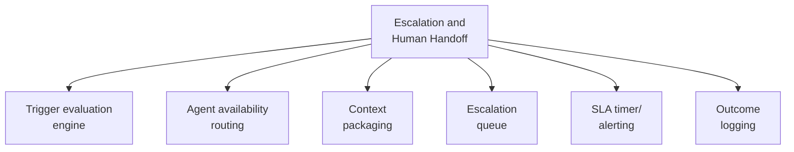

# PART 4 — FUNCTIONAL REQUIREMENTS
## Module 9: Escalation & Human Handoff
### Product: P2 — AI Marketing & Sales RevOps Engine | Layer 2 — Product & Functional

---

## Module Overview
This module evaluates AI-BR-001–004 trigger conditions across Modules 2 and 3, routes escalated conversations to an available Human Agent, and packages full conversation context for handoff. It's the formal feature implementation behind the escalation rules already defined in Parts 1 and 3.

## Feature Map

## Requirement List

| ID | Requirement Statement | Priority | Source |
|---|---|---|---|
| AI-FR-059 | The system shall continuously evaluate AI-BR-001–004 trigger conditions during any active chat or voice conversation. | Must | AI-BR-001–004 |
| AI-FR-060 | The system shall route an escalated conversation to an available Human Agent based on configurable routing rules (team, language, load). | Must | Part 2.4 |
| AI-FR-061 | The system shall package the full transcript, lead record, and escalation reason code into a single handoff view. | Must | Part 2.2 |
| AI-FR-062 | The system shall maintain an escalation queue visible to Sales Ops Manager, showing wait time per conversation. | Must | Part 2.1 |
| AI-FR-063 | The system shall raise an SLA alert if an escalation remains unclaimed beyond a configurable threshold (default 10 minutes). | Must | Part 2.1 |
| AI-FR-064 | The system shall log the outcome of every escalation (resolved, lost, reassigned). | Must | Part 3.6 |
| AI-FR-065 | The system shall record which specific AI-BR rule(s) triggered each escalation, supporting multiple simultaneous triggers. | Must | Module 2, Edge Case 4 |

## User Stories

- As a Human Agent, I want the full conversation context handed to me immediately so I never have to ask the prospect to repeat themselves.
- As a Sales Ops Manager, I want to see how long escalations sit unclaimed so I can staff appropriately.
- As a System Administrator, I can configure routing rules (language, team, load) so escalations reach the right agent.

## Acceptance Criteria

1. An AI-BR-001 escalation routes to a Human Agent within the SLA threshold, or raises an alert if it does not.
2. The handoff view includes the complete transcript, lead record link, and at least one escalation reason code.
3. An escalation triggered by two rules simultaneously logs both reason codes, not just one.
4. Escalation outcome is recorded for 100% of escalation events after a defined grace period.

## Business Rules

30. **AI-BR-030**: An escalation shall not be claimed by more than one Human Agent simultaneously — claiming is a single atomic action; first claim wins, others see "already claimed."
31. **AI-BR-031**: An escalation unclaimed beyond the SLA threshold shall automatically widen its routing pool rather than continuing to wait indefinitely on the original routing rule.

## Permission Rules

| Feature | Sales Ops Manager | Human Agent | System Admin |
|---|---|---|---|
| View escalation queue | Yes | Yes (own team) | Yes |
| Claim an escalation | No | Yes | No |
| Configure routing rules | Yes | No | Yes |
| Configure SLA threshold | Yes | No | Yes |
| View escalation outcome reports | Yes | No | Yes |

## Validation Rules

| Field | Type | Format | Required | Min/Max |
|---|---|---|---|---|
| SLA threshold (config) | Integer (minutes) | Whole number | Yes, default 10 | Min 1, Max 60 |
| Routing rule criteria | Structured (language, team, load) | N/A | Yes, admin-set | N/A |
| Escalation outcome | Enum | Resolved/Lost/Reassigned | Yes, set on close | N/A |

## Error States

| Trigger | Message Shown | System Action |
|---|---|---|
| Two agents claim the same escalation simultaneously | "This conversation has already been claimed by another agent." (to second claimant) | First claim wins (AI-BR-030); second attempt blocked, logged |
| Escalation unclaimed beyond SLA threshold | Internal alert to Sales Ops Manager | Routing pool widened automatically (AI-BR-031) |
| Human Agent closes without setting an outcome | "Please select an outcome before closing this conversation." | Closure blocked until outcome selected |

## Edge Cases

1. All agents matching routing criteria are simultaneously unavailable — system widens the routing pool immediately rather than waiting for the SLA timer, since "no available agent" is a stronger signal than "agents busy."
2. A claiming Human Agent loses connectivity mid-handoff — system detects inactivity beyond a configurable threshold and returns the escalation to the queue rather than leaving it permanently assigned.
3. A single conversation re-triggers escalation multiple times in a short window — system flags the pattern for Sales Ops Manager review rather than treating each as an independent event.

---

**Layer 2 Gate Check:** ✅ All gates passed.

*P2 Master SRS — Part 4, Module 9 of 17.*
