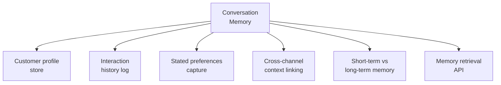

# PART 4 — FUNCTIONAL REQUIREMENTS
## Module 10: Conversation Memory
### Product: P2 — AI Marketing & Sales RevOps Engine | Layer 2 — Product & Functional

---

## Module Overview
This module persists customer/prospect profile data, interaction history, and stated preferences across channels and sessions (AI-BR-012) — the shared context layer Modules 2, 3, and 9 read from and write to. It distinguishes short-term session state from long-term persisted memory and enforces retention rules consistent with compliance requirements.

## Feature Map

## Requirement List

| ID | Requirement Statement | Priority | Source |
|---|---|---|---|
| AI-FR-066 | The system shall maintain a persistent customer profile linked to the CRM lead record, storing name, contact details, and stated preferences. | Must | Module 8 |
| AI-FR-067 | The system shall log every conversational turn against the customer profile, timestamped and channel-tagged. | Must | Part 1.3 |
| AI-FR-068 | The system shall make prior interaction history available to any agent module handling a subsequent interaction, per AI-BR-012. | Must | AI-BR-012 |
| AI-FR-069 | The system shall distinguish short-term session context from long-term persisted memory. | Must | Part 1.3 |
| AI-FR-070 | The system shall provide a memory retrieval API used internally by Modules 2, 3, and 9 within a bounded response-time budget. | Must | Part 1.4 |
| AI-FR-071 | The system shall apply configurable retention rules to chat transcripts, consistent with but independent of voice retention (AI-BR-008). | Must | AI-BR-008 |

## User Stories

- As a Prospect, I don't want to repeat myself when I switch from chat to voice or return after a few days.
- As a System Administrator, I can configure how long chat transcripts are retained, consistent with the voice retention policy.
- As a Human Agent, I want to see a concise summary of prior interactions, not just a raw transcript dump, when I take over a conversation.

## Acceptance Criteria

1. A prospect's prior stated preference is available to the Voice/Chat Agent in a subsequent session, verified by agent behavior respecting it.
2. Memory retrieval for an active conversation returns within a bounded latency (e.g., under 500ms).
3. Chat transcripts older than the configured retention window are deleted on schedule.
4. A Human Agent's handoff view includes a generated summary of prior interactions, not only a raw transcript.

## Business Rules

32. **AI-BR-032**: Conversation memory retention for chat transcripts shall be configurable independently of voice call audio retention (AI-BR-008), with the same default (90 days) unless overridden by Compliance Officer.
33. **AI-BR-033**: Stated preferences shall persist independently of transcript retention — even after transcript deletion, the derived preference remains unless explicitly revoked by the customer.

## Permission Rules

| Feature | Compliance Officer | System Admin | Human Agent | Sales Ops Manager |
|---|---|---|---|---|
| Configure memory/transcript retention window | Yes | Yes (implementation) | No | No |
| View full interaction history for a lead | No | Yes (technical/audit) | Yes (assigned) | Yes |
| View interaction summary | No | Yes | Yes (assigned) | Yes |
| Trigger manual memory deletion (right-to-be-forgotten) | Yes | Yes (implementation) | No | No |

## Validation Rules

| Field | Type | Format | Required | Min/Max |
|---|---|---|---|---|
| Chat transcript retention window (config) | Integer (days) | Whole number | Yes, default 90 | Min 1, Max 365 |
| Stated preference key/value | Structured key-value | N/A | No, captured opportunistically | N/A |
| Interaction summary length | Integer (words) | Whole number | System-generated, configurable cap | Max 200 words default |

## Error States

| Trigger | Message Shown | System Action |
|---|---|---|
| Memory retrieval API times out mid-conversation | None (internal) | Agent proceeds without historical context for that turn rather than stalling; logged for monitoring |
| Right-to-be-forgotten request received | "Your data deletion request has been received and will be processed within [X] days." | Profile, history, preferences scheduled for deletion (Module 14) |
| Retention window misconfigured (e.g., 0 days) | "Retention window must be at least 1 day." | Configuration save blocked |

## Edge Cases

1. A prospect requests deletion mid-active-conversation — system completes the current interaction without referencing deleted history, then schedules full deletion immediately after, rather than abruptly terminating the conversation.
2. Two agent modules request memory retrieval for the same lead within the same second — system serves consistent data to both rather than a race condition producing divergent context.
3. A stated preference contradicts an earlier one — system uses the most recent value and logs the change, rather than retaining the stale one or erroring.

---

**Layer 2 Gate Check:** ✅ All gates passed.

*P2 Master SRS — Part 4, Module 10 of 17.*
