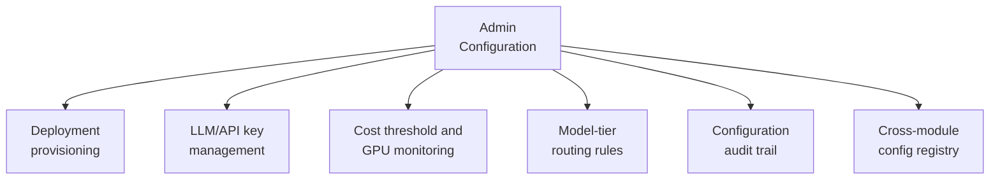

# PART 4 — FUNCTIONAL REQUIREMENTS
## Module 11: Admin Configuration
### Product: P2 — AI Marketing & Sales RevOps Engine | Layer 2 — Product & Functional

---

## Module Overview
This is the consolidated control panel tying together every configurable parameter declared across other modules (intake channels, escalation thresholds, target markets, pipeline stages, brand tone, retention windows) plus genuinely admin-only features: deployment provisioning, API key management, cost monitoring, and model-tier routing rules.

## Feature Map

## Requirement List

| ID | Requirement Statement | Priority | Source |
|---|---|---|---|
| AI-FR-072 | The system shall provide a single admin console indexing all configurable parameters across modules. | Must | Cross-module |
| AI-FR-073 | The system shall allow a System Administrator to provision a new deployment with its own CRM instance, configuration set, and API credentials. | Must | Part 1, G9 |
| AI-FR-074 | The system shall securely store and allow rotation of LLM and telephony API keys without exposing plaintext values after initial entry. | Must | Part 1, Constraint 1 |
| AI-FR-075 | The system shall display a real-time cost monitoring dashboard against the configured threshold (<$1,000/month). | Must | Part 1, Constraint 1 |
| AI-FR-076 | The system shall allow configuration of which conversation types route to self-hosted vs. commercial-API model tiers. | Must | Part 1, Constraint 1 |
| AI-FR-077 | The system shall log every configuration change to a dedicated audit trail. | Must | Part 2.4 |

## User Stories

- As a System Administrator, I can see every configurable setting in one place rather than hunting across modules.
- As a System Administrator, I can rotate an API key without downtime or needing to know the old key value.
- As a Business Owner, I can see at a glance how much of the monthly AI budget has been spent so far.

## Acceptance Criteria

1. The admin console lists all configuration items defined across Modules 1–10 and 12–17, each with a working link to its source module.
2. An API key, once entered, is never displayed in plaintext again — only a masked reference is shown.
3. The cost monitoring dashboard updates within 1 hour of new billing data being available.
4. Every configuration change produces a corresponding audit entry.

## Business Rules

34. **AI-BR-034**: API key values shall never be displayed in plaintext in any UI after initial entry — only masked references are shown.
35. **AI-BR-035**: A new deployment provisioned by this module shall receive a fully isolated CRM instance and configuration set — no shared data leakage between deployments by default.

## Permission Rules

| Feature | System Admin | Business Owner | Compliance Officer |
|---|---|---|---|
| Provision new deployment | Yes | No | No |
| Manage/rotate API keys | Yes | No | No |
| View cost monitoring dashboard | Yes | Yes | No |
| Configure model-tier routing rules | Yes | No | No |
| View configuration audit trail | Yes | No | Yes (read-only, compliance-relevant entries) |

## Validation Rules

| Field | Type | Format | Required | Min/Max |
|---|---|---|---|---|
| API key value | String, encrypted at rest | Provider-specific format | Yes | N/A |
| Cost threshold (config) | Decimal (currency) | USD, 2 decimal places | Yes, default 1000.00 | Min 0.01 |
| New deployment name | String | Alphanumeric, no spaces | Yes | Max 100 chars, must be unique |

## Error States

| Trigger | Message Shown | System Action |
|---|---|---|
| API key invalid format for selected provider | "This does not look like a valid [Provider] API key." | Save blocked |
| Cost threshold exceeded | "Monthly AI spend has exceeded the configured threshold." (to System Admin and Business Owner) | Non-blocking alert; no auto-halt unless a separate hard-stop flag is configured |
| New deployment name collides with existing one | "This deployment name is already in use." | Save blocked |

## Edge Cases

1. Cost threshold exceeded mid-month due to a voice-volume spike — system alerts within the hour rather than waiting for end-of-month reconciliation.
2. An API key is rotated while agents are mid-conversation using the old key — in-flight requests complete using the cached old key before fully switching, avoiding mid-conversation failures.
3. Two System Administrators provision a deployment with the same name simultaneously — first request succeeds, second receives the "already in use" error rather than creating a silently broken duplicate.

---

**Layer 2 Gate Check:** ✅ All gates passed.

*P2 Master SRS — Part 4, Module 11 of 17.*
