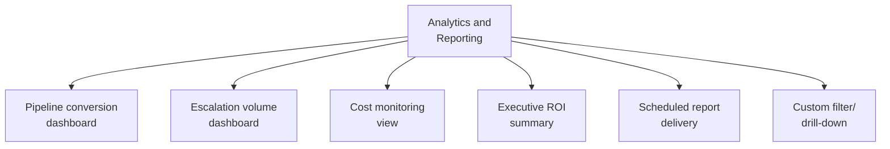

# PART 4 — FUNCTIONAL REQUIREMENTS
## Module 12: Analytics & Reporting Dashboard
### Product: P2 — AI Marketing & Sales RevOps Engine | Layer 2 — Product & Functional

---

## Module Overview
This module is the feature implementation behind Part 3.6's reporting requirements — pipeline conversion, escalation volume, cost monitoring, and executive ROI summary — rendered as interactive dashboards with filtering, drill-down, and scheduled export, scoped per the Part 2.4 permissions matrix.

## Feature Map

## Requirement List

| ID | Requirement Statement | Priority | Source |
|---|---|---|---|
| AI-FR-078 | The system shall render the Pipeline Conversion Report as an interactive dashboard with filters by date range, channel, and stage. | Must | Part 3.6 |
| AI-FR-079 | The system shall render the Escalation Volume Report with a trigger-rule breakdown and average time-to-claim. | Must | Part 3.6, Module 9 |
| AI-FR-080 | The system shall render a Cost Monitoring Report combining LLM API, GPU, and voice/telephony cost into one view. | Must | Module 11 |
| AI-FR-081 | The system shall generate an Executive ROI Summary on a quarterly schedule. | Must | Part 1.6 |
| AI-FR-082 | The system shall allow any report to be scheduled for automated delivery at a configurable frequency. | Should | Part 3.6 |
| AI-FR-083 | The system shall allow drill-down from any aggregate metric to underlying individual records. | Must | Part 2.4 |
| AI-FR-084 | The system shall export any report view to CSV or PDF on demand. | Should | Part 3.6 |

## User Stories

- As a Sales Ops Manager, I can drill down from a stalled-leads count directly into the list of affected leads.
- As an Executive, I can receive a quarterly ROI summary automatically without requesting it each time.
- As a System Administrator, I can see cost broken down by component (LLM API, GPU, voice) rather than one opaque total.

## Acceptance Criteria

1. The Pipeline Conversion dashboard, filtered to a date range and channel, matches a manual CRM query for the same filter.
2. The Escalation Volume report's per-rule counts sum to the total escalation count for the period.
3. A scheduled quarterly ROI summary generates and delivers without manual trigger.
4. Drilling down from an aggregate metric opens a filtered list matching that exact count.

## Business Rules

36. **AI-BR-036**: All dashboard figures shall be derived live from Module 8 (CRM) and Module 11 (cost) data — no separately maintained, potentially stale copy of metrics.
37. **AI-BR-037**: A report visible to a role shall only display data that role is authorized to see per the permissions matrix.

## Permission Rules

| Feature | Sales Ops Manager | Marketing Manager | Business Owner | Executive | System Admin |
|---|---|---|---|---|---|
| View Pipeline Conversion dashboard | Yes | No | Yes | Yes (aggregate) | Yes |
| View Escalation Volume dashboard | Yes | No | No | No | Yes |
| View Cost Monitoring view | No | No | Yes | Yes | Yes |
| View Executive ROI Summary | No | No | Yes | Yes | No |
| Schedule automated report delivery | Yes | Yes (own reports) | No | No | Yes |
| Export report to CSV/PDF | Yes | Yes (own reports) | Yes | Yes | Yes |

## Validation Rules

| Field | Type | Format | Required | Min/Max |
|---|---|---|---|---|
| Date range filter | Date pair | ISO 8601 | No, default last 30 days | End date ≥ start date |
| Report delivery frequency | Enum | Daily/Weekly/Monthly/Quarterly | Yes, if scheduling enabled | N/A |
| Export format | Enum | CSV/PDF | Yes, on export action | N/A |

## Error States

| Trigger | Message Shown | System Action |
|---|---|---|
| End date before start date | "End date must be after start date." | Filter not applied, prior valid filter retained |
| Scheduled delivery target invalid/unreachable | None (internal) | Logged; System Admin alerted after 2 consecutive failures |
| Drill-down on a metric with zero records | "No records match this view." | Empty state shown, not an error page |

## Edge Cases

1. A role's permissions change while they have a dashboard open — the new permission set applies on next data refresh rather than letting a stale, over-privileged view persist.
2. Cost Monitoring is viewed during a billing provider outage — dashboard shows last successfully retrieved figures with a "data as of [timestamp]" notice, rather than blank/zero values that could be misread as zero spend.
3. The quarterly ROI schedule falls before month-end reconciliation finishes — system flags the report "preliminary" rather than presenting it as final.

---

**Layer 2 Gate Check:** ✅ All gates passed.

*P2 Master SRS — Part 4, Module 12 of 17.*
