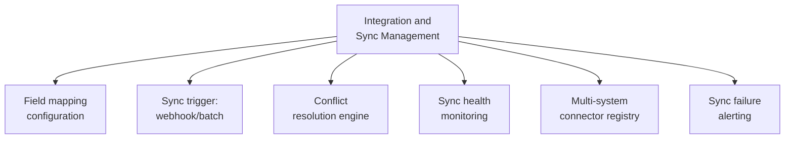

# PART 4 — FUNCTIONAL REQUIREMENTS
## Module 13: Integration & Sync Management
### Product: P2 — AI Marketing & Sales RevOps Engine | Layer 2 — Product & Functional

---

## Module Overview
This module is the direct functional implementation of the G9 architecture decision — managing the sync contract between P2's standalone CRM and any host system (e.g., P1), including field mapping, webhook/batch sync mechanisms, conflict resolution, and sync health monitoring. It resolves the open dependencies flagged in Part 1.9.

## Feature Map

## Requirement List

| ID | Requirement Statement | Priority | Source |
|---|---|---|---|
| AI-FR-085 | The system shall allow defining a field mapping between P2's generic CRM schema and a host system's schema per integrated deployment. | Must | Part 1.9 |
| AI-FR-086 | The system shall support both real-time webhook sync and scheduled batch sync, configurable per integration. | Must | Part 1.9 |
| AI-FR-087 | The system shall apply a configurable conflict-resolution rule when the same record is updated in both systems near-simultaneously. | Must | Part 1.9 |
| AI-FR-088 | The system shall monitor sync health and display last-successful-sync timestamp per integration. | Must | Part 1.9 |
| AI-FR-089 | The system shall alert System Admin on sync failure or when latency exceeds a configurable threshold. | Must | Part 1.9 |
| AI-FR-090 | The system shall support registering multiple host-system connectors, supporting P2's reusability across deployments. | Should | Part 1.3 (vertical-agnostic) |
| AI-FR-091 | The system shall log every sync transaction for audit and troubleshooting. | Must | Part 2.4 |

## User Stories

- As a System Administrator, I can define exactly which fields sync between P2 and a host system, and in which direction.
- As a System Administrator, I want to know immediately if sync breaks, not days later.
- As a Sales Ops Manager, I want confidence that a stage change I make in P2 reaches the host system promptly.

## Acceptance Criteria

1. A configured field mapping syncs only the mapped fields — unmapped fields remain untouched in both systems.
2. A webhook-configured sync reflects a P2-side change in the host system within a configurable target latency (e.g., under 30 seconds).
3. A simultaneous-update conflict resolves per the configured rule, with the final record state matching the rule's expected outcome.
4. A sync failure triggers a System Admin alert within 5 minutes of the failure.
5. Every sync transaction, successful or failed, has a corresponding log entry.

## Business Rules

38. **AI-BR-038**: A sync conflict shall never silently overwrite data without applying the configured resolution rule and logging which value won and why.
39. **AI-BR-039**: P2 shall continue operating independently if a host-system sync integration is down — sync failure degrades gracefully (queued for retry) and never blocks P2's own internal functionality.

## Permission Rules

| Feature | System Admin | Sales Ops Manager | Compliance Officer |
|---|---|---|---|
| Configure field mapping | Yes | No | No |
| Configure conflict-resolution rule | Yes | No | No |
| View sync health dashboard | Yes | Yes (read-only) | No |
| View sync transaction logs | Yes | No | Yes (audit access) |

## Validation Rules

| Field | Type | Format | Required | Min/Max |
|---|---|---|---|---|
| Field mapping pair | Structured key-value | N/A | Yes, per mapped field | N/A |
| Sync latency threshold (config) | Integer (seconds) | Whole number | Yes, default 30 | Min 1, Max 3600 |
| Conflict resolution rule (config) | Enum | Most-recent-wins/Source-of-truth-per-field/Manual review | Yes, default Most-recent-wins | N/A |

## Error States

| Trigger | Message Shown | System Action |
|---|---|---|
| Host system unreachable during sync | None (internal) | Queued for retry per backoff schedule (AI-BR-039); alerted if failures persist |
| Mapped field no longer exists in host schema (drift) | "Mapped field [X] no longer exists in the host system. Please update the mapping." | That field's sync pauses; other mapped fields continue |
| Conflict rule set to "Manual review" and a conflict occurs | "A sync conflict requires manual review." (to System Admin) | Record held in conflict state until resolved, not auto-merged |

## Edge Cases

1. A host system schema migration renames/removes a previously mapped field — system detects the mismatch on next sync and pauses only that field mapping rather than failing the entire sync.
2. A network partition causes both systems to independently update the same record multiple times before reconnecting — conflict resolution replays the full divergence history, not just the two most recent versions, to avoid losing an intermediate change that should have won.
3. A new deployment is provisioned before its field mapping is configured — sync stays inactive (not erroring) until mapping is explicitly set up, so an incomplete deployment doesn't generate noise alerts.

---

**Layer 2 Gate Check:** ✅ All gates passed.

*P2 Master SRS — Part 4, Module 13 of 17.*
