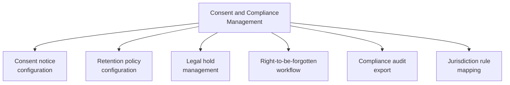

# PART 4 — FUNCTIONAL REQUIREMENTS
## Module 14: Consent & Compliance Management
### Product: P2 — AI Marketing & Sales RevOps Engine | Layer 2 — Product & Functional

---

## Module Overview
This module gives the Compliance Officer a working surface for what was previously scattered across business rules (AI-BR-007/008, AI-BR-019, AI-BR-032/033): consent notice configuration, retention policy management, legal-hold application, right-to-be-forgotten processing, and audit export.

## Feature Map

## Requirement List

| ID | Requirement Statement | Priority | Source |
|---|---|---|---|
| AI-FR-092 | The system shall allow configuring consent notice text and trigger point per AI-BR-007, per deployment/jurisdiction. | Must | AI-BR-007 |
| AI-FR-093 | The system shall allow configuring retention windows for call audio and chat transcripts independently, per deployment. | Must | AI-BR-008/032 |
| AI-FR-094 | The system shall allow applying or removing a legal hold on any call or lead record, overriding scheduled deletion. | Must | AI-BR-019 |
| AI-FR-095 | The system shall provide a right-to-be-forgotten intake and processing workflow coordinating deletion across CRM, Memory, and call recordings. | Must | Part 3.5 |
| AI-FR-096 | The system shall generate an exportable Compliance Audit Report covering consent, retention, and deletion events for a date range. | Must | Part 3.6 |
| AI-FR-097 | The system shall allow mapping jurisdiction-specific compliance rules without a code change. | Must | Part 3.5 |

## User Stories

- As a Compliance Officer, I can configure consent notice wording per jurisdiction without engineering involvement.
- As a Compliance Officer, I can pull a complete audit trail for a regulator request in under five minutes.
- As a Compliance Officer, I can place a legal hold on a record the moment I learn of a dispute, before any scheduled deletion runs.

## Acceptance Criteria

1. A jurisdiction-specific consent notice is played/shown only to prospects in that configured jurisdiction.
2. A retention window change applies to new records going forward without retroactively altering already-scheduled deletions unless explicitly requested.
3. A legal hold prevents a record's scheduled deletion date from executing.
4. A right-to-be-forgotten request results in confirmed deletion across all three data stores within the committed window.
5. A Compliance Audit Report for a date range includes every consent, retention, and deletion event in that window.

## Business Rules

40. **AI-BR-040**: A legal hold shall be removable only by a Compliance Officer, never automatically expired by the system, and its removal shall be logged with a reason.
41. **AI-BR-041**: A right-to-be-forgotten request shall be processed across all data stores holding the customer's data as a single coordinated workflow — partial deletion is not an acceptable end state without explicit Compliance Officer override and logged justification.

## Permission Rules

| Feature | Compliance Officer | System Admin | Sales Ops Manager |
|---|---|---|---|
| Configure consent notice text/jurisdiction mapping | Yes | Yes (implementation) | No |
| Configure retention windows | Yes | Yes (implementation) | No |
| Apply/remove legal hold | Yes | No | No |
| Process right-to-be-forgotten request | Yes | Yes (implementation) | No |
| Export Compliance Audit Report | Yes | Yes (technical) | No |

## Validation Rules

| Field | Type | Format | Required | Min/Max |
|---|---|---|---|---|
| Consent notice text (per jurisdiction) | String | Free text | Yes, per configured jurisdiction | Max 500 chars |
| Legal hold reason | String | Free text | Yes, when applying | Max 500 chars |
| Right-to-be-forgotten identity verification | Structured verification method | N/A | Yes, before processing | N/A |

## Error States

| Trigger | Message Shown | System Action |
|---|---|---|
| Right-to-be-forgotten request without identity verification | "We need to verify your identity before processing this request." | Held pending verification, not processed or rejected outright |
| Legal hold removal by non-Compliance-Officer | "Only a Compliance Officer can remove a legal hold." | Action blocked, logged |
| Jurisdiction mapping references undefined code | "This jurisdiction is not recognized. Please check the code." | Save blocked |

## Edge Cases

1. A right-to-be-forgotten request arrives for a record under legal hold for an unrelated dispute — system flags the conflict for Compliance Officer decision rather than auto-deleting (violating the hold) or auto-rejecting (violating the deletion right).
2. A prospect relocates mid-relationship, creating conflicting jurisdictional consent requirements — system applies the most protective applicable rule rather than defaulting to the original jurisdiction.
3. A retention window is shortened and existing records already exceed the new window — system flags these for accelerated deletion rather than ignoring the new rule or instantly mass-deleting without review.

---

**Layer 2 Gate Check:** ✅ All gates passed.

*P2 Master SRS — Part 4, Module 14 of 17.*
