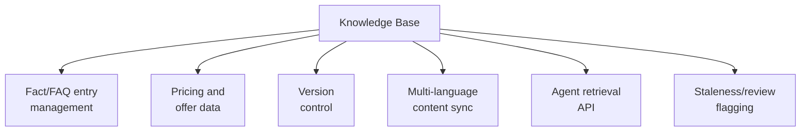

# PART 4 — FUNCTIONAL REQUIREMENTS
## Module 15: Knowledge Base / Agent Content Management
### Product: P2 — AI Marketing & Sales RevOps Engine | Layer 2 — Product & Functional

---

## Module Overview
This module is the single source of truth for product/service facts, pricing, and FAQ content that Modules 2, 3, 4, and 6 all draw from, per AI-BR-018/024 (no unverified factual claims outside Knowledge Base content). It enforces version control, multi-language coverage, and staleness flagging.

## Feature Map

## Requirement List

| ID | Requirement Statement | Priority | Source |
|---|---|---|---|
| AI-FR-098 | The system shall allow authorized users to create, edit, and delete Knowledge Base entries per deployment. | Must | AI-BR-018 |
| AI-FR-099 | The system shall version every entry, retaining prior versions for audit/rollback. | Must | Part 2.4 |
| AI-FR-100 | The system shall require an entry to exist in all configured languages or machine-translate with a "translated, unreviewed" flag if missing. | Must | Part 1.3 |
| AI-FR-101 | The system shall expose a retrieval API for Modules 2, 3, 4, and 6 within a bounded latency. | Must | Module 10 pattern |
| AI-FR-102 | The system shall flag an entry as stale if not reviewed within a configurable period (default 180 days). | Must | AI-BR-013 pattern |
| AI-FR-103 | The system shall log every instance where an agent found no Knowledge Base answer, building a gap-detection queue. | Should | Part 2.1 |

## User Stories

- As a Marketing Manager, I can update a pricing fact once and know every agent across chat, voice, research, and copywriting reflects it immediately.
- As a Sales Ops Manager, I can see which prospect questions the agents couldn't answer, so I know what content to add.
- As a content reviewer, I can see when an entry was last reviewed and flag stale ones for update.

## Acceptance Criteria

1. Editing a pricing fact is reflected in the next Voice/Chat Agent conversation referencing it, not a cached old value.
2. An entry missing a native-language version is internally flagged "translated, unreviewed" whenever cited.
3. An entry not reviewed within 180 days displays a staleness flag.
4. A question an agent couldn't answer is logged to the gap-detection queue.

## Business Rules

42. **AI-BR-042**: Knowledge Base content is the only source of truth for factual claims used by Modules 2, 3, 4, and 6 — the same discipline as AI-BR-018/024, formally owned by this module.
43. **AI-BR-043**: A machine-translated entry without native-language review shall be flagged "translated, unreviewed" in internal logs whenever cited, even though the prospect sees only the translated text.

## Permission Rules

| Feature | Marketing Manager | Sales Ops Manager | Compliance Officer | System Admin |
|---|---|---|---|---|
| Create/edit Knowledge Base entries | Yes | No | No | Yes |
| Review/clear staleness flag | Yes | No | No | Yes |
| View gap-detection queue | Yes | Yes | No | Yes |
| Configure staleness review period | No | No | No | Yes |

## Validation Rules

| Field | Type | Format | Required | Min/Max |
|---|---|---|---|---|
| Knowledge Base entry text | String | Free text, per language | Yes, at least one language | Max 2,000 chars per entry |
| Entry category | Enum | Fact/FAQ/Pricing/Offer | Yes | N/A |
| Staleness review period (config) | Integer (days) | Whole number | Yes, default 180 | Min 1, Max 730 |

## Error States

| Trigger | Message Shown | System Action |
|---|---|---|
| Entry deleted while actively cited by live agent flows | "This entry is in use by [N] active agent flows. Confirm deletion?" | Deletion requires confirmation; dependent flows fall back to "insufficient data" response rather than crashing |
| Retrieval API timeout mid-conversation | None (internal) | Agent proceeds without that fact, defaults to "let me confirm and follow up" rather than fabricating an answer |
| Entry submitted in only one language | "This entry is missing Arabic and Urdu versions. It will be auto-translated and flagged for review." | Saved with auto-translation and "unreviewed" flag (AI-BR-043) |

## Edge Cases

1. Two content owners edit the same entry simultaneously — last-save-wins for the entry body, but both versions are retained in version history so no edit is silently lost.
2. A pricing fact changes mid-conversation — system does not retroactively alter what was already said, uses the new price going forward, and flags the conversation for review if a deal closes on outdated pricing.
3. The gap-detection queue accumulates the same unanswered question from many prospects — system deduplicates by similarity and surfaces a frequency count rather than listing the same gap repeatedly.

---

**Layer 2 Gate Check:** ✅ All gates passed.

*P2 Master SRS — Part 4, Module 15 of 17.*
