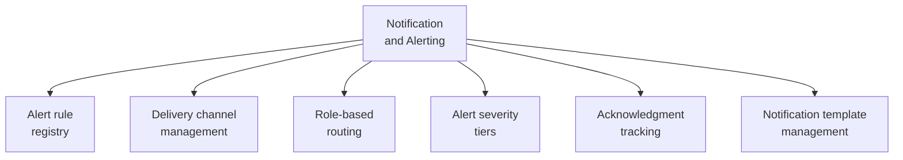

# PART 4 — FUNCTIONAL REQUIREMENTS
## Module 16: Notification & Alerting
### Product: P2 — AI Marketing & Sales RevOps Engine | Layer 2 — Product & Functional

---

## Module Overview
This module consolidates every alert/notification trigger referenced across other modules — escalation SLA (Module 9), cost threshold (Module 11), sync failure (Module 13), intake channel down (Module 1), compliance notices (Module 14) — into a single engine with configurable delivery channels and role-based routing.

## Feature Map

## Requirement List

| ID | Requirement Statement | Priority | Source |
|---|---|---|---|
| AI-FR-104 | The system shall provide a central alert rule registry referencing every alert-triggering condition defined across other modules. | Must | Cross-module |
| AI-FR-105 | The system shall support delivery via email, in-app dashboard, and SMS, configurable per alert type. | Must | Cross-module |
| AI-FR-106 | The system shall route each alert to the correct role(s) per the owning module's routing table. | Must | Cross-module |
| AI-FR-107 | The system shall classify every alert with a severity tier (Info, Warning, Critical) with different delivery urgency per tier. | Must | Cross-module |
| AI-FR-108 | The system shall track alert acknowledgment and escalate unacknowledged Critical alerts after a configurable threshold. | Must | Part 2.1 |
| AI-FR-109 | The system shall allow customizing notification template wording without a code change. | Should | Master Guide, Part 4 |

## User Stories

- As a System Administrator, I want all my alerts in one place with consistent severity levels, not five different ad hoc notification styles.
- As a Business Owner, I only want Critical alerts to reach me by SMS — everything else can wait for the dashboard.
- As a Sales Ops Manager, I want an unacknowledged Critical alert to escalate to someone else if I don't respond in time.

## Acceptance Criteria

1. Every alert-triggering condition in other modules resolves through this registry.
2. A Critical-severity alert delivers via both SMS and email within 1 minute of trigger.
3. An unacknowledged Critical alert escalates to a secondary recipient after the configured threshold.
4. A customized template change is reflected in the next triggered alert without a deployment/code change.

## Business Rules

44. **AI-BR-044**: Every alert-triggering condition defined anywhere in this specification shall register through this module's alert rule registry — no module implements a separate, undocumented notification path.
45. **AI-BR-045**: A Critical-severity alert unacknowledged beyond a configurable threshold (default 15 minutes) shall automatically escalate to a secondary recipient or role.

## Permission Rules

| Feature | System Admin | Business Owner | Compliance Officer |
|---|---|---|---|
| Configure alert delivery channel per type | Yes | No | No |
| Configure severity tier assignment | Yes | No | No |
| Customize notification templates | Yes | No | No |
| View alert acknowledgment history | Yes | No | Yes (compliance-relevant alerts only) |

## Validation Rules

| Field | Type | Format | Required | Min/Max |
|---|---|---|---|---|
| Alert severity tier | Enum | Info/Warning/Critical | Yes, per alert type | N/A |
| Acknowledgment escalation threshold (config) | Integer (minutes) | Whole number | Yes, default 15 | Min 1, Max 120 |
| Notification template text | String, free text with merge fields | N/A | Yes, per template | Max 1,000 chars |

## Error States

| Trigger | Message Shown | System Action |
|---|---|---|
| SMS delivery fails | None (internal) | Falls back to email; failure logged |
| Template saved with invalid merge field | "Unrecognized field: [X]. Check template syntax." | Save blocked until corrected |
| Alert registry references a deprecated module event | None (internal) | Orphaned rule flagged for System Admin cleanup, not silently retained |

## Edge Cases

1. The same condition (e.g., a sync failure) re-triggers repeatedly in a short window — system suppresses duplicate alerts after the first for a configurable cool-down period, rather than flooding recipients.
2. A Business Owner's SMS-configured number is invalid — system falls back to email and flags the misconfiguration to System Admin rather than silently failing delivery.
3. Two Critical alerts fire simultaneously for the same recipient — both deliver, but are not merged into one notification, preserving distinct acknowledgment tracking per alert.

---

**Layer 2 Gate Check:** ✅ All gates passed.

*P2 Master SRS — Part 4, Module 16 of 17.*
