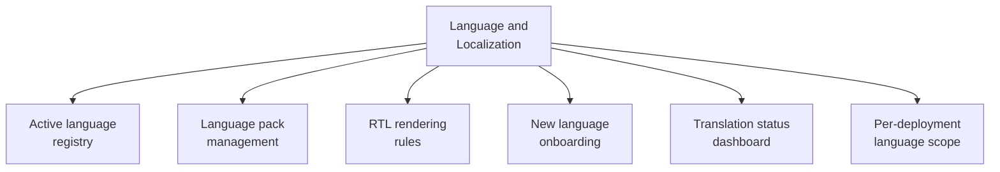

# PART 4 — FUNCTIONAL REQUIREMENTS
## Module 17: Language & Localization Management
### Product: P2 — AI Marketing & Sales RevOps Engine | Layer 2 — Product & Functional

---

## Module Overview
This module manages the active language set (EN/AR/UR at v1.0) and the mechanism for adding a new language as a configuration step rather than a re-architecture — language pack management, RTL rendering rules (Part 2.5), and coordination with Knowledge Base (Module 15) translation status.

## Feature Map

## Requirement List

| ID | Requirement Statement | Priority | Source |
|---|---|---|---|
| AI-FR-110 | The system shall maintain a registry of active languages per deployment, defaulting to English, Arabic, Urdu. | Must | Part 1.8, Constraint 2 |
| AI-FR-111 | The system shall apply RTL rendering rules automatically for any RTL-flagged language across admin interfaces. | Must | Part 2.5 |
| AI-FR-112 | The system shall provide an onboarding workflow for adding a new language: language pack creation, Knowledge Base translation trigger, voice STT/TTS verification. | Must | Module 15, Module 3 |
| AI-FR-113 | The system shall display a translation status dashboard showing native vs. machine-translated Knowledge Base coverage per language. | Should | Module 15 |
| AI-FR-114 | The system shall allow scoping which languages are active for a given deployment independently of the global supported-language list. | Must | Part 1.8, Constraint 2 |
| AI-FR-115 | The system shall block live-agent activation of a new language until Knowledge Base content gap and voice support are both verified ready. | Must | Module 15, Module 3 |

## User Stories

- As a System Administrator, I can add a fourth language as a configuration step rather than a development project.
- As a Marketing Manager, I can see what percentage of Knowledge Base content is natively translated versus machine-translated per language.
- As a Compliance Officer, I want assurance that a new language isn't activated for live prospects until its content and voice support are actually ready.

## Acceptance Criteria

1. Adding a new language to the active registry does not enable live use until the readiness gate (AI-FR-115) passes.
2. RTL rendering applies automatically to any interface displaying an RTL-flagged language.
3. The translation status dashboard accurately reflects native-vs-machine-translated ratios per language, matching Module 15's entry-level flags.
4. A deployment scoped to English and Arabic only does not expose Urdu in any agent-facing language selection.

## Business Rules

46. **AI-BR-046**: A new language shall not be activated for live prospect-facing agent use until both Knowledge Base coverage and voice STT/TTS support are verified ready — partial readiness blocks activation rather than triggering a degraded "best effort" launch.
47. **AI-BR-047**: Per-deployment language scope shall never expose a language to prospects that is not in that deployment's active registry, even if globally supported elsewhere.

## Permission Rules

| Feature | System Admin | Marketing Manager | Compliance Officer |
|---|---|---|---|
| Add/onboard a new language | Yes | No | No |
| Scope active languages per deployment | Yes | No | No |
| View translation status dashboard | Yes | Yes | No |
| Approve new language activation (readiness override) | Yes | No | Yes (compliance sign-off) |

## Validation Rules

| Field | Type | Format | Required | Min/Max |
|---|---|---|---|---|
| Language code (config) | Enum | ISO 639-1 | Yes | N/A |
| RTL flag | Boolean | Yes/No | Yes, per language | N/A |
| Active deployment language scope | Multi-select from global registry | N/A | Yes, at least one | N/A |

## Error States

| Trigger | Message Shown | System Action |
|---|---|---|
| Activation attempted before readiness gate passes | "This language cannot go live until Knowledge Base and voice support are verified ready." | Activation blocked |
| Deployment scoped to zero languages | "At least one language must be active." | Save blocked |
| RTL flag missing for a language requiring it | "Arabic requires the RTL flag to be enabled." | Save blocked until corrected |

## Edge Cases

1. A new language passes Knowledge Base readiness but voice support lags — system allows chat-only activation while blocking voice specifically, rather than an all-or-nothing gate.
2. A deployment removes a previously active language after prospects have interacted in it — existing conversation history/memory is retained, even though new conversations in that language are no longer offered.
3. Mixed LTR/RTL content within code-switched Arabic-English chat — system defers to the dominant detected language's directionality rather than producing a broken mixed-direction layout.

---

**Layer 2 Gate Check:** ✅ All gates passed.

**Part 4 — Functional Requirements is now complete across all 17 modules.** Total: AI-FR-001 through AI-FR-115, AI-BR-001 through AI-BR-047.

*P2 Master SRS — Part 4, Module 17 of 17 (final module).*
