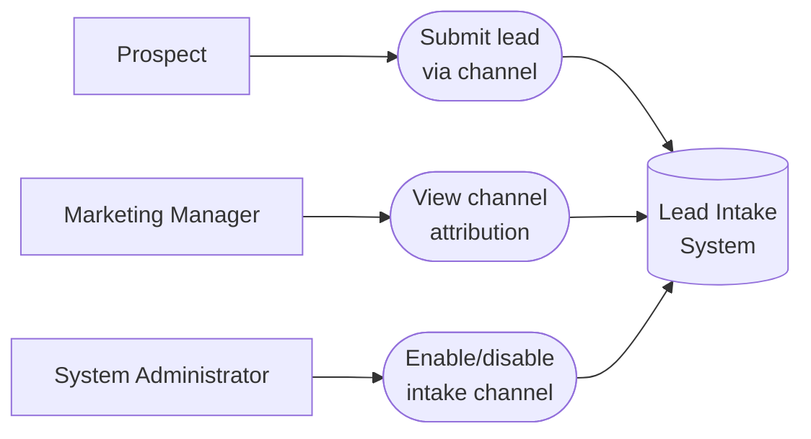

# PART 5 — USE CASES
## Module 1: Lead Intake & Multi-Channel Capture
### Product: P2 — AI Marketing & Sales RevOps Engine | Layer 2 — Product & Functional

---

## Use Case Diagram

## UC-P2-001: Submit Lead via Channel

| Field | Detail |
|---|---|
| Actor | Prospect |
| Preconditions | Prospect has access to at least one active intake channel |
| **Main Flow** | 1. Prospect accesses an active intake channel. 2. Prospect provides required contact information. 3. System validates input against Module 1 validation rules. 4. System checks for an existing matching record (AI-BR-010). 5. System creates or merges the lead record (AI-FR-001–007). 6. System hands off the lead to Module 2 (Lead Qualification Agent). |
| **Alternate Flows** | 3a. Validation fails (e.g., invalid email) → system displays error, prospect corrects and resubmits. 4a. Matching record found → system merges into the existing record instead of creating a new one. |
| **Exceptions** | E1. Intake channel is disabled/offline → submission is not accepted; prospect sees no option to use that channel. E2. Inbound email has a malformed sender → routed to the error queue. |
| Postconditions | A CRM lead record exists, attributed to its originating channel, ready for qualification. |

## UC-P2-002: View Channel Attribution

| Field | Detail |
|---|---|
| Actor | Marketing Manager |
| Preconditions | Marketing Manager has "View intake channel attribution" permission |
| **Main Flow** | 1. Marketing Manager opens the Analytics & Reporting Dashboard (Module 12). 2. Marketing Manager filters by channel. 3. System displays lead counts and attribution data per channel (AI-BR-014). |
| **Alternate Flows** | None |
| **Exceptions** | E1. No leads exist for the selected filter → system shows an empty state, not an error. |
| Postconditions | Marketing Manager has visibility into channel performance to inform campaign decisions. |

## UC-P2-003: Enable/Disable Intake Channel

| Field | Detail |
|---|---|
| Actor | System Administrator |
| Preconditions | Administrator is authenticated with Admin Configuration access (Module 11) |
| **Main Flow** | 1. Administrator opens the Module 11 admin console. 2. Administrator navigates to intake channel settings. 3. Administrator toggles a channel on/off. 4. System saves the change without a code deployment (AI-BR-015). 5. System logs the configuration change (AI-FR-077). |
| **Alternate Flows** | None |
| **Exceptions** | E1. Administrator disables the last remaining active channel → system warns "No intake channels are active. No new leads will be captured." but allows the change, since this may be intentional during maintenance. |
| Postconditions | The channel's active/inactive state is updated, effective immediately. |

---

**Layer 2 Gate Check:** ✅ One use case per user story (3 of 3). ✅ Each includes at least one alternate flow or exception.

*P2 Master SRS — Part 5, Module 1 of 17.*
