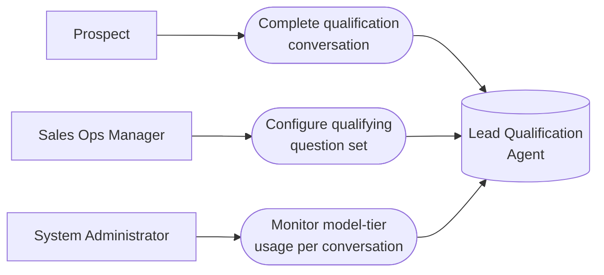

# PART 5 — USE CASES
## Module 2: Lead Qualification Agent
### Product: P2 — AI Marketing & Sales RevOps Engine | Layer 2 — Product & Functional

---

## Use Case Diagram

## UC-P2-004: Complete Qualification Conversation

| Field | Detail |
|---|---|
| Actor | Prospect |
| Preconditions | Lead record exists (Module 1); qualifying question set is configured |
| **Main Flow** | 1. System initiates a qualifying conversation within 5 minutes of intake (AI-FR-008). 2. System detects the prospect's language (AI-FR-009). 3. Prospect answers the configured qualifying questions. 4. System computes a confidence score per turn (AI-FR-011). 5. System evaluates qualifying criteria; if met, transitions the lead to "Qualified" (AI-FR-012). 6. System hands off to Module 3 (Voice & Chat Engagement Agent) for continued engagement. |
| **Alternate Flows** | 3a. Prospect responds in a different language than detected → system switches response language. 5a. Criteria not yet met after configured turns → conversation continues or times out per Module 2 error states. |
| **Exceptions** | E1. Confidence score below 70% for two consecutive turns → escalate per AI-BR-001. E2. Lead matches the high-value threshold → escalate per AI-BR-002, regardless of confidence. E3. No prospect response within 24h → one auto follow-up sent; if still no response, lead flagged "unresponsive." |
| Postconditions | Lead is either "Qualified" and handed to Module 3, escalated to a Human Agent (Module 9), or flagged unresponsive. |

## UC-P2-005: Configure Qualifying Question Set

| Field | Detail |
|---|---|
| Actor | Sales Ops Manager |
| Preconditions | Sales Ops Manager has "Configure qualifying question set" permission |
| **Main Flow** | 1. Sales Ops Manager opens Module 2 configuration via the Module 11 admin console. 2. Sales Ops Manager adds, edits, or removes qualifying questions. 3. System saves the updated question set without a code change (AI-BR-016). 4. System applies the updated set to new conversations going forward. |
| **Alternate Flows** | None |
| **Exceptions** | E1. Sales Ops Manager attempts to save an empty question set → system blocks the save, since AI-BR-017 requires at least one recorded response before stage transition. |
| Postconditions | New qualifying conversations use the updated question set; in-flight conversations are unaffected. |

## UC-P2-006: Monitor Model-Tier Usage per Conversation

| Field | Detail |
|---|---|
| Actor | System Administrator |
| Preconditions | Administrator has access to Module 11 cost/routing configuration |
| **Main Flow** | 1. Administrator opens the Cost Monitoring View (Module 12). 2. Administrator filters by conversation/agent module. 3. System displays which model tier (self-hosted vs. commercial API) handled each conversation (AI-FR-015). |
| **Alternate Flows** | None |
| **Exceptions** | E1. Billing/usage data not yet available for very recent conversations → system shows "pending" rather than a blank or zero value. |
| Postconditions | Administrator has visibility into model-tier distribution to inform cost optimization. |

---

**Layer 2 Gate Check:** ✅ One use case per user story (3 of 3). ✅ Each includes at least one alternate flow or exception.

*P2 Master SRS — Part 5, Module 2 of 17.*
