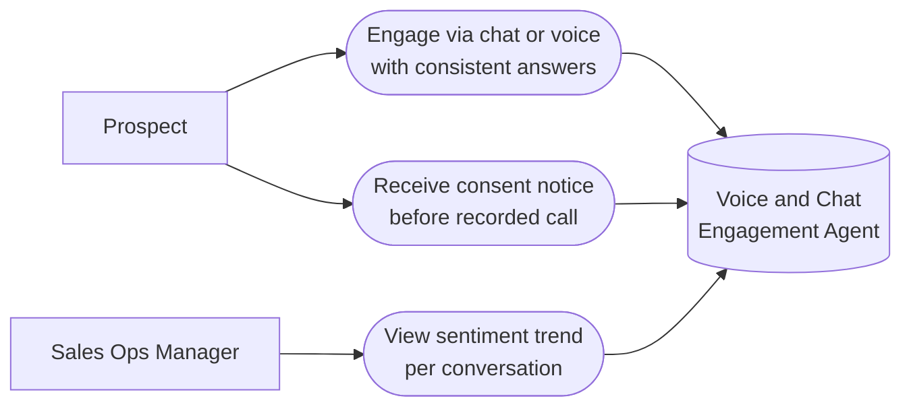

# PART 5 — USE CASES
## Module 3: Voice & Chat Engagement Agent
### Product: P2 — AI Marketing & Sales RevOps Engine | Layer 2 — Product & Functional

---

## Use Case Diagram

## UC-P2-007: Engage via Chat or Voice with Consistent Answers

| Field | Detail |
|---|---|
| Actor | Prospect |
| Preconditions | Lead is at "Qualified" stage (Module 2); Knowledge Base (Module 15) has relevant content |
| **Main Flow** | 1. Prospect continues engagement via chat or initiates/receives a voice call. 2. System retrieves Conversation Memory (Module 10) and Knowledge Base content (Module 15) to answer questions (AI-FR-016). 3. Prospect switches channel mid-engagement. 4. System preserves full conversation context across the switch (AI-FR-021, AI-BR-012). 5. System detects sentiment per turn (AI-FR-020). 6. Once the minimum engagement turn count is reached, system transitions the lead to "Engaged" (AI-FR-022). |
| **Alternate Flows** | 2a. Knowledge Base has no answer for a question → system responds "let me confirm that and follow up" rather than fabricating an answer (AI-BR-018). |
| **Exceptions** | E1. Two or more turns show negative sentiment → escalate per AI-BR-003. E2. Voice call drops mid-conversation → system attempts one auto-retry; if unreachable, escalates to Human Agent. |
| Postconditions | Lead reaches "Engaged" stage with full context preserved, or is escalated. |

## UC-P2-008: Receive Consent Notice Before Recorded Call

| Field | Detail |
|---|---|
| Actor | Prospect |
| Preconditions | A voice call (inbound or outbound) is being initiated |
| **Main Flow** | 1. System initiates the voice call. 2. System plays the consent notice before any other agent speech (AI-FR-019, AI-BR-007). 3. System logs the consent acknowledgment with timestamp. 4. Call proceeds and is recorded. |
| **Alternate Flows** | 4a. Prospect declines consent → system does not proceed with a recorded call; offers chat-only continuation instead. |
| **Exceptions** | E1. Consent notice playback fails (TTS/audio error) → call is aborted, logged, and a technical alert is sent to System Admin (Module 16). |
| Postconditions | Call recording (if proceeding) is accompanied by a logged, timestamped consent acknowledgment. |

## UC-P2-009: View Sentiment Trend per Conversation

| Field | Detail |
|---|---|
| Actor | Sales Ops Manager |
| Preconditions | Sales Ops Manager has "View sentiment trend per conversation" permission |
| **Main Flow** | 1. Sales Ops Manager opens the conversation view for an assigned lead/deal. 2. System displays sentiment score per turn as a trend line. 3. Sales Ops Manager identifies conversations with declining sentiment for proactive follow-up. |
| **Alternate Flows** | None |
| **Exceptions** | E1. Sentiment cannot be computed for a turn (e.g., non-text content) → that turn is shown as "not scored" rather than defaulting to neutral/zero, avoiding a misleading trend line. |
| Postconditions | Sales Ops Manager has identified at-risk conversations for intervention. |

---

**Layer 2 Gate Check:** ✅ One use case per user story (3 of 3). ✅ Each includes at least one alternate flow or exception.

*P2 Master SRS — Part 5, Module 3 of 17.*
