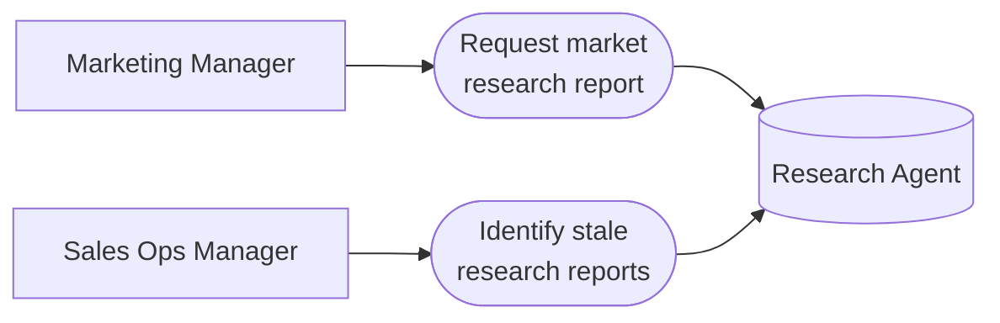

# PART 5 — USE CASES
## Module 4: Research Agent
### Product: P2 — AI Marketing & Sales RevOps Engine | Layer 2 — Product & Functional

---

## Use Case Diagram

## UC-P2-010: Request Market Research Report

| Field | Detail |
|---|---|
| Actor | Marketing Manager (also Sales Ops Manager, per Module 4 permission table) |
| Preconditions | Actor has "Submit research request" permission |
| **Main Flow** | 1. Marketing Manager opens the Research Agent request form. 2. Marketing Manager specifies a target product/service and target market/geography (AI-BR-006). 3. System aggregates publicly available market data, competitor info, and pricing benchmarks (AI-FR-025, AI-FR-026). 4. System generates a structured report within 48 hours (AI-FR-027). 5. System notifies the requester when the report is ready (AI-FR-029). |
| **Alternate Flows** | 3a. Conflicting pricing data across sources → system presents a range with source count rather than a fabricated average. 4a. Insufficient public data found → report explicitly states "insufficient public data" for that section (AI-BR-020). |
| **Exceptions** | E1. Target market field is empty → submission blocked: "Please specify a target market or geography." E2. 48-hour SLA at risk → requester notified of possible delay. |
| Postconditions | A timestamped, versioned research report exists, available to Module 5 (Marketing Agent). |

## UC-P2-011: Identify Stale Research Reports

| Field | Detail |
|---|---|
| Actor | Sales Ops Manager |
| Preconditions | At least one research report exists in the system |
| **Main Flow** | 1. Sales Ops Manager views a research report or report list. 2. System checks report age against the 90-day staleness threshold (AI-BR-013). 3. System displays a "stale — refresh recommended" flag on reports older than 90 days. |
| **Alternate Flows** | None |
| **Exceptions** | E1. A campaign generation request references a stale report → system requires Marketing Manager override and acknowledgment before proceeding (AI-BR-023, Module 5). |
| Postconditions | Sales Ops Manager and Marketing Manager are visibly warned before acting on outdated research. |

---

**Layer 2 Gate Check:** ✅ One use case per user story (2 of 2). ✅ Each includes at least one alternate flow or exception.

*P2 Master SRS — Part 5, Module 4 of 17.*
