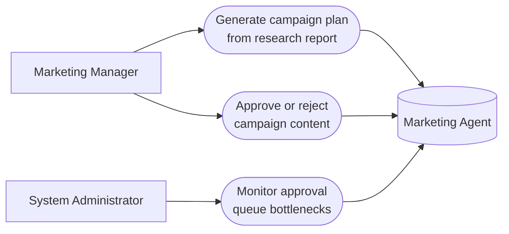

# PART 5 — USE CASES
## Module 5: Marketing Agent
### Product: P2 — AI Marketing & Sales RevOps Engine | Layer 2 — Product & Functional

---

## Use Case Diagram

## UC-P2-012: Generate Campaign Plan from Research Report

| Field | Detail |
|---|---|
| Actor | Marketing Manager |
| Preconditions | A completed (non-stale, or overridden) Research Agent report exists (Module 4) |
| **Main Flow** | 1. Marketing Manager selects a Research Agent report. 2. Marketing Manager requests campaign plan generation (AI-FR-030). 3. System generates funnel structure, landing page drafts, and email sequence drafts aligned to CRM pipeline stages (AI-FR-031–033). 4. System routes generated content to the approval queue (AI-FR-034). |
| **Alternate Flows** | 1a. Selected report is flagged stale → system requires override and acknowledgment (AI-BR-023) before generation proceeds. |
| **Exceptions** | None beyond the stale-report block |
| Postconditions | A draft campaign plan with linked assets exists, pending approval, traceable to its source report ID. |

## UC-P2-013: Approve or Reject Campaign Content

| Field | Detail |
|---|---|
| Actor | Marketing Manager |
| Preconditions | Draft campaign content exists in the approval queue |
| **Main Flow** | 1. Marketing Manager opens the approval queue. 2. Marketing Manager reviews a draft campaign asset (per language variant where applicable). 3. Marketing Manager approves or rejects the content (AI-FR-034, AI-FR-036). 4. If approved, content becomes eligible for scheduling/publish (AI-FR-035). 5. If rejected, content returns to "draft" status with a logged rejection reason (AI-BR-022). |
| **Alternate Flows** | 2a. Marketing Manager approves one language variant but rejects another for the same campaign → system supports per-language partial approval. |
| **Exceptions** | E1. An unauthorized role attempts to approve → action blocked, logged: "You do not have permission to approve campaign content." |
| Postconditions | Campaign content is in either "published-eligible" or "draft, with rejection reason" state — never silently deleted. |

## UC-P2-014: Monitor Approval Queue Bottlenecks

| Field | Detail |
|---|---|
| Actor | System Administrator |
| Preconditions | Administrator has "View approval queue/bottlenecks" permission |
| **Main Flow** | 1. Administrator opens the campaign approval queue view. 2. System displays pending items with time-in-queue per item. 3. Administrator identifies items stalled beyond a reasonable window for follow-up with the Marketing Manager. |
| **Alternate Flows** | None |
| **Exceptions** | E1. Queue is empty → system shows an empty state, not an error. |
| Postconditions | Administrator has visibility into approval-pipeline health. |

---

**Layer 2 Gate Check:** ✅ One use case per user story (3 of 3). ✅ Each includes at least one alternate flow or exception.

*P2 Master SRS — Part 5, Module 5 of 17.*
