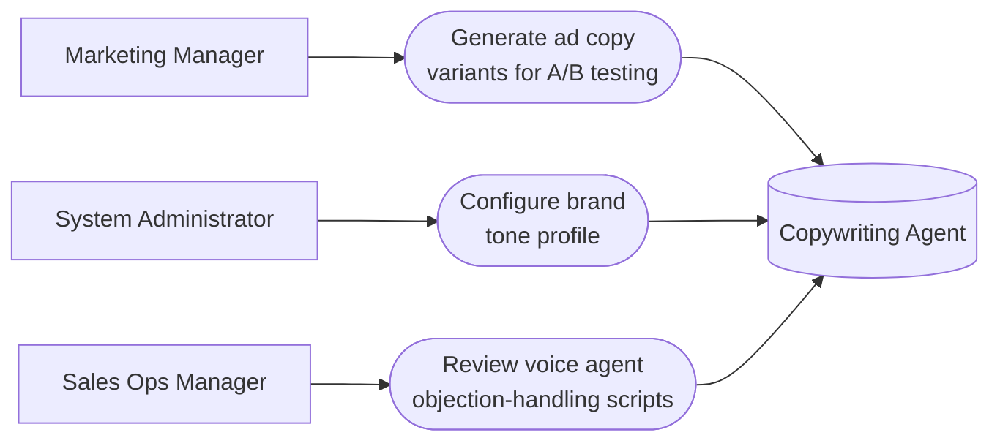

# PART 5 — USE CASES
## Module 6: Copywriting Agent
### Product: P2 — AI Marketing & Sales RevOps Engine | Layer 2 — Product & Functional

---

## Use Case Diagram

## UC-P2-015: Generate Ad Copy Variants for A/B Testing

| Field | Detail |
|---|---|
| Actor | Marketing Manager |
| Preconditions | A campaign exists (Module 5) requiring copy assets |
| **Main Flow** | 1. Marketing Manager requests ad copy generation for a campaign/channel. 2. Marketing Manager specifies A/B testing (2+ variants). 3. System generates copy in configured languages, drawing on Knowledge Base content (AI-FR-037, AI-FR-041, AI-BR-024). 4. System tags each variant with a unique ID (AI-FR-042). 5. Generated copy routes to the Module 5 approval gate (AI-FR-043). |
| **Alternate Flows** | 3a. A referenced fact is not in the Knowledge Base → system omits the unverifiable claim and flags it for manual input. |
| **Exceptions** | E1. Requested variant count exceeds 5 → capped at 5, user notified. E2. Two near-identical variants generated → flagged for Marketing Manager review rather than presented as a valid A/B test. |
| Postconditions | Tagged copy variants exist, pending approval. |

## UC-P2-016: Configure Brand Tone Profile

| Field | Detail |
|---|---|
| Actor | System Administrator |
| Preconditions | Administrator has "Configure brand tone profile" permission |
| **Main Flow** | 1. Administrator opens the brand tone configuration via the Module 11 console. 2. Administrator selects/defines a tone profile (Formal, Casual, Technical, Custom). 3. System applies the tone profile to all newly generated copy going forward (AI-BR-025). |
| **Alternate Flows** | None |
| **Exceptions** | None defined beyond standard validation (profile must be a recognized enum value) |
| Postconditions | Future copy generation reflects the new tone; previously published copy is unchanged. |

## UC-P2-017: Review Voice Agent Objection-Handling Scripts

| Field | Detail |
|---|---|
| Actor | Sales Ops Manager |
| Preconditions | Copywriting Agent has generated voice script content for Module 3 use (AI-FR-040) |
| **Main Flow** | 1. Sales Ops Manager opens the generated voice script list. 2. Sales Ops Manager reviews script content against the Module 5 approval gate (AI-FR-043). 3. Sales Ops Manager flags concerns or confirms readiness for Marketing Manager approval. |
| **Alternate Flows** | None |
| **Exceptions** | E1. A script is activated for live use without passing approval (attempted) → system blocks activation: "This script has not been approved for live use." |
| Postconditions | Only approved scripts are usable by Module 3 in live conversations. |

---

**Layer 2 Gate Check:** ✅ One use case per user story (3 of 3). ✅ Each includes at least one alternate flow or exception.

*P2 Master SRS — Part 5, Module 6 of 17.*
