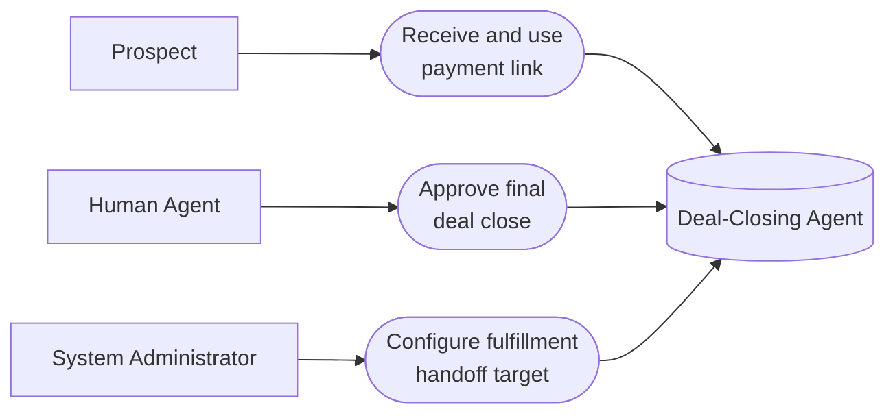

# PART 5 — USE CASES
## Module 7: Deal-Closing Agent
### Product: P2 — AI Marketing & Sales RevOps Engine | Layer 2 — Product & Functional

---

## Use Case Diagram

## UC-P2-018: Receive and Use Payment Link

| Field | Detail |
|---|---|
| Actor | Prospect |
| Preconditions | Lead is at "Engaged" stage and requests to proceed |
| **Main Flow** | 1. System generates a unique payment link (AI-FR-044, AI-BR-026). 2. System sends the link to the prospect via chat or voice follow-up. 3. Prospect clicks the link and completes payment/application submission. 4. System captures proposal/application details and transitions CRM stage to "Submitted" (AI-FR-046). |
| **Alternate Flows** | 3a. Prospect requires a human conversation first → system offers meeting booking instead (AI-FR-045). |
| **Exceptions** | E1. Payment link clicked after expiry → "This payment link has expired. Request a new one." New link offered. E2. Prospect attempts to pay twice (double-click/two tabs) → system prevents duplicate processing, reconciles to one transaction. |
| Postconditions | Lead reaches "Submitted" stage with captured proposal/application data, or a meeting is booked instead. |

## UC-P2-019: Approve Final Deal Close

| Field | Detail |
|---|---|
| Actor | Human Agent (or Sales Ops Manager) |
| Preconditions | Lead is at "Submitted" stage |
| **Main Flow** | 1. Human Agent reviews the submitted proposal/application and pricing. 2. Human Agent approves the final close (AI-BR-005). 3. System hands off the lead to the configured fulfillment system (AI-FR-048). 4. Upon fulfillment success confirmation, system transitions CRM stage to "Converted" (AI-FR-049). 5. System sends a confirmation message to the customer (AI-FR-050). |
| **Alternate Flows** | None — this flow has no AI-autonomous path by design (AI-BR-005). |
| **Exceptions** | E1. Fulfillment handoff target unreachable → stage remains "Submitted" with an error flag; Sales Ops Manager alerted (AI-BR-027); approval record is not revoked, handoff retried. E2. Unauthorized role attempts approval → action blocked: "You do not have permission to approve this close." E3. Lead goes unresponsive before approval → stalled approval flagged after a configurable SLA (e.g., 48 hours). |
| Postconditions | Lead is "Converted" with a logged human-approval record, or remains "Submitted" pending resolution. |

## UC-P2-020: Configure Fulfillment Handoff Target

| Field | Detail |
|---|---|
| Actor | System Administrator |
| Preconditions | Administrator has "Configure fulfillment handoff target" permission |
| **Main Flow** | 1. Administrator opens Module 7 configuration via the Module 11 console. 2. Administrator sets the fulfillment system endpoint (HTTPS URL) for the deployment. 3. System validates the endpoint format and saves the configuration. |
| **Alternate Flows** | None |
| **Exceptions** | E1. Invalid/unreachable endpoint format entered → save blocked with validation message. |
| Postconditions | Approved deals route to the configured fulfillment endpoint. |

---

**Layer 2 Gate Check:** ✅ One use case per user story (3 of 3). ✅ Each includes at least one alternate flow or exception.

*P2 Master SRS — Part 5, Module 7 of 17.*
