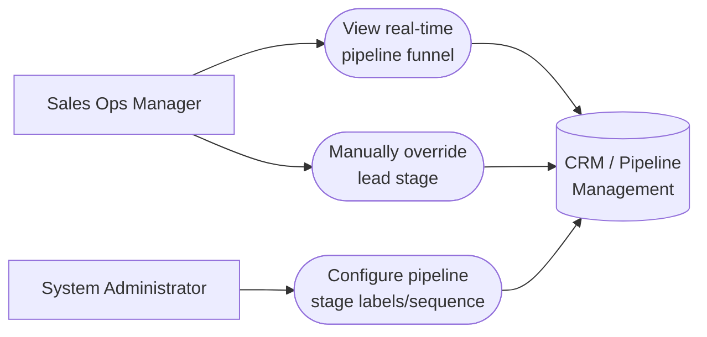

# PART 5 — USE CASES
## Module 8: CRM / Pipeline Management
### Product: P2 — AI Marketing & Sales RevOps Engine | Layer 2 — Product & Functional

---

## Use Case Diagram

## UC-P2-021: View Real-Time Pipeline Funnel

| Field | Detail |
|---|---|
| Actor | Sales Ops Manager |
| Preconditions | Sales Ops Manager has "View pipeline dashboard" permission |
| **Main Flow** | 1. Sales Ops Manager opens the pipeline/funnel dashboard. 2. System displays lead count per stage, updated in real time, within 5 seconds of underlying change (AI-FR-054). 3. Sales Ops Manager identifies stages with disproportionate lead counts (bottlenecks). |
| **Alternate Flows** | None |
| **Exceptions** | E1. No leads in the system → dashboard shows zero-state, not an error. |
| Postconditions | Sales Ops Manager has visibility to prioritize intervention. |

## UC-P2-022: Manually Override Lead Stage

| Field | Detail |
|---|---|
| Actor | Sales Ops Manager |
| Preconditions | Sales Ops Manager has "Manually edit lead/deal record" permission; lead record exists |
| **Main Flow** | 1. Sales Ops Manager opens a lead/deal record. 2. Sales Ops Manager selects a new pipeline stage, overriding the current automated stage. 3. System applies the override, which takes precedence over any pending automated transition (AI-BR-029). 4. System logs the edit — user, field, old value, new value, timestamp (AI-FR-053). |
| **Alternate Flows** | 3a. An agent module attempts an automatic transition at the same moment → manual override wins; the agent's attempt is logged as superseded. |
| **Exceptions** | E1. Unauthorized role attempts override → "You do not have permission to change this lead's stage." Action blocked, logged. |
| Postconditions | Lead's stage reflects the Sales Ops Manager's determination, with full audit trail. |

## UC-P2-023: Configure Pipeline Stage Labels and Sequence

| Field | Detail |
|---|---|
| Actor | System Administrator |
| Preconditions | Administrator has "Configure pipeline stage labels/sequence" permission |
| **Main Flow** | 1. Administrator opens pipeline configuration via the Module 11 console. 2. Administrator defines stage labels and sequence (minimum 3, maximum 10 stages) (AI-FR-052). 3. System saves the configuration; it is referenced everywhere else in the system per AI-BR-028. |
| **Alternate Flows** | None |
| **Exceptions** | E1. Fewer than 3 stages configured → "A minimum of 3 pipeline stages is required." Save blocked. E2. Reconfiguration occurs while leads exist in the old structure → existing records map to the nearest equivalent new stage with a "stage mapping changed" flag. |
| Postconditions | The new stage configuration is the single source of truth across the system. |

---

**Layer 2 Gate Check:** ✅ One use case per user story (3 of 3). ✅ Each includes at least one alternate flow or exception.

*P2 Master SRS — Part 5, Module 8 of 17.*
