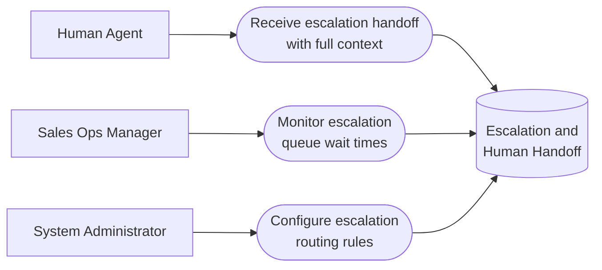

# PART 5 — USE CASES
## Module 9: Escalation & Human Handoff
### Product: P2 — AI Marketing & Sales RevOps Engine | Layer 2 — Product & Functional

---

## Use Case Diagram

## UC-P2-024: Receive Escalation Handoff with Full Context

| Field | Detail |
|---|---|
| Actor | Human Agent |
| Preconditions | An escalation has been triggered (AI-BR-001–004) and routed |
| **Main Flow** | 1. System evaluates trigger conditions during active conversation (AI-FR-059). 2. System routes the escalation to an available Human Agent per routing rules (AI-FR-060). 3. Human Agent claims the escalation. 4. System presents the full transcript, lead record, and escalation reason code(s) (AI-FR-061, AI-FR-065). 5. Human Agent takes over the conversation. |
| **Alternate Flows** | 3a. Two agents attempt to claim simultaneously → first claim wins (AI-BR-030); second sees "already claimed." |
| **Exceptions** | E1. No available agent matches routing criteria → routing pool widens immediately (AI-BR-031). E2. Claiming agent loses connectivity mid-handoff → escalation returns to queue after inactivity threshold. |
| Postconditions | Human Agent has full context and is actively handling the escalated conversation. |

## UC-P2-025: Monitor Escalation Queue Wait Times

| Field | Detail |
|---|---|
| Actor | Sales Ops Manager |
| Preconditions | Sales Ops Manager has "View escalation queue" permission |
| **Main Flow** | 1. Sales Ops Manager opens the escalation queue view (AI-FR-062). 2. System displays each escalated conversation with wait time since trigger. 3. Sales Ops Manager identifies staffing gaps based on queue patterns. |
| **Alternate Flows** | None |
| **Exceptions** | E1. An escalation exceeds the SLA threshold unclaimed → alert raised (AI-FR-063); visible in the queue view. |
| Postconditions | Sales Ops Manager has data to inform staffing decisions. |

## UC-P2-026: Configure Escalation Routing Rules

| Field | Detail |
|---|---|
| Actor | System Administrator |
| Preconditions | Administrator has "Configure routing rules" permission |
| **Main Flow** | 1. Administrator opens Module 9 configuration via the Module 11 console. 2. Administrator defines routing criteria — team, language skill, current load (AI-FR-060). 3. System saves and applies the routing rules to new escalations going forward. |
| **Alternate Flows** | None |
| **Exceptions** | None defined beyond standard validation |
| Postconditions | New escalations route according to the updated criteria. |

---

**Layer 2 Gate Check:** ✅ One use case per user story (3 of 3). ✅ Each includes at least one alternate flow or exception.

*P2 Master SRS — Part 5, Module 9 of 17.*
