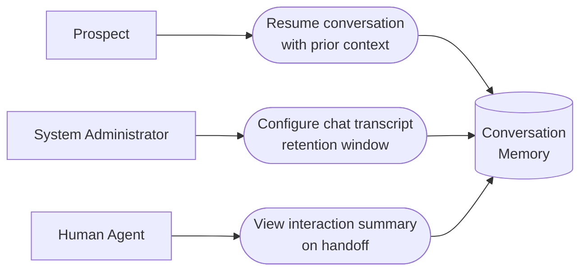

# PART 5 — USE CASES
## Module 10: Conversation Memory
### Product: P2 — AI Marketing & Sales RevOps Engine | Layer 2 — Product & Functional

---

## Use Case Diagram

## UC-P2-027: Resume Conversation with Prior Context

| Field | Detail |
|---|---|
| Actor | Prospect |
| Preconditions | Prospect has prior interaction history stored in Conversation Memory |
| **Main Flow** | 1. Prospect returns via any channel after a prior interaction. 2. System retrieves prior interaction history and stated preferences via the Memory Retrieval API (AI-FR-070). 3. Agent module uses this context to avoid repeating questions already answered. 4. System logs the new turn against the customer profile (AI-FR-067). |
| **Alternate Flows** | 2a. Stated preference contradicts an earlier one → system uses the most recent value and logs the change. |
| **Exceptions** | E1. Memory retrieval times out → agent proceeds without historical context for that turn rather than stalling. |
| Postconditions | Prospect experiences continuity; system has logged the new interaction. |

## UC-P2-028: Configure Chat Transcript Retention Window

| Field | Detail |
|---|---|
| Actor | System Administrator |
| Preconditions | Administrator has "Configure memory/transcript retention window" permission (shared with Compliance Officer) |
| **Main Flow** | 1. Administrator opens Module 10 retention configuration. 2. Administrator sets the retention window (1–365 days, default 90) (AI-FR-071, AI-BR-032). 3. System applies the new window to retention scheduling going forward. |
| **Alternate Flows** | None |
| **Exceptions** | E1. Retention window set to 0 → "Retention window must be at least 1 day." Save blocked. |
| Postconditions | Chat transcripts are deleted per the configured schedule, independent of voice retention (AI-BR-008). |

## UC-P2-029: View Interaction Summary on Handoff

| Field | Detail |
|---|---|
| Actor | Human Agent |
| Preconditions | An escalation handoff has occurred (Module 9) |
| **Main Flow** | 1. Human Agent receives the escalation handoff view. 2. System presents a generated summary of prior interactions alongside the full transcript. 3. Human Agent uses the summary to quickly orient before engaging the prospect. |
| **Alternate Flows** | None |
| **Exceptions** | E1. Summary generation fails → falls back to presenting the raw transcript only, with a note that summarization was unavailable. |
| Postconditions | Human Agent is oriented efficiently without needing to read the entire raw transcript. |

---

**Layer 2 Gate Check:** ✅ One use case per user story (3 of 3). ✅ Each includes at least one alternate flow or exception.

*P2 Master SRS — Part 5, Module 10 of 17.*
